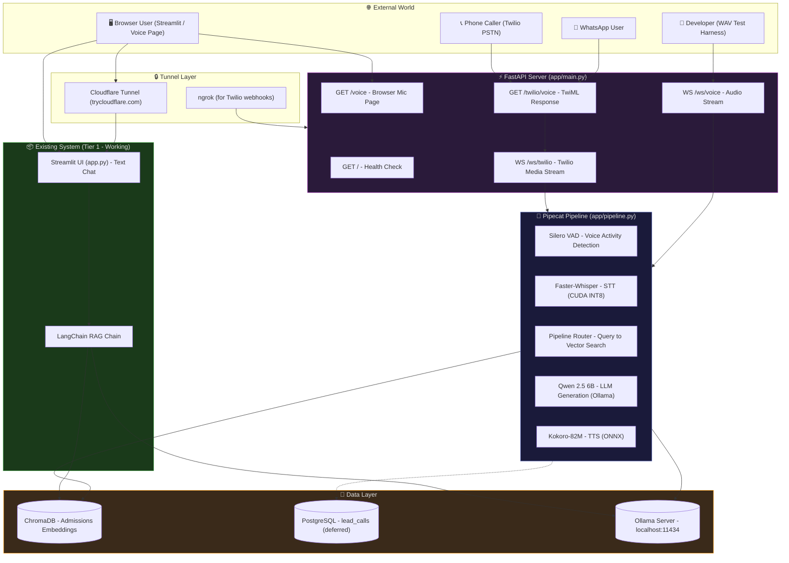
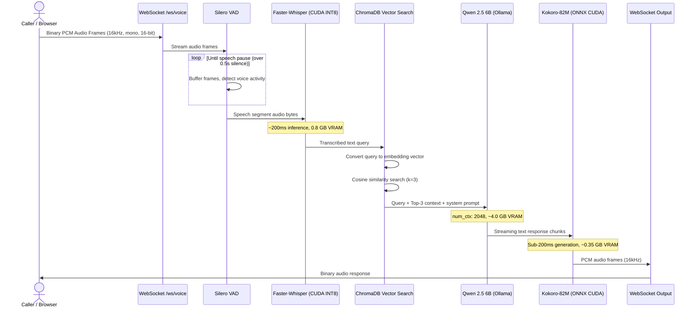
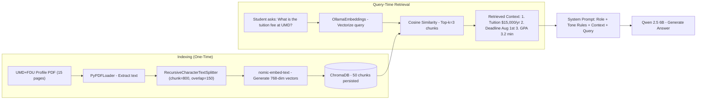
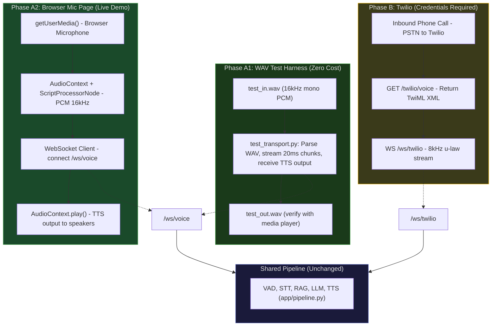
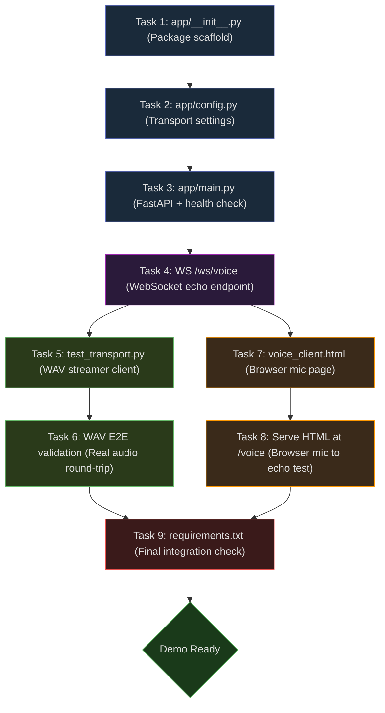
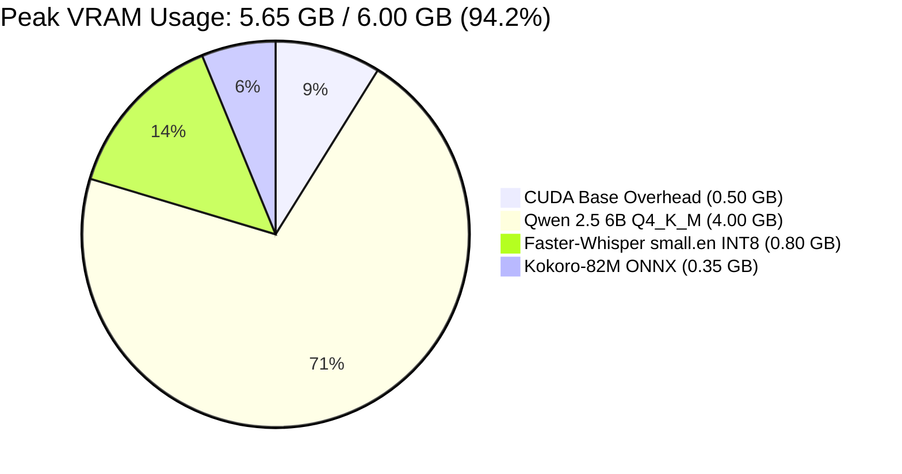
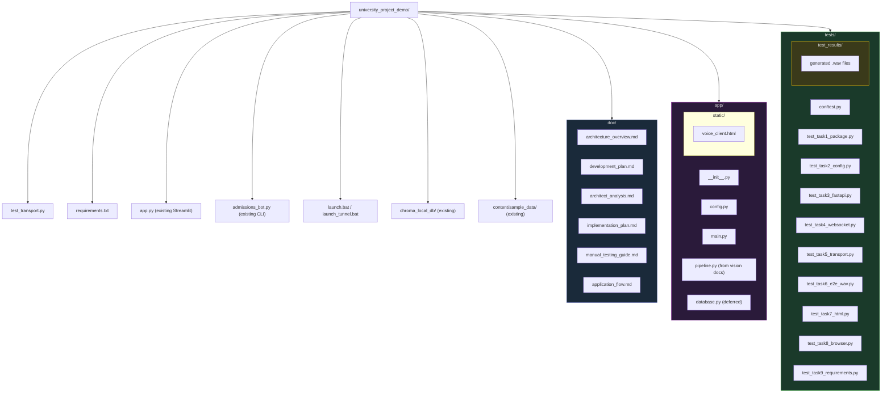
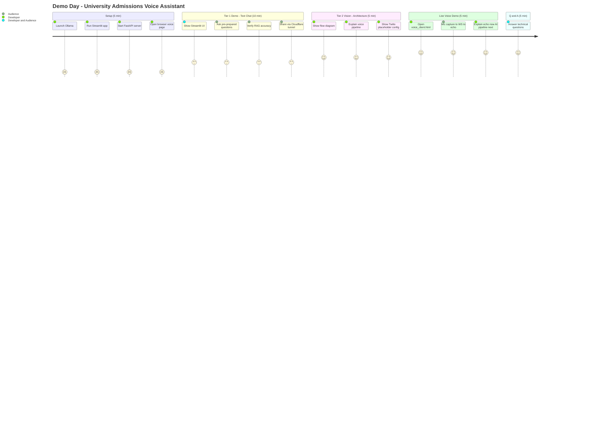

# University Admissions Voice AI Assistant — Flow Diagrams

Open this file in VS Code with the "Markdown Preview Mermaid Support" extension,
or push to GitHub (renders natively).

---

## 1. System Context Diagram (Top-Level)



---

## 2. Voice Pipeline — Detailed Sequence



---

## 3. RAG Retrieval Flow (ChromaDB)



---

## 4. Two-Phase Transport Strategy



---

## 5. Task Execution Flow (Build Order)



---

## 6. Memory Allocation Map (6 GB GPU)



---

## 7. Component State Machine (Per Call)

```mermaid
stateDiagram-v2
    [*] --> Idle: Server started

    Idle --> Connecting: WebSocket handshake
    Connecting --> Listening: VAD active

    Listening --> Processing: Speech detected (over 0.5s pause)
    Processing --> Transcribing: STT running
    Transcribing --> Retrieving: Text query ready

    Retrieving --> Generating: Top-3 chunks + context
    Generating --> Synthesizing: LLM text streaming

    Synthesizing --> Playing: TTS frames ready
    Playing --> Listening: Response complete, wait for next input

    Listening --> Disconnecting: Client closes / hangup
    Processing --> Disconnecting: Error / timeout
    Generating --> Disconnecting: Error / OOM

    Disconnecting --> SavingState: Persist transcript + lead
    SavingState --> Idle: Cleanup complete
    Disconnecting --> Idle: Force cleanup (no DB)

    note right of Processing: GPU peak: ~5.65 GB
    note right of SavingState: Async: PostgreSQL INSERT
```

---

## 8. File & Directory Structure



---

## 9. Demo Day Flow


