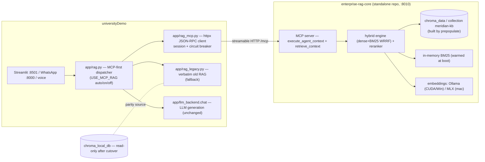

# TRD — enterprise-rag-core Decoupling & Integration (v1.0)

**Scope:** Decouple universityDemo's embedded RAG (Meridian) from the app and
serve retrieval from the standalone **enterprise-rag-core** MCP service, with
data migration, parity verification, and automatic fallback.
**Branch:** `enterprise-rag-core-for-universityDemo` (both repos).
**Status:** implemented 2026-08-29 — all acceptance criteria below verified on
this machine (see §12).

---

## 1. Purpose & scope

- **Decouple retrieval only.** LLM generation stays in universityDemo
  (`app/llm_backend.chat`); prompts and voice behavior are unchanged.
- **Standalone service.** enterprise-rag-core runs as an MCP server on
  `:8010` (streamable HTTP), deployed by its own launcher.
- **Data migration.** The Meridian KB is re-ingested into fresh backends
  (reproducible, deterministic chunk ids). The old `chroma_local_db` store is
  **read-only** from cutover onward.
- **Safety.** `USE_MCP_RAG=auto` (default): MCP-first with automatic fallback
  to the legacy store + circuit breaker. Old code retained (`app/rag_legacy.py`);
  deletion is a later cleanup phase gated on observed parity.

## 2. Current state (legacy)

- `app/rag.py` (now `app/rag_legacy.py`, verbatim): ChromaDB
  (`chroma_local_db`, collection `langchain`, cosine space), LangChain MMR /
  stdlib-BM25 hybrid, chunk metadata `{section, source_file, doc_type,
  ingested_at}`, `[§ section]` context labels (SYSTEM_PROMPT rule 3).
- Call sites funnel through `app/rag` functions: `pipeline.py`
  (`retrieve_context`, `run_rag_query_sync`), `main.py` (lifespan warmup,
  `_whatsapp_chat_rag`), `app.py` + `admissions_bot.py` (LCEL
  `get_retriever()`), `voice_handler.py`, rebuild script, test scripts.
- KB: `content/meridian/meridian_knowledge_base.md` — 16 `## ` sections.

## 3. Target architecture

## 4. ERC change spec (branch `enterprise-rag-core-for-universityDemo`)

### 4.1 `retrieve_context` MCP tool

| Field | Value |
|---|---|
| Name | `retrieve_context` |
| Input | `query: str` (required), `top_k: int = 5` |
| Output | JSON string: `{chunks: [{chunk_id, parent_id, tenant_id, section_title, content, score, required_clearance, department}], count, hit_source: "retrieval"}` |
| Auth | oidc: bearer → `SecurityContext` from claims; none: `default_security()` |
| Wiring | module seam `agent_engine`/`_set_engine` (set by `build_app`/`serve-stdio`) |

Session sequence (client contract, verified): `POST initialize` →
capture `Mcp-Session-Id` response header → `POST tools/call` with header.
The endpoint **rejects** clients whose `Accept` lacks
`text/event-stream` (406); responses may be SSE or plain JSON.

### 4.2 Prepopulation (markdown KB → DBs)

- `python -m enterprise_rag.prepopulate --kb <file> [--doc-id meridian-kb]
  [--tenant default] [--required-marker ...] [--blocked-marker ...] [--force]`
- `## ` headings → `section_title`; front matter dropped; deterministic
  paragraph-packing chunker (600/90, word-boundary overlap); ids
  `{doc_id}:s{section}:c{chunk}`; marker validation (expected required,
  blocked fatal); **idempotent** — skips when the doc is present (`--force`
  rebuilds via `delete_by_parent`); upserts both legs.
- Chunk boundaries are NOT byte-identical to LangChain's splitter — parity
  acceptance is behavioral (stated non-goal).

### 4.3 Protocol + warm-up + launcher

- `VectorStore.get_all(tenant_id)` (chroma/memory/qdrant) — bulk export for
  idempotency checks and warm-up.
- `RAG_CORE_WARM_KEYWORD=1` (default): `serve`/`serve-stdio` repopulate the
  in-memory BM25 leg from the vector store **before** serving.
- `start_services.ps1` (Windows, universityDemo quality bar): venv self-heal
  (probe → install → re-probe), kill stale :8010, Docker + Redis Stack
  (warn-only), Ollama `nomic-embed-text` check, model download, idempotent
  prepopulate (`-KbPath`), serve + JSON-RPC readiness, optional tunnel,
  summary card, exit guard.

## 5. universityDemo change spec

### 5.1 `app/rag_mcp.py` (client)

Pure httpx, no MCP SDK import (the repo's `mcp==2.0.0` pin for
`app/mcp/server.py` is untouched). Lazy env per call; `_post` single choke
point; session state machine; one re-init + re-call on session expiry
(400/404); circuit breaker (`RAG_MCP_COOLDOWN`, default 30s); connect
timeout 1.0s, read 2.5s; `MCPRetriever` LCEL shim with lazy legacy fallback.

### 5.2 `app/rag.py` dispatcher matrix

| `USE_MCP_RAG` | MCP up | MCP down |
|---|---|---|
| `auto` (default) | MCP context | WARNING + breaker → legacy |
| `on` | MCP context | `""` / `[]` (no fallback) |
| `off` | legacy (MCP never touched) | legacy |

- `retrieve_context` renders the exact legacy shape:
  `"[§ {section}]\n{content}"` joined `"\n\n---\n\n"`; empty chunks are a
  legitimate result, never a fallback trigger.
- `query_rag`: prompt construction and `llm_backend.chat` are byte-identical
  to legacy; the threshold gate maps MCP score → distance `1 - score`.
- `get_retriever()`: MCP-backed shim (legacy fallback in auto), legacy MMR
  retriever in off mode.
- `warmup()`: FastAPI lifespan — MCP session in MCP modes, Chroma load in
  legacy mode; never raises.
- `app/rag_legacy.py`: verbatim old module; `scripts/rebuild_rag_index.py`
  imports it directly (its smoke tests must validate the store it builds).

### 5.3 Migration + parity script

`scripts/migrate_rag_to_erc.py`: legacy `validate_source` gate → ERC venv
python resolution → `python -m enterprise_rag.prepopulate` subprocess
(list-args, no shell, env pinned to the launcher's DB defaults) → parity
gate (§7). Flags: `--kb`, `--erc-root`, `--skip-parity`, `--force`.

### 5.4 Launcher chain

`start_services.ps1` **Step 6b** (after Ollama pre-warm, before tunnels)
invokes the ERC repo's `start_services.ps1`; failures are warn-only
("RAG falls back to local Chroma (auto mode)"). `.sh` keeps macOS parity
notes (ERC launcher follow-up).

## 6. Environment contract

### universityDemo (`.env.example`; read lazily by the client/dispatcher)

| Variable | Default | Meaning |
|---|---|---|
| `USE_MCP_RAG` | `auto` | `auto` \| `on` \| `off` |
| `RAG_MCP_URL` | `http://127.0.0.1:8010/mcp` | ERC streamable-HTTP endpoint |
| `RAG_MCP_TIMEOUT` | `2.5` | Read timeout (s); connect fixed 1.0s |
| `RAG_MCP_COOLDOWN` | `30` | Circuit-breaker cooldown (s) |

### enterprise-rag-core (`RAG_CORE_*`, see repo README; launcher defaults)

| Variable | Launcher default | Meaning |
|---|---|---|
| `RAG_CORE_CHROMA_PATH` | `<repo>\chroma_data` | New DB location (NOT the old store) |
| `RAG_CORE_CHROMA_COLLECTION` | `meridian-kb` | New collection |
| `RAG_CORE_DEFAULT_TENANT` | `default` | none-auth tenant |
| `RAG_CORE_KEYWORD_BACKEND` | `bm25` | in-memory, warmed at boot |
| `RAG_CORE_CACHE_BACKEND` | `redisvl` (none if Redis down) | semantic cache |
| `RAG_CORE_EMBED_BACKEND` | `auto` | MLX on Apple Silicon, Ollama elsewhere |
| `RAG_CORE_WARM_KEYWORD` | `1` | BM25 warm-up at boot |

## 7. Data migration & parity gates

1. **Validation**: KB must pass legacy `validate_source` (expected marker
   `meridian university`; 10 blocked markers fatal).
2. **Prepopulate**: re-ingest into `meridian-kb` (16 sections, 26 chunks on
   this machine); idempotent skip on re-run.
3. **Parity gate** (`migrate_rag_to_erc.py`): the 5 smoke queries
   (MBA tuition, deadlines, UG programs, hostel fee, how to apply) must
   return non-empty context on **both** sides; negative canary
   ("Terrapin Commitment") and every MCP chunk free of blocked markers;
   labeled chunks render `[§ section]`.
4. **Old store policy**: read-only from cutover; `chroma_local_db` is never
   written by any migration step.

## 8. Deployment runbook

1. `cd D:\project\enterprise-rag-core; git checkout enterprise-rag-core-for-universityDemo; .\start_services.ps1 -KbPath "D:\project\universityDemo\content\meridian\meridian_knowledge_base.md"`
   → expect `sections=16 chunks=26` (first run) / `skipped` (warm runs),
   `MCP server responding ... (HTTP 200)`.
2. `cd D:\project\universityDemo; git checkout enterprise-rag-core-for-universityDemo; python scripts\migrate_rag_to_erc.py`
   → `Parity gate: PASSED`.
3. `.\start_services.ps1` → Step 6b brings ERC up automatically; app
   retrieval is MCP-first.
4. Verify fallback: kill the ERC process (`taskkill /PID <pid>`), ask a
   question → correct answer via legacy + WARNING log.

## 9. Rollback plan

| Failure | Action |
|---|---|
| MCP unreachable / bad answers | Automatic: breaker → legacy (auto). Instant: `USE_MCP_RAG=off` + restart. |
| ERC DB corrupt | Delete ERC `chroma_data` → launcher/prepopulate rebuilds deterministically. |
| Legacy needed long-term | `USE_MCP_RAG=off` — `app/rag_legacy.py` is verbatim; old store untouched. |
| Code regression | Revert/delete the branch in either repo; `main` / `rag-decoupled-standalone-deployment` untouched. |

## 10. Test matrix

### ERC (`pytest`, CI ubuntu+windows 3.11/3.12)

| File | Covers |
|---|---|
| `tests/test_vector_get_all.py` | get_all tenant filtering (chroma/memory) |
| `tests/test_prepopulate.py` | section split, chunker determinism, id scheme, both-leg upsert, skip/force, marker fatals |
| `tests/test_retrieve_tool.py` | JSON-RPC session sequence, SSE parsing, schema defaults, none-mode tenant, 401-refusal |
| `tests/test_warm_keyword.py` | BM25 repopulation across "restart", empty store |

### universityDemo (pytest per-file; conftest pins `USE_MCP_RAG=off`)

| File | Covers |
|---|---|
| `tests/test_rag_mcp_adapter.py` | wire contract: dual Accept, session sequence, SSE, expiry re-init, breaker, format contract, retriever fallback |
| `tests/test_rag_dispatcher.py` | off/auto/on × up/down matrix, breaker, prompt parity, threshold mapping, warmup safety |
| existing suite | regression (legacy mode, hermetic) |

## 11. Acceptance criteria (all verified 2026-08-29)

- [x] ERC suite 90 passed; CI green on push (4 jobs).
- [x] ERC launcher boots the service from scratch: venv self-heal, Redis
  Stack, prepopulate (16 sections / 26 chunks), MCP `initialize` 200.
- [x] uD adapter + dispatcher suites green; phase4/whatsapp/defect
  regressions green.
- [x] `migrate_rag_to_erc.py` exit 0; parity gate 5/5 both sides; canary
  clean; prepopulate skips idempotently.
- [x] Live end-to-end: uD client → ERC service returns labeled
  `[§ section]` context (session OK, no errors).

## 12. Risks & mitigations

1. **Wire-protocol drift** → adapter tests pin the exact sequence; fallback
   covers residuals.
2. **Chunking divergence** → behavioral acceptance, not byte parity.
3. **BM25 loss on restart** → boot warm-up before serving; readiness implies
   warm.
4. **First-run ordering** → uD Step 6b runs after Ollama pre-warm.
5. **Latency when ERC absent** → breaker cooldown; conftest pins `off`.
6. **Prompt drift** → dispatcher prompt byte-parity tests.
7. **mcp pin divergence (2.0.0 vs 2.1.1)** → no shared process; SDK-free
   client; never harmonize the uD pin.

## 13. Follow-ups

1. Remove legacy RAG deps (`chromadb`, `langchain*`, `pyarrow`) from
   universityDemo after a verified soak period.
2. Namespaced semantic cache for `retrieve_context` (`schema_version`).
3. Expose `fetch_k` on the tool; per-request `top_k` already supported.
4. macOS `.sh` parity for the ERC launcher chain.
5. Cleanup: stray `langchain` collection in ERC `chroma_data` (created by an
   early unpinned-env run; not served — safe to delete).
6. universityDemo CI (none exists today).
