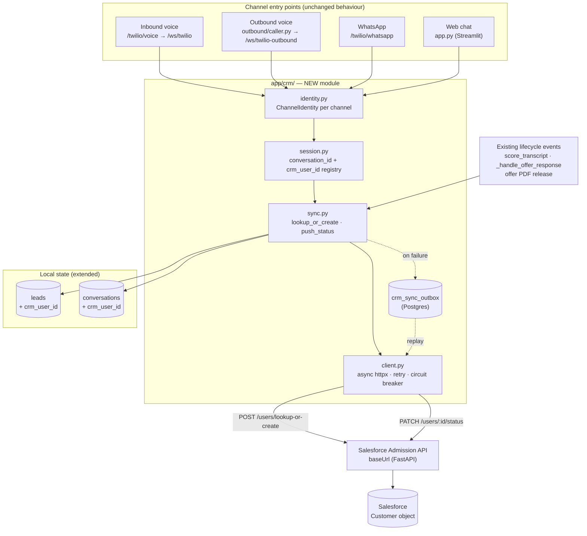

# Project Plan — Salesforce User API Integration (Users, Conversations, Status)

**Created:** 2026-09-11
**Branch:** `enterprise-rag-core-for-universityDemo` (recommend a new branch, see §11.1)
**Status:** Phase 0 **COMPLETE** — Gate 0 passed 2026-09-11 against the live dev org
(`http://127.0.0.1:8098`, 18 probes / 0 FAIL). Findings folded back in: **R16 is new and
critical**; R9 and R11 are resolved; D1–D3 are answered. See §9 Phase 0.
**Scope:** Call `POST {baseUrl}/users/lookup-or-create` once per conversation start on
every channel (inbound voice, outbound voice, WhatsApp, web chat), capture course/program
interest + phone/email/name, and drive `PATCH {baseUrl}/users/{user_id}/status` from the
lifecycle events that already exist in this app.

---

## 1. Purpose & why now

The Salesforce admission API (`LeahXing/salesforce-admission-api`) exists and exposes a
user record with conversation linkage, course interest, sentiment, and offer-letter state.
This app has none of that shared state: leads live only in local Postgres
(`app/leads/schema.py:14-30`), and nothing in the repo talks to Salesforce — verified, zero
hits for `salesforce|simple_salesforce|crm` across all `.py` files.

This plan connects the two so that:

1. **Every conversation gets a CRM identity.** When a call connects or a chat starts, the
   person is looked up or created in Salesforce, and the returned `userId` is the handle
   every later write uses.
2. **Course/program interest reaches the CRM.** `leads.program_interest`, already captured
   by the existing per-channel state machines, becomes `course` on the user record.
3. **Status flows back.** Sentiment, offer-letter release, and offer acceptance — all
   already computed by this app — are pushed to `PATCH /users/{user_id}/status`.

**Non-goal:** this plan does not touch RAG, LLM generation, the voice pipeline's
STT/TTS behaviour, or the `/admissions` and `/admissions/{no}/documents/*` endpoints of the
Salesforce API. Those are a separate (later) workstream — see §12.2.

---

## 2. Sources used (and one correction)

| Source | What it gave |
|---|---|
| `salesforceAPISchema` (repo root) | **Empty — 0 bytes.** No schema was in it. |
| `salesforcer_api.txt` (repo root, untracked) | Handover note: repo URL + a Google Doc handbook link |
| `github.com/LeahXing/salesforce-admission-api` | **The actual source of truth.** All endpoint, schema, and repository behaviour below was read from `main` @ `272434d`, not from memory. |
| This repo's code | `app/main.py`, `app/outbound/`, `app/leads/`, `app.py` — the four channel entry points |

The Google Doc handbook was not readable. **If it contradicts §3, §3 wins** — §3 is read
from the running code. Worth confirming the Doc isn't describing a *different* deployment.

---

## 3. The external API, as it actually behaves

FastAPI app, `main.py` registers three routers. Base URL is wherever it is deployed
(uvicorn default `:8000` — see risk **R9**). No auth header, no API key, no CORS middleware.

### 3.1 `POST /users/lookup-or-create`

Request (`app/schemas/user_schema.py`):

```jsonc
{
  "name":           "string",   // required
  "email":          "string",   // required, NOT optional
  "phoneNumber":    "string",   // required, NOT optional
  "conversationId": "string",   // required
  "course":         "string"    // optional
}
```

Response:

```jsonc
{
  "userId": "a0X...", "name": "...", "email": "...", "phoneNumber": "...",
  "conversationId": "...", "course": "...",
  "sentiment": null, "offerLetterReleased": false, "offerLetterAccepted": null
}
```

### 3.2 `PATCH /users/{user_id}/status`

Request body — **exactly three writable fields**, all optional:

```jsonc
{ "sentiment": "positive", "offerLetterReleased": true, "offerLetterAccepted": "accepted" }
```

Returns the same `UserResponse`. `404` if `get_user_by_id` finds nothing. **There is no
generic `status` field.** "Update the status of the user" therefore means: *choose which of
these three fields your event maps to.*

### 3.3 Other endpoints

| Method | Path | Notes |
|---|---|---|
| `DELETE` | `/users/{user_id}` | hard delete |
| `GET` | `/admissions` | returns **all** `Customer` rows — see **R1** |
| `POST`/`PATCH`/`DELETE` | `/admissions`, `/admissions/{id}` | same `Customer` object as users |
| `GET`/`POST`/`PATCH` | `/admissions/{application_no}/documents/*` | chunked upload, verification |
| `GET` | `/` , `/health` | liveness only; `/health` does **not** check Salesforce reachability |

### 3.4 What backs it

Salesforce custom object **`Customer`** (`app/repositories/salesforce_user_repository.py`),
OAuth `client_credentials` grant against `{SALESFORCE_DOMAIN}/services/oauth2/token`
(`app/core/salesforce.py`). Fields the integration cares about:

```
Id, Application_No__c, First_Name__c, Last_Name__c, Email__c, Phone__c,
Course__c, Conversation_ID__c, Sentiment__c,
Offer_Letter_Released__c, Offer_Letter_Accepted__c
```

Env expected: `SALESFORCE_CLIENT_ID`, `SALESFORCE_CLIENT_SECRET`, `SALESFORCE_DOMAIN`.
(`config.py` also reads `SALESFORCE_INSTANCE_URL`, but it is absent from `.env.example`
and unused — dead.)

---

## 4. Research finding — how status updates actually work

This is the load-bearing result of the research phase, and it constrains the whole design:

> **`PATCH /users/{user_id}/status` requires a Salesforce `Customer.Id`, and the only
> endpoint that returns one is `POST /users/lookup-or-create`. There is no
> `GET /users/{user_id}`.**

Consequences:

1. **You cannot update status without first having called lookup-or-create.** The `userId`
   must be captured at conversation start and persisted. It cannot be fetched later.
2. **There is no read-back path.** To re-read a user's current CRM state you must call
   `lookup-or-create` again — which is a POST that *can create a record* if the lookup
   misses. Any "refresh status" feature inherits the duplicate-creation risk of §5/R2.
   **Recommendation: request a `GET /users/{user_id}` from the API owner** (§12.1).
3. **Only three fields are addressable.** Everything else about a user is write-once (at
   create) or not exposed at all.

### 4.1 `Sentiment__c` and `Offer_Letter_Accepted__c` are restricted picklists — ⚠️ **read this before writing any code**

**Verified live 2026-09-11** against the dev org (202 existing rows), and reproduced by
`scripts/verify_salesforce_api.py`:

```
Sentiment__c               NURTURE · HOT · WARM · AT-RISK · DISQUALIFIED
Offer_Letter_Accepted__c   UNKNOWN · ACCEPTED · NOT_ACCEPTED
Offer_Letter_Released__c   boolean
Course__c                  free text (a "Verify Program" write was accepted)
```

A value outside the picklist fails with
`INVALID_OR_NULL_FOR_RESTRICTED_PICKLIST`, which this API surfaces as a **500** — look
like a transient fault unless the `detail` string is parsed. This is **R16**, and it is
the single most likely way to ship a broken integration that passes its own tests.

**The trap:** the obvious field to send is `primary_emotion` from
`app/sentiment/scorer.py:95` — `excited, interested, neutral, skeptical, frustrated,
angry, confused`. That set shares **zero** values with `Sentiment__c`. Sending it will
500 on **every** call. The correct source is the **categorizer**
(`app/sentiment/categorizer.py:31-35`), whose output maps cleanly by upper-casing.

### 4.2 Corrected mapping — app event → CRM field

| CRM field | Send this | From | Exact location |
|---|---|---|---|
| `sentiment` | `categorize(...).upper()` → `HOT`/`WARM`/`NURTURE`/`AT-RISK`/`DISQUALIFIED` | **the categorizer, not the emotion** | `app/sentiment/categorizer.py:31-35`, `47` |
| `offerLetterReleased` | `true` | offer-letter PDF released | `app/offers/` |
| `offerLetterAccepted` | `"accepted"` → `ACCEPTED`; `"rejected"` → `NOT_ACCEPTED` | student accept/decline | `app/main.py:1493-1504` |
| `course` | `leads.program_interest` (free text) | per-channel state machines | `app/leads/schema.py:14-30` |
| — | sentiment is *computed* after the call | `score_transcript()` — returns the raw extraction, whose `.category` carries the mapped value | `app/main.py:2776-2791`, `app/leads/service.py:188-233` |

**Watch the near-miss:** `Sentiment__c` uses `AT-RISK` (hyphen) while the separate
`Lead_Category__c` field uses `AT RISK` (space). The app's categorizer emits the
hyphenated form, so it aligns with `Sentiment__c` — but any copy-paste between the two
fields will fail validation.

**Note on `course`:** existing rows hold canonical program names (`Information
Technology`, `Data Science`, `Business Administration`, `Computer Science`) plus at least
one junk value (`10`). `Course__c` is free text, so `program_interest` will be accepted
as-is — but it should be normalised against the program list before sending, or the CRM
accumulates synonyms for the same program.

---

## 5. Current state of this app — per-channel readiness

Conversation entry points, and what identity is actually available *at the moment the
conversation starts*:

| Channel | Conversation starts at | Phone at start? | Email at start? | `conversation_id` at start? |
|---|---|---|---|---|
| **Inbound voice** | `/ws/twilio` — `app/main.py:453-628` | ❌ **not threaded** | ❌ | ❌ |
| **Outbound voice** | `/ws/twilio-outbound` — `app/main.py:633-814` | ⚠️ known pre-call, **lost at WS** | ⚠️ maybe | ❌ |
| **WhatsApp** | `/twilio/whatsapp` — `app/main.py:1353-1563` | ✅ clean (`From`) | ❌ until typed | ❌ |
| **Web chat** | Streamlit `app.py:354-372` | ❌ until typed (`app.py:555`) | ❌ until typed (`app.py:547`) | ❌ |

### 5.1 Four gaps that the plan must close

**G1 — Inbound voice has no caller number.** `/twilio/voice` (`:934-943`) and
`/twilio/voice/connect` (`:946-955`) declare no `From` parameter, and the `<Stream>`
TwiML (`:294-300`, `:303-320`) carries no custom parameters. The WS `start` handler
(`:489-505`) reads only `streamSid`/`callSid`. Twilio Media Streams does **not** include the
caller number in the `start` event, so it must be captured at the webhook and threaded via
`<Parameter>` on `<Stream>`.
This is the same defect already logged as **B6** in `doc/environmentsetup/OPEN_QUESTIONS.md`
("Inbound caller phone number never threaded through the WebSocket") — fixing G1 clears B6.

**G2 — Outbound voice loses the lead at the WS boundary.** The lead *is* resolved before
dialling (`app/outbound/caller.py:153-161`), but `app/main.py:669-675` reads only
`callSid`/`streamSid`. Same fix as G1 (custom parameters on the outbound `<Stream>` in
`app/outbound/twiml.py:14-34`).

**G3 — No conversation ID exists at conversation start, on any channel.** The UUID is
minted at *write* time, after the conversation ends — `app/leads/models.py:392`
(`conv_id = uuid4()` inside `create_conversation()`), called from
`_handle_disconnect` (`app/main.py:2710`). `conversationId` is a **required** field of
lookup-or-create, so a stable ID must be minted at session start instead. See §8.2.

**G4 — `email` is required by the API but unknown at voice-call start.** Voice gives a
phone; email typically arrives later (or never). Sending `""` is dangerous — see **R2**.
See §8.3 for the handling rule.

---

## 6. Target architecture



**Design principles** (mirroring the existing ERC integration, `USE_MCP_RAG`):

- **CRM is never on the critical path.** A CRM failure must not delay a call answer, drop a
  WhatsApp reply, or block a chat turn. Every call site degrades to local-only behaviour.
- **Feature-flagged**, default **off** (`CRM_ENABLED=false`) so the demo keeps working
  untouched — the "zero-downtime / demo must keep working" constraint.
- **Idempotent and de-duplicated** on the client side, because the upstream API is not
  (§7/R1–R5).

---

## 7. Risk register

Ordered by severity. **R1–R5 and R16 are upstream API defects**, not integration mistakes —
they determine whether §12.1 is a "fix upstream" or a "defend client-side forever" plan.
Rows marked **✅ resolved** were closed by the Phase 0 verification run (§9).

| # | Severity | Risk | Evidence |
|---|---|---|---|
| **R18** | 🔴 **Critical — blocks the integration** | **A record created without an email can never be read or updated again.** `UserResponse` declares `email: str` as *required*, but Salesforce stores an empty string as null, so `Email__c` reads back as `None` and the response fails validation. The route's `try/except` cannot catch it — response serialisation happens *after* the handler returns — so it surfaces as a bare uvicorn `500 Internal Server Error`. **Reproduced live:** a `lookup-or-create` with `email: ""` created the row and returned 500; two further lookups for the same number returned 500; `PATCH /users/{id}/status` returned 500. `DELETE` still works (no response model). The record is unreachable except to delete it. **This fires on the normal WhatsApp path** — the first linkable turn has a name and a phone but no email. | Reproduced 2026-09-11, `scripts/verify_gate3_whatsapp.py` |
| **R16** | 🔴 **Critical** | **`Sentiment__c` is a restricted picklist, and the app's obvious source field doesn't fit it.** `primary_emotion` (`excited`/`interested`/`neutral`/…) shares **zero** values with the picklist (`HOT`/`WARM`/`NURTURE`/`AT-RISK`/`DISQUALIFIED`). Writing it will 500 on every call — and as a 500, not a 400, so it reads as transient. **Reproduced live:** `'excited'` → rejected. The fix is to send the **categorizer** output upper-cased. | Verified live 2026-09-11; `app/sentiment/categorizer.py:31-35` vs `scorer.py:95` |
| **R1** | 🔴 Critical | **`/users` and `/admissions` write the same `Customer` object.** `create_user` sets `Name = Application_No__c = APP-…`; `create_admission` sets `Name = Application_No__c` from its own payload. So one person can hold *two* `Customer` rows, and `GET /admissions` returns **user** rows too (no filter). A lookup can therefore return an admission row as if it were the user. | `salesforce_user_repository.py:create_user` vs `salesforce_admission_repository.py:create_admission`, `get_all_admissions` |
| **R2** | 🔴 Critical | **`find_user` matches `Email__c = X OR Phone__c = Y` with `LIMIT 1` and no `ORDER BY`.** Two failures compound: (a) a missing/empty value makes the clause `Email__c = ''`, which matches unrelated records; (b) when several rows match, which one is returned is **undefined**. Combined with **G4** (voice has no email), naive integration will mis-link or fabricate users. | `salesforce_user_repository.py:find_user` |
| **R3** | 🟠 High | **SOQL injection / query breakage.** `email` and `phone_number` are f-string interpolated directly into SOQL. An apostrophe in an email or a crafted name breaks the query (500) or alters it. | `salesforce_user_repository.py:find_user` (f-string `WHERE Email__c = '{email}'`) |
| **R4** | 🟠 High | **Partial success returning 500.** `format_user_response` returns `user.get("Email__c")` etc., which may be `None`, while `UserResponse.email/phoneNumber/conversationId` are **required `str`**. A record created *without* email ⇒ response-validation failure ⇒ 500 — **after** the Salesforce row was created. The caller cannot tell "created" from "failed", so any retry duplicates. | `user_service.py:format_user_response` vs `user_schema.py:UserResponse` |
| **R5** | 🟠 High | **No uniqueness / race window.** Two concurrent inbound calls from the same number can both miss the lookup and both create ⇒ duplicate `Customer` rows. Nothing upstream prevents it. | `user_service.py:lookup_or_create_user` (find-then-create, no lock) |
| **R6** | ✅ resolved | ~~**`Conversation_ID__c` is never updated for a returning user.** Create-time only; the existing-user branch returns early.~~ **Closed 2026-09-20** by `sync.sync_conversation_id` writing the field through `PATCH /admissions/{id}` — the same route that already carried `Course__c`. See D1 and `scripts/verify_gate7_status.py` clause C9. | `user_service.py:lookup_or_create_user` still returns early — the API is untouched; the fix is client-side, as D1 requires |
| **R7** | 🟠 High | **Latency on the answer path.** Every repository call re-runs the OAuth token fetch (`get_salesforce()` per call). One `lookup-or-create` = **up to 3 token fetches + 3 Salesforce round trips**. Voice turn latency is already 12–35s. | `app/core/salesforce.py:get_salesforce`; `user_service.py` (find + create + get_by_id) |
| **R8** | 🟠 High | **No authentication on the API at all.** No API key, no signature, no CORS config. Anyone who reaches `baseUrl` can read, mutate, and delete the entire CRM. | `main.py` (no middleware); no auth dependency in any route |
| **R9** | ✅ resolved | ~~Port collision.~~ **Closed by D2:** the API runs on **`127.0.0.1:8098`** — no clash with this repo's `:8000` or enterprise-rag-core's `:8010`. It is loopback-only, which also mitigates R8 for now, but see **D5** before this leaves a dev machine. | Live probe 2026-09-11 |
| **R10** | 🟡 Medium | **No `GET /users/{id}`.** No way to re-read state without a creating POST. | `user_routes.py` (only POST/PATCH/DELETE) |
| **R11** | ✅ resolved | ~~`offerLetterAccepted` vocabulary unconfirmed.~~ **Closed — it is a restricted picklist:** `UNKNOWN` · `ACCEPTED` · `NOT_ACCEPTED`. The app's `"rejected"` must be sent as **`NOT_ACCEPTED`**, not `REJECTED` or `DECLINED`. Round-tripped live. Same picklist failure mode as R16. | Verified live 2026-09-11; `app/main.py:1494,1500` |
| **R12** | 🟡 Medium | **PII egress + compliance.** Student names, phones, emails, course interest, and sentiment now leave the premises. `OPEN_QUESTIONS.md` Q18 (retention/consent, FERPA/DPDP) is currently unanswered and becomes live the moment this ships. | `doc/environmentsetup/OPEN_QUESTIONS.md` §5 |
| **R13** | 🟡 Medium | **`Testing_Record__c` exists but is never filtered.** `get_all_admissions` does not exclude test rows, so they contaminate any downstream read. | `salesforce_admission_repository.py:get_all_admissions` |
| **R14** | 🔵 Low | **TwiML templating by `str.format`.** Adding `{phone}` to the templates interpolates unsanitised values into XML — needs escaping (phone is low-risk; any name field is not). | `app/main.py:294-320` (`.format(host=host)`) |
| **R15** | 🔵 Low | **WhatsApp has no session boundary.** Every message is an independent webhook, so "conversation start" is undefined there — needs an explicit idle-window rule (§8.2). | `app/main.py:1353` (stateless per request) |

---

## 8. Design

### 8.1 New module: `app/crm/`

```
app/crm/
  __init__.py
  config.py     # CRM_ENABLED (false), CRM_BASE_URL, CRM_API_KEY, CRM_TIMEOUT_S, CRM_MAX_RETRIES
  identity.py   # ChannelIdentity dataclass + one resolver per channel
  client.py     # async httpx client — retry/backoff, circuit breaker, single-flight
  session.py    # in-flight registry: conversation_id <-> crm_user_id, keyed per channel
  sync.py       # lookup_or_create_for_conversation() · push_status()
  outbox.py     # durable queue for failed writes
```

```python
@dataclass(frozen=True)
class ChannelIdentity:
    channel: Literal["inbound_call", "outbound_call", "whatsapp", "chat"]
    phone_number: str
    email: str = ""
    name: str = ""
    course: str = ""          # from leads.program_interest
    conversation_id: str = "" # minted at session start, see 8.2
    lead_id: str = ""         # local UUID, for correlation only
```

`client.py` responsibilities: `httpx.AsyncClient` (already a dependency, `0.28.1`), explicit
timeouts (connect 2s / read 5s — never the httpx default on a call path), bounded retry with
jittered backoff on 5xx/connect errors, a circuit breaker that opens after N consecutive
failures, and **single-flight** so concurrent requests for the same phone share one
lookup (mitigates **R5**).

### 8.2 Conversation ID at session start (closes **G3**)

Mint `conversation_id = uuid4()` when the session starts, hold it in `session.py`, and
persist it with the conversation row instead of generating it at write time
(`app/leads/models.py:392` — change to accept an id).

Per channel:

| Channel | Session key | Start trigger |
|---|---|---|
| Inbound voice | `stream_sid` | WS `start` event (`app/main.py:489`) |
| Outbound voice | `stream_sid` | WS `start` event (`app/main.py:653`) |
| WhatsApp | `phone_number` + idle window | First message when no conversation row for that phone in the last **N hours** (**D4**) |
| Web chat | Streamlit `session_state` | First render (`app.py:354-372`) |

### 8.3 Identity resolution rules (defends against **R2**/**R3**/**R4**)

1. **Never send a blank `email` or `phoneNumber`.** The API requires both, so send `""`
   only when the alternative is not calling at all — and prefer **deferring**. Rule: if the
   channel yields *no* usable identifier, **skip lookup-or-create** and retry when an
   identifier arrives. A lookup with two empty strings is the worst case in R2.
2. **Sanitise before send.** Strip; reject values containing `'`, `\`, or control
   characters (**R3**); normalise phone to E.164 (the app stores raw Twilio `From`).
3. **Treat 500 from lookup-or-create as "unknown state".** It may mean the record *was*
   created (R4). Re-lookup before any retry; never blind-retry a POST.
4. **One lookup per conversation, not per message.** Cache `crm_user_id` on the lead.

### 8.4 Status push rules

- **Coalesce.** Sentiment may be produced more than once mid-conversation; send the final
  value once, at conversation end (`_handle_disconnect`, `app/main.py:2710`).
- **Never block.** `push_status` is fire-and-forget on a background task.
- **Durable.** On failure, write to `crm_sync_outbox` and replay with backoff. Status
  updates must not be silently lost to a transient Salesforce outage.
- **Ordering.** `offerLetterReleased` before `offerLetterAccepted`; both are idempotent
  single-field writes, so replay is safe.

### 8.5 Local schema changes

Additive, nullable — no backfill required:

```sql
ALTER TABLE leads         ADD COLUMN crm_user_id     VARCHAR(32);
ALTER TABLE leads         ADD COLUMN crm_synced_at   TIMESTAMPTZ;
ALTER TABLE conversations ADD COLUMN crm_user_id     VARCHAR(32);

CREATE TABLE crm_sync_outbox (
  id              BIGSERIAL PRIMARY KEY,
  crm_user_id     VARCHAR(32),
  conversation_id VARCHAR(64),
  op              VARCHAR(32)  NOT NULL,   -- 'lookup_or_create' | 'status'
  payload         JSONB        NOT NULL,
  attempts        INT          NOT NULL DEFAULT 0,
  next_attempt_at TIMESTAMPTZ  NOT NULL DEFAULT now(),
  last_error      TEXT,
  created_at      TIMESTAMPTZ  NOT NULL DEFAULT now()
);
```

---

## 9. Phase plan

Each phase ends at a **gate** — a verifiable exit condition. No phase starts before the
previous gate passes. Phases 3–6 are independent of each other and may be reordered.

### Phase 0 — Verify & stage the upstream API  ✅ **COMPLETE 2026-09-11**

**Gate 0 PASSED — 18 probes, 0 FAIL, cleanup verified.** Run:

```
python scripts/verify_salesforce_api.py --base-url http://127.0.0.1:8098 --write
```

| # | Deliverable | Result |
|---|---|---|
| 0.1 | `scripts/verify_salesforce_api.py` | ✅ written; read-only by default, `--write` for create/hit/status, `--json`, `--fail-on-defect` for CI |
| 0.2 | Endpoint + credentials | ✅ **`http://127.0.0.1:8098`**, org `power-agility-491.my.salesforce.com`, API v59.0. Source at `D:\project\salesforce\salesforce-admission-api` @ `272434d` — same commit this plan was written against, no contract drift across all 14 paths. R9 dead. |
| 0.3 | Auth (D5) | ⏳ **still open** — see §12 |
| 0.4 | Findings | ✅ below |

**What the run established:**

| Behaviour | Result |
|---|---|
| `POST /users/lookup-or-create` create path | ✅ works; `course` persisted; returns `userId` |
| Hit path (identical identity, repeat call) | ✅ returns the **same** `userId` — no duplicate on a sequential repeat (R5 is a *concurrency* race, not a sequential one) |
| `Conversation_ID__c` on the hit path | ❌ **R6 reproduced** — sent `conv-…-b`, got back `conv-…` |
| `PATCH /users/{id}/status` with mapped values | ✅ all three fields accepted **and persisted on read-back** |
| `PATCH` with a raw `primary_emotion` value | ❌ 500 — **R16 reproduced**, and the mapping is now mandatory, not optional |
| Unknown user id on `PATCH` | ✅ 404, no write (the `ValueError` branch works) |
| `GET /admissions` | ⚠️ **R1 reproduced** — 2 of 202 rows carry an `APP-*` application number, i.e. were minted by lookup-or-create, yet appear in the admissions listing |
| `Testing_Record__c` | ⚠️ **R13 reproduced** — set on 200/202 rows, never filtered |
| Blank-identifier lookups (R2/R4) | ⏳ **not probed** — the destructive probe was deliberately not run; see §12 D8 |

**Two things the run changed in this plan:**

1. **§4.1/§4.2 are new** — the sentiment field is a restricted picklist and the source
   field is the *categorizer*, not `primary_emotion`. Before Phase 7, fix this or every
   write fails.
2. **A 500 is ambiguous.** R4 already said "500 may mean created". R16 shows the same
   status code also means *permanent validation error*. The outbox (§8.4) must parse
   `detail` and **never retry** a `RESTRICTED_PICKLIST` failure — retrying it forever is
   the default behaviour and it is wrong.

**Environment note:** the local `.env` carries `SF_USERNAME`/`SF_PASSWORD`/
`SF_SECURITY_TOKEN`, which `app/core/config.py` never reads — dead keys, harmless, but
they suggest an earlier auth approach. The OAuth `client_credentials` grant is what
actually runs.

### Phase 1 — Local session identity (no CRM calls)

| # | Deliverable |
|---|---|
| 1.1 | `conversation_id` minted at session start on all four channels (§8.2) |
| 1.2 | `app/leads/models.py:392` accepts an externally supplied conversation id |
| 1.3 | DB migration (§8.5) |
| 1.4 | Unit tests: ids are stable within a session, distinct across sessions |

**Gate 1:** a call/chat/WhatsApp session exposes a stable `conversation_id` from its first
moment, with `CRM_ENABLED=false` — i.e. **zero behaviour change** to the demo.

### Phase 2 — `app/crm/` client (still no channel wiring)

| # | Deliverable |
|---|---|
| 2.1 | `config.py`, `client.py`, `identity.py`, `session.py`, `sync.py`, `outbox.py` |
| 2.2 | Timeouts, retry/backoff, circuit breaker, single-flight |
| 2.3 | Sanitisation + E.164 normalisation (§8.3) |
| 2.4 | Unit tests against a mock transport: retry, breaker, sanitisation, 500-means-unknown |
| 2.5 | `CRM_ENABLED=false` short-circuits at the top of every entry point |

**Gate 2:** with `CRM_ENABLED=false`, the entire existing test suite passes unchanged.

### Phase 3 — WhatsApp (first live channel)

Chosen first: clean `From` phone (`app/main.py:1360`), lowest blast radius, and the
identity state machine (name → email → program, `:1432-1479`) already collects exactly the
`name`/`email`/`course` that lookup-or-create wants.

| # | Deliverable |
|---|---|
| 3.1 | Hook at the lead-upsert point (`app/main.py:1422-1425`) — lookup-or-create when an identifier first exists |
| 3.2 | Re-sync when the state machine captures a *new* email/program (`:1453-1479`) |
| 3.3 | Idle-window session rule for "conversation start" (§8.2, **D4**) |
| 3.4 | `crm_user_id` persisted on the lead + conversation |

**Gate 3:** a real WhatsApp thread creates exactly **one** `Customer` row with the right
`Course__c` and `Conversation_ID__c`; a second thread from the same number reuses it and
does **not** duplicate.

### Phase 4 — Outbound voice

Lead is known pre-call (`app/outbound/caller.py:153-161`); thread `lead_id` + phone into the
outbound `<Stream>` via `<Parameter>` (`app/outbound/twiml.py:14-34`), read them in
`app/main.py:669-675`.

**Gate 4:** an outbound call links to the correct CRM user, and the call is placed with
**no added dial latency** (lookup happens off the dial path).

### Phase 5 — Inbound voice  *(largest change — closes **G1** and blocker B6)*

| # | Deliverable |
|---|---|
| 5.1 | `/twilio/voice` (`:934`) and `/twilio/voice/connect` (`:946`) accept `From` |
| 5.2 | `<Stream>` in both templates (`:294-300`, `:303-320`) carries `<Parameter name="phone" …/>` with **XML escaping** (R14) |
| 5.3 | WS `start` handler (`:489-505`) reads `start.customParameters` |
| 5.4 | `_handle_disconnect` (`:2710`) prefers the carrier-supplied number over LLM-extracted phone (`:2731`) |
| 5.5 | Regression test: caller-number threading survives an IVR path and a straight-connect path |

**Gate 5:** an inbound call's CRM user is created against the **real** caller number before
the first AI turn completes; `conversations.phone_number` is the carrier number, not an
LLM guess. **This also resolves OPEN_QUESTIONS blocker B6** — sentiment is no longer keyed
to `lead_id=""` for inbound calls.

### Phase 6 — Web chat (Streamlit)

Hook the identity state machine (`app.py:516-580`) — lookup-or-create when
`sync_lead()` runs (`app/streamlit_backend.py:60-113`).

**Gate 6:** a first-time web chatter appears in Salesforce after supplying name + email/phone.

### Phase 7 — Status push (the §4 wiring)

| # | Deliverable |
|---|---|
| 7.1 | `sentiment` ← **the categorizer output** (`app/sentiment/categorizer.py:31-35`), upper-cased, at `app/main.py:2776-2791` / `app/leads/service.py:188`. **Not** `primary_emotion` — see §4.1 (R16) |
| 7.2 | `offerLetterReleased: true` ← offer PDF release (`app/offers/`) |
| 7.3 | `offerLetterAccepted` ← `_handle_offer_response` (`app/main.py:1493-1504`) via `rejected` → `NOT_ACCEPTED` |
| 7.4 | Outbox replay worker — **must not retry `RESTRICTED_PICKLIST` failures** |
| 7.5 | ~~Confirm the accepted vocabulary with the API owner (**D3**)~~ ✅ answered by Phase 0 |

**Gate 7:** all three fields round-trip — set locally, observe in Salesforce, and survive a
simulated Salesforce outage via outbox replay.

### Phase 8 — Hardening & rollout

Observability (counters for lookups/creates/duplicates/breaker state/outbox depth),
runbook, `CRM_ENABLED` rollout ladder (off → shadow → on for one channel → all), and a
duplicate-detection query to run against Salesforce after the first week.

**Gate 8:** one week of production traffic with zero unexplained duplicate `Customer` rows
and outbox depth returning to zero.

---

## 10. Acceptance criteria

| # | Criterion |
|---|---|
| A1 | Every conversation start yields exactly one CRM `userId`, persisted locally |
| A2 | **No duplicate `Customer` rows** for one person across repeat conversations on any channel |
| A3 | `Course__c` reflects the program the student expressed interest in |
| A4 | `Conversation_ID__c` reflects the **current** conversation, not the first (guards **R6**) |
| A5 | `CRM_ENABLED=false` ⇒ byte-identical behaviour to today |
| A6 | CRM outage ⇒ calls, chats and WhatsApp still work; writes replay from the outbox |
| A7 | No CRM call adds measurable latency to call answer, WhatsApp reply, or chat turn |
| A8 | `sentiment`, `offerLetterReleased`, `offerLetterAccepted` all reach Salesforce |
| A9 | No PII logged in plaintext by the new module |
| A10 | Every `sentiment` write is a value from `{HOT, WARM, NURTURE, AT-RISK, DISQUALIFIED}` — a unit test asserts the mapping covers all five categorizer outputs (R16) |
| A11 | A `RESTRICTED_PICKLIST` failure is classified permanent and is **not** retried by the outbox (R4/R16) |

---

## 11. Rollout, rollback, and conventions

### 11.1 Branching
`enterprise-rag-core-for-universityDemo` is carrying unrelated in-flight work. **Branch
this off `main`** (e.g. `salesforce-user-api-integration`) and keep the two independent.

### 11.2 Rollback
`CRM_ENABLED=false` is a complete, instant rollback — all writes are best-effort and the
local tables are the source of truth. The DB migration (§8.5) is additive and needs no
down-migration.

### 11.3 Config
```
CRM_ENABLED=false          # master switch, default off
CRM_BASE_URL=              # e.g. http://127.0.0.1:8030 — must not collide (R9)
CRM_API_KEY=               # if D1 = shared secret
CRM_TIMEOUT_CONNECT_S=2
CRM_TIMEOUT_READ_S=5
CRM_MAX_RETRIES=3
CRM_IDLE_WINDOW_HOURS=6    # WhatsApp session boundary (D4)
```
All via `app/config.py`'s existing `_env()` pattern. Secrets stay in `.env` (never committed).

---

## 12. Decisions

### ✅ Answered

**D1 — Frozen external contract.**
The API is called as-is; we do not modify it. Every upstream defect is therefore defended
against client-side, and **R2 and R16 are permanent constraints**:

- **R6 — solved 2026-09-20 (was: "cannot be fully solved from the client").** The original
  entry conflated *`lookup-or-create` cannot fix it* with *we cannot fix it*. It is true
  that `POST /users/lookup-or-create` writes `Conversation_ID__c` at create time only; it
  is **not** true that the link must therefore stay stale. `PATCH /admissions/{id}` accepts
  the field (`AdmissionUpdate.Conversation_ID__c` in the API's own schema), which is the
  same profile-update route that already solved the identical create-time-only problem for
  `Course__c`, and the same route whose null-clears-the-field behaviour
  (`app/crm/status.py:17-21`) proves it writes the field at all. The client now repoints it
  on every conversation through `sync.sync_conversation_id`, cache-gated so the per-turn
  link does not become a per-turn write, and pushed from `log_interaction` so the voice
  path — which never reaches `link_conversation` — is covered too. Acceptance criterion
  **A4** is now met; it should not have been marked satisfiable and unreachable at the same
  time. Proven live by clause **C9** in `scripts/verify_gate7_status.py`, which repoints a
  record's link and re-reads it. The local tables remain authoritative; this only stops the
  CRM's copy from contradicting them.
- **R2** is defended by never sending a blank identifier (§8.3 rule 1). Since there is no
  way to fix the query, the client's discipline is the only control.
- **R16** is defended by the mapping table in §4.2.

**D2 — `http://127.0.0.1:8098`**, running locally from
`D:\project\salesforce\salesforce-admission-api` @ `272434d`. No port collision (R9 ✅).
Loopback-only, which incidentally contains R8 *for now* — but that containment disappears
the moment this moves anywhere reachable, so D5 still matters.

**D3 — ✅ answered by Phase 0.** `Offer_Letter_Accepted__c` is a restricted picklist:
`UNKNOWN` · `ACCEPTED` · `NOT_ACCEPTED`. The app's `"rejected"` maps to **`NOT_ACCEPTED`**.

### ⏳ Open

**D4** *(Phase 3)* — WhatsApp session idle window. Proposed default: 6 hours. What makes
two WhatsApp threads "one conversation"?

**D5** *(before leaving a dev machine)* — Auth. Today the API has none (R8), and
loopback-only access is the sole control. Once it is reachable at call time from anything
other than this host, a shared-secret header plus network isolation becomes mandatory.
Note the whole CRM is readable *and deletable* by anyone who reaches the port.

**D6** *(Phase 8)* — Compliance sign-off: does pushing student PII to Salesforce need
consent/retention changes? Ties to R12 and `OPEN_QUESTIONS.md` Q18.

**D7** *(post-MVP)* — Do we also wire `/admissions` and the document endpoints? Deliberately
out of scope. Note **R1** — Phase 0 confirmed users and admissions already share the
listing — makes it urgent to decide the row convention *before* both are in use.

**D9** *(new — blocking Phase 3)* — **How do we handle R18: a person with no email?**

The API cannot represent someone without an email. Options, with their real costs:

| Option | Effect | Cost |
|---|---|---|
| **(a) Require an email before linking** | WhatsApp links one message later (the state machine already asks for it). Voice students who never give one **never reach the CRM at all**. | Fails the product intent for the voice channels — most callers never volunteer an email. |
| **(b) Synthesise a placeholder email** | Every student reaches the CRM; records stay usable. | Fabricated addresses in a CRM that humans read and may email. Needs a format that is obviously not real (`.invalid` is RFC 2606 reserved). |
| **(c) Recover the userId from `GET /admissions`** | No fabricated data; the record is correct. | Leans on an internal listing endpoint, is O(all rows) per recovery, and leaves every intended call path failing 500. |
| **(d) Ask the API owner to make `UserResponse.email` optional** | Fixes it properly for everyone. | One line upstream — but D1 says the contract is frozen. Reporting a bug is not the same as modifying it, though. |

**Recommendation: (d) first, then (a) as the interim.** (d) is genuinely one line
(`email: Optional[str] = None`), it fixes R4's root cause rather than working around it, and
it also unblocks `PATCH`, which fails identically. Failing that, (a) is honest and loses
only voice leads who gave no email — recoverable later, whereas fabricated addresses in a
CRM are not. (b) should only be chosen deliberately, with the admissions team knowing.

**D8** *(needs a call)* — **Should the destructive R2/R4 probe be run?**
Phase 0 deliberately skipped `--include-destructive`. It is the only way to confirm
whether a blank-identifier lookup matches an unrelated record (R2) or creates-then-500s
(R4) — but if R4 fires, the record exists and **this API cannot delete it** (no
`GET /users/{id}`), leaving an orphan in the CRM until someone removes it by hand.
Recommended: run it against a **sandbox org**, not the one under test. Until then, R2 and
R4 remain source-read, not reproduced.

**D4** *(Phase 3)* — WhatsApp session idle window (default proposed: 6h). What makes two
WhatsApp threads "one conversation"?

**D5** *(Phase 0.3)* — Is a shared-secret header acceptable, or is network isolation alone
enough? Note R8 means *anyone* who reaches `baseUrl` owns the CRM.

**D6** *(Phase 8)* — Compliance sign-off: does pushing student PII to Salesforce need
consent/retention changes? Ties to `OPEN_QUESTIONS.md` Q18 (R12).

**D7** *(post-MVP)* — Do we also wire `/admissions` and the document endpoints? Those let
the CRM hold the full application (IELTS, CGPA, offer status) instead of just user identity.
Deliberately out of scope here — but note **R1** makes it urgent to decide the
user-vs-admission row convention *before* both are in use.

---

## 13. Appendix — verified API surface

Everything below read from `github.com/LeahXing/salesforce-admission-api` @ `main`
(`272434d`), 2026-09-11. Files: `main.py`, `app/routes/*.py`, `app/services/*.py`,
`app/repositories/*.py`, `app/schemas/*.py`, `app/core/*.py`, `requirements.txt`,
`.env.example`.

| Method | Path | Request | Response |
|---|---|---|---|
| `GET` | `/` | — | `{message}` |
| `GET` | `/health` | — | `{status, service}` — **does not check Salesforce** |
| `POST` | `/users/lookup-or-create` | `UserLookupCreateRequest` | `UserResponse` |
| `PATCH` | `/users/{user_id}/status` | `UserStatusUpdateRequest` | `UserResponse` |
| `DELETE` | `/users/{user_id}` | — | `{message, userId}` |
| `GET` | `/admissions` | — | all `Customer` rows |
| `GET` | `/admissions/{application_id}` | — | `Customer` |
| `POST` | `/admissions` | `AdmissionCreate` | create result |
| `PATCH` | `/admissions/{application_id}` | `AdmissionUpdate` | update result |
| `DELETE` | `/admissions/{application_id}` | — | delete result |
| `GET` | `/admissions/{application_no}/documents` | — | `[DocumentResponse]` |
| `POST` | `/admissions/{application_no}/documents/uploads` | multipart | `UploadInitializeResponse` |
| `POST` | `/admissions/{app_no}/documents/uploads/{id}/chunks` | multipart | `ChunkUploadResponse` |
| `POST` | `/admissions/{app_no}/documents/uploads/{id}/complete` | — | `UploadCompleteResponse` |
| `GET` | `/admissions/documents/{document_id}` | — | `DocumentResponse` |
| `GET` | `/admissions/documents/{document_id}/content` | — | file bytes |
| `PATCH` | `/admissions/documents/{document_id}/verification` | `DocumentVerificationUpdate` | `DocumentResponse` |

**Status codes:** `404` on unknown user (both `PATCH` and `DELETE`, via `ValueError`),
`500` for everything else — **including upstream failures the client should treat as
retryable.** No `4xx` for malformed input (Pydantic `422` is the only exception).

**Stack:** FastAPI 0.141.1, Pydantic 2.13.4, `simple-salesforce` 1.12.10, `requests` 2.34.2.

---

## 14. Immediate next step

**Phase 0 is done and Gate 0 passed.** The API works; the defects are characterised; the
picklist vocabularies are known.

Next is **Phase 1** — local session identity (§8.2): mint `conversation_id` at session
start on all four channels, extend `app/leads/models.py:392` to accept it, and apply the
additive migration in §8.5. It needs no CRM access and no further decisions, and with
`CRM_ENABLED=false` it changes nothing about how the demo behaves.

Before **Phase 7**, re-read **§4.1** — the sentiment mapping is the one thing most likely
to be built wrong, because the obvious field to send is the wrong one and the failure
looks like a transient 500.

**Reply to the handover note** (`salesforcer_api.txt`): the API is working — create, hit,
status-update and 404 paths all verified end-to-end — with the caveats in §9 and the
picklist constraint in §4.1. R1, R6, R13 and R16 are upstream behaviours the caller should
know about, not integration bugs.

**Still blocked:** D4 before Phase 3, D5 before this leaves a dev machine.
