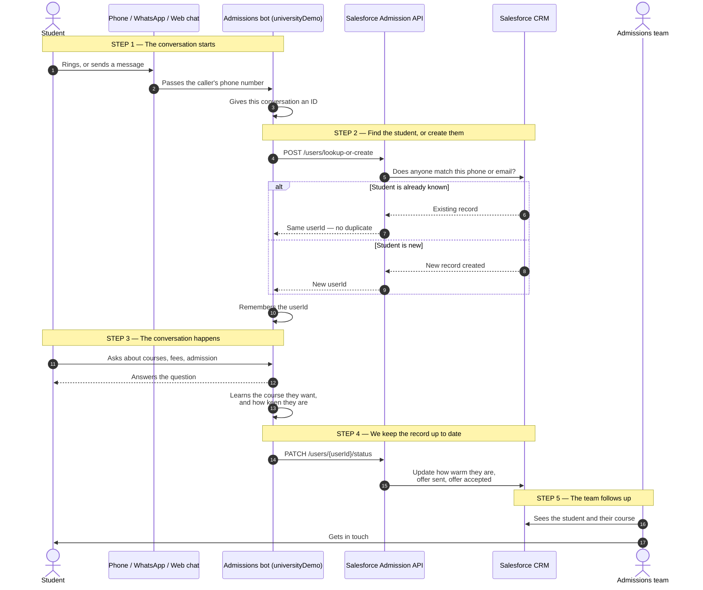
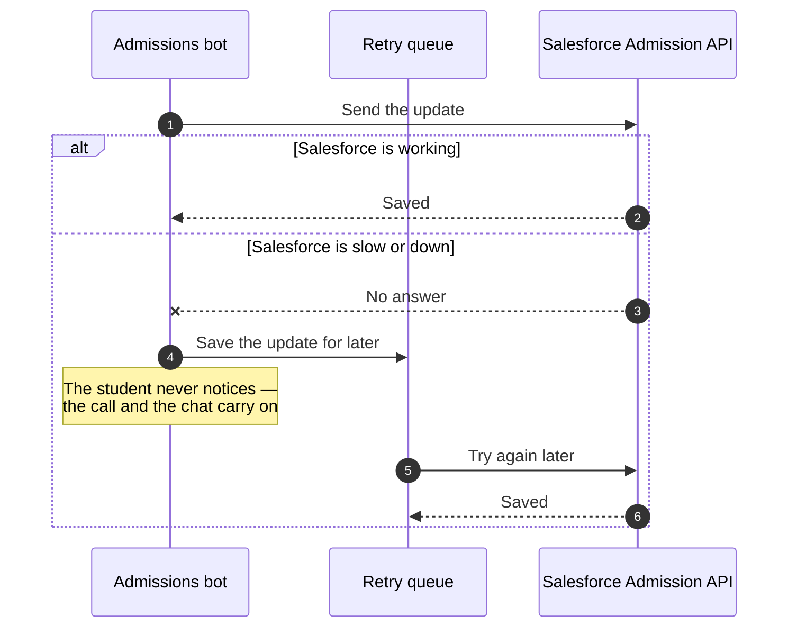

# Product Intent — Salesforce User Sync

**Plain-English version, written from the Product Owner's side**
**Date:** 2026-09-11 · **Status:** Phase 0 complete
**Technical detail:** see [`PLAN_SALESFORCE_USER_INTEGRATION.md`](PLAN_SALESFORCE_USER_INTEGRATION.md)

---

## 1. The problem today

Students talk to our AI assistant in three ways: they ring the phone line, they message us
on WhatsApp, and they use the web chat.

The assistant is good at the conversation. It finds out the student's name, phone number,
email, and which course they are interested in.

**But all of that stays inside our own app.**

The admissions team works in Salesforce. Salesforce knows nothing about these students.

So today:

- A student rings three times about the MBA. The counsellor has no idea.
- A student who is ready to apply looks exactly the same as one who is just browsing.
- When a student accepts an offer, nobody in Salesforce sees it.
- Someone has to write it all up by hand — or, more often, it never gets written up at all.

---

## 2. What we want

> **Every student who talks to our AI should appear in Salesforce as a real lead, with
> their contact details and the course they care about — and everything they do afterwards
> should keep that record up to date.**

### Why it matters

| Goal | What that means in practice |
|---|---|
| **No student is invisible** | Every conversation finds or creates them in the CRM |
| **Counsellors get context** | They see which course the student wants and how warm they are |
| **Faster follow-up** | Hot students show up while they are still interested |
| **One source of truth** | Salesforce, not a separate list the bot quietly keeps |
| **No double entry** | Nobody retypes anything, so nothing gets mistyped |

---

## 3. The flow

### And if Salesforce is down?

The student must never notice. This is how we promise that:

---

## 4. Walking through it, step by step

**Step 1 — The conversation starts.**
A student rings, or messages on WhatsApp, or opens the chat. The moment the conversation
begins, we give it an ID. Think of it as a label for *this particular chat*. We need one
because Salesforce asks for it every time we talk to it.

**Step 2 — We find the student, or create them.**
We ask Salesforce: "do you already know someone with this phone number or email?"

- **If yes** — we get their existing record back. We do not make a second one.
- **If no** — Salesforce creates a new record and hands us back a `userId`.

That `userId` is the important part. It is the handle we use for everything afterwards.
Without it, we cannot update anything later.

**Step 3 — The conversation happens.**
The student asks about courses, fees, admission. The assistant answers. Along the way it
learns more about them — which course they want, and sometimes their email.

**Step 4 — We keep the record up to date.**
As we learn things, we push them to Salesforce: how the student seems (keen, unsure,
frustrated), whether an offer letter went out, and whether they accepted it.

**Step 5 — The team acts.**
A counsellor opens Salesforce and sees the student, the course, and how warm they are.
They follow up.

---

## 5. Three promises we make

1. **The student never notices any of this.** If Salesforce is slow or down, calls, chats
   and WhatsApp keep working exactly as they do now. We save the update and send it later.
2. **One student, one record.** Calling twice does not create two people. Calling ten times
   does not create ten people.
3. **Nothing is switched on until it is proven.** Everything ships behind an off switch. If
   anything goes wrong, we flip the switch and we are instantly back to today's behaviour —
   no rollback, no downtime.

---

## 6. What "done" looks like

- [ ] A student who calls today is visible in Salesforce today
- [ ] Calling twice reuses the same record — no duplicates
- [ ] The course the student asked about is visible on the record
- [ ] How warm the student is (the sentiment) is visible
- [ ] An accepted offer shows in Salesforce
- [ ] If Salesforce goes down for an hour, nothing is lost — it all catches up
- [ ] With the switch off, the system behaves exactly as it does today

---

## 7. Two things the wider team should know

**One — Salesforce only accepts certain words.**
Salesforce will only accept five words for "how the student seems": `HOT`, `WARM`,
`NURTURE`, `AT-RISK`, `DISQUALIFIED`. Our app uses different words internally, so we
translate between them. We found this by testing — sending our own words is simply
rejected. It is handled, but it is the kind of thing that quietly breaks if someone edits
the code later without knowing.

**Two — a limitation to accept, not fix.**
Salesforce only keeps the **first** conversation we ever linked to a student. If they call
again, Salesforce still shows the old conversation. We work around this on our side, but
**anyone building a report on that Salesforce field will get the wrong answer for repeat
callers.** Please do not build reports on it.

---

## 8. Where we are

**Phase 0 is finished.** We verified the Salesforce API works end to end — creating a
student, finding an existing one, and updating their status all confirmed against the live
system.

**Next is Phase 1:** giving every conversation an ID from its very first moment. Today the
ID is only created *after* a call ends, which is too late for Salesforce. This step needs
no Salesforce access and changes nothing about how the product behaves today.

**Two things still need a decision before we go further:**
how long a WhatsApp "conversation" lasts before we treat the next message as a new one,
and what security we put in front of the Salesforce API before it runs anywhere other than
this machine.
