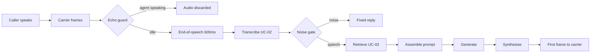
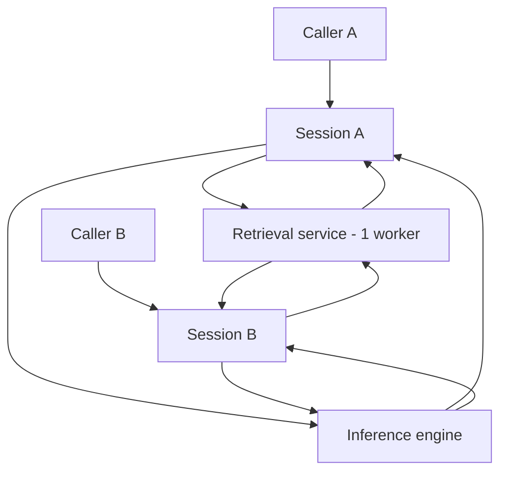
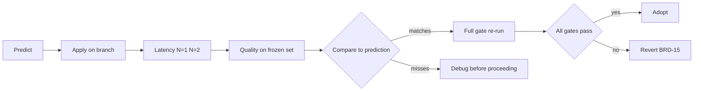

> **Lens:** BA · **Decided by:** BA · **Inputs:** `00-product-intent.md`, `01-brd.md` · **Engagement:** Brownfield · **Defines:** UC-01 … UC-08, WF-01 … WF-03

# Use Cases & Workflows — Admissions Voice Assistant Performance & Concurrency Program

## 1. Actors

| Actor | Role | Goals |
|---|---|---|
| **Caller** | Human, inbound | Get a correct answer about programs/fees/deadlines/eligibility, quickly, and be able to interrupt |
| **Admissions counselor** | Human, handoff recipient | Receive a warm lead with usable context |
| **Operator** | Human, runs the box | Keep 8 services healthy; know when a call is degrading before the caller complains |
| **Developer** | Human, maintains code | Change the pipeline without breaking quality or concurrency; trust that config says what runs |
| **Twilio** | System | Carry audio between PSTN and the app over Media Streams |
| **Inference engine (Ollama)** | System | Serve generation + embeddings for the tenant model |
| **Retrieval service (ERC MCP)** | System | Return grounded chunks for a query |
| **CRM (Salesforce API)** | System | Hold leads, offers, documents |
| **Stores (Postgres, Redis, Chroma)** | System | Persist leads, transcripts, sessions, vectors |

**Persona resolution:** all four personas in `00-product-intent.md` §3 resolve to actors — caller → **Caller**; admissions counselor → **Admissions counselor**; operator/admin → **Operator**; developer/maintainer → **Developer**.

**Completeness note (interrogation, section A):**
- *Caller* — "what breaks your task?" produced UC-01, UC-02, UC-03, UC-04. "What do you do when it fails?" produced the noise/clarification paths inside UC-02. No further candidates.
- *Counselor* — "what do you need from the system?" produced UC-04 only. A counselor-facing UI is out of scope (`01-brd.md` §2), so no UC exists for reading context — recorded as deliberate.
- *Operator* — produced UC-06, UC-07. "What do you do at 3am?" produced the degradation path in UC-06.
- *Developer* — produced UC-05, UC-07, UC-08.
- System actors (Twilio, Ollama, ERC, CRM, stores) are **participants**, not initiators — they appear inside UCs and WFs rather than owning one. Recorded so their absence as UC owners is not read as a gap.

## 2. Use Cases

### UC-01 — Place an inbound voice call
- **Actor(s):** Caller (initiator); Twilio, inference engine, retrieval service (participants)
- **Trigger:** Caller dials the Twilio number.
- **Preconditions:** Services running; carrier configured; model available (see `BRD-17`).
- **Postconditions — success:** Caller hears a greeting, then a spoken answer per turn; call ends on sign-off or hangup; transcript persisted post-call.
- **Postconditions — failure:** Caller hears a polite fallback or the call ends cleanly; no half-written lead; no other caller affected.
- **Main flow:**
  1. Caller dials; carrier fetches the voice endpoint and plays the IVR prompt.
  2. Caller presses a digit; carrier connects the media stream to the app.
  3. App opens a per-call session, speaks the greeting.
  4. Per turn: caller speaks → silence detected → transcript → grounded answer → synthesised speech → played back.
  5. Caller signs off; app speaks a closing and ends the call.
  6. Post-call: transcript processed for lead extraction and persisted.
- **Alternate flows:**
  - **A1.** Caller stays silent at the IVR → carrier times out and proceeds to the stream without a digit.
  - **A2.** Caller speaks before the greeting finishes → audio is discarded by the echo guard (`BRD-19`), and the caller must repeat.
- **Exception flows:**
  - **E1.** Model not resident → first turn pays a cold load; `BRD-03` is breached and traced.
  - **E2.** Retrieval service unavailable → fallback to local store; answer still produced (`BRD-13`).
  - **E3.** Second caller arrives mid-turn → see UC-03.
- **Business rules:** `BRD-02`, `BRD-03`, `BRD-13`, `BRD-18`.
- **Related workflows:** `WF-01`.
- **Scenario Coverage**

| Scenario | Covered |
|---|---|
| Happy path | ✓ main flow 1–6 |
| Alternate path | ✓ A1, A2 |
| Invalid input | ✓ DTMF ignored in-band (`main.py:686`); noise-gated turns use the ladder |
| Unauthorized user | — no auth on an inbound PSTN line; carrier number is the identity (`main.py:3172`) |
| Missing data | ✓ retrieval returns nothing → explicit "no information" marker |
| Partial data | ✓ some chunks relevant → partial grounding; `BRD-10` governs |
| Duplicate request | ✓ carrier retry creates a new session; no dedupe exists — recorded as a gap |
| Timeout | ✓ retrieval timeout → fallback; 2.5 s budget (`BRD-14`) |
| Dependency failure | ✓ E2; also model/db/cache failure per `BRD-13` |
| Retry | ✓ caller repeats; clarification loop capped at one (`voice_system_prompt.py:305`) |
| Concurrent operation | ✓ E3 → UC-03 |
| Cancellation | ✓ caller hangs up mid-turn; post-call handling skipped |
| Recovery | ✓ service restart resumes accepting calls (`BRD-15`) |
| Partial completion | ✓ call ends mid-turn → transcript may be partial; lead extraction handles it |

### UC-02 — Receive a grounded answer
- **Actor(s):** Caller; retrieval service, inference engine (participants)
- **Trigger:** An utterance is transcribed and passes the noise gate.
- **Preconditions:** Transcript ≥ minimum length; session has history.
- **Postconditions — success:** Spoken answer grounded in retrieved context, within the latency target.
- **Postconditions — failure:** Spoken "I don't have that information" or a clarification request; no invented facts.
- **Main flow:**
  1. Transcript is appended to conversation history.
  2. Retrieval query is issued; chunks returned.
  3. Prompt assembled: static instructions + retrieved context + recent history + current question.
  4. Model generates the answer.
  5. Answer synthesised to speech and played.
- **Alternate flows:**
  - **A1.** Noise-gated turn (short fragment / low confidence) → fixed reply, model never invoked.
  - **A2.** Sign-off phrase detected → fixed closing, model never invoked; call terminates.
  - **A3.** Repeated clarification detected → prompt rebuilt to force a concrete answer.
- **Exception flows:**
  - **E1.** Retrieval returns chunks below any relevance floor → today no floor exists (`BRD-10`); the model may ground on unrelated content.
  - **E2.** Model returns empty/failed → empty reply path; caller hears nothing this turn.
  - **E3.** Prompt exceeds context window → no trimming occurs today (`RAG_MAX_CONTEXT_CHARS=0`).
- **Business rules:** `BRD-09`, `BRD-10`, `BRD-18`.
- **Related workflows:** `WF-01`.
- **Scenario Coverage**

| Scenario | Covered |
|---|---|
| Happy path | ✓ main flow 1–5 |
| Alternate path | ✓ A1, A2, A3 |
| Invalid input | ✓ noise gate + STT confidence thresholds |
| Unauthorized user | — not applicable; no per-request authorisation on the voice path |
| Missing data | ✓ empty retrieval → explicit no-information marker |
| Partial data | ✓ partial grounding; `BRD-10` decides the floor |
| Duplicate request | ✓ same question twice → second uses history; no cache in the voice path |
| Timeout | ✓ retrieval 2.5 s → fallback, cost paid twice today (`BRD-14`) |
| Dependency failure | ✓ E2; embedding hop failure degrades to keyword-only |
| Retry | ✓ clarification capped at one; on repeat the model must answer |
| Concurrent operation | ✓ retrieval is shared and single-threaded (`BRD-07`) |
| Cancellation | — mid-generation cancellation is impossible; the call is non-streaming |
| Recovery | ✓ next turn proceeds independently; history preserved |
| Partial completion | ✓ empty model response leaves history appended but unanswered — recorded as a gap |

### UC-03 — Serve a second caller concurrently
- **Actor(s):** Caller A, Caller B; inference engine, retrieval service (participants)
- **Trigger:** A second inbound call begins while the first is mid-conversation.
- **Preconditions:** Both sessions admitted; `BRD-05` in force.
- **Postconditions — success:** Both callers complete turns within 1.5× of their solo latency; no cross-talk; no shared state leakage.
- **Postconditions — failure:** One caller degrades gracefully with a spoken fallback; neither receives the other's data.
- **Main flow:**
  1. Caller B's stream opens a second session.
  2. Both sessions accumulate audio independently.
  3. Both issue retrieval and generation requests.
  4. Inference engine serves both; retrieval service serves both.
  5. Each caller hears only their own audio.
- **Alternate flows:**
  - **A1.** *(Current behaviour — expected to disappear.)* Caller B arrives while Caller A is mid-generation → B queues behind A on the inference engine. This is a description of the **incumbent serialization defect**, not an acceptable design variant: `UC-03` exists to bound how much B is slowed by A, not to bless queueing. Post-change the flow is: B's turn proceeds concurrently and is bounded by `BRD-05`'s interference budget. Recorded explicitly so the scenario table is not read as endorsing the current behaviour.
- **Exception flows:**
  - **E1.** Retrieval is single-threaded → B's retrieval waits for A's (`BRD-07` breach).
  - **E2.** VRAM exhausted by two KV caches → OOM or spill (`BRD-11` breach).
  - **E3.** A's retrieval times out at 2.5 s → A pays the fallback cost; B is **not blocked by A's timeout**. Note the precision: "unaffected" is not the requirement (one shared GPU makes true non-interference impossible) — the requirement is that B stays within `BRD-05`'s interference budget: p95 ≤ 1.5× B's solo p95, no turn > 3 s, no queue starvation. See `BRD-05`'s three-way decomposition.
- **Business rules:** `BRD-05`, `BRD-06`, `BRD-07`, `BRD-11`, `BRD-12`.
- **Related workflows:** `WF-02`.
- **Scenario Coverage**

| Scenario | Covered |
|---|---|
| Happy path | ✓ main flow 1–5 |
| Alternate path | ✓ A1 queueing |
| Invalid input | ✓ each session's own noise gate applies independently |
| Unauthorized user | — not applicable |
| Missing data | ✓ each session retrieves independently |
| Partial data | ✓ per-session grounding |
| Duplicate request | ✓ two callers asking the same question → two independent retrievals; no shared cache |
| Timeout | ✓ E3 |
| Dependency failure | ✓ one session's dependency failure must not fail the other (`BRD-13`) |
| Retry | ✓ per-session retry; no shared retry state |
| Concurrent operation | ✓ this is the use case |
| Cancellation | ✓ one caller hangs up; the other continues |
| Recovery | ✓ a session crash must not kill the other |
| Partial completion | ✓ one caller mid-turn when the other ends — both handled |

### UC-04 — Escalate to a human
- **Actor(s):** Caller, Admissions counselor (participants: CRM, notification)
- **Trigger:** Caller asks for a human, or the noise ladder reaches its final rung.
- **Preconditions:** Call in progress; lead identifiable by carrier number.
- **Postconditions — success:** Lead recorded with handoff intent; caller told when to expect contact; call continues or ends politely.
- **Postconditions — failure:** Caller is told honestly that handoff could not be arranged; call ends cleanly.
- **Main flow:**
  1. Handoff is requested.
  2. Lead is identified or created.
  3. Handoff intent recorded against the lead.
  4. Caller is told a counselor will follow up.
- **Alternate flows:**
  - **A1.** Caller declines to leave details → accepted gracefully, no pressure (`BRD-18` opt-out rule).
- **Exception flows:**
  - **E1.** CRM API unavailable → handoff cannot be recorded; caller told honestly.
  - **E2.** Lead extraction cannot identify the caller → handoff recorded against the carrier number only.
- **Business rules:** `BRD-09`, `BRD-13`, `BRD-18`.
- **Related workflows:** `WF-03`.
- **Scenario Coverage**

| Scenario | Covered |
|---|---|
| Happy path | ✓ main flow 1–4 |
| Alternate path | ✓ A1 |
| Invalid input | ✓ unidentifiable caller → number-only lead |
| Unauthorized user | — not applicable |
| Missing data | ✓ no name/email captured → partial lead persisted |
| Partial data | ✓ E2 |
| Duplicate request | ✓ repeated handoff requests → one lead, no duplicate creation |
| Timeout | ✓ CRM call bounded; failure is spoken |
| Dependency failure | ✓ E1 |
| Retry | ✓ handoff retried on a later turn without duplicating the lead |
| Concurrent operation | ✓ two callers escalating → two leads |
| Cancellation | ✓ caller declines mid-handoff |
| Recovery | ✓ CRM recovers → later turns succeed |
| Partial completion | ✓ lead created but not marked for handoff — recorded as a gap |

### UC-05 — Capture and persist a lead after the call
- **Actor(s):** Developer (owner); CRM, store (participants)
- **Trigger:** Call ends.
- **Preconditions:** Transcript exists.
- **Postconditions — success:** Lead persisted with extracted fields; CRM synchronised.
- **Postconditions — failure:** Call data not silently lost; failure observable.
- **Main flow:**
  1. Post-call handler receives the transcript.
  2. Lead fields extracted.
  3. Lead resolved by carrier number.
  4. Persisted; CRM sync attempted.
- **Alternate flows:**
  - **A1.** Empty transcript → nothing saved, logged.
- **Exception flows:**
  - **E1.** Extraction fails → non-fatal; call record still persisted.
  - **E2.** Database unavailable → call data lost; recorded as a gap.
- **Business rules:** `BRD-13`, `BRD-18`.
- **Related workflows:** `WF-03`.
- **Scenario Coverage**

| Scenario | Covered |
|---|---|
| Happy path | ✓ main flow 1–4 |
| Alternate path | ✓ A1 |
| Invalid input | ✓ empty/garbled transcript → skip |
| Unauthorized user | — internal system flow |
| Missing data | ✓ no fields extracted → number-only record |
| Partial data | ✓ some fields extracted |
| Duplicate request | ✓ existing lead updated, not duplicated (upsert by phone) |
| Timeout | — extraction is post-call; no interactive budget |
| Dependency failure | ✓ E2 |
| Retry | ✓ CRM sync retried on next interaction |
| Concurrent operation | ✓ two calls ending together → two leads |
| Cancellation | — post-call runs to completion |
| Recovery | ✓ next call's post-processing unaffected |
| Partial completion | ✓ E1 — partial extraction persisted |

### UC-06 — Operate and recover the stack
- **Actor(s):** Operator
- **Trigger:** Scheduled start, or an observed degradation.
- **Preconditions:** Box has the services installed.
- **Postconditions — success:** All services healthy; a test call completes within the target.
- **Postconditions — failure:** Degraded mode documented and communicated; no silent partial state.
- **Main flow:**
  1. Operator starts the stack (one command).
  2. Health endpoints verified.
  3. Model and prompt prefix warmed.
  4. A test call confirms the path end-to-end.
- **Alternate flows:**
  - **A1.** A dependency is already running from a previous session → reused, not duplicated.
- **Exception flows:**
  - **E1.** A port is held by an orphaned process → start fails; operator resolves ownership.
  - **E2.** Model fails to load → stack runs but every call degrades; must be visible.
- **Business rules:** `BRD-15`, `BRD-16`, `BRD-17`.
- **Related workflows:** `WF-03`.
- **Scenario Coverage**

| Scenario | Covered |
|---|---|
| Happy path | ✓ main flow 1–4 |
| Alternate path | ✓ A1 |
| Invalid input | ✓ malformed config → start aborts with a clear message |
| Unauthorized user | — local operator, no auth layer |
| Missing data | ✓ absent env keys fall back to documented defaults |
| Partial data | ✓ partial config → effective values must be unambiguous (`BRD-16`) |
| Duplicate request | ✓ repeated start is idempotent |
| Timeout | ✓ startup deadline; a service that never listens is reported |
| Dependency failure | ✓ E2 |
| Retry | ✓ restart is safe and repeatable |
| Concurrent operation | ✓ start while a call is live — must not drop the call |
| Cancellation | ✓ operator aborts a start |
| Recovery | ✓ E1 orphan-port recovery |
| Partial completion | ✓ half-started stack must be detectable, never silent |

### UC-07 — Measure a turn
- **Actor(s):** Developer, Operator
- **Trigger:** Any completed voice turn.
- **Preconditions:** Instrumentation enabled.
- **Postconditions — success:** One machine-readable record per turn with per-stage timings and engine counters.
- **Postconditions — failure:** Missing stages are visible as absent, never as zero.
- **Main flow:**
  1. Turn begins at the end-of-speech decision.
  2. Stage boundaries recorded as the turn progresses.
  3. Engine counters captured from the inference response.
  4. Record emitted; derived stages computed.
- **Alternate flows:**
  - **A1.** Early-exit turn (noise gate, closing phrase) → fewer stages, still emitted, marked as such.
- **Exception flows:**
  - **E1.** Counter capture fails → record emitted without engine counters; must be distinguishable from a genuine zero.
  - **E2.** Two concurrent turns → records must not interleave or merge (`BRD-06`).
- **Business rules:** `BRD-01`, `BRD-06`, `BRD-16`.
- **Related workflows:** `WF-02`.
- **Scenario Coverage**

| Scenario | Covered |
|---|---|
| Happy path | ✓ main flow 1–4 |
| Alternate path | ✓ A1 |
| Invalid input | ✓ malformed/absent marks → absent stage, not a fabricated zero |
| Unauthorized user | — internal |
| Missing data | ✓ E1 |
| Partial data | ✓ partial stage set is valid and flagged |
| Duplicate request | ✓ same turn emitted twice → distinct turn IDs |
| Timeout | ✓ tracing never blocks or fails a turn |
| Dependency failure | ✓ tracing is dependency-free |
| Retry | ✓ re-emission on retry carries the same turn ID |
| Concurrent operation | ✓ E2 — the N=2 isolation requirement |
| Cancellation | ✓ aborted turn emits what it has |
| Recovery | ✓ tracing disabled → no-op, calls unaffected |
| Partial completion | ✓ partial trace is honest about what was seen |

### UC-08 — Evaluate quality against the frozen set
- **Actor(s):** Developer; Product Owner (ground-truth approver)
- **Trigger:** A candidate change is ready, or a baseline is needed.
- **Preconditions:** Golden set frozen and hashed; ground truth approved for critical intents.
- **Postconditions — success:** Per-intent scores recorded; the change is accepted or rejected by rule.
- **Postconditions — failure:** A blocked evaluation is reported as blocked, never as a pass.
- **Main flow:**
  1. Candidate configuration is applied.
  2. Every case is run; deterministic checks first.
  3. Rubric scoring second; human spot-check on disagreements.
  4. Per-intent results compared to the frozen baseline.
  5. Adoption decision per `BRD-09`.
- **Alternate flows:**
  - **A1.** Held-out 20% is never used for tuning — scored once at the end.
- **Exception flows:**
  - **E1.** Ground truth missing for a critical intent → evaluation blocked; escalates to the PO.
  - **E2.** A format check passes while the answer is wrong → rubric must catch it; format ≠ correctness.
- **Business rules:** `BRD-08`, `BRD-09`.
- **Related workflows:** `WF-03`.
- **Scenario Coverage**

| Scenario | Covered |
|---|---|
| Happy path | ✓ main flow 1–5 |
| Alternate path | ✓ A1 |
| Invalid input | ✓ malformed case file → rejected, not skipped |
| Unauthorized user | — internal |
| Missing data | ✓ E1 |
| Partial data | ✓ partial case set → report states coverage, never extrapolates |
| Duplicate request | ✓ re-running yields the same scores on a frozen set |
| Timeout | ✓ evaluation runs outside latency windows |
| Dependency failure | ✓ judge model unavailable → evaluation blocked, not scored as zero |
| Retry | ✓ re-run is safe |
| Concurrent operation | ✓ never runs concurrently with latency measurement |
| Cancellation | ✓ partial run reported as partial |
| Recovery | ✓ resumes from the last completed case |
| Partial completion | ✓ per-intent reporting means partial results are still meaningful |

### UC-09 — Decide caller-interruption behaviour
- **Actor(s):** Product Owner (decider); Caller (affected)
- **Trigger:** Stage 5 identified that the prompt instructs the agent to yield on interruption while the architecture discards the audio. A decision is required.
- **Preconditions:** Latency baseline exists; the echo-cancellation constraint is understood.
- **Postconditions — success:** A recorded decision — either barge-in is implemented, or it is explicitly not supported and the prompt is corrected to stop describing it.
- **Postconditions — failure:** The contradiction persists and is carried as an accepted gap with an owner.
- **Main flow:**
  1. The current behaviour is restated: caller audio is discarded while the agent speaks.
  2. The trade is stated: enabling interruption risks the agent transcribing its own speech (no echo cancellation on the carrier stream).
  3. Options are costed: keep-and-document, enable-with-guard, or enable-with-echo-suppression.
  4. The PO decides; the class is recorded.
  5. The agent's prompt is aligned to the decision.
- **Alternate flows:**
  - **A1.** Decision deferred → gap stays open with the PO as owner and a date.
- **Exception flows:**
  - **E1.** Enabling interruption degrades transcription → revert per `BRD-15`.
- **Business rules:** `BRD-19`, `BRD-15`, `BRD-18`.
- **Related workflows:** `WF-01`.
- **Scenario Coverage**

| Scenario | Covered |
|---|---|
| Happy path | ✓ main flow 1–5 |
| Alternate path | ✓ A1 |
| Invalid input | ✓ guard thresholds tuned on real speech |
| Unauthorized user | — PO-owned decision, no auth surface |
| Missing data | ✓ baseline missing → decision deferred until measured |
| Partial data | ✓ partial baseline → decision scoped to what is known |
| Duplicate request | ✓ decision recorded once; repeat requests cite it |
| Timeout | — not a timed flow |
| Dependency failure | ✓ E1 |
| Retry | ✓ revert and re-decide |
| Concurrent operation | ✓ two callers interrupting simultaneously is the test case |
| Cancellation | ✓ decision withdrawn before adoption |
| Recovery | ✓ revert restores discard behaviour |
| Partial completion | ✓ prompt updated but code not, or vice versa — must not ship mismatched |

### UC-10 — Evaluate a model or quantization change
- **Actor(s):** Developer; Product Owner (approver)
- **Trigger:** Streaming and concurrency changes fail to meet `BRD-02`/`BRD-05`, or VRAM at N=2 breaches `BRD-11`.
- **Preconditions:** Frozen golden set exists; streaming work is complete and measured.
- **Postconditions — success:** Model/quantization either adopted with quality evidence or rejected with the gate result recorded.
- **Postconditions — failure:** No model change is adopted on latency grounds alone.
- **Main flow:**
  1. Candidate sizes are derived from the VRAM budget at N=2, not from popularity.
  2. Each candidate is measured at N=1 **and** N=2 — never extrapolated.
  3. Each candidate is scored on the frozen golden set.
  4. Quality gate applied per `BRD-09`; latency compared to the streaming baseline.
  5. Adopt or reject; record the decision and its class.
- **Alternate flows:**
  - **A1.** No candidate clears both gates → the honest outcome is "not achievable on this hardware"; report it.
- **Exception flows:**
  - **E1.** Golden set unavailable (`DG-03`) → evaluation is blocked, and no swap is permitted.
- **Business rules:** `BRD-08`, `BRD-09`, `BRD-11`, `BRD-03`.
- **Related workflows:** `WF-03`.
- **Scenario Coverage**

| Scenario | Covered |
|---|---|
| Happy path | ✓ main flow 1–5 |
| Alternate path | ✓ A1 |
| Invalid input | ✓ a candidate that will not fit VRAM is rejected before evaluation |
| Unauthorized user | — internal |
| Missing data | ✓ E1 |
| Partial data | ✓ partial golden set → report coverage, do not extrapolate |
| Duplicate request | ✓ same candidate re-evaluated → same result on a frozen set |
| Timeout | ✓ model pulls bounded; failure aborts the candidate |
| Dependency failure | ✓ pull/load failure rejects the candidate cleanly |
| Retry | ✓ re-run is safe and idempotent |
| Concurrent operation | ✓ never evaluated while calls are live |
| Cancellation | ✓ evaluation abandoned mid-sweep leaves no partial adoption |
| Recovery | ✓ previous model restored per `BRD-15` |
| Partial completion | ✓ candidate loaded but not adopted — must be reverted explicitly |

## 3. Workflows

### WF-01 — Inbound call turn
- **Participants:** Caller, Twilio, app session, retrieval service, inference engine, speech services.
- **Trigger → Outcome:** Caller finishes a sentence → caller hears the first syllable of the reply.
- **Steps:**
  1. Carrier streams 20 ms µ-law frames to the app.
  2. Echo guard discards frames while the agent speaks (`BRD-19`).
  3. End-of-speech decision fires after sustained trailing silence (`BRD-04`).
  4. Audio decoded and transcribed (UC-02 step 1).
  5. Noise gate decides whether the model is invoked at all (UC-02 A1).
  6. Retrieval query issued; chunks returned (UC-02 steps 2–3).
  7. Prompt assembled with static prefix, context, history, question.
  8. Model generates the complete answer.
  9. Answer synthesised to a complete audio buffer.
  10. Buffer resampled and chunked; first frame sent to the carrier (UC-01 step 4).
- **Failure drill (section B):** ran across all ten steps; forced flows live in UC-01 E1–E3 and UC-02 E1–E3. Steps that produced no new candidate: step 2 (echo guard — its failure mode is caller frustration, already captured as UC-01 A2); step 10 (chunking — a truncation failure is a quality symptom, covered by `BRD-18`).
- **Partial completion matrix:**

| Failure point | State after (→ `SM-01` in Stage 4) | Resumable? | Compensation | Retry |
|---|---|---|---|---|
| Step 3 — endpoint never fires | No turn produced; buffer grows to the max-utterance cap | Yes — cap forces a turn | None needed | Automatic at cap |
| Step 4 — transcription empty | Turn consumed; fixed fallback reply spoken | Yes — next turn | Noise ladder advances | Caller repeats |
| Step 6 — retrieval timeout | Turn continues ungrounded or on fallback store | Yes | Local store fallback | Next turn re-queries |
| Step 8 — generation fails | Empty reply; caller hears nothing | Yes | None today — **gap** | Caller repeats |
| Step 9 — synthesis fails | No audio for a generated answer | Yes | None today — **gap** | Caller repeats |
| Step 10 — send fails | Partial audio delivered; stream may close | No | Call ends | Carrier redial |

### WF-02 — Two concurrent calls
- **Participants:** Caller A, Caller B, two app sessions, shared retrieval service, shared inference engine.
- **Trigger → Outcome:** A second call is admitted while the first is active → both complete turns within the concurrency target.
- **Steps:**
  1. Session B opens; B's greeting is synthesised (UC-03 step 1).
  2. A and B accumulate audio independently.
  3. A's turn enters retrieval; B's turn enters retrieval behind it (single-threaded today — `BRD-07`).
  4. A's turn enters generation; B's queues behind it on the engine.
  5. Both audio streams are written only to their own carrier sockets (UC-03 step 5).
  6. Turn traces are emitted per session and must not merge (UC-07 E2).
- **Failure drill (section B):** ran; forced flows are UC-03 E1–E3 and UC-07 E2. Steps producing nothing new: step 1 (greeting contention — a first-turn latency issue, covered by `BRD-03`); step 5 (socket isolation — a correctness failure, covered by `BRD-06`).
- **Partial completion matrix:**

| Failure point | State after (→ `SM-02`) | Resumable? | Compensation | Retry |
|---|---|---|---|---|
| Step 3 — retrieval serialization | B's turn delayed by A's retrieval duration | Yes | None today — **gap** | None |
| Step 4 — engine saturated | B's generation queued; both slower | Yes | None | None |
| Step 5 — cross-session leak | **Correctness violation** | No | None — must be prevented | n/a |
| Step 6 — merged traces | Measurement invalid | Yes | Discard the run | Re-run |
| Either session crashes | One call drops | Yes — the other continues | None | Caller redials |

### WF-03 — Change adoption
- **Participants:** Developer, Product Owner, load harness, golden set, validator.
- **Trigger → Outcome:** A candidate change is proposed → adopted with evidence, or rejected with a recorded reason.
- **Steps:**
  1. Hypothesis and numeric prediction written before the run (UC-08 precondition).
  2. Change applied on a branch or behind a flag (UC-06).
  3. Fixed suite run: latency at N=1 and N=2, then quality, in separate windows (UC-07, UC-08).
  4. Resource capture alongside (UC-03).
  5. Actual compared to prediction; the experiment log records a verdict (UC-08 step 4).
  6. Full gate re-run on the accumulated configuration.
  7. Adopt or revert per `BRD-15`.
- **Failure drill (section B):** ran; forced flows are UC-08 E1–E2 and UC-06 E2. Steps producing nothing new: step 1 (prediction discipline is process, not a failure path); step 7 (revert is the compensation).
- **Partial completion matrix:**

| Failure point | State after | Resumable? | Compensation | Retry |
|---|---|---|---|---|
| Step 1 — no prediction recorded | Result unattributable | No | Discard the experiment | Re-run with prediction |
| Step 3 — latency run invalidated by concurrent quality run | Measurement noise | Yes | Discard the window | Re-run isolated |
| Step 5 — gain < 50% of prediction | Change is suspect | Yes | Investigate before proceeding | Per the phase gate |
| Step 6 — a previously-passing gate fails | Regression introduced | Yes | Revert the change | Re-run the gate |
| Step 7 — revert fails | Stack left changed | No | Restore from branch | Manual |

