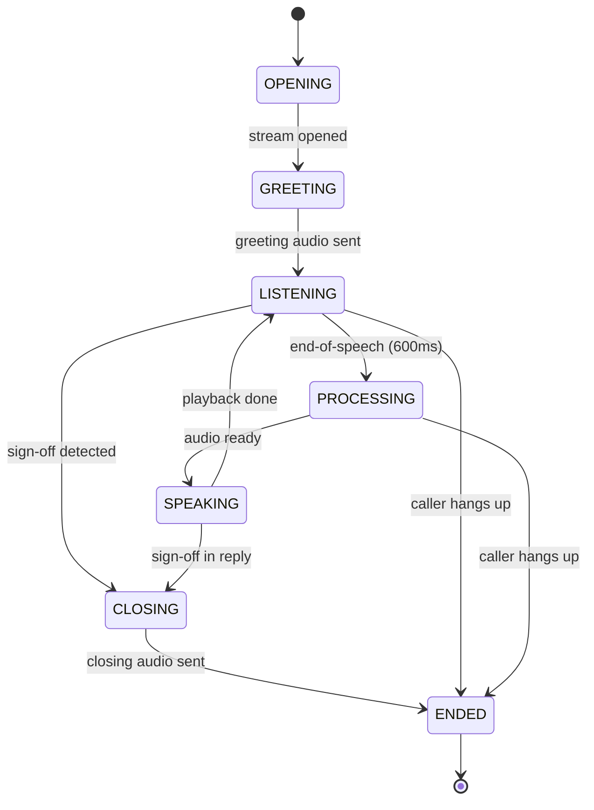
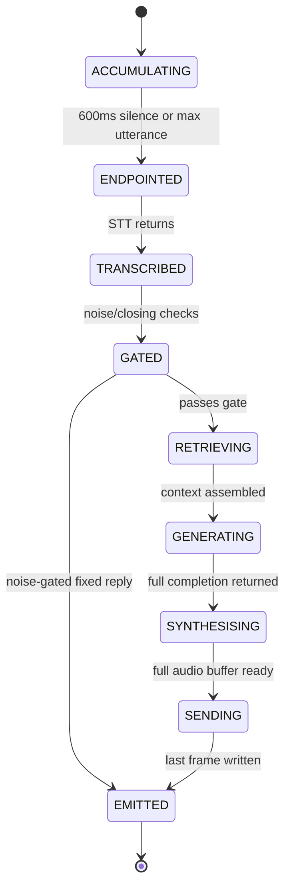
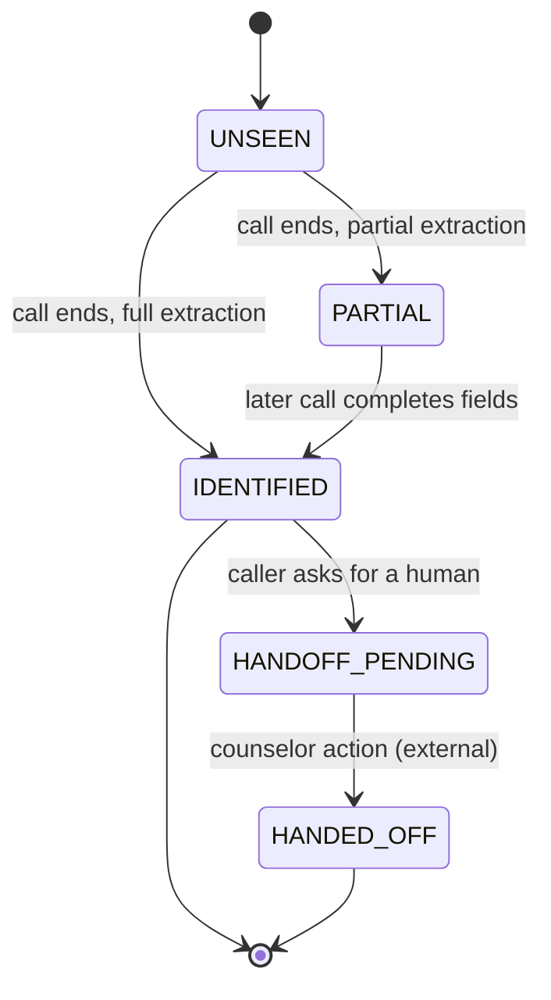

> **Lens:** BA (Part A) / BA + TPO (Part B) · **Decided by:** BA, gated by TPO on workaround feasibility · **Inputs:** `00-product-intent.md`, `01-brd.md`, `02-use-cases-workflows.md` · **Engagement:** Brownfield · **Defines:** DAT-01 … DAT-14, DG-01 … DG-06, SM-01 … SM-03

# Data & State Analysis — Admissions Voice Assistant Performance & Concurrency Program

## Part A — Data Reality [Lens: BA]

### A.1 Data Inventory

| ID | Data | Source | Owner | Required? | Availability | Quality | Freshness | Trust |
|---|---|---|---|---|---|---|---|---|
| DAT-01 | Knowledge base content | `content/meridian/meridian_knowledge_base.md` (11,214 B, 16 sections) | Developer | Yes | 100% | High | edited manually | trusted |
| DAT-02 | Vector store — local | Chroma `./chroma_local_db`, collection `langchain` | Developer | Yes | ~47 records | Medium | rebuilt on demand | trusted |
| DAT-03 | Vector store — ERC | `<ERC>/chroma_data`, collection `meridian-kb` | Developer | Yes | 37 chunks | Medium | prepopulate script | **conflicting with DAT-02** |
| DAT-04 | Conversation history | In-memory list, per call | App | Yes | 100% while live | High | per turn | trusted |
| DAT-05 | Call transcripts | Postgres (post-call) | App | Yes | Partial | Medium | at call end | user-entered (spoken) |
| DAT-06 | Leads | Postgres + Salesforce CRM | App / CRM | Yes | Partial | Medium | post-call, then sync | user-entered |
| DAT-07 | **Per-turn latency traces** | `logs/perf_turns.jsonl` | App | Yes | **Missing — does not exist** | — | — | — |
| DAT-08 | **Frozen golden set** | `eval/golden_set.jsonl` | Developer + PO | Yes | **Missing — does not exist** | — | — | — |
| DAT-09 | Runtime configuration | `.env` + `.machine_profile.json` | Developer | Yes | 100% | **Low — 4 keys inert, 3 disagree** | manual | **conflicting** |
| DAT-10 | Audio buffers (µ-law / PCM) | In-process, per turn | App | Yes | 100% transient | High | per frame | trusted |
| DAT-11 | TTS audio cache | Class-level dict, **shared across calls** | App | No | 100% | High | in-process | **shared — isolation unproven** |
| DAT-12 | Pre-synthesised critical audio set | Versioned audio assets on disk | App / Operator | Yes (`US-016`) | **Missing — does not exist** | — | regenerated on voice or script change | trusted once hashed |
| DAT-13 | Admission records | `logs/admissions.jsonl` | App | Yes (`US-016`) | **Missing — does not exist** | — | per admission decision | trusted |
| DAT-14 | Index version pointer (`ACTIVE`) and `KB_VERSION` | `kb/ACTIVE` + version directories | Operator | Yes (`DG-01`) | **Missing — no versioning concept exists** | — | per rebuild | trusted once validated |

### A.2 Load & Capacity Model

**Derivation chain (all figures Derived unless marked):**

```
Callers are conversational, not batched.
A turn occupies the pipeline for ~T_turn seconds (measured range 3.6–5.6 s today).
A caller produces a turn roughly every T_cycle ≈ 15 s
   (speak ~5 s + agent speaks ~5 s + think ~5 s) — Assumed, no measurement exists.

Peak concurrent in-flight turns = 2            (AS-01, User-provided)
Peak turn arrival rate = callers / T_cycle = 2 / 15 ≈ 0.133 turns/s
Peak instantaneous concurrency = 2             (the binding number, not the rate)
```

| Core flow | Peak arrival | Peak concurrency | Peak : average | 12-month growth | Evidence |
|---|---|---|---|---|---|
| WF-01 Inbound turn | ~0.13 turns/s | **2 in-flight** | Unknown — seasonal (admissions calendar) | Unknown | Derived from AS-01; `T_cycle` is Assumed |
| WF-02 Two concurrent calls | 2 calls | 2 sessions | Unknown | Unknown | User-provided peak |
| **WF-02 + background (`BRD-20`)** | 2 calls + 1 chat request | **2 voice sessions + 1 background job** | Unknown — the realistic peak for this box | Unknown | **Still Assumed, and now measurable.** US-017 built the policy and the harness gained `--background-units` on 2026-09-19, so the 2+1 mix can be driven; the figures are not yet in, so the row stays labelled Assumed rather than being quietly promoted. **Demonstration window measured:** 6 background units against a live call pair — 5 deferred, **0 started during a voice turn**, peak background concurrency 1 |
| WF-03 Change adoption | n/a (developer-time) | 1 | n/a | n/a | Not a runtime flow |

> **The binding constraint is concurrency, not rate.** 0.13 turns/s is trivial for any engine; **2 simultaneous in-flight generations on one GPU sharing 448 GB/s is not.** This is why the capacity model is expressed in concurrent requests.

**Per-asset scale profile:**

| Asset | Volume | Velocity | Access pattern | Consistency needed |
|---|---|---|---|---|
| DAT-01 KB content | 11 KB, 16 sections | rare (manual edit) | read at ingest | strong |
| DAT-02 local vectors | ~47 records | rebuilt on demand | read per retrieval | strong within a store |
| DAT-03 ERC vectors | 37 chunks | prepopulate on boot | read per retrieval | strong within a store |
| DAT-04 history | ≤6 entries per call | write per turn | read per turn | strong, session-local |
| DAT-05 transcripts | ~1 per call | write post-call | append-only | eventual |
| DAT-06 leads | 1 per call | write post-call + sync | upsert by phone | strong on identity |
| DAT-07 traces | ~1 row/turn. 30-min soak at N=2 = 2 callers × (1800 s ÷ 15 s per turn) = **240 rows** | append per turn | append-only, read offline | eventual |
| DAT-09 config | ~222 env lines | rare | read at import | **strong — currently violated** |
| DAT-11 TTS cache | ≤50 entries, **process-wide** | write per utterance | read per utterance | **strong on isolation — unproven** |

### A.3 Completeness Classification

| Data asset | Classification | Consequence |
|---|---|---|
| DAT-01 Knowledge base content | Complete | — |
| DAT-02 Local vector store | Partially available | Local store only serves when MCP is down |
| DAT-03 ERC vector store | **Conflicting** with DAT-02 | Same question → different chunks depending on which store answers; citation prefixes differ |
| DAT-04 Conversation history | Complete (ephemeral) | Lost on process restart mid-call; acceptable |
| DAT-05 Call transcripts | Partially available | Post-call only; unusable for in-call context |
| DAT-06 Leads | Partially available | Depends on extraction succeeding post-call |
| DAT-07 Per-turn latency traces | **Missing** | No per-stage latency data exists — the program's first deliverable |
| DAT-08 Frozen golden set | **Missing** | Quality gate cannot run — blocking |
| DAT-09 Runtime configuration | **Conflicting / Stale** | `FASTAPI_WORKERS`, `WHISPER_NUM_THREADS` disagree; 4 keys never read |
| DAT-10 Audio buffers | Complete | — |
| DAT-11 TTS audio cache | **Untrusted (shared)** | Class-level, process-wide; two concurrent callers share one dict |
| DAT-12 Pre-synthesised critical audio | **Missing** | `BRD-13`'s matrix makes it the only path that can speak when TTS is the failed component (`US-016`) |
| DAT-13 Admission records | **Missing** | Without it, refusals are indistinguishable from failures in the call record (`US-016`) |

### A.4 Data Gap Decisions

| ID | Gap | Impact | Workaround | Decision |
|---|---|---|---|---|
| DG-01 | DAT-02/DAT-03 diverge — two stores, two chunkers, different results for the same question | Answer content and citation format change on failover | Pick one authoritative store; retire or regenerate the other | **derive** — consolidate to one store, verified against DAT-01; affects `UC-02`, `WF-01`. See the index-versioning contract below — consolidation without atomic replacement would trade one correctness bug for another |
| DG-02 | No arrival-rate measurement (AS-01, AS-06) | Capacity model rests on an assumed peak of 2 | Instrument call admissions during Phase A baseline | **continue-without** — proceed on 2, validate in Stage 5 with a named owner |
| DG-03 | DAT-08 golden set does not exist; ground truth for fees/deadlines/eligibility/escalation needs human approval (AS-05) | `BRD-08`/`BRD-09` cannot be evaluated; every Class B/C change is blocked | Author the set; PO approves critical-intent ground truth | **block** — blocks `UC-08` and the quality gate; descope only by PO decision |
| DG-04 | DAT-07 does not exist | `BRD-01` unmet; all latency numbers remain inferred | Build instrumentation (A1) | **derive** — instrumentation is the Phase A deliverable; affects `UC-07`, `WF-01` |
| DG-05 | DAT-09 conflicts — `.env` vs `.machine_profile.json` vs code defaults | "Set" ≠ "live"; a reviewer can optimise a value that never executes | Establish one source of truth; remove or wire inert keys | **use-as-is (short term)** with a verification step per change; **derive** the single source in Stage 8 |
| DG-06 | DAT-11 TTS cache is process-wide and shared by concurrent calls | A cross-caller audio leak would violate `BRD-06` | Keys are content hashes, so identical text maps to identical audio — no PII in the key | **use-as-is**, conditional on an explicit N=2 isolation test (`UC-03`, `BRD-06`) |

> `DG-03` is the only **block** decision. It stops the pipeline at Stage 5 unless the PO supplies ground truth or descopes the quality gate.

### A.5 Data Lineage

| Asset | Lineage |
|---|---|
| DAT-01 KB content | `meridian_knowledge_base.md` → split on `## ` headings → chunked (600/90) → **two independent chunkers** → DAT-02 **and** DAT-03 |
| DAT-02 Local vectors | DAT-01 → RecursiveCharacterTextSplitter → `nomic-embed-text` → Chroma `langchain` → read by `rag_legacy` |
| DAT-03 ERC vectors | DAT-01 → custom paragraph packer → `nomic-embed-text` → Chroma `meridian-kb` → read by ERC → MCP → app |
| DAT-04 History | Caller speech → transcript → appended as `Caller:`/`Assistant:` strings → windowed to last 6 → flattened into one prompt string |
| DAT-05 Transcripts | DAT-04 → post-call handler → LLM extraction → Postgres |
| DAT-06 Leads | DAT-05 extraction → upsert by phone → Postgres → CRM sync |
| DAT-07 Traces | Turn boundaries → marks → engine counters → JSONL (**derived asset; derivation is DG-04**) |
| DAT-09 Config | `scripts/predeploy.py` writes the machine block into `.env` and writes `.machine_profile.json` → both read inconsistently → **DG-05** |

### A.6 Index versioning and atomic replacement (the `DG-01` physical contract)

`DG-01` decides *which* store survives. It does not yet say **where it physically lives or how it is replaced safely** — and consolidation without that answer would swap one correctness bug (two divergent stores) for another (callers reading a half-rebuilt index). The contract:

```
kb/
  versions/
    2026-09-18.01/   ← complete, validated index; immutable once published
    2026-09-17.03/   ← retained previous version
  ACTIVE             ← pointer file (or symlink) naming the live version
```

**Lifecycle — build, validate, switch, retain:**

| Step | Action | Why |
|---|---|---|
| 1 Build | New version written to its own directory, never over the live one | A rebuild cannot corrupt the index callers are reading |
| 2 Validate | Chunk count, section coverage against `DAT-01`, embedding dimension, a smoke retrieval | Catches a truncated or partially-embedded index before it is live |
| 3 Switch | `ACTIVE` pointer replaced **atomically** (rename or symlink swap) | A reader sees either the whole old version or the whole new one — never a partial state |
| 4 Retain | Previous version kept, not deleted | Rollback is a pointer swap back, seconds not minutes |
| 5 Prune | Old versions removed only after the new one has served a full session | Bounds disk without a cliff |

**Version identity.** `KB_VERSION` (e.g. `2026-09-18.01`) is recorded in the trace and in the golden-set score. Without it, a quality score cannot be tied to the content it was measured against — and `DAT-01` is edited by hand, so this will drift.

**Questions this closes** (each was previously unanswered):

- *Concurrent reads* — readers open the version named by `ACTIVE` at request time; no reader holds a writer lock.
- *Rebuilds* — happen in a separate directory; no in-place mutation, so no locking contention with live traffic.
- *Atomic replacement* — a pointer swap, not a directory rename over a live path.
- *Index refresh* — a new version becomes visible only at the swap; there is no partial-visibility window.
- *Corruption recovery* — validate-before-switch (step 2) plus retain-previous (step 4); a corrupt build never reaches `ACTIVE`.
- *Rollback* — swap the pointer back. This is the `BRD-15` reversibility requirement applied to data.
- *Versioning* — `KB_VERSION` is stamped into traces and evaluations.
- *In-flight calls* — a caller mid-turn keeps reading the version it opened. A rebuild never changes the answer to a question already being answered.

**Both the MCP path and the local fallback read the same `ACTIVE` version.** This is the part `DG-01` alone left open: with two readers of one store, the fallback stops being a *different* corpus and becomes the same corpus reached differently — which is what makes `REC-03`'s "citation format changes on failover" go away.

## Part B — Entity Lifecycle & State Analysis [Lens: BA + TPO]

### B.1 Key Entities

| Entity | Owned by (future MOD) | States | SM |
|---|---|---|---|
| Call session | MOD-01 Voice Turn Path | OPENING, GREETING, LISTENING, PROCESSING, SPEAKING, CLOSING, ENDED | SM-01 |
| Turn | MOD-01 Voice Turn Path | ACCUMULATING, ENDPOINTED, TRANSCRIBED, GATED, RETRIEVING, GENERATING, SYNTHESISING, SENDING, EMITTED | SM-02 |
| Lead | MOD-05 Lead & CRM | UNSEEN, PARTIAL, IDENTIFIED, HANDOFF_PENDING, HANDED_OFF | SM-03 |

### B.2 State Machines

### SM-01 — Call session lifecycle

1. **Created by:** UC-01, actor Caller (via carrier stream open).
2. **States:** OPENING → GREETING → LISTENING ⇄ PROCESSING → SPEAKING → LISTENING … → CLOSING → ENDED.
3. **Who transitions:** Carrier opens/closes; the app drives GREETING→LISTENING→PROCESSING→SPEAKING; the caller drives LISTENING (by speaking) and CLOSING (by sign-off).
4. **Legal:** as drawn. **Illegal:** PROCESSING → GREETING (no re-greeting); ENDED → any state; SPEAKING → PROCESSING (a turn cannot begin while the agent speaks — `MUTE_STT_DURING_TTS` discards the audio, `BRD-19`).
5. **Repeatable:** LISTENING→PROCESSING→SPEAKING is repeatable per turn. GREETING is not.
6. **Concurrent:** Caller speaks during SPEAKING → audio discarded (today); with barge-in enabled this becomes a real race and needs its own decision (`BRD-19`).
7. **Halfway stop:** process crash while PROCESSING → session is lost; the carrier stream closes; no resume.
8. **Resume:** none — a dropped call ends. Caller redials (new session, new SM-01 instance).
9. **Cancel:** caller hangs up from any state → ENDED; post-call handling (UC-05) still runs if a transcript exists.
10. **Timeout:** LISTENING with no speech beyond the max-utterance cap forces a turn (`voice_handler.py:283`); no session-level idle timeout exists — recorded as a gap.



### SM-02 — Turn lifecycle

1. **Created by:** UC-01, on the first non-silent frame after the agent stops speaking.
2. **States:** ACCUMULATING → ENDPOINTED → TRANSCRIBED → GATED → RETRIEVING → GENERATING → SYNTHESISING → SENDING → EMITTED.
3. **Who transitions:** the app drives every transition; the caller only determines when ACCUMULATING ends.
4. **Legal:** as drawn. **Illegal:** ACCUMULATING → TRANSCRIBED without ENDPOINTED; GENERATING → SENDING without SYNTHESISING; any transition back to ACCUMULATING within the same turn.
   **AMENDED 2026-09-19 by US-016:** `GENERATING → fixed response → EMITTED` is a legal path, recorded here as an explicit amendment rather than left as a transition the machine calls illegal. A generation that fails or returns empty emits the pre-synthesised fixed response; the turn is recorded as `degraded`, which is its own outcome. `SM-01`'s state list is **unchanged** — there is no QUEUED, HOLDING or REFUSED state, because a refused call creates no session at all.
5. **Repeatable:** no — a turn instance is single-use; a new turn is a new instance.
6. **Concurrent:** with two callers, two independent SM-02 instances run; they share the inference engine and the retrieval service and must not share state (`BRD-06`).
7. **Halfway stop:** crash during GENERATING → history already appended with the caller's line, answer never spoken; **the turn is lost and the transcript records a question with no answer** — recorded as a gap.
8. **Resume:** none today. The next turn carries the history forward.
9. **Cancel:** not possible — the pipeline is non-streaming, so a turn cannot be abandoned mid-flight. This is the core latency problem: `BRD-02`.
10. **Timeout:** no per-stage timeout exists inside a turn; only the retrieval hop is bounded (2.5 s). A hung generation has no ceiling below the client's own limit — recorded as a gap against `BRD-14`.



### SM-03 — Lead lifecycle

1. **Created by:** UC-05 (post-call extraction) or UC-04 (handoff request mid-call).
2. **States:** UNSEEN → PARTIAL → IDENTIFIED → HANDOFF_PENDING → HANDED_OFF.
3. **Who transitions:** the app (extraction, upsert); the caller's spoken intent drives HANDOFF_PENDING; a counselor's action drives HANDED_OFF (outside this system).
4. **Legal:** as drawn. **Illegal:** UNSEEN → HANDED_OFF; PARTIAL → HANDED_OFF without IDENTIFIED.
5. **Repeatable:** upsert by phone is idempotent — repeat calls update, not duplicate.
6. **Concurrent:** two calls from the same number cannot occur simultaneously on one line; two different numbers create two leads.
7. **Halfway stop:** crash between lead creation and handoff marking → lead exists, handoff lost — recorded as a gap (also UC-04 partial completion).
8. **Resume:** next call from the same number resumes at IDENTIFIED.
9. **Cancel:** caller declines handoff → stays IDENTIFIED, no push.
10. **Timeout:** no lifecycle timeout; a HANDOFF_PENDING lead never ages out — recorded as a gap.



### B.3 Partial Completion Matrix

Per workflow, from `02-use-cases-workflows.md`:

| Failure point | State after | Resumable? | Compensation | Retry |
|---|---|---|---|---|
| WF-01 step 8 — generation fails | GENERATING → fixed response → EMITTED; history has the question, the caller hears the prepared sentence | Yes — next turn | **Built 2026-09-19 (US-016)**: the pre-synthesised fixed response, read from disk, byte-identical across failures. Deterministic, and needs no model or synthesiser | Caller repeats |
| WF-01 step 9 — synthesis fails | SM-02 at SYNTHESISING; answer exists but unspoken | Yes | **Built 2026-09-19 (US-016)**: the same fixed response, which needs no synthesiser because it is read from disk — which is what makes it work when synthesis is the thing that failed | Caller repeats |
| WF-01 step 10 — send fails | SM-02 at SENDING; partial audio delivered | No | Call ends | Carrier redial |
| WF-02 step 3 — retrieval serialization | Caller B's SM-02 waits at RETRIEVING | Yes | None today (`BRD-07`) | None |
| WF-02 step 5 — cross-session leak | **Correctness violation** | No | Must be prevented (`BRD-06`) | n/a |
| WF-03 step 6 — regression found | Config changed, gate failed | Yes | Revert (`BRD-15`) | Re-run gate |
| UC-04 — handoff after lead created | SM-03 at IDENTIFIED, handoff lost | Yes — next call | None (**gap**) | Caller re-requests |
| UC-05 — DB unavailable at call end | Transcript lost; SM-03 never created | No | None (**gap**) | None |
