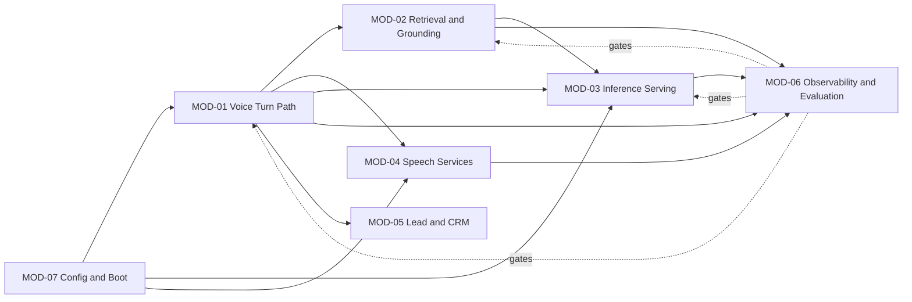

> **Lens:** TPO + Architect (joint) · **Decided by:** TPO + Architect, consulted BA · **Inputs:** `00-product-intent.md`, `01-brd.md`, `02-use-cases-workflows.md`, `03-data-state-analysis.md`, `04-coverage-gap-analysis.md` · **Engagement:** Brownfield · **Defines:** MOD-01 … MOD-07

# Modularization — Admissions Voice Assistant Performance & Concurrency Program

## 1. Approach & Justification

- **Decomposition style:** **Brownfield module boundaries over an existing monolith.** The system already runs as 8 processes on one box; the boundaries below follow the code's existing seams (`app/voice_handler.py`, `app/rag*.py`, `app/llm_backend.py`, `app/leads/`, `start_services.ps1`) rather than imposing a new topology.
- **Why it fits this product:** one developer, one box, fixed hardware, a 2-caller ceiling. Deployment independence buys nothing here — everything must co-reside for latency. What *is* needed is **fault and performance isolation**: the plan's central finding is that one module's blocking design (retrieval, single event loop) degrades another's service. Boundaries here exist to make that coupling visible and ownable, not to enable independent deploys.
- **Alternatives considered:**
  - *Microservices / independent deploys* — rejected: adds network hops to a latency budget already dominated by serial hops, and the box cannot host more processes at N=2 VRAM.
  - *Layered (controller/service/repository)* — rejected: the codebase is already layered enough; the problems are cross-cutting timing and isolation, which layers don't express.
  - *Pure DDD bounded contexts* — partially adopted: MOD-02 and MOD-05 are genuine bounded contexts (retrieval, lead lifecycle). MOD-01/03/04 are pipeline stages, not domains, and are named as such.
- **Brownfield rule applied:** existing boundaries were the starting point. Only **MOD-06** is net-new; the rest name seams that already exist in code but were never written down — which is why four inert config keys and two divergent stores went unnoticed.

## 2. Module Map

### MOD-01 — Voice Turn Path
- **Responsibility:** own one caller's turn from end-of-speech to first audio frame on the carrier, and the session lifecycle around it.
- **Why this boundary:** it is the unit that `BRD-02` (latency) and `BRD-06` (isolation) are measured on. Architect: this module is where the serial chain lives, so streaming and cancellability land here. TPO: it is the highest-churn area, so it must stay independently testable. Alternatives: folding speech services in would couple model config to turn logic.
- **Inputs / Outputs:** in — µ-law frames from the carrier, retrieved context, generated text, synthesised audio. Out — audio frames to the carrier, transcripts to MOD-05, turn traces to MOD-06.
- **Depends on:** `MOD-02`, `MOD-03`, `MOD-04`, `MOD-06`, `MOD-07`.
- **Key aggregates / entities:** Call session (`SM-01`), Turn (`SM-02`), conversation history (`DAT-04`), audio buffers (`DAT-10`).
- **Satisfies:** `BRD-02`, `BRD-03`, `BRD-04`, `BRD-13`, `BRD-18`, `BRD-19` · `UC-01`, `UC-02`, `UC-03`, `UC-04`, `UC-09`
- **Size estimate:** ~6 stories (instrumentation is MOD-06).

### MOD-02 — Retrieval & Grounding
- **Responsibility:** turn a question into grounded context, and decide when context is not good enough to answer from.
- **Why this boundary:** it contains `DG-01` (two divergent stores) and `DG-03`'s quality precondition, and it is the named concurrency bottleneck (`BRD-07`). Architect: the single-event-loop design is the 2-caller constraint, so the fix is internal to this module. TPO: consolidating two stores is the highest-effort item in the plan and must be sequenced independently of streaming.
- **Inputs / Outputs:** in — query text. Out — ranked chunks, or an explicit "not relevant" signal.
- **Depends on:** `MOD-03` (embeddings), `MOD-06`.
- **Key aggregates / entities:** `DAT-01` KB content, `DAT-02`/`DAT-03` vector stores, `SM-03`-adjacent citation metadata.
- **Contains:** `DG-01` (store consolidation), `DG-06` (shared-cache isolation test).
- **Satisfies:** `BRD-07`, `BRD-10`, `BRD-14` · `UC-02`, `UC-03`
- **Size estimate:** ~5 stories.

### MOD-03 — Inference Serving & Prompt Assembly
- **Responsibility:** assemble the prompt, hold the model resident, and serve generation to all callers.
- **Why this boundary:** the A4 experiment showed prompt *structure* determines per-turn prefill cost, and model residency determines cold-start (`BRD-03`, `BRD-17`). Architect: prompt ordering and stream consumption are the two highest-leverage latency changes. TPO: this is where `UC-10`'s model decision would land, so keep it separable.
- **Inputs / Outputs:** in — context chunks, history, question. Out — generated text, engine counters.
- **Depends on:** `MOD-06`, `MOD-07`.
- **Key aggregates / entities:** the system prompt template, `DAT-09` model config, engine counters.
- **Satisfies:** `BRD-02`, `BRD-03`, `BRD-11`, `BRD-17` · `UC-02`, `UC-10`
- **Size estimate:** ~5 stories.

### MOD-04 — Speech Services
- **Responsibility:** transcribe caller audio and synthesise agent speech.
- **Why this boundary:** both are GPU-resident models competing for the same VRAM and bandwidth as the LLM; the VRAM budget at N=2 is decided here. Architect: streaming synthesis is a within-module change with a large latency payoff. TPO: TTS output buffering is shared process-wide (`DAT-11`), which is an isolation risk owned here.
- **Inputs / Outputs:** in — audio buffers, text. Out — transcripts, audio buffers.
- **Depends on:** `MOD-06`, `MOD-07`.
- **Key aggregates / entities:** STT model, TTS model, `DAT-11` TTS cache.
- **Satisfies:** `BRD-05`, `BRD-11`, `BRD-18` · `UC-02`, `UC-03`
- **Size estimate:** ~4 stories.

### MOD-05 — Lead & CRM
- **Responsibility:** capture, identify and hand off a caller as a lead.
- **Why this boundary:** it is a genuine bounded context with its own lifecycle (`SM-03`) and an external system (Salesforce) that can fail independently. Architect: it is post-call and therefore the one place where latency is unconstrained — keeping it out of MOD-01 is what makes that true. TPO: least churn; lowest priority in this program.
- **Inputs / Outputs:** in — transcripts, handoff requests. Out — leads, CRM sync, notifications.
- **Depends on:** `MOD-06`.
- **Key aggregates / entities:** Lead (`SM-03`), `DAT-05` transcripts, `DAT-06` leads.
- **Satisfies:** `BRD-13`, `BRD-18` · `UC-04`, `UC-05`
- **Size estimate:** ~3 stories (mostly acceptance criteria for existing behaviour).

### MOD-06 — Observability & Evaluation **(net-new)**
- **Responsibility:** make latency and quality measurable — per-stage traces, the load harness, and the frozen golden set.
- **Why this boundary:** `BRD-01` and `BRD-08` have no home in the existing code; `DAT-07` and `DAT-08` do not exist. Architect: it must be dependency-free so tracing can never fail a call, and it must isolate per caller (`BRD-06`). TPO: it is the program's Phase A deliverable and gates every later decision, so it is built first.
- **Inputs / Outputs:** in — stage boundary marks, engine counters, call audio. Out — `logs/perf_turns.jsonl`, harness results, evaluation scores.
- **Depends on:** nothing (deliberately — no `app.*` imports).
- **Key aggregates / entities:** `DAT-07` traces, `DAT-08` golden set.
- **Contains:** `DG-04` (traces do not exist).
- **Satisfies:** `BRD-01`, `BRD-06`, `BRD-08`, `BRD-09` · `UC-07`, `UC-08`
- **Size estimate:** ~6 stories.

### MOD-07 — Configuration & Boot
- **Responsibility:** a single, honest source of runtime configuration, and a stack that is warm before the first call.
- **Why this boundary:** `BRD-16` and `BRD-17` are unmet today, and `DG-05` shows two writers producing divergent values. Architect: preload and clock behaviour decide `BRD-03`. TPO: this is where "set ≠ live" gets fixed once, for every later change.
- **Inputs / Outputs:** in — operator command. Out — a running, warmed stack with unambiguous effective config.
- **Depends on:** nothing (it starts everything else).
- **Key aggregates / entities:** `DAT-09` configuration.
- **Contains:** `DG-05` (config source of truth).
- **Satisfies:** `BRD-15`, `BRD-16`, `BRD-17` · `UC-06`
- **Size estimate:** ~4 stories.

## 3. Module Dependency Diagram

> **Note the shape — and a correction.** The arrows above read `MOD-01 --> MOD-06`, which in this document's convention means *runtime depends on observability*. **That is the wrong relationship and it is drawn that way here only because a flowchart has no better primitive.** `MOD-06` is a **best-effort event sink**, not a runtime dependency: runtime modules *emit* to it and proceed regardless of whether anyone is listening. The intended property, stated plainly:
>
> **If `MOD-06` is deleted entirely, every voice call still works.**
>
> The dependency arrows are therefore inverted in intent: they represent emission, not reliance. `TRD-20` makes this enforceable (dependency-free emitter; every method swallows exceptions), and `UC-07` E1 requires a missing stage to appear as *absent*, never as a zero — because a sink that can fabricate a measurement is worse than no sink. The reason it is built first stands: every other module's change is only adoptable once it can be measured (`WF-03`).

## 4. Decision Record

| Decision | Rationale | Alternatives considered | Lens |
|---|---|---|---|
| Keep one deployable, split by responsibility not by deployability | One box, co-residency required for latency; the real need is fault/perf isolation | Microservices, independent deploys | TPO + Architect |
| `MOD-06` is net-new and dependency-free | `BRD-01` has no existing home; tracing must never fail a call | Fold tracing into `MOD-01` (rejected: couples instrumentation to the hot path) | Architect |
| Retrieval is its own module, not part of the turn path | It is the named 2-caller bottleneck (`BRD-07`) and contains `DG-01`; it must be fixable without touching turn logic | Fold into `MOD-01` | TPO + Architect |
| Lead/CRM is isolated and lowest priority | Post-call, latency-unconstrained; isolating it is what keeps latency out of `MOD-01` | Merge with `MOD-01` (rejected: would drag CRM failure into the call path) | Architect |
| Config/boot is a module, not a script | `DG-05` proves two writers diverge silently; `BRD-16` needs an owner | Leave in `start_services.ps1` | TPO |
| Boundaries preserve the existing code seams | Brownfield: new boundaries must justify deviating from what exists | Full re-decomposition | TPO + Architect |
