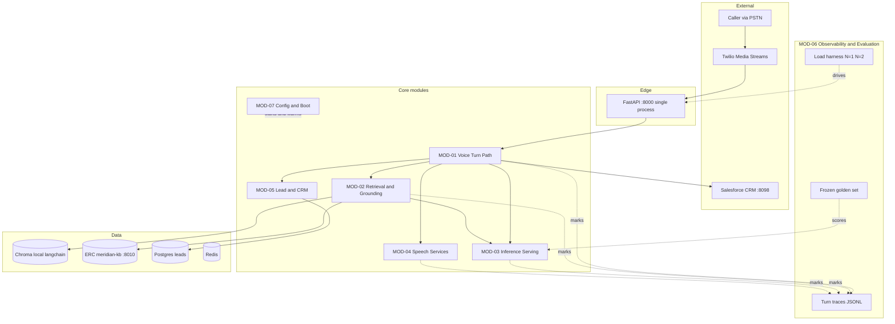
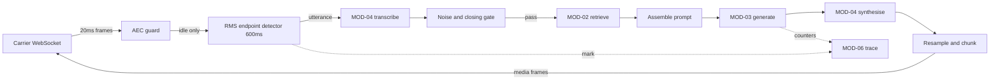
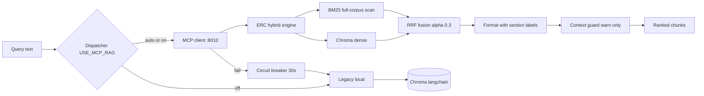
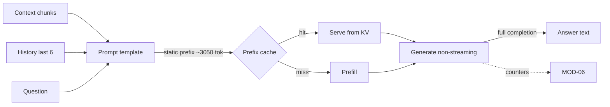
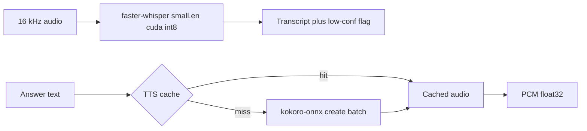
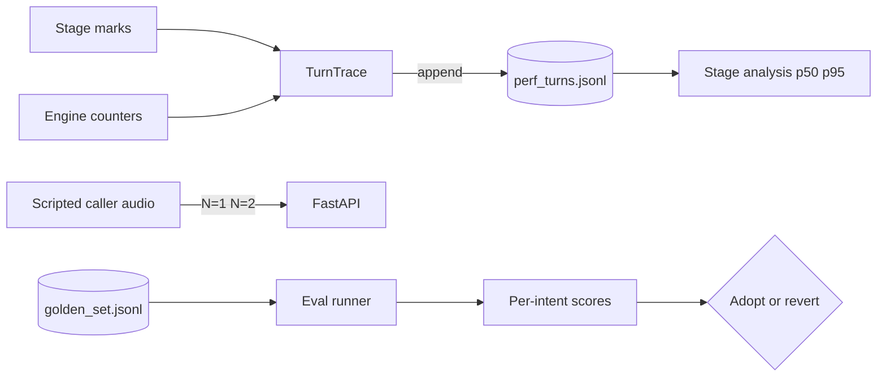
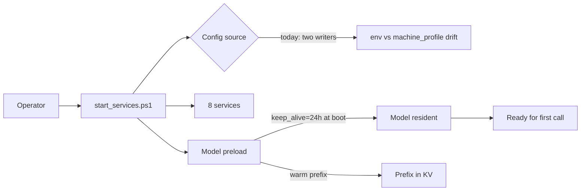
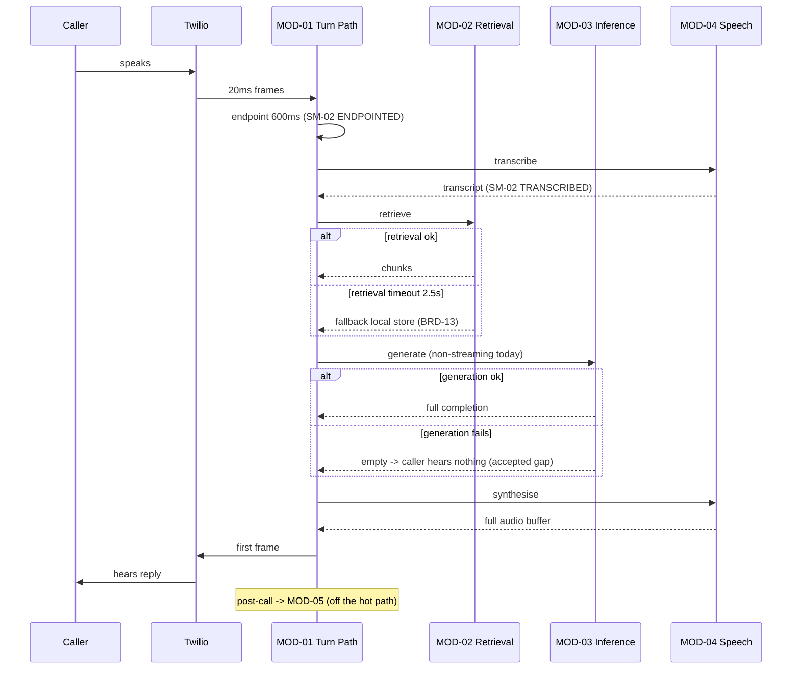

> **Lens:** Architect + TPO · **Decided by:** Architect, gated by TPO on feasibility · **Inputs:** `00-product-intent.md`, `01-brd.md`, `02-use-cases-workflows.md`, `03-data-state-analysis.md`, `05-modularization.md` · **Engagement:** Brownfield

# Architecture & Orchestration — Admissions Voice Assistant Performance & Concurrency Program

## 1. Overall System Architecture

**Integration points and how data crosses boundaries:**

- **Carrier → MOD-01:** bidirectional audio over a WebSocket, 20 ms µ-law frames. Integration style: streaming socket. Rationale: it is the only transport the carrier offers, and it is already the lowest-latency option for telephony.
- **MOD-01 → MOD-02:** in-process call carrying query text, returning ranked chunks. Style: synchronous function call. Rationale: same process today; making it a network hop would add latency to a budget that cannot afford it.
- **MOD-02 → ERC:** HTTP JSON-RPC on `:8010`. Style: synchronous request/response. Rationale: the MCP boundary is what allows the local store to be a fallback — the one place where a network hop buys fault isolation worth its latency.
- **MOD-03 ← MOD-01/02:** HTTP to Ollama on `:11434`. Style: synchronous, **currently non-streaming** — the single largest architectural defect this program addresses.
- **MOD-05:** runs strictly post-call, off the turn path. Style: fire-and-forget with background tasks. Rationale: isolation is what keeps CRM failure out of the caller's turn.
- **MOD-06:** read-only observer. Style: same-process marks for traces, out-of-band for harness and evaluation. Rationale: tracing must never be able to fail a call.
- **State:** session state is in-process and per-call (`DAT-04`); leads and transcripts are in Postgres; vectors in two Chroma stores. Nothing on the turn path is persisted — which is why a crash loses a turn (`SM-02`) and why that is acceptable at this scale.

## 2. Per-Module Component Flows

### Component Flow — MOD-01 Voice Turn Path

- **AEC guard** — discards caller audio while the agent speaks; exists because the carrier stream has no echo cancellation. Owns `CV-01`.
- **RMS endpoint detector** — the live end-of-speech decision; a 600 ms energy gate, not a neural VAD. Owns `BRD-04`.
- **Noise/closing gate** — deterministic pre-LLM short-circuits; keeps junk out of the model.
- **Resample and chunk** — 24 kHz → 8 kHz µ-law framing.

### Component Flow — MOD-02 Retrieval and Grounding

- **Dispatcher** — mode chosen per call from `USE_MCP_RAG`; `auto` prefers MCP and falls back.
- **Circuit breaker** — binary, 30 s, **no half-open probe**; one failure buys 30 s of local-only retrieval. Owns part of `BRD-14`.
- **ERC hybrid engine** — single event loop; the dense and BM25 legs are synchronous CPU-bound calls behind an `asyncio.gather`, so they do not actually run in parallel. Owns `BRD-07`.
- **Context guard** — warns above 80% of the context window; **never trims** (`RAG_MAX_CONTEXT_CHARS=0`). Owns `BRD-10`'s threshold gap.

### Component Flow — MOD-03 Inference Serving and Prompt Assembly

- **Prompt template** — `{context}` sits at line 600 with ~500 static tokens after it, which caps how much prefix the cache can hold. Owns `BRD-02`'s prompt-structure lever.
- **Prefix cache** — **measured working** (identical repeat: 2,909 ms → 50 ms). The per-turn cost is everything from `{context}` onward.
- **Generate** — non-streaming today; the caller waits for the full completion. Owns `BRD-02`'s largest term.

### Component Flow — MOD-04 Speech Services

- **faster-whisper** — GPU, int8, `small.en`; internal VAD runs *after* endpointing and cannot delay turn detection.
- **TTS cache** — process-wide, shared across concurrent calls (`DAT-11`); keyed by text hash, so no PII in the key. Owes an explicit N=2 isolation test (`DG-06`).
- **kokoro `create()`** — batch API; the streaming variant exists in the installed library and is unused. Owns `BRD-02`'s synthesis term.

### Component Flow — MOD-06 Observability and Evaluation

- **TurnTrace** — dependency-free; every method swallows exceptions so tracing cannot fail a call.
- **Harness** — replays 8 kHz µ-law at carrier framing; the only way to reproduce N=2 without two humans.
- **Eval runner** — deterministic checks first, rubric second; never runs concurrently with latency measurement.

### Component Flow — MOD-07 Config and Boot

- **Config source** — today `.env` and `.machine_profile.json` diverge with no reconciliation (`DG-05`); four keys are written and never read.
- **Model preload** — a boot-time pre-warm **exists and runs** (`start_services.ps1:659–702`): it enumerates the model list and POSTs a one-token `/api/generate` with `keep_alive=24h`. An earlier PowerShell 5.1 native-pipe bug that made it skip silently was already fixed at line 676 (`Out-String` + `ConvertFrom-Json`). It is nevertheless **neutralised on the serving path**: `_chat_ollama` (`llm_backend.py:135–146`) passes only `num_ctx` and `temperature`, so the first real chat resets the model's expiry to the server default of 5 minutes, and `OLLAMA_KEEP_ALIVE` is set nowhere in `.env` or read anywhere in `app/`. Measured consequence: **32,919 ms** cold load on the first turn after an idle gap — with working pre-warm code sitting in the repository. This is a **fifth** instance of the "set ≠ live" pattern, alongside `REC-01`, `REC-02`, `REC-05` and the pre-warm bug itself.

## 3. Orchestration Strategy

**Chosen pattern:** **Synchronous in-process orchestration on the turn path, with post-call work decoupled to background tasks.**

**Why it fits this problem:** the caller is waiting on a live audio stream — the interaction is inherently request/response, and every added hop lands directly in a budget that measurement shows is already over target. The architecture deliberately keeps the hot path synchronous and same-process, and pushes the one genuinely asynchronous concern (lead extraction, CRM sync) off it. What the hot path is *missing* is not a different orchestration pattern — it is **streaming, bounded timeouts, and cancellability within the synchronous model**.

**Why the runners-up don't fit:**

| Pattern | Fits | Doesn't fit | Verdict here |
|---|---|---|---|
| **Synchronous orchestration** | low latency, few hops, small teams, strong consistency | long chains, retries, partial failure | **Chosen for the turn path** — but its two "doesn't fit" conditions are exactly today's defects (`BRD-14`, `BRD-13`) |
| Event-driven choreography | decoupled producers/consumers, fast domain evolution | end-to-end latency visibility, atomic outcomes | Rejected on the hot path — a broker hop adds latency and obscures per-stage timing |
| Saga (orchestrated) | distributed transactions with compensation | single-module systems | Rejected — there is no distributed transaction here |
| Message queue / async worker | bursty load, slow consumers, retries | request/response UX | **Chosen off the turn path** — already how lead/CRM work runs |
| Workflow engine (Temporal et al.) | long-running processes, humans in the loop | simple pipelines | Rejected — operational overhead for a 2-caller system |
| Batch / ETL | bulk data movement | real-time needs | Rejected — ingest is already a manual script |

## 4. Build vs Buy

| Component | Options | Decision | Rationale |
|---|---|---|---|
| Inference engine | keep Ollama / llama.cpp server / vLLM on WSL2 | **Ollama retained as the *incumbent*, pending comparison — not adopted as the answer** | Under the solution-neutrality rule (`00-product-intent.md` §6b) this is a baseline, not a decision. It is the incumbent because it already runs and supports `stream=True`; that is a migration-cost argument, not evidence of superiority. `US-015` compares it against llama.cpp server and, if WSL2 + Blackwell support verify, vLLM/SGLang on scheduling and prefix-cache behaviour under two active streams. Evidence: migration cost is Derived; comparative performance is **Unknown until measured** |
| Voice framework | keep hand-rolled loop / wire in Pipecat 1.6.0 | **Keep hand-rolled** | Pipecat is installed and bypassed; its `KokoroTTSService` already streams, so it is a candidate — but wiring it in is a re-architecture with its own risk. Recorded as `REC-01`, not adopted |
| Retrieval engine | keep ERC / consolidate to one Chroma / rebuild | **Consolidate to one store, keep ERC for grounding** | Two divergent stores is a correctness problem (`DG-01`), not a capability gap. Buy-vs-build is moot; the decision is *which one* |
| Reranker | keep loaded-unused / wire in / remove | **Remove from boot or wire in** | It is loaded and never called; either is improvement, but the choice needs the golden set to justify wiring |
| Semantic cache | keep configured-bypassed / wire in / remove | **Remove until a caller exists for it** | Same: configured, unreachable from `retrieve_context` |
| Observability | bundled JSONL tracer / OpenTelemetry / Prometheus | **Bundled JSONL tracer** | Correct at production scale; over-engineered for one box and two callers. Evidence: Assumed — revisit at N>10 |
| Load harness | bundled script / k6 / Locust | **Bundled script** | The harness must speak µ-law at carrier framing, which general load testers do not do natively |
| Evaluation | bundled scorer / LLM-judge framework / hosted eval | **Bundled scorer + local judge** | Hosted eval prohibited on residency grounds (`AS-03`) |

## 5. Scale & Bottleneck Analysis

Input: `03-data-state-analysis.md` A.2 — peak concurrency 2, arrival ~0.13 turns/s.

| Module | Scale profile | Scale unit | Scaling trigger | Saturation limit | Bottleneck at 10× | Degradation mode |
|---|---|---|---|---|---|---|
| MOD-01 | stateful per-call session | concurrent call | concurrent calls > 2 | VRAM (~90% at N=2) | VRAM exhaustion, then carrier socket count | **Designed:** refuse or queue new calls at the carrier with a spoken "all lines busy" rather than admitting a third and degrading all three. Recovery: revert to accept when a session ends |
| MOD-02 | single event loop | retrieval request | queue depth > 0 | one in-flight retrieval | serialized retrieval — every caller waits behind the slowest | **Designed:** per-request deadline (2.5 s) plus keyword-only degradation; breaker opens and local store serves. Recovery: half-open probe on a timer |
| MOD-03 | single GPU, shared bandwidth | in-flight generation | concurrent generations > 1 | 448 GB/s shared | **MEASURED 2026-09-18:** per-stream decode is **essentially unchanged** at N=2 — 39.2 → 38.6 tok/s (14B), 131.0 → 131.2 (3B). The engine **batches**: N=2 wall time is 1.13× (3B) / 1.42× (14B) the N=1 wall, not 2×. VRAM peaks at **69%** (14B), not the ~90% projected. See `doc/perf/us015-benchmark-results.md` | **Designed:** queue with a bounded wait; below the measured threshold, reduce context rather than refuse. Recovery: queue drains |
| MOD-04 | GPU-resident, co-resident models | concurrent transcription/synthesis | VRAM pressure | VRAM shared with MOD-03 | VRAM (whisper 0.8 GiB + kokoro 0.35 GiB compete with the LLM) | **Designed:** TTS falls back to CPU execution provider; slower but available. Recovery: revert when VRAM frees |
| MOD-05 | post-call batch | call completion | queue depth post-call | none at this scale | Postgres write contention (not reached at 10×) | **Designed:** retry with backoff; lead persisted on next interaction. Recovery: next call |
| MOD-06 | append-only file | turn | file size | disk write throughput | file append contention | **Designed:** sampling (trace 1 in N turns) if append cost becomes measurable. Recovery: re-enable full tracing |
| MOD-07 | boot-time only | stack start | n/a | none | none — no runtime load | **Designed:** partial start is detected and reported, never silent (`UC-06` partial completion). Recovery: restart |

**System bottleneck & SPOF:** the first thing to saturate end-to-end is **`MOD-02`'s single event loop** — not, as this document previously stated, GPU memory or bandwidth. Both of those predictions were **measured on 2026-09-18 and falsified**: VRAM peaks at 69% at N=2 (not ~90%), and per-stream decode does not fall at all (39.2 → 38.6 tok/s on the 14B), because the engine batches rather than serialises. **GPU memory is not currently the binding constraint.** `MOD-02` is the first *non-resource* bottleneck and the only one that degrades a caller with no resource near exhaustion — and it has not yet been measured. Single points of failure: the FastAPI process (one process, not four — `FASTAPI_WORKERS` is inert), Ollama (no fallback — accepted gap, see `BRD-13`'s scope note), and the box itself. Full evidence: `doc/perf/us015-benchmark-results.md`.

**Degradation ladder:** (1) retrieval degrades to keyword-only; (2) retrieval degrades to local store; (3) TTS degrades to CPU; (4) generation queues; (5) new calls are refused with a spoken message. Full service returns by the designed recovery path of each step. **"It fails" is not a mode — every rung above has a named recovery.**

## 6. Data & Integration

| Boundary | Style | Rationale |
|---|---|---|
| Carrier ↔ MOD-01 | streaming WebSocket | only transport offered; lowest latency for telephony |
| MOD-01 ↔ MOD-02/03/04 | in-process call | same process; a network hop would land directly in the latency budget |
| MOD-02 → ERC | HTTP JSON-RPC | buys fault isolation and a local fallback worth its hop |
| MOD-02 → local Chroma | in-process | fallback path must be fast and dependency-free |
| MOD-03 → Ollama | local HTTP | engine boundary; enables `UC-10`'s model swap without code change |
| MOD-01 → MOD-05 | background task | post-call; keeps CRM failure out of the caller's turn |
| MOD-01/02/03/04 → MOD-06 | in-process marks | tracing must never fail a call |
| MOD-05 → Postgres | pooled SQL | strong consistency on lead identity (upsert by phone) |

Consistency per operation is decided in `03-data-state-analysis.md` A.2 and cited here, not re-derived.

## 7. Decision Log (ADR-lite)

| Decision | Context | Options | Rationale | Evidence |
|---|---|---|---|---|
| Keep the synchronous hot path; add streaming rather than change orchestration | Caller waits on live audio; 8 services on one box | synchronous / event-driven / queue | Every added hop lands in a budget already over target; the missing pieces are streaming, timeouts, cancellability | Derived (measured prefill + decode) |
| Keep Ollama | `UC-10` exists but is gated | Ollama / llama.cpp / vLLM WSL2 | Measured decode is at 77% of the bandwidth ceiling; the engine is not the bottleneck | Derived |
| Consolidate the two vector stores | Failover changes answers | keep both / pick one / rebuild | Two stores returning different chunks for one question is a correctness defect, not redundancy | Code-observed |
| MOD-06 built first, dependency-free | Every change needs measurement to be adoptable | fold into MOD-01 / standalone | Tracing that can fail a call is worse than no tracing | Derived |
| Refuse a third call rather than degrade all three | VRAM ~90% at N=2 | admit and degrade / refuse | Degrading three callers to serve a third is worse than a clear "all lines busy" | Derived from VRAM budget |
| Remove or wire the four inert config keys | Four keys are written and never read | leave / remove / wire | "Set ≠ live" already caused one wrong conclusion in this program | Code-observed |
| Do not adopt Pipecat in this program | Installed, pinned, bypassed; its TTS service already streams | wire in / remove dependency | Wiring it in is a re-architecture with its own risk profile; recorded as `REC-01` | Code-observed |
