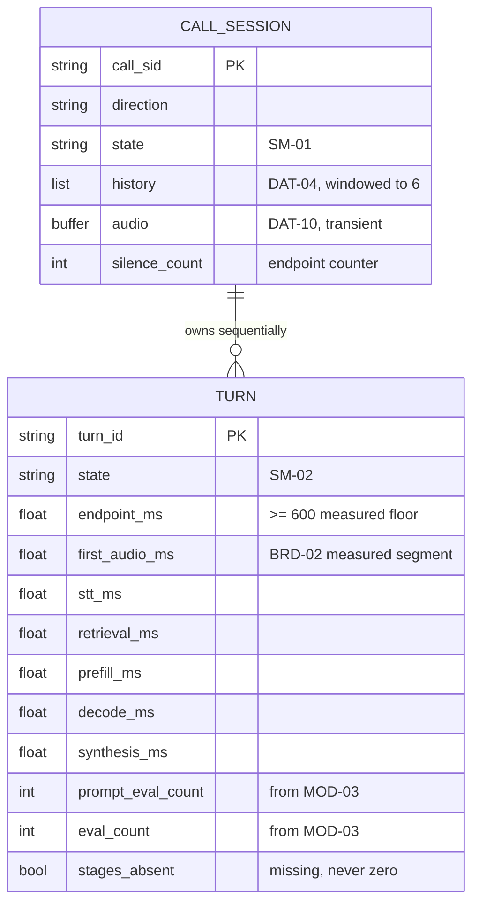

> **Lens:** BA (Part A) / TPO + Architect (Part B) · **Inputs:** `01-brd.md`, `02-use-cases-workflows.md`, `03-data-state-analysis.md`, `05-modularization.md`, `06-architecture.md`, `07-brownfield-reconciliation.md` · **Engagement:** Brownfield — `D:\project\universityDemo` · **Defines:** TRD-01 … TRD-05

# Voice Turn Path — MOD-01 [Lens: BA (Part A) / TPO + Architect (Part B)]

**Boundary (from `05-modularization.md` §2):** own one caller's turn from end-of-speech to first audio frame on the carrier, and the session lifecycle around it. **Depends on:** `MOD-02`, `MOD-03`, `MOD-04`, `MOD-06`, `MOD-07`. **Entities:** call session (`SM-01`), turn (`SM-02`), conversation history (`DAT-04`), audio buffers (`DAT-10`).

## Part A — Module BRD [Lens: BA]

### A.1 Module Objectives

MOD-01 is where the program's two headline promises are actually kept or broken. It owns the moment the caller stops speaking and the moment they hear a reply, so it owns the latency that `BRD-02` measures and the isolation that `BRD-06` protects. It also owns the *turn* as a business event: the point at which a spoken question becomes a spoken answer, and the point at which either of those fails and the caller must still be treated politely.

Three objectives, in the caller's terms:

- **Answer fast enough to feel like a conversation.** The caller is standing in a queue or on a phone in a hostel corridor; a three-second silence reads as a dropped call.
- **Never go silent and never lie about it.** When a dependency is down, the caller hears a sentence, not dead air (`BRD-13`) — this is a business outcome, not an engineering one.
- **Do not let one caller's problem become another caller's problem.** With two lines live, one stalled retrieval must not stall the other conversation (`BRD-05`, `BRD-07`, `BRD-13`).

### A.2 Scoped Requirements

This module satisfies, and is the sole owner of:

| Requirement | What MOD-01 owes it |
|---|---|
| `BRD-02` | The end-of-speech → first-audio path is the measured segment; the module carries the budget split |
| `BRD-03` | The first turn of a call must not pay a cold-start penalty |
| `BRD-04` | Exactly one live end-of-speech decision, its delay documented and reconciled |
| `BRD-13` | Every dependency failure on the turn produces a polite spoken fallback, not silence |
| `BRD-18` | The 28-intent surface survives the refactor end-to-end |
| `BRD-19` | The interruption contradiction (`CV-01`) is resolved to a decision, not left implicit |

Contributing to, but not owning: `BRD-01` (emits the marks; `MOD-06` owns the record), `BRD-05` (the turn under two callers; the shared engine is `MOD-03`), `BRD-06` (per-caller state; the demonstration is `MOD-06`), `BRD-14` (the turn consumes bounded calls; `MOD-02` owns the retrieval-bound decision), `BRD-15` (every change here is flag- or config-revertible).

### A.3 Module Business Rules

Extending `01-brd.md` §5; nothing here duplicates a `BRD-xx`:

- **R1 — The caller hears something in every turn.** A turn that cannot produce a grounded answer produces a spoken clarification or a spoken apology instead. Silence is a defect, not a degradation mode. (Derives from `BRD-13`.)
- **R2 — The caller is never told a dependency failed.** "Connection error" or "timeout" is internal vocabulary; the caller hears a normal sentence.
- **R3 — A turn is admitted only when the line is free.** At the concurrency ceiling the third caller is refused with a spoken "all lines are busy" rather than admitted into a degraded call (`06-architecture.md` §5, MOD-01 degradation mode). **Built 2026-09-19 (US-016):** this is now a specified behaviour with a contract, not a sentence. The refusal is taken from the live session count at the carrier-facing endpoint, the busy message is a pre-synthesised asset read from disk, and no session is created — so `SM-01`'s state list is unchanged and there is no QUEUED, HOLDING or REFUSED state, because there is no queue.
- **R4 — Nothing on the turn path is persisted mid-turn.** History (`DAT-04`) and audio (`DAT-10`) are per-call and in-memory; a crash costs one turn (`SM-02` halfway-stop) and that cost is accepted, not fixed here.
- **R5 — The delay the caller experiences is the delay the trace records.** If a stage is not measured, the turn's decomposition must not silently absorb it.

### A.4 Actors

| Actor | Why it touches MOD-01 |
|---|---|
| **Caller** | The only actor who experiences the module — speaks into it, is answered by it, hangs up on it |
| **Twilio** | System participant: delivers 20 ms µ-law frames inbound and carries outbound audio; the module's only network peer on the caller side |
| **Operator** | Needs the turn path to admit/refuse callers predictably and to survive a restart (`UC-06`) |
| **Developer** | Highest-churn module in the program; owns the streaming refactor and its rollback |
| **Product Owner** | Decides interruption behaviour (`UC-09`, `BRD-19`) and approves the relaxed SLO that `BRD-02`'s evidence clause requires |

### A.5 Module Acceptance Criteria

Business-verifiable, at module level:

1. **Latency — and which clock it is on.** This module's budget is stated in `processing_ms`, **not** `TURN_E2E_MS`. The two are defined once in `BRD-02` and differ by the endpointing floor:

   ```
   TURN_E2E_MS   = first_audio_frame_to_carrier − caller_speech_end_reference
   endpointing_ms = vad_end                     − caller_speech_end_reference   (~600 ms, measured)
   processing_ms  = first_audio_frame_to_carrier − vad_end
   TURN_E2E_MS   = endpointing_ms + processing_ms
   ```

   Over ≥100 turns at N=1 and ≥100 at N=2, `processing_ms` reaches p50 ≤ 2,300 ms and p95 ≤ 2,900 ms, cold and warm reported separately (`BRD-02`, `BRD-03`). **Every figure in this document is `processing_ms` unless it says otherwise**, and any figure compared against the original 700 ms target must add the measured endpointing floor first — comparing `processing_ms` to 700 ms would understate the gap by ~600 ms. The 700 ms target is not silently dropped: the arithmetic in B.2 is presented to the PO for the explicit approval `BRD-02` requires.
2. **Traceability.** Every turn emits one record naming ≥6 stages plus engine counters; the stage decomposition reconciles to the measured turn duration within 5 ms (`BRD-01`, and `01-brd.md` §11 criterion 1).
3. **Concurrency.** Two callers each stay within 1.5× of their solo p95 and no single turn exceeds 3,000 ms, on three consecutive runs (`BRD-05`).
4. **Isolation.** No turn ever contains another caller's history, context or audio; observed, not asserted, under N=2 (`BRD-06`).
5. **Failure.** Killing any one dependency mid-turn still produces audible speech in that same turn, and the other caller's in-flight turn completes unchanged (`BRD-13`).
6. **Interruption.** The agent's prompt and the AWS-side audio handling agree: either the caller can interrupt and is heard, or the prompt no longer claims they can (`BRD-19`, `CV-01`, `UC-09`).
7. **Behaviour surface.** All 28 intents still complete end-to-end; the noise gate, closing detection and one-shot clarification ladder behave as before (`BRD-18`).

## Part B — Module TRD [Lens: TPO + Architect]

### TRD-01 — Stream the turn: consume generation and synthesis incrementally so first audio is emitted before the answer is complete

Serves `BRD-02`, `BRD-03`, `BRD-18`; implements `SM-02` transitions GENERATING → SYNTHESISING → SENDING → EMITTED.

Today the turn is a chain of full-buffer handoffs: `llm_backend.chat()` returns a complete string (`llm_backend.py:135–175`, non-streaming), then `VoiceCallSession._synthesise()` returns a complete PCM array from `kokoro.create()` (`voice_handler.py:673`), then the buffer is resampled and chunked. The caller waits for the *worst* term in the chain, not the first. This TRD makes the turn incremental: token deltas are consumed as they arrive, clause boundaries are cut on punctuation-and-silence, and the first synthesised chunk is written to the carrier socket while the model is still decoding.

### TRD-02 — One live end-of-speech decision at a documented, reconciled delay

Serves `BRD-04`; implements `SM-02` ACCUMULATING → ENDPOINTED.

The live decision is the RMS energy gate in `VoiceCallSession` — 30 consecutive silent frames at 20 ms per frame (`voice_handler.py:301` `silence_threshold_frames=30`), forced by a 300-frame (~6 s) max-utterance cap. The Pipecat `VADParams` block (`pipeline.py:174–180`) builds an analyzer that is never referenced, and must not be presented as a live setting (`REC-01`, `01-brd.md` Evidence Register "Pipecat VAD setting — inert"). This TRD makes that single decision explicit, configurable, documented at its real value, and reconciled against the latency budget with the arithmetic in B.2.

### TRD-03 — Emit per-stage turn marks with an explicit first-audio-to-carrier boundary

Serves `BRD-01`; produces `DAT-07` rows; consumes `DG-04`'s derivation.

The turn path is the only place that can timestamp the boundaries that matter. It marks, per turn: end-of-speech decision, transcript returned, gate decision, retrieval returned, prompt assembled, first token, last token, first synthesised chunk, and **first frame written to the carrier socket** — the last of these is the end of `BRD-02`'s measured segment and must be taken at the socket write in `main.py`'s `/ws/twilio` handler, not at the end of synthesis. Marks are emitted into `MOD-06` and can never fail, block or reorder a turn.

### TRD-04 — Bound every stage, and degrade to speech rather than to silence

Serves `BRD-13`; consumes the retrieval bound decided by `MOD-02` (`BRD-14`); implements the `SM-02` failure branches.

Today a failed generation returns `""` and the caller hears nothing for that turn (`voice_handler.py` LLM-failure path; `02-use-cases-workflows.md` WF-01 step 8, "None today — gap"). This TRD gives every stage a deadline below the client limit, and gives every failure a spoken outcome: a grounded answer, a clarification, or an honest apology — never an empty turn. It also enforces that one caller's stage failure cannot abort the other caller's turn, because the stages hold no shared mutable state.

### TRD-05 — Session-scoped state, single ownership of `SM-01`, and a decision point for interruption

Serves `BRD-19`, `BRD-06`; implements `SM-01`; resolves `CV-01`.

`SM-01` (call session) and `SM-02` (turn) are analytical instruments as much as designs (`REC-10`); this TRD makes the session the *owner* of every mutable per-call value — history (`DAT-04`), audio buffer (`DAT-10`), the endpoint counter — so that "which caller's data is this?" has one answer by construction. It also places the interruption decision at a single point: the AEC guard (`main.py:87–91, 624–627`, `MUTE_STT_DURING_TTS`) currently discards every inbound frame while the agent speaks, while the system prompt instructs the agent to yield to the caller (`CV-01`). `UC-09` decides; this TRD implements whichever side is chosen and removes the other claim.

### B.1 Technical Constraints

- **Language/runtime:** Python 3.11 on Windows; asyncio single event loop in one FastAPI process. `FASTAPI_WORKERS=4` is written and never read — the app runs as **one** process (`REC-02`, `start_services.ps1:559`), and this module is designed against that truth.
- **Carrier:** Twilio Media Streams, bidirectional WebSocket, 20 ms µ-law frames at 8 kHz. The transport is fixed; it can be measured but not replaced (`01-brd.md` §8).
- **In-process composition:** `MOD-02`, `MOD-03` and `MOD-04` are called in-process, not over the network (`06-architecture.md` §6). No new hop is introduced on the turn path.
- **Streaming primitives already installed:** `ollama.chat(..., stream=True)` and `kokoro.create_stream()` both exist in the pinned libraries and are unused today. No dependency change is required to satisfy TRD-01 (`07-brownfield-reconciliation.md` Asset Classification: TTS `create()` → Refactor).
- **No Pipecat:** the hand-rolled loop is the target; `REC-01` is not reopened by this module.
- **Second text path exists:** `/ws/voice/text` (`main.py:466`) shares `run_rag_query_sync` with the voice path, so changes here must not regress it (`REC-09`). The `/ws/voice` echo stub (`main.py:402–410`) is out of scope.

### B.2 Non-Functional Requirements

| NFR | Target |
|---|---|
| Performance | First audio to the carrier at **p50 ≤ 2,300 ms / p95 ≤ 2,900 ms** from the end-of-speech decision, over ≥100 turns per condition, cold and warm reported separately (`BRD-02`, `BRD-03`) |
| Performance — SLO honesty | `BRD-02`'s 700 ms/1,200 ms is **arithmetically unreachable** as written: the 600 ms endpointing floor is 86% of the 700 ms p50 budget before STT, retrieval, prefill, decode or synthesis have run (`AS-04`, `CV-02`). The tightest defensible SLO is the line above; it is submitted for PO approval per `BRD-02`'s evidence clause, not adopted silently |
| Latency sub-allocation | Stage p95 sub-budgets in B.2.1 must sum to ≤ 2,900 ms; any stage exceeding its sub-budget by >25% in the baseline run is investigated before a later stage is optimised |
| Scalability | 2 concurrent sessions, each meeting the p95 above; no admission of a third (`06-architecture.md` §5) |
| Scale unit & limits | Unit = one live call; ceiling = 2 concurrent sessions (`AS-01`); per-turn ceiling 3,000 ms (`BRD-05`); turn arrival ~0.133/s (`03-data-state-analysis.md` A.2) |
| Degradation | Turn-path rungs, in `06-architecture.md` §5 order: retrieval → keyword-only, then → local store; TTS → CPU execution provider; generation queues; new calls refused with a spoken "all lines busy". Each rung has its named recovery and none is "it fails" |
| Security | No inbound auth on the carrier socket by design (the PSTN number is the identity, `main.py:3172`); no caller data crosses sessions; transcripts are PII and never written to the trace (`DAT-07` carries timings and counters, not text) |
| Observability | One `DAT-07` record per turn with ≥6 stage timings + engine counters, reconciling to the turn duration within 5 ms; absent stages appear absent, never as `0` |
| Availability | Turn path is the availability surface: a failed turn must still end in speech; process restart resumes accepting calls (`BRD-15`) |
| Reversibility | Streaming lands behind a config flag; reverting the flag restores today's buffered behaviour without a code revert (`BRD-15`) |

#### B.2.1 Stage sub-budgets (p95), and where each number comes from

| Stage | p95 sub-budget | Basis |
|---|---|---|
| End-of-speech decision | 600 ms | **Measured floor** — 30 frames × 20 ms (`voice_handler.py:301`). Fixed, not tunable inside this budget |
| Transcription | Assumed: 300 ms | Not measured; faster-whisper `small.en` cuda int8 |
| Retrieval | Assumed: 400 ms | `MOD-02` p95 allowance; the 2,500 ms `RAG_MCP_TIMEOUT` is an abort ceiling, not an expectation |
| Prompt assembly + prefill | Derived: 600–750 ms | Residual 2,108 uncached tokens (5,666-token prompt − 3,558-token cached prefix) at the **measured** 2,847–3,568 tok/s prefill rate |
| Decode to first audio-bearing clause | Derived: ~390 ms | 15 tokens × 25.7–27.3 ms/token at the **measured** 36.6–38.9 tok/s decode rate |
| Synthesis to first chunk | Assumed: 250 ms | Batch API today; `create_stream()` exists in the installed library |
| Carrier transport | Assumed: 150 ms | Twilio RTT is **unmeasured** — the highest-uncertainty term and the one the local harness cannot see (`01-brd.md` Discovery Matrix, Integrations) |
| **Total p95** | **2,690–2,840 ms** | Under the 3,000 ms per-turn cap in `BRD-05` |

p50 uses the same stages at their lower ends (600 / Assumed 200 / Assumed 250 / 600 / ~390 / Assumed 150 / Assumed 100) ≈ **2,300 ms**. The endpointing floor alone is 26% of that p50 and 600 ms of any total; this is the single largest term this module cannot remove without changing turn-taking behaviour, which is `BRD-04`'s subject, not an optimisation.

### B.3 APIs / Interfaces

| Name | Direction | Style | Contract | AuthN/Z |
|---|---|---|---|---|
| `/twilio/voice`, `/twilio/voice/connect` (carrier-facing endpoints) | exposed | HTTP GET → TwiML | **Admission decision point (US-016).** Returns the IVR/`<Connect>` TwiML when the line has capacity, or the busy TwiML — a `<Play>` of the pre-synthesised asset with **no `<Connect>`** — when both lines are live. Checked at both endpoints: the first spares a refused caller the IVR, the second is binding because a line can fill while a caller is still pressing a digit | Carrier-asserted; `From` is threaded into the stream as a `<Parameter>` |
| `/ws/twilio` (carrier media socket) | exposed | streaming WebSocket | 20 ms µ-law frames in; µ-law frames out; first outbound frame closes `BRD-02`'s segment. **Registers/releases the live-session count** that the admission decision reads (US-016 TAC-1) — the count is the real lifecycle, so a refused call can never inflate the count it was refused by | Carrier-asserted — no inbound auth; the PSTN line is the identity |
| `retrieve_context(question)` (`MOD-02`) | consumed | in-process call | ranked chunks, or an explicit not-relevant signal | n/a (in-process) |
| `generate(prompt, stream=True)` (`MOD-03`) | consumed | in-process → HTTP to Ollama `:11434` | token deltas; engine counters on completion | n/a (loopback) |
| `transcribe(pcm)`, `synthesise_stream(text)` (`MOD-04`) | consumed | in-process | transcript + low-confidence flag; audio chunks | n/a (in-process) |
| `submit_transcript(...)` (`MOD-05`) | published | background task | fire-and-forget, strictly post-call | n/a |
| `mark(stage, turn_id)` / `counter(...)` (`MOD-06`) | published | in-process marks | never raises, never blocks | n/a |
| `voice_events` structured log | published | append-only log | `log_event(name, **fields)`; existing event names preserved | n/a |
| `/ws/voice/text` | shared consumer | WebSocket | shares the retrieval + generation path; must not regress (`REC-09`). **US-017: classified as background and admitted through the work gate** — it used to call the model directly, which was the one route into inference the priority policy could not see | none |
| `GET /api/perf/policy` | published | HTTP GET → JSON | **Added by US-016/US-017.** The admission and work-priority counters, so the load harness can count an N=3 window and a 2+1 mix from the app's own records rather than from its own beliefs. Counts and reasons only — no phone number, no transcript, no caller text (`caller_ref` is a truncated digest) | none (loopback dev service, same as every other `/api` route) |

Events are in-process method calls; there is no broker on the hot path (`06-architecture.md` §3, "Event-driven choreography — rejected on the hot path"). Turn lifecycle stays `SM-02`'s; the trace record is `MOD-06`'s contract.

**Entry classification (US-017 TAC-1).** Every unit of work entering retrieval or inference carries a class — `voice` or `background` — derived from the `mode` argument the two callers already used (`app/pipeline.run_rag_query_sync`, `test_pipeline_with_text`). An unrecognised mode is admitted **as voice** and recorded as a classification defect: the failure that matters is a caller starved, not a background job let through. The class is stamped on every caller turn's trace, so the priority invariant is countable after the fact rather than only observable live.

### B.4 Data Model

MOD-01 owns no durable store. Its entities are per-call and in-memory, which is itself a design decision (`SM-02` halfway-stop, R4 above).



Mapping to `03-data-state-analysis.md`: `history` is `DAT-04` (in-memory list, windowed to the last 6 entries — `voice_handler.py:605`); `audio` is `DAT-10` (transient µ-law/PCM buffers); the per-turn timing record is `DAT-07` and is **owned by `MOD-06`** — this module produces the marks, it does not own the store. `Turn` carries no caller text: `DAT-07` is a timing asset, and transcripts are PII that stays in `DAT-05` post-call.

### B.5 Tech Stack Choices

| Choice | Rationale | Runner-up, and why not |
|---|---|---|
| Stream via the installed `ollama` client and `kokoro.create_stream()` | Both primitives already exist in the pinned versions; the change is in how the results are consumed, not in the dependency set (`REC-01` keeps Pipecat out) | Wiring Pipecat's `KokoroTTSService` — a re-architecture with an unmeasured latency profile replacing a measured one; deferred to `UC-10` per `REC-01` |
| Consume token deltas and cut on clause boundaries | The caller waits for a *sentence*, not a completion; clause cutting lets synthesis start ~390 ms after generation begins instead of after the full answer | Wait for full completion, then stream synthesis only — halves the gain and leaves the largest term untouched |
| Keep the RMS energy gate as the endpoint decision | It is deterministic, free, and testable; a neural VAD adds a GPU-resident model to a VRAM budget already at ~90% at N=2 | Neural VAD (`REC-01` artifact `pipeline.py:174–180`) — inert today, and it would compete for the same VRAM as the LLM |
| Keep `MUTE_STT_DURING_TTS` until `UC-09` decides | The trade (the agent transcribing its own speech, no carrier-side echo cancellation) is a PO decision, not a default (`REC-01`, `BRD-19`) | Enabling barge-in unilaterally — changes user-perceivable turn-taking, which `01-brd.md` §5 requires PO sign-off for |
| Flag-gated streaming | `BRD-15` requires a one-command rollback; a config flag makes the revert cheap and the A/B comparison honest (`WF-03`) | Big-bang replacement — the fallback would be a code revert under pressure |

### B.6 Edge Cases & Error Handling

Per failure class, with the `SM-02` state each leaves behind:

| Failure | State after (`SM-02`) | Handling |
|---|---|---|
| Endpoint never fires | ACCUMULATING | 300-frame (~6 s) max-utterance cap forces the turn (`voice_handler.py:283`); never a silent stall |
| Empty/garbled transcript | TRANSCRIBED | Noise gate takes the fixed-reply branch; the model is never invoked; ladder advances one rung (one-shot, capped — `voice_system_prompt.py:305`) |
| Retrieval times out | RETRIEVING | `MOD-02`'s bound applies; the turn continues on the local store or keyword-only, and the trace records the degraded path (`BRD-13`, `BRD-14`) |
| Generation fails or returns empty | GENERATING | **Built by US-016 (`BRD-13`'s "build item").** The caller hears the **pre-synthesised fixed response**, read from disk — not silence, and not an apology generated at request time. Deterministic: the same failure on two turns in two calls produces byte-identical audio. The caller's line stays in history; the next turn carries it forward. The turn is recorded as `degraded`, which is its own outcome and is never collapsed into `served`, `failed` or `refused` |
| Synthesis fails | SYNTHESISING | Spoken fallback text; on repeated failure the turn ends and the session returns to LISTENING rather than hanging |
| Socket write fails mid-turn | SENDING | Call ends (not resumable — `SM-01` timeout/cancel); post-call handling still runs if a transcript exists |
| Caller hangs up mid-generation | any | Cancellation propagates to the generation stream and stops synthesis; no orphaned audio is queued to a closed socket. `SM-01` → ENDED from any state |
| Caller speaks while the agent speaks | SPEAKING | Today: frames discarded and the partial buffer reset (`main.py:624–627`). After `UC-09`: whatever the PO decides, with the prompt edited to match (`CV-01`) |
| Third caller arrives | — (no state is created) | **Built by US-016.** The rule was one sentence with no contract behind it; it now has one. The carrier answers the PSTN leg (an inbound call cannot be declined by the app); the app's lever is the TwiML it returns — the busy TwiML, a `<Play>` of the pre-synthesised asset with no `<Connect>`. **No session, no history and no KV allocation is created**, so the refused call leaves no state at all and a redial into a freed slot is a fresh session. The decision is single-valued from the live session count, and the two live sessions are not degraded. `06-architecture.md` §5's "refuse **or queue**" is closed to **refuse** — see below |
| Stage mark missing | any | Trace records an absent stage; **never** a fabricated zero (TRD-03) |
| Retry/idempotency | — | There is no retry inside a turn: a turn is single-use (`SM-02` Q5). Re-emission of a trace on a retried turn carries the same `turn_id` |

### B.7 Tech Debt Accepted

- **Accepted: the AEC guard stays until `UC-09` decides.** `REC-01`/`07-brownfield-reconciliation.md` §4 classify it as debt "accept pending `UC-09`". Rationale: the guard exists because the carrier stream has no echo cancellation; removing it without an echo-suppression plan makes the agent transcribe itself. Revisit: the `UC-09` decision, PO-owned.
- **Accepted: no session idle timeout.** `SM-01` Q10 — an idle caller costs a held session, not inference (`04-coverage-gap-analysis.md` §6, owner: PO). Revisit if concurrency rises above 2.
- **Accepted: no dedupe on carrier retry.** A retry is a new session with a new `call_sid`; merging retries risks conflating distinct callers (§6, owner: TPO).
- **Accepted (resolved immediately, recorded for the record):** the uncached `/api/tags` round trip per utterance (`llm_backend.pick_model()`) is classified **resolve now** (§4) — it is a per-turn HTTP round trip on the hot path with zero benefit; it moves to `MOD-03`'s prompt/generation call and is cached for the process lifetime.

### B.8 Reconciliation (Brownfield)

Assets this module reuses, refactors, or adds (classes from `07-brownfield-reconciliation.md` §1):

| Asset | Location | Class | What this module does |
|---|---|---|---|
| `VoiceCallSession` turn loop | `app/voice_handler.py` | **Refactor** | Streams consumption of generation and synthesis; adds stage marks; keeps the serial structure and the gates |
| RMS endpoint detector | `voice_handler.py:301, 341, 367` | **Reusable** | Used as-is; TRD-02 documents its value and reconciles it — the detector is right, the *value* is `BRD-04`'s question |
| Noise gate + closing detection | `voice_handler.py:451, 469` | **Reusable** | Untouched; they save whole model calls and are deterministic |
| Conversation history | `voice_handler.py:301, 605` | **Reusable** | Untouched — correctly windowed to 6 and not the prefill problem (`REC-03`'s concern is the store, not the window) |
| `app/main.py` WS handler | `main.py:495–690` | **Refactor** | Emits the first-audio-to-carrier mark at the socket write; owns the AEC guard |
| AEC / `MUTE_STT_DURING_TTS` | `main.py:87–91, 624–627` | **Debt** | Accepted pending `UC-09`; blocks barge-in (`BRD-19`) |
| `/ws/voice/text` shared path | `main.py:466` | **Reusable (constrained)** | Not modified; regression-checked because it shares `MOD-02`/`MOD-03` (`REC-09`) |
| Call/turn state machines | — | **Net-new** | Analytical instruments only; not a refactor mandate (`REC-10`) |
| Per-stage marks | — | **Net-new** | This module emits them; `MOD-06` owns the record |

REC notes that apply: **`REC-01`** (Pipecat is not adopted — the hand-rolled loop is the target; its inert `VADParams` must not be presented as the live endpoint setting, TRD-02), **`REC-02`** (one process, one event loop — the design assumes it), **`REC-09`** (the text path shares this module's downstream code), **`REC-10`** (`SM-01`/`SM-02` do not have to become code). Debt calls cite `07-brownfield-reconciliation.md` §4.

## TPO Buildability Sign-off [Lens: TPO]

**TPO sign-off: this TRD is buildable against the BRD above.** The primitives (`stream=True`, `create_stream()`) are already installed and unused, so TRD-01 is a consumption change inside a module whose structure is being kept — not a re-architecture. Feasibility risks:

- **The latency target is the real risk, and it is not an engineering risk.** The arithmetic says the tightest defensible SLO is ~2,300/2,900 ms, roughly 3× the 700 ms brief, and the largest single term is a 600 ms endpointing floor that is a *product* choice about turn-taking. If the PO rejects the relaxed SLO, the module cannot deliver the original one and the plan must say so rather than iterate. Mitigation: the sub-budget table (B.2.1) is the negotiating document, and `AS-04`/`CV-02` already carry it.
- **Twilio RTT is unmeasured (Assumed: 150 ms).** Every local measurement stops at the socket. If RTT is materially higher, the p95 target moves and no amount of local work recovers it. Mitigation: measure RTT during Phase A before the target is frozen.
- **TRD-05 depends on a decision that does not exist yet.** `UC-09` is PO-owned and open; until it closes, the prompt and the AEC guard contradict each other (`CV-01`) and the module ships with a known inconsistency. Mitigation: TRD-05 is separable — it can land after streaming without blocking it.
- **Not buildable as written if** the PO requires barge-in *and* the carrier stream stays echo-uncontrolled; that combination needs an echo-suppression design that is not in this plan.
