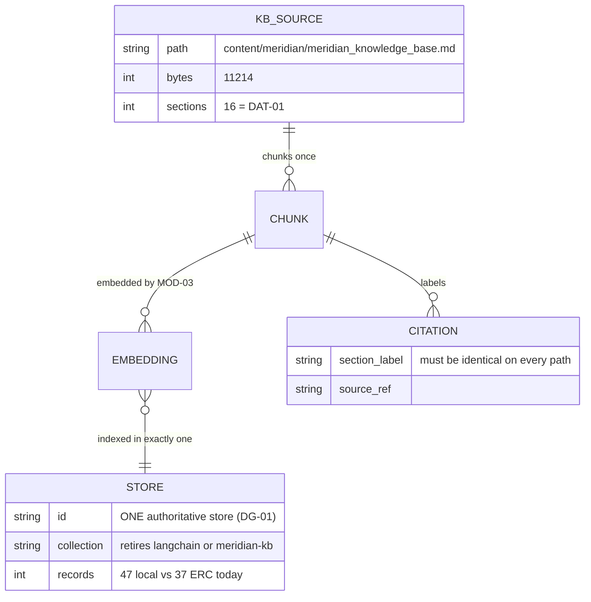

> **Lens:** BA (Part A) / TPO + Architect (Part B) · **Inputs:** `01-brd.md`, `02-use-cases-workflows.md`, `03-data-state-analysis.md`, `05-modularization.md`, `06-architecture.md`, `07-brownfield-reconciliation.md` · **Engagement:** Brownfield — `D:\project\universityDemo` · **Defines:** TRD-06 … TRD-09

# Retrieval & Grounding — MOD-02 [Lens: BA (Part A) / TPO + Architect (Part B)]

**Boundary (from `05-modularization.md` §2):** turn a question into grounded context, and decide when context is not good enough to answer from. **Depends on:** `MOD-03` (embeddings), `MOD-06`. **Contains:** `DG-01` (store consolidation), `DG-06` (shared-cache isolation test). **Entities:** `DAT-01` KB content, `DAT-02`/`DAT-03` vector stores, `SM-03`-adjacent citation metadata.

## Part A — Module BRD [Lens: BA]

### A.1 Module Objectives

MOD-02 decides what the assistant is allowed to know. Every answer the caller hears is either grounded in a chunk this module returned or is an admission that nothing relevant was found — and today the second branch is unreachable, because the relevance gate is disabled (`RAG_SIMILARITY_THRESHOLD=0.0`, `rag.py:163`). That makes this module the custodian of two distinct business promises:

- **Correctness.** The same question must produce the same grounding regardless of which internal path answers it. It does not today: two divergent stores hold different chunks of the same knowledge base, so a failover silently changes the answer and the citation format (`DG-01`, `REC-03`).
- **Honesty.** The assistant must say it does not know rather than answer from an unrelated chunk (`BRD-10`). A confident wrong answer about a fee or a deadline is worse than a refusal.

And it owns the program's only *non-resource* bottleneck: retrieval is single-threaded, so one caller's slow query delays another caller's turn with no CPU, VRAM or bandwidth anywhere near saturation (`BRD-07`).

### A.2 Scoped Requirements

This module satisfies, and is the sole owner of:

| Requirement | What MOD-02 owes it |
|---|---|
| `BRD-07` | A slow or hung retrieval for one caller must not delay another caller's turn |
| `BRD-10` | A defined, enforced threshold below which retrieved context is treated as not relevant |
| `BRD-14` | Every outbound retrieval call carries a timeout justified against the budget, and a tripped circuit *probes* for recovery instead of paying the timeout forever |

Contributing to, but not owning: `BRD-05` (two callers, jointly with `MOD-01`/`MOD-03`), `BRD-09` (grounding quality is a quality-gate input; `MOD-06` scores it), `BRD-13` (this module supplies the retrieval rung of the degradation ladder and the local-store fallback), `BRD-18` (the 28-intent surface — a grounding change is a behaviour change).

### A.3 Module Business Rules

Extending `01-brd.md` §5; nothing here duplicates a `BRD-xx`:

- **R1 — One store answers.** There is exactly one authoritative knowledge store derived from `DAT-01`. A fallback path may exist for availability, but it must return the same chunks with the same citation labels as the primary. Divergent grounding across paths is a defect, not redundancy (`DG-01`, `REC-03`).
- **R2 — "I don't know" is a valid answer and must be reachable.** If the best available chunk is below the relevance floor, the module returns an explicit not-relevant signal and the assistant says it does not have the information (`BRD-10`).
- **R3 — Retrieval never blocks the caller past its budget.** A retrieval that exceeds its deadline is abandoned, not awaited; the turn continues on the degraded rung (`BRD-07`, `BRD-13`).
- **R4 — A degraded path is announced in the trace, never to the caller.** Which rung served the turn is a measurement fact (`DAT-07`) and an operator fact; it is not spoken (A.3/R2 of `MOD-01`).
- **R5 — Grounding quality is judged end-to-end, not per-chunk.** An answer is scored on task success against the frozen set (`DAT-08`), so this module's changes are gated by `BRD-08`/`BRD-09` like any other model-input change.

### A.4 Actors

| Actor | Why it touches MOD-02 |
|---|---|
| **Caller** | Indirectly: receives the consequence of this module's correctness (a right answer, or an honest refusal) |
| **Developer** | Owns the store consolidation — the plan's highest-effort correctness item, sequenced independently of streaming |
| **Operator** | Needs the retrieval rung to degrade predictably and to recover without a restart (`UC-06`) |
| **Retrieval service (ERC MCP)** | System participant on `:8010`; the primary path, and the one whose single event loop is the bottleneck |
| **Product Owner** | Approves critical-intent ground truth (`AS-05`, `DG-03`) — without it neither the floor's value nor the consolidation's equivalence can be accepted |

### A.5 Module Acceptance Criteria

Business-verifiable, at module level:

1. **One answer per question.** For every case in the frozen set, the primary path and the fallback path return the same chunk set and the same citation labels; a diff between the two paths is empty (`DG-01`, `REC-03`).
2. **No cross-caller delay.** With two callers retrieving, caller B's retrieval completes without waiting on caller A's, and B's turn stays within 1.5× of its solo latency; an artificial 2.5 s stall on A's retrieval does not move B's first-audio time (`BRD-07`).
3. **Refusal is reachable.** A question with no relevant content in `DAT-01` produces an explicit not-relevant signal and a spoken "I don't have that information", with the retrieval recorded as below-floor in `DAT-07` (`BRD-10`).
4. **Bounded and self-healing.** With the MCP service killed, the first affected turn falls back within one retrieval budget; subsequent turns use the local path without paying the full timeout again; when the service returns, the primary path resumes within one probe interval and without a restart (`BRD-14`, `BRD-13`, and `06-architecture.md` §5 MOD-02 recovery).
5. **No second round trip.** Enabling the relevance floor does not increase the per-turn MCP request count (`REC-08`).
6. **No cross-caller context.** No turn's retrieved context contains another caller's query or chunk set, observed under N=2 (`BRD-06`).

## Part B — Module TRD [Lens: TPO + Architect]

### TRD-06 — Consolidate to one authoritative knowledge store, regenerated from `DAT-01` and verified chunk-for-chunk

Serves `BRD-10`, `BRD-09`; implements `DG-01`.

Two stores exist today, both derived from the same 11,214-byte, 16-section source: local Chroma collection `langchain` (~47 records, LangChain `RecursiveCharacterTextSplitter`) and ERC collection `meridian-kb` (37 chunks, a custom paragraph packer). They differ in chunk boundaries *and* in whether citation labels appear at all (`rag_legacy.py:443` vs `rag_mcp.py:169–178`), so a failover changes the answer text and not merely its packaging (`REC-03`). This TRD picks one store, regenerates it from `DAT-01` with one chunker, and verifies equivalence against the source before the other is retired.

**Physical topology and safe replacement — this TRD owns the contract in `03-data-state-analysis.md` §A.6.** Picking a store is only half the decision; *where it lives and how it is replaced* is the other half, and getting it wrong would trade one correctness bug for a worse one. This module therefore implements, and `US-010` delivers:

- a versioned index directory (`kb/versions/<KB_VERSION>/`) with the live version named by an atomic `ACTIVE` pointer (`DAT-14`);
- the five-step lifecycle — **build → validate → atomically switch → retain previous → prune** — so a rebuild never mutates the index callers are reading;
- `KB_VERSION` stamped into every trace and every golden-set score, so a quality figure can be tied to the content it was measured against — necessary because `DAT-01` is edited by hand;
- **both readers — the MCP path and the local fallback — resolve the same `ACTIVE` version.** That is the clause that actually closes `REC-03`: the fallback stops being a *different corpus* and becomes the same corpus reached another way, so a failover can no longer change the chunk boundaries or drop the citation labels.

### TRD-07 — Make retrieval concurrent: no caller waits behind another caller's query

Serves `BRD-07`, `BRD-05`; implements the `SM-02` RETRIEVING path for two simultaneous callers.

ERC runs one worker with no `workers` argument and performs its dense and BM25 legs as synchronous CPU-bound calls wrapped in an `asyncio.gather` (`enterprise-rag-core/cli.py:83`, `hybrid.py:141–144`), so the two "parallel" legs are serial and the whole service is a single-threaded queue. With peak concurrency 2 (`AS-01`), caller B's retrieval waits for caller A's. This TRD removes the head-of-line block: the retrieval work must not occupy the event loop for the duration of a synchronous scan, and this module must be able to have two retrievals in flight without one starving the other.

### TRD-08 — Enforce a relevance floor without paying a second round trip

Serves `BRD-10`; implements the grounding precondition that `DG-01` consolidation exists to make trustworthy (a floor is only meaningful if both paths return the same distances for the same question); consumes `DAT-01`'s content as the only corpus in scope; consumes `REC-08`.

The gate exists in code but is switched off (`RAG_SIMILARITY_THRESHOLD=0.0`, `rag.py:163`). The obvious implementation is wrong: `_threshold_distance` issues a **second** MCP `tools/call` with `top_k=1`, so enabling the gate naively doubles per-turn retrieval traffic (`REC-08`). This TRD requires the floor to be enforced from the distance information already present in the primary retrieval response — one round trip per turn, as today.

### TRD-09 — Bound every retrieval dependency call, and replace the flat cooldown with a recovery probe

Serves `BRD-14`, `BRD-13`; discharges the `DG-06` isolation test for this module's shared state.

The MCP read timeout is 2.5 s with a fixed 1.0 s connect (`rag_mcp.py:35–38`), and a failed call costs the timeout **plus** a full re-retrieval from the local store — the caller pays twice for one failure (`01-brd.md` Discovery Matrix, Failure row). The breaker is a single global `{failed_at}` with a 30 s cooldown and no probe: after the cooldown expires, the next request retries the dead service with the *full* 2.5 s timeout, so an outage costs the timeout again every 30 s rather than once. This TRD bounds the whole retrieval operation to one budget including the fallback, and replaces the flat cooldown with the designed recovery — a single half-open probe on a timer, at a fraction of the full timeout (`06-architecture.md` §5 MOD-02).

### B.1 Technical Constraints

- **Two paths exist and both stay.** The MCP-first / local-fallback seam (`app/rag.py:93–205`) is classified **Reusable** and is kept — it is the one place a network hop buys fault isolation worth its latency (`06-architecture.md` §6). Consolidation changes *which store* answers, not the dispatcher's shape.
- **Mode is per-call, from config:** `USE_MCP_RAG` (`auto` prefer MCP and fall back / `on` / `off`). This module must behave identically under `auto` failover and under an explicit choice.
- **ERC is an external codebase.** `D:\project\enterprise-rag-core` is a separate repository; TRD-07's changes land there and must not change the `retrieve_context` tool contract the app depends on (one tool, `REC-04`).
- **Embeddings come from `MOD-03`'s engine** (`nomic-embed-text` via Ollama). An embedding-hop failure is a retrieval failure and takes the degraded rung (`UC-02` E2, "embedding hop failure degrades to keyword-only").
- **Single process, one event loop** (`REC-02`): this module shares the loop with the turn path, so a blocking retrieval is also a blocked turn path.
- **The text path shares this code.** `/ws/voice/text` calls `run_rag_query_sync` (`main.py:466`), so a grounding change lands on both entry points (`REC-09`).

### B.2 Non-Functional Requirements

| NFR | Target |
|---|---|
| Performance | Retrieval p95 ≤ **400 ms** at N=1 and at N=2 (`Assumed` — no retrieval-stage measurement exists yet; `DAT-07` is `DG-04`'s deliverable). Abort ceiling: 2,500 ms read / 1,000 ms connect (`rag_mcp.py:35–38`), unchanged |
| Performance — degraded rungs | Keyword-only ≤ `Assumed: 150 ms` p95; local-store fallback ≤ `Assumed: 300 ms` p95. Both are assertions to be replaced by `DAT-07` measurement, not claims |
| Scalability | Two concurrent retrievals overlap; the second must not add more than **1.5×** to the first's completion (`BRD-05`), asserted at N=2 with an artificial 2.5 s stall injected into caller A's retrieval |
| Scale unit & limits | Unit = one retrieval request; in-flight ceiling = 2 (peak concurrency 2, `AS-01`); arrival ≈ 0.133 turns/s (`03-data-state-analysis.md` A.2); corpus = 11,214 B / 16 sections of `DAT-01` |
| Degradation | `06-architecture.md` §5 MOD-02, in order: per-request deadline (2,500 ms) → keyword-only → breaker opens, local store serves. Recovery: single half-open probe on a timer. Same ladder as the module map — this TRD does not invent a rung |
| Security | No caller query text is written to `DAT-07`; chunk metadata carries source section labels only; `DAT-04` history stays session-local and is never a retrieval input from another session |
| Observability | Every retrieval emits its rung (primary / keyword-only / local), its wall-clock, and whether the floor rejected the result; the trace must distinguish "no results" from "results below floor" from "timed out" |
| Availability | MCP outage degrades to local store within one retrieval budget; recovery is automatic and requires no restart or operator action |
| Reversibility | Store consolidation and the floor are separately flag-revertible; reverting the floor restores today's `0.0` behaviour without a code revert (`BRD-15`) |

Floor value: `Assumed: the relevance floor is expressed on the retrieval distance already returned (lower = closer) and is calibrated on `DAT-08` before adoption. A value cannot be adopted while `DG-03` blocks the frozen set — the number is deliberately not invented here (`BRD-10` requires a defined threshold; `BRD-08` requires the evidence for it).

### B.3 APIs / Interfaces

| Name | Direction | Style | Contract | AuthN/Z |
|---|---|---|---|---|
| `retrieve_context(query) -> list[chunk]` | exposed | in-process call | The single tool the app calls; returns ranked chunks **or** an explicit not-relevant signal (TRD-08). Schema unchanged by consolidation | n/a (in-process) |
| MCP `tools/call` `retrieve_context` → ERC `:8010` | consumed | HTTP JSON-RPC | Primary path; read timeout 2,500 ms, connect 1,000 ms; one round trip per turn (TRD-08) | n/a (loopback) |
| Local Chroma `langchain` / successor collection | consumed | in-process | Fallback path; must return the same chunks and citation labels as primary (`DG-01`) | n/a |
| `nomic-embed-text` via Ollama `:11434` (`MOD-03`) | consumed | local HTTP | Query embedding; failure ⇒ keyword-only rung | n/a |
| `run_rag_query_sync` | shared consumer | in-process | Also serves `/ws/voice/text`; must not regress (`REC-09`) | n/a |
| Retrieval marks (`MOD-06`) | published | in-process marks | rung, wall-clock, floor verdict; never raises | n/a |

The `retrieve_context` contract is deliberately **unchanged in shape** — `REC-04` records that the app calls exactly one tool, and widening the contract is what pulls reranker and semantic-cache costs back into the hot path.

### B.4 Data Model

Mapping to `03-data-state-analysis.md`: `KB_SOURCE` is `DAT-01` (the only source of truth for content); `STORE` is whichever of `DAT-02`/`DAT-03` survives `DG-01` consolidation — **one** of them, regenerated, not both; the retrieval result is consumed by `MOD-03` as context (`DAT-04` history is assembled there, not here). Chunks carry no caller data: the store is shared across all callers precisely because it contains none, which is what makes `BRD-06`'s isolation requirement satisfiable by construction on this path.

### B.5 Tech Stack Choices

| Choice | Rationale | Runner-up, and why not |
|---|---|---|
| Keep ERC as the grounding engine; consolidate the *store* | Build-vs-buy is moot here — the two-store split is a correctness problem, not a capability gap (`06-architecture.md` §4). ERC's hybrid dense+BM25 with RRF fusion (alpha 0.3) is the stronger retrieval and is already the primary path | Rebuild retrieval in-app — discards a working hybrid engine to solve a data problem |
| Consolidate onto **one** collection, regenerated from `DAT-01` | Same question ⇒ same chunks ⇒ same answer, on every path (`DG-01`, `BRD-10`'s precondition) | Keep both stores and reconcile at read time — the reconciliation itself becomes a second ranking problem, on the hot path |
| Enforce the floor from the existing response's distances | One round trip per turn; the information is already in hand (`REC-08`) | Call `_threshold_distance` as written — doubles per-turn MCP traffic to answer a question the first response already answered |
| Fix the event-loop block inside ERC rather than front it with workers | `REC-02` establishes one process; adding ERC workers multiplies GPU/CPU contention on a box already at ~90% VRAM at N=2, and does not by itself de-serialize a synchronous scan | Add `workers` to ERC's launcher — treats the symptom with more processes on fixed hardware |
| Single half-open probe on a timer | Matches the designed recovery in `06-architecture.md` §5; distinguishes "service is back" from "service is still down" without paying the full timeout to find out. **Chosen and built (US-013).** | Keep the flat 30 s cooldown — an outage costs the full read timeout on the first request after every cooldown window. **Rejected:** it is the defect being removed, and the `BRD-15` revert demonstration in `doc/perf/tools/test_brd15_rollback.py` shows it retrying a dead service blind at full cost |

### B.6 Edge Cases & Error Handling

Per failure class; the `SM-02` state each leaves behind is `RETRIEVING` unless stated:

| Failure | Handling |
|---|---|
| MCP returns nothing (empty result set) | Not an error: the explicit "no information" marker is substituted into the prompt (`voice_system_prompt.py` §29) and the assistant says it does not know. Distinguished in the trace from below-floor |
| MCP returns chunks below the floor | TRD-08 rejects them; the same not-relevant path as above; the trace records the best distance (`BRD-10`) |
| MCP times out (2,500 ms) | Fall back to the local store **within the same retrieval budget** — not after it (TRD-09). The turn continues; the trace records the local rung |
| MCP connect fails (1,000 ms) | Immediately local; a connect failure is not a reason to wait for the read timeout |
| Breaker open | Local store serves; no per-turn probing of a known-dead service. A single half-open probe fires on the timer (TRD-09) |
| Embedding hop down | Keyword-only rung (`UC-02` E2); dense leg skipped, BM25 still answers |
| Query empty or whitespace | No retrieval; the existing `if not question.strip(): return None` guard (`rag.py:159`) is kept |
| Context exceeds the window | The guard warns above 80% of `OLLAMA_NUM_CTX` (8192) and does **not** trim (`RAG_MAX_CONTEXT_CHARS=0`, `rag_legacy.py:330–341`). Trimming stays off by decision — trimming was the alternative the prefix-cache result removed the need for (`06-architecture.md` §7) |
| Malformed / partial MCP response | Treated as a retrieval failure, not as empty context: falling through to "no information" on a parse error would silently degrade grounding quality |
| Two callers query simultaneously | Two independent retrievals; no shared query state; the `DAT-11` TTS cache is not on this path (`DG-06` is exercised jointly with `MOD-04` — see B.8) |
| Idempotency | A retrieval is read-only and side-effect-free; a retried turn re-queries. No cache is added on this path — `REC-04` records that the semantic cache is configured and unreachable, and this module does not wire it |

### B.7 Tech Debt Accepted

- **Accepted for this program: the reranker stays unused (23.2 MB loaded at boot).** `REC-04` and `07-brownfield-reconciliation.md` §4 call for **removing** it from boot ("resolve now — zero benefit today; re-add only when `UC-10` justifies wiring"), and this module does not wire it. Rationale: wiring a cross-encoder into the hot path is a latency and VRAM decision that needs the frozen set, which `DG-03` blocks. Revisit: `UC-10`.
- **Accepted: the semantic cache stays unreachable.** Same call and same reason (`REC-04`). Note that a cache on this path would also be a correctness risk under `BRD-10` — a cached answer from a lower-floor query would bypass the floor.
- **Accepted: context trimming stays off.** `RAG_MAX_CONTEXT_CHARS=0`. Rationale: with the static prefix cached, the residual prefill is ~2,108 tokens (`03-data-state-analysis.md` A.5 + measured prompt sizes), well inside `num_ctx=8192`; trimming would risk dropping the chunk that answers the question to save time that is no longer the bottleneck.
- **Accepted: the legacy store is retired, not repaired.** If consolidation finds content present in one store and absent from the other, that is a finding about `DAT-01`/chunking, recorded and resolved against the source — not a reason to keep both.

### B.8 Reconciliation (Brownfield)

| Asset | Location | Class | What this module does |
|---|---|---|---|
| RAG dispatcher + MCP→legacy fallback | `app/rag.py:93–205` | **Reusable** | Kept as-is; the seam is sound (`REC-03`'s affected-artifact list) |
| MCP client | `app/rag_mcp.py` | **Part-refactored 2026-09-19 (US-013)** | **flat breaker → three-state probe DONE.** The breaker is now `closed`/`open`/`half_open`: after the cooldown elapses exactly ONE caller may probe, at a fraction of the read timeout (1.5 s vs 6.0 s), and its result decides. A failed probe reopens and restarts the window; a successful one closes with no operator action; an abandoned probe slot is reclaimed rather than held forever. The primary attempt also reserves room for the fallback inside `RAG_RETRIEVAL_BUDGET` (8.0 − 1.5 = 6.5 s, which does not bind on the tuned 6 s timeout). **The shared `httpx.Client` was deliberately REVERTED and is NOT reinstated** — it was rolled back pending load evidence and this story did not produce that evidence. |
| Legacy Chroma retrieval | `app/rag_legacy.py` | **Refactor** | `PersistentClient` rebuilt per call → reused; the store itself is `DG-01`'s subject (TRD-06) |
| ERC service | `D:\project\enterprise-rag-core` | **Refactor** | Single event loop; synchronous "parallel" legs (`hybrid.py:141–144`) — the `BRD-07` blocker (TRD-07) |
| Relevance gate + `_threshold_distance` | `app/rag.py:163` | **Refactor** | Enabled from the existing response's distances; the second `top_k=1` call is removed (`REC-08`) |
| Reranker (ONNX) | ERC `config.py:196–198` | **Debt** | Loaded at boot, never invoked; remove from boot per §4 — **not** wired by this module |
| Semantic cache | ERC `cache.py` | **Debt** | Configured, unreachable from `retrieve_context`; left unreachable (§4) |
| RAG parameter docs | `doc/RAGPIPLINE/RAG_Pipeline_Report.md` | **Excluded** | States `top_k=2` (actual 5), calls the threshold dead (it is read), and gives `num_ctx` 2048 (actual 8192) — excluded as evidence (`REC-07`) |

REC notes that apply: **`REC-03`** (two divergent stores — the module's central task), **`REC-04`** (reranker and semantic cache are pure cost today; the decision is remove-vs-wire, owned by `UC-10`), **`REC-07`** (the stale RAG report is not an evidence source — its figures contradict `RAG_TOP_K=5`/`RAG_FETCH_K=20` in `.env.example`), **`REC-08`** (the floor must not double retrieval traffic), **`REC-09`** (the text path shares this code).

**Ownership note on `DG-06`.** `05-modularization.md` §2 lists `DG-06` under `MOD-02`, while the asset it protects — `DAT-11`, the process-wide TTS cache — is owned by `MOD-04` in `06-architecture.md` §2. This module discharges the part it can own: its own shared state is per-call and carries no cross-caller query or chunk data (TRD-09), so `BRD-06` holds on the retrieval path by construction. The TTS-side N=2 isolation test is executed by `MOD-04` on `DAT-11`; the two together close `DG-06`. Recorded so the split is visible rather than assumed.

## TPO Buildability Sign-off [Lens: TPO]

**TPO sign-off: this TRD is buildable against the BRD above**, with one gated component. The consolidation is a data operation against an 11 KB source with both stores already on disk — the work is verification, not invention. Feasibility risks:

- **`DG-03` blocks the numbers, not the work.** TRD-06 and TRD-07 are buildable and testable today (equivalence against `DAT-01` is a diff, not a judgement; concurrency is measured with an injected stall). TRD-08 is buildable but its *floor value* is unadoptable until the frozen set exists and the PO approves critical-intent ground truth — so the floor ships calibrated-pending, and `BRD-10` is only fully satisfied once `DG-03` clears.
- **TRD-07's difficulty is outside this repository.** The single event loop lives in `enterprise-rag-core`; if its hybrid legs cannot be moved off the loop without changing the `retrieve_context` contract, the fallback design is a bounded-timeout plus local-store path and `BRD-07` is met by *isolation* rather than by *parallelism*. That is an acceptable outcome, but it must be stated as such, not discovered late.
- **Retrieval latency has never been measured on this box.** Every performance number in B.2 is `Assumed` and the 2,500 ms ceiling is a config default, not a measured need. If p95 comes back far below 400 ms, the concurrency work drops in priority; if it comes back near the ceiling, the local store becomes the primary and the consolidation decision changes shape. Mitigation: `MOD-06`'s Phase A baseline lands before this module's changes are adopted.
- **Not buildable as written if** consolidation reveals content present in one store and absent from the other at a scale that changes answers for critical intents — that needs the PO's ground truth (`AS-05`) before the retired store can be dropped.
