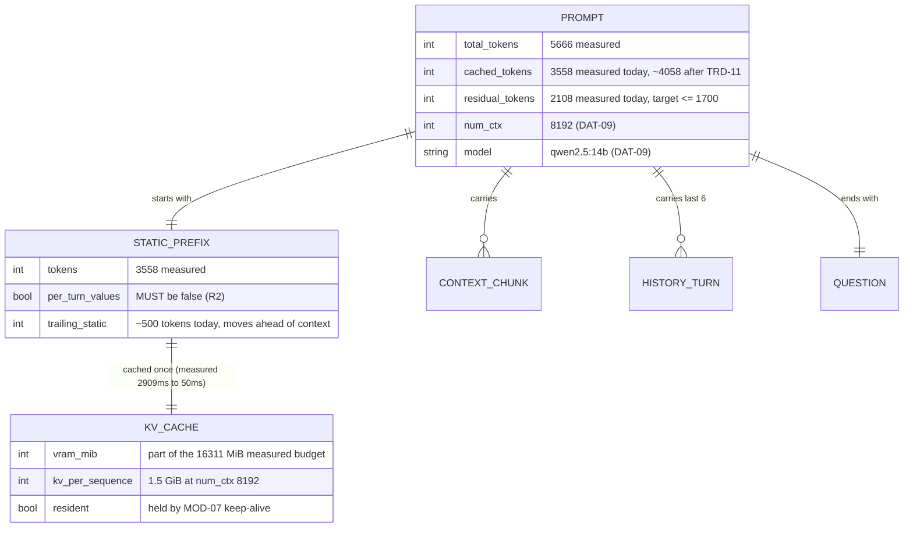

> **Lens:** BA (Part A) / TPO + Architect (Part B) · **Inputs:** `01-brd.md`, `02-use-cases-workflows.md`, `03-data-state-analysis.md`, `05-modularization.md`, `06-architecture.md`, `07-brownfield-reconciliation.md` · **Engagement:** Brownfield — `D:\project\universityDemo` · **Defines:** TRD-10 … TRD-12

# Inference Serving & Prompt Assembly — MOD-03 [Lens: BA (Part A) / TPO + Architect (Part B)]

**Boundary (from `05-modularization.md` §2):** assemble the prompt, hold the model resident, and serve generation to all callers. **Depends on:** `MOD-06`, `MOD-07`. **Entities:** the system prompt template, `DAT-09` model config, engine counters.

## Part A — Module BRD [Lens: BA]

### A.1 Module Objectives

MOD-03 owns the two largest terms in the caller's wait. The first is *prefill*: the model must read a 5,666-token prompt (3,558 tokens of which are static instructions) before it can emit a single word, and that costs a measured 1,588–1,990 ms. The second is *residency*: when the model is not in VRAM, the first turn of a call pays a measured 32,919 ms load and 67,349 ms to first token — a silence long enough that a caller will hang up.

Both are business problems before they are engineering problems:

- **The caller waits for the model to read, not to think.** The prompt is mostly fixed text; the caller should pay for the new part only.
- **A call arriving after an idle period must not be punished for being first.** `BRD-03` is about the caller who dials at 09:00 after the service sat idle overnight.
- **The card must not be over-committed.** Peak VRAM at two callers is ~90% of the device (`BRD-11`); this module is where the second caller's KV cache either fits or does not.

### A.2 Scoped Requirements

This module satisfies, and is the sole owner of:

| Requirement | What MOD-03 owes it |
|---|---|
| `BRD-02` | Prompt structure (the cacheable prefix) and streamed generation — the two highest-leverage latency levers |
| `BRD-03` | The first turn of a call must not pay a cold-start penalty |
| `BRD-11` | Peak VRAM with two concurrent calls ≤ 90% of device memory, no silent sysmem spill |
| `BRD-17` | Model and prompt prefix resident before the first call is accepted |

Contributing to, but not owning: `BRD-01` (supplies the engine counters — `prompt_eval_count`, `eval_count` — that make a turn decomposition honest), `BRD-05` (generation under two callers), `BRD-08`/`BRD-09` (any change to what the model sees is a quality-gated change), `BRD-12` (CPU bound under two callers), `BRD-13` (this module supplies the generation rung of the ladder), `BRD-15` (model and prompt changes are flag- or config-revertible).

### A.3 Module Business Rules

Extending `01-brd.md` §5; nothing here duplicates a `BRD-xx`:

- **R1 — The model identity is not a performance knob.** A model or quantization change alters what the assistant says; it is admissible only through `UC-10`, on the frozen set, with `BRD-09`'s gate applied. Latency pressure alone never replaces the model.
- **R2 — The prompt's static text is written once and cached.** Any per-turn variation must sit *after* the cacheable prefix; a timestamp or session identifier in the static block silently destroys the cache and is a defect.
- **R3 — Residency is a property of the running stack, not of the last call.** The operator starts the stack warm (`BRD-17`); no caller should ever be the one who pays the load.
- **R4 — A caller is never refused to protect the other.** At the VRAM ceiling, generation queues with a bounded wait and, below a threshold, context is reduced rather than the request refused (`06-architecture.md` §5, MOD-03).
- **R5 — Counters are evidence, not decoration.** If the engine returns counter values, they are recorded; if it does not, the trace says so rather than recording a zero (`UC-07` E1).

### A.4 Actors

| Actor | Why it touches MOD-03 |
|---|---|
| **Caller** | Experiences this module as the pause before the answer; experiences a cold start as silence |
| **Developer** | Owns prompt ordering, streaming consumption, and the residency/warm path |
| **Operator** | Owns the boot sequence that makes residency true (`UC-06`); needs "model loaded" to be verifiable rather than assumed |
| **Inference engine (Ollama)** | System participant on `:11434`; serves generation and embeddings; has no fallback (accepted gap) |
| **Product Owner** | Approves any model or quantization change through `UC-10`; owns the residency requirement's cost |

### A.5 Module Acceptance Criteria

Business-verifiable, at module level:

1. **Prefill is paid once.** With an identical static prefix and a changed context, the second turn's prefill is a small fraction of the first's, and the measured prompt-evaluation counter shows the cached portion is not re-read (`BRD-02`). Reference behaviour: an identical repeat measured **2,909 ms → 50 ms** at the same token count.
2. **No caller pays the load.** After the stack reports ready, no turn exhibits a first-token time above the warm p95; a call placed 30 minutes after boot behaves like one placed 30 seconds after (`BRD-03`, `BRD-17`).
3. **Two callers fit — and this is now MEASURED, not projected.** On 2026-09-18 (see `doc/perf/us015-benchmark-results.md`): peak VRAM at N=2 is **11,272 MiB = 69%** of the 16,311 MiB device budget, not the ~90% projected here; per-stream decode is **39.4 tok/s vs 39.2 at N=1** — no measurable degradation; and N=2 wall time is **1.42×** the N=1 wall, so the engine **partially batches** rather than serialising. **No per-stream decode floor is asserted.** The plan originally carried "≥ 18 tok/s per stream", derived by halving the N=1 rate; that figure was withdrawn and is now **superseded by measurement** — the real number is ~39 tok/s, roughly 2× the withdrawn floor. Also measured: per-turn prefill is **411 ms** in the realistic cache-break case (100 ms for a 3B), not the 1,588–1,990 ms this plan modelled, which was a cold-cache first call.
4. **Counters reconcile.** Every generation reports `prompt_eval_count` and `eval_count` that match the prompt and answer actually exchanged; a missing counter is reported as missing (`BRD-01`).
5. **Streaming is cancellable.** A hang-up during generation stops decoding within `Assumed: 200 ms` and frees the sequence's KV allocation (`MOD-01` TRD-05 interaction).
6. **No behaviour change without a gate.** The prompt ordering change moves text that the model reads but does not change any instruction's content; it is verified by a token-level diff of the assembled prompt against the baseline, and by the frozen set when `DG-03` clears (`BRD-08`, `BRD-09`, `BRD-18`).

## Part B — Module TRD [Lens: TPO + Architect]

### TRD-10 — Stream generation, capture engine counters, and stop paying an HTTP round trip per utterance

Serves `BRD-02`, `BRD-01`; implements the `SM-02` GENERATING state.

`llm_backend.chat()` calls `ollama.chat()` and returns `response["message"]["content"]` — a complete string, with the caller waiting for the whole completion (`llm_backend.py:135–175`). This is the single largest architectural defect the program addresses (`06-architecture.md` §1). This TRD consumes generation as a token stream, so the first clause can be handed to synthesis in ~390 ms rather than after the full answer; it captures the engine's own `prompt_eval_count` / `eval_count` from the response so a turn's decomposition can be checked against the engine's account of it; and it removes `pick_model()`'s uncached `/api/tags` HTTP round trip, which runs **per utterance** today (`llm_backend.py:180–204`, classified "resolve now" in `07-brownfield-reconciliation.md` §4).

### TRD-11 — Order the prompt so the cacheable prefix is as large as possible

Serves `BRD-02`; implements the prompt-structure lever identified by the prefix-cache experiment, operating over the `DAT-04` history and `DAT-01`-derived context that form the volatile tail.

Prefix caching demonstrably works on this box — an identical repeat measured **2,909 ms → 50 ms** at the same token count — and the cache break point is exactly at the `{context}` insertion (`voice_system_prompt.py:600`, `doc/perf/tools/a4_prefix_cache_probe.py`). Everything from `{context}` onward is re-read every turn: 2,108 of the 5,666 prompt tokens, including roughly **500 static tokens that sit after the insertion point** (`06-architecture.md` §2, MOD-03). This TRD moves static text ahead of `{context}` so the cached prefix grows from 3,558 to ~4,058 tokens, leaves the volatile part (retrieved context, history, question) contiguous at the tail, and forbids per-turn nondeterminism anywhere in the static region.

### TRD-12 — Keep the model and its prefix resident, and hold two callers inside the VRAM budget

Serves `BRD-03`, `BRD-17`, `BRD-11`; implements the residency half of `DAT-09` model config (`keep_alive`, model tag) and the VRAM line of the `BRD-11` budget; consulted by `UC-10` for any model or quantization change.

The model is not resident when a call arrives after an idle period: measured **32,919 ms** to load and **67,349 ms** to first token, with the GPU reporting P5 and a memory clock of 405 of 14,001 MHz at rest (`01-brd.md` Evidence Register). This TRD makes residency a property of the running stack — the model held with an explicit keep-alive on the serving path (not only at boot) and the static prefix pre-populated with a representative prompt before the first call is accepted — and it fixes the concurrency budget: two KV caches of ~1.5 GiB each alongside whisper (~0.8 GiB) and kokoro (~0.35 GiB) against a measured 16,311 MiB device budget, i.e. ≤ 14,680 MiB at N=2 with no spill.

### B.1 Technical Constraints

- **Engine stays Ollama** on `:11434`. It supports the required change (`stream=True`) without a migration, and the measured bottleneck is not the engine: decode runs at **36.6–38.9 tok/s = 77% of the 448 GB/s memory-bandwidth ceiling** (`AS-07`). Replacing it is a `UC-10` question, not a fix for this module (`06-architecture.md` §4, §7).
- **Model and context window are fixed inputs to this plan:** `qwen2.5:14b` at `num_ctx=8192`. Both are `DAT-09` values and neither is changed here.
- **One process, one event loop** (`REC-02`): the Ollama calls are `asyncio.to_thread`-style offloads today and must stay non-blocking; a synchronous stream read would stall both callers.
- **Prompt template is shared with the text path.** `voice_system_prompt.py` is consumed by `/ws/voice/text` as well as the voice path (`REC-09`), so the reordering in TRD-11 lands on both.
- **Boot is `MOD-07`'s boundary.** This module specifies *what* must be resident and *how it is verified*; `start_services.ps1` and the boot sequence are `MOD-07`'s to change.
- **No hosted inference** under any circumstances (`AS-03`), including as a latency fallback.

### B.2 Non-Functional Requirements

| NFR | Target |
|---|---|
| Performance | Time-to-first-token, warm: p95 ≤ **1,000 ms** (this module's share, excluding the 600 ms endpointing floor owned by `MOD-01`). Basis: residual prefill of 2,108 tokens at the measured 2,847–3,568 tok/s ≈ 590–740 ms, plus first-clause decode ≈ 390 ms |
| Performance — prefill | Post-change residual prefill (uncached tokens) ≤ **1,700 tokens**, down from 2,108 — i.e. the cached prefix grows from 3,558 to ~4,058 tokens (TRD-11) |
| Performance — decode | ≥ **36.6 tok/s** per stream at N=1 (measured range 36.6–38.9) — this one is a measured baseline, restated as a floor. **At N=2 the rate is measured, not required**: record aggregate tok/s, per-stream tok/s, queue time and prefill interference, then let the measurement set the limit (`TRD-22`). The withdrawn "≥ 18 tok/s per stream" figure and why it was withdrawn are recorded in the note below |
| Performance — cold start | First token ≤ `Assumed: 2,000 ms` on a stack that has completed its boot warm-up. The measured **67,349 ms** cold-load-to-first-token must not be reachable after boot (`BRD-03`, `BRD-17`) |
| Performance — removed overhead | Zero HTTP round trips to `/api/tags` per utterance (today: one, uncached). Target: **1** model resolution per process lifetime (TRD-10) |
| Scalability | 2 concurrent generations on one GPU; a third is not admitted (`AS-01`, `06-architecture.md` §5) |
| Scale unit & limits | Unit = one in-flight generation; KV allocation ≈ 1.5 GiB per sequence; `num_ctx` 8192; prompt 5,666 tokens today = **69%** of the window, below the 80% (6,554-token) guard threshold |
| Security | No caller text leaves the box; prompts contain student-facing KB content and session-local history only; no hosted inference (`AS-03`) |
| Observability | `prompt_eval_count`, `eval_count`, prefill ms and decode tok/s recorded per turn; a missing counter is recorded as absent, never `0` (`UC-07` E1) |
| Availability | Engine failure has **no** fallback and this is an accepted gap (`04-coverage-gap-analysis.md` §8 Q7, owner: TPO). The turn still ends in speech via `MOD-01` TRD-04 — the module's obligation is to fail fast and let the turn path speak, not to invent a second engine |
| Resource budget | Peak VRAM ≤ **14,680 MiB** (90% of the measured 16,311 MiB budget) at N=2, no sysmem spill (`BRD-11`); CPU ≤ 80% and RAM ≤ 80% (`BRD-12`) |
| Reversibility | Prompt reordering and streaming are separately flag-revertible; the model/quantization is untouched by this TRD (`BRD-15`) |

### B.3 APIs / Interfaces

| Name | Direction | Style | Contract | AuthN/Z |
|---|---|---|---|---|
| `generate(prompt, stream=True)` | exposed | in-process call | Yields token deltas; terminates with engine counters; cancellable; used by `MOD-01` | n/a (in-process) |
| Ollama `POST /api/chat` (`:11434`) | consumed | local HTTP, streamed | `stream=True`; `options.num_ctx=8192`; keep-alive applied on the serving path; loopback only | n/a (loopback) |
| Ollama `POST /api/embeddings` (`:11434`) | consumed | local HTTP | `nomic-embed-text` for `MOD-02`'s query embedding | n/a (loopback) |
| `pick_model()` | internal | in-process | Resolved once per process and cached; no per-utterance `/api/tags` call | n/a |
| Prompt template (`voice_system_prompt.py`) | owned | template asset | Ordered: `[invariant static prefix]` → `{context}` → `[history]` → `[question]`; the static region contains no per-turn values | n/a |
| Boot warm command (`MOD-07`) | consumed | operator command | Reports model resident and prefix warm before the first call is accepted | n/a (local operator) |
| Engine counters (`MOD-06`) | published | in-process marks | `prompt_eval_count`, `eval_count`, prefill ms, decode tok/s | n/a |

The engine boundary is deliberately narrow: one generation call and one embeddings call. `REC-04` records that the app calls exactly one retrieval tool and never reaches ERC's reranker or semantic cache; nothing in this module widens that surface.

### B.4 Data Model

This module owns no durable store; its "data" is the prompt's structure and the residency state, both of which are the levers.

Mapping to `03-data-state-analysis.md`: `PROMPT.total_tokens` and `cached_tokens` are **measured** values from the `prompt_eval_count` counter (`01-brd.md` Evidence Register); `num_ctx` and `model` are `DAT-09` configuration and are the values `REC-05` establishes as `.env`-authoritative; `KV_CACHE.vram_mib` is the `BRD-11` budget line. History (`HISTORY_TURN`) is `DAT-04`, assembled here but owned by `MOD-01` — this module does not persist or window it.

### B.5 Tech Stack Choices

| Choice | Rationale | Runner-up, and why not |
|---|---|---|
| Keep Ollama | The required change (`stream=True`) is already supported with no migration; measured decode is at 77% of the memory-bandwidth ceiling, so the engine is not the bottleneck (`AS-07`, `06-architecture.md` §4) | llama.cpp server / vLLM on WSL2 — a migration whose ceiling is the same 448 GB/s; gated behind `UC-10` if the gates fail, not adopted on latency grounds |
| Stream from the same `ollama` client | Zero new dependencies; the streaming path exists in the pinned version and is simply unused | Switching to a different client library — churn with no bearing on the measured terms |
| Reorder the prompt rather than trim the context | Prefix caching is measured working; trimming (`RAG_MAX_CONTEXT_CHARS`) discards grounding to save time that prefill already yields for free once the prefix is cached | Trim context to shrink prefill — trades answer quality (`BRD-09`) for a smaller win than caching delivers |
| Hold residency with an explicit keep-alive on the serving path | `BRD-17` is a property of the running stack; a boot-only ping leaves the model unprotected for the life of the process (see B.8) | Rely on the pack's default eviction window — that is precisely the mechanism that produced the measured 32,919 ms load |
| Leave model and quantization unchanged in this program | Decode is bandwidth-bound at 77% of ceiling with ~30% headroom (`AS-07`), so a smaller model buys little; the quality risk is real and the gate (`DG-03`) is blocked | Quantize to make room — a `UC-10` decision needing a frozen set that does not yet exist |

### B.6 Edge Cases & Error Handling

Per failure class:

| Failure | Handling |
|---|---|
| Generation returns empty or errors | Surfaced as a failure to `MOD-01`, never swallowed into an empty string that reaches synthesis — today's empty-reply path leaves the caller in silence (`WF-01` step 8 gap). `MOD-01` TRD-04 speaks the fallback |
| Engine unreachable | Fail fast (short connect timeout, not the full generation budget) so the turn path can speak within its own deadline. Accepted: there is no fallback engine (`04-coverage-gap-analysis.md` §8 Q7) |
| Model evicted mid-call | The largest single stall in the system: 32,919 ms load / 67,349 ms to first token. Prevented by servicing keep-alive (TRD-12); detected by the trace when it still happens, so it is never invisible |
| Prompt approaches the window | `num_ctx` 8192, guard warns at 80% (6,554 tokens); today's prompt is 5,666 tokens — 69%, with ~888 tokens (~2–3 chunks) of headroom before the warning fires. The guard never trims by decision (`RAG_MAX_CONTEXT_CHARS=0`); a growing prompt is a signal to review `RAG_TOP_K`, not to truncate silently |
| Prompt overflows the window | A model-level truncation would drop the *tail* — exactly where the question sits. The turn path must detect it rather than let the engine silently truncate, and degrade to a shorter context instead |
| Counter capture fails | Record the turn without counters and mark them absent; never write `0`, which is indistinguishable from a genuine zero-token evaluation (`UC-07` E1) |
| Two callers generate simultaneously | Both queue on the engine; per-stream decode falls as streams are added — **by how much is measured, not assumed** (`TRD-22`). Below the measured threshold, reduce context rather than refuse; never degrade one caller's *answer* to protect the other's *speed* |
| Caller hangs up mid-generation | Cancellation aborts the stream and releases the sequence's KV allocation; the answer is discarded, not spoken (interacts with `MOD-01` TRD-05) |
| Per-turn value lands in the static prefix | Detected by the verification in A.5 criterion 6; this is a cache-invalidating defect that shows up as a prefill regression, not as an error |
| Malformed stream / truncated response | Treated as partial: what arrived is used if it forms a complete clause, otherwise the turn takes the failure path. A half-sentence is never spoken |
| Retry / idempotency | Generation is read-only w.r.t. state; a retried turn re-issues. No result cache is introduced — `REC-04` records the semantic cache as unreachable and this module does not wire it |

### B.7 Tech Debt Accepted

- **Accepted: the engine has no fallback.** `04-coverage-gap-analysis.md` §8 Q7 records this as an accepted gap owned by the TPO, addressed by `BRD-13`/`BRD-17`. Rationale: a second engine does not fit the VRAM budget at N=2. The mitigation is honesty — the turn speaks a fallback and the trace records the cause.
- **Accepted: model and quantization are untouched.** `UC-10` owns any change and `DG-03` blocks its gate. Revisit only if `BRD-02`/`BRD-05`/`BRD-11` fail after streaming.
- **Accepted: the ~500 trailing static tokens move rather than being deleted.** They may include instruction text the quality gate depends on; the reordering is verified by token-level diff, and deleting prompt content is a `BRD-18`/`BRD-09` decision.
- **Resolved now: `pick_model()`'s per-utterance `/api/tags` round trip** (`llm_backend.py:180–204`) — classified "resolve now" in §4 as trivial and pure win; it becomes a process-lifetime resolution inside TRD-10.
- **Resolved now: the identical prompt string rebuilt per turn** — §4 records this as falling out of the streaming refactor; TRD-11's ordering makes the rebuild explicit and the cacheable region stable.

### B.8 Reconciliation (Brownfield)

| Asset | Location | Class | What this module does |
|---|---|---|---|
| `llm_backend.chat` / `_chat_ollama` | `llm_backend.py:135–175` | **Refactor** | Non-streaming → token stream with counter capture (TRD-10); `options` gains keep-alive on the serving path (TRD-12) |
| `pick_model()` per-call `/api/tags` | `llm_backend.py:180–204` | **Debt** | **Resolve now** — uncached HTTP round trip per utterance becomes process-lifetime (TRD-10) |
| System prompt template | `app/voice_system_prompt.py` (`{context}` at line 600 of 714) | **Refactor** | Static text after `{context}` moves ahead of it; the static region must contain no per-turn values (TRD-11) |
| Prompt prefix / KV cache behaviour | measured, `doc/perf/tools/a4_prefix_cache_probe.py` | **Reusable** | The mechanism is measured working (2,909 ms → 50 ms); the change is to what is placed inside it, not to the mechanism |
| Model preload / warm path | `start_services.ps1` Step 6 | **Refactor** | See the note below — the pre-warm exists, is committed, and is the `MOD-07` boundary this module specifies against |
| `doc/model_vram_analysis.md` | `doc/` | **Excluded** | Budgets for a 6 GB GPU and `qwen2.5:7b-instruct-q3_K_M` at `num_ctx=2048`; the live machine is 16 GB running `qwen2.5:14b` at `num_ctx=8192` — stale, not an evidence source (`REC-06`) |
| Reranker + semantic cache boot cost | ERC `config.py:196–198` | **Debt** | 23.2 MB loaded and unreachable; remove from boot per §4 — not wired here (`REC-04`) |
| Pipecat 1.6.0 | `requirements.txt:33` | **Debt** | Installed, pinned, bypassed; **not** adopted — the hand-rolled path is the target (`REC-01`) |

REC notes that apply: **`REC-01`** (Pipecat is not adopted; its `KokoroTTSService` already streams and remains a `UC-10` candidate only if hand-rolled streaming proves insufficient), **`REC-02`** (one process — generation must not block the single event loop), **`REC-04`** (reranker/semantic cache are pure cost), **`REC-06`** (the stale VRAM document must not drive a model decision), **`REC-09`** (the prompt template is shared with the text path).

**Flagged: the plan's claim that model preload does not exist contradicts committed code.** `06-architecture.md` §2 (MOD-07) states "Model preload — not present today". `start_services.ps1` contains a committed Step 6, "Ollama model pre-warming", which enumerates `/api/tags` and POSTs a one-token `/api/generate` with `keep_alive=24h` for every completion-capable model. The reconciliation is narrower than either claim:

- The pre-warm **was silently inert**: under PowerShell 5.1 a native-to-native pipe did not deliver the model list to the parsing step, so the list came back empty and pre-warming was skipped while reporting a misleading "ollama pull" hint. That is why a 32,919 ms cold load was measured with pre-warm code present in the file — a fourth instance of the "set ≠ live" pattern alongside `FASTAPI_WORKERS` (`REC-02`), the Pipecat VAD (`REC-01`) and `.machine_profile.json` (`REC-05`).
- `keep_alive` is passed **only** in the boot ping. `_chat_ollama` sets `num_ctx` and `temperature` and nothing else, and `OLLAMA_KEEP_ALIVE` is not set in `.env` or read anywhere in `app/`. So residency is protected at boot and unprotected for the rest of the process's life — which is precisely the window `BRD-17` and the 32,919 ms measurement are about.
- **Consequence for this module:** TRD-12's requirement is not "add a preload" but "make residency hold on the serving path and make the warm state verifiable". `MOD-07` owns the boot sequence; this module owns the serving-path keep-alive and the verification criterion in A.5 criterion 2.

#### As-built, 2026-09-19 — this section contradicted B.3, and B.3 was right

The two rows disagreed: B.3 asserts "keep-alive applied on the serving path", while
the flag above recorded that it was not. **The gap is now closed, and B.3 has
been true since the fix; the flag above was the stale half.**

| Claim in the flag | As built | Evidence |
|---|---|---|
| `keep_alive` passed only in the boot ping | **CLOSED** — sent on every generation. `_chat_ollama` resolves `ka = KEEP_ALIVE if keep_alive is None else keep_alive` and passes it to `ollama.chat` | `app/llm_backend.py:204–207` |
| `OLLAMA_KEEP_ALIVE` not set in `.env`, not read in `app/` | **STALE** — it is set, and it is read | `.env:235` (`-1`); `app/llm_backend.py:178` |
| `_chat_ollama` sets `num_ctx` and `temperature` and nothing else | **STALE** — `options` gained `num_predict` (the spoken-answer tail guard, `OLLAMA_NUM_PREDICT`, default 192, voice path only) | `app/llm_backend.py:186`; `app/rag.py` |
| `pick_model()` is an uncached per-utterance `/api/tags` round trip | **STILL OPEN** — verified uncached. This is the one claim in the flag that remains true, and it remains a real per-turn cost | `app/llm_backend.py:271` |

Two consequences worth carrying forward. First, `_resolve_keep_alive` exists
because a `.env` value is always a string and Ollama's Go duration parser
rejects `"-1"` with `time: missing unit in duration` — a 400 on **every**
request. A setting that is present but malformed does not degrade residency, it
breaks every call, so the coercion is load-bearing rather than defensive.
Second, if the installed client rejects the `keep_alive` kwarg the code degrades
**loudly** (`_keep_alive_unsupported`, a warning naming `BRD-17` as unmet)
rather than silently reverting to the server default.

**The "set ≠ live" list above is one item shorter.** It named four instances —
`FASTAPI_WORKERS`, the Pipecat VAD, `.machine_profile.json`, and the pre-warm
list. The **Pipecat VAD has since been removed** rather than fixed: it was
constructing a `SileroVADAnalyzer` with `stop_secs=0.5` that nothing read, and
it has been deleted from `app/pipeline.py` under `BRD-04` ("exactly one live
end-of-speech decision"). `FASTAPI_WORKERS` remains wrong in the
`hardware_profile.py` tier tables and still warns at every boot.

## TPO Buildability Sign-off [Lens: TPO]

**TPO sign-off: this TRD is buildable against the BRD above.** Both levers are measured on this box before being proposed — the prefix cache was proved to work (2,909 ms → 50 ms) and decode was proved to be bandwidth-bound at 77% of ceiling, so neither change rests on a projection. Feasibility risks:

- **Prefill is only half the win, and the other half is not this module's.** Even with the prefix fully cached, the 600 ms endpointing floor sits in front of every turn. If the PO rejects the relaxed SLO in `MOD-01` B.2.1, no amount of prompt work closes the gap — the honest answer is that the target was set before measurement (`CV-02`).
- **The VRAM budget at N=2 is the module's real constraint, and it is ~90% committed before this work starts.** TRD-12's second caller fits only if the KV allocation behaves as measured (1.5 GiB per sequence) alongside whisper and kokoro. If it does not, the fallback is `UC-10` — which is blocked by `DG-03` until the frozen set exists. **Sequencing risk: the residency fix must not be adopted without the resource measurement, or a "fix" could push the box into spill.**
- **The set ≠ live trap has already caught this program once and is live here.** The residency requirement looks satisfied by code that exists and does not execute. Any acceptance test for `BRD-17` must observe the model resident in `nvidia-smi` at the moment a call arrives, not that the boot script printed a success line.
- **Not buildable as written if** prompt reordering changes an instruction's effective position in a way the frozen set objects to. The token-level diff in A.5 criterion 6 proves the *content* is unchanged; only the quality gate can prove the *behaviour* is, and it is blocked until `DG-03` clears. Until then the reordering lands behind a flag with the baseline prompt one config change away (`BRD-15`).
