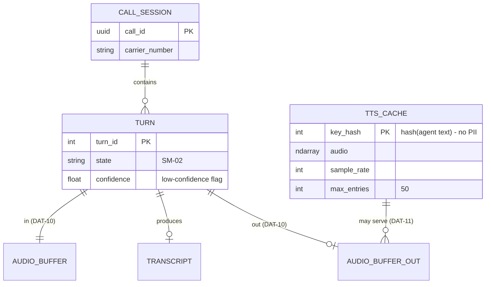

> **Lens:** BA (Part A) / TPO + Architect (Part B) · **Inputs:** `01-brd.md`, `02-use-cases-workflows.md`, `03-data-state-analysis.md`, `05-modularization.md`, `06-architecture.md`, `07-brownfield-reconciliation.md` · **Engagement:** Brownfield · **Defines:** TRD-13 … TRD-16

# Speech Services — MOD-04 [Lens: BA (Part A) / TPO + Architect (Part B)]

## Part A — Module BRD [Lens: BA]

### A.1 Module Objectives

Give the caller a voice. This module turns the caller's audio into text the assistant can reason about, and turns the assistant's text back into audio the caller can hear. Every second it spends is a second the caller spends waiting in silence, so its objective is stated in the caller's terms: **the reply must start sounding as soon as there is something worth saying**, not once the whole answer has been rendered.

Two constraints shape the module more than any feature request. First, both models are GPU-resident and share the same card, the same memory bandwidth and the same VRAM budget with the language model — so this module is where the two-caller ceiling is actually decided. Second, the module's output is spoken into a live telephone call, which means a failure here is heard as silence, not seen as an error.

### A.2 Scoped Requirements

**Satisfies** (per `05-modularization.md`):

- `BRD-05` — Two simultaneous callers, neither degraded beyond 1.5× by the other.
- `BRD-11` — Peak VRAM at two callers at or below 90% of device memory, with no silent spill into shared system memory.
- `BRD-18` — Behaviour surface preserved: all 28 intents keep working after optimisation.

**Contributes to** (named here because this module carries the term, not because the requirement is owned here):

- `BRD-02` — Turn latency target. The synthesis term is owned here; `06-architecture.md` §2 names it explicitly ("kokoro `create()` … Owns `BRD-02`'s synthesis term").
- `BRD-06` — Caller isolation. `DAT-11` is process-wide and shared across concurrent calls (`03-data-state-analysis.md` A.1); the isolation proof is owed by this module even though the requirement is stated in `MOD-01`'s terms.
- `BRD-13` — Graceful degradation: a speech failure must be heard as a polite fallback, never as silence.
- `BRD-15` — Reversible change: every change in this module is revertible by configuration.

### A.3 Module Business Rules

| Rule | Condition → Action | Traces to |
|---|---|---|
| Local models only | A proposal for a hosted STT/TTS service → rejected on residency grounds | `AS-03`, `BRD-02` constraint set |
| Audio is per-call | Synthesised audio for caller A → never returned to caller B, cached or not | `BRD-06` |
| Cache keys carry no PII | A cache key derived from caller speech or caller identity → rejected; keys are content hashes of the agent's own text | `DG-06`, `03-data-state-analysis.md` A.1 (`DAT-11`) |
| A turn that produced an answer must speak | Synthesis failure for a generated answer → a spoken fallback, never silence | `BRD-13`, `UC-02` E2 |
| Degrade slower, not dead | VRAM pressure → fall back to CPU execution for TTS rather than skipping speech | `BRD-13`, `06-architecture.md` §5 (MOD-04 degradation mode) |
| One variable at a time | Changing synthesis streaming and decoding parameters in the same experiment → split it | `01-brd.md` §5 business rules |

### A.4 Actors

| Actor | Why it touches this module |
|---|---|
| **Caller** | Hears the result; experiences the synthesis latency directly and cannot distinguish it from the model being slow |
| **MOD-01 Voice Turn Path** | The only caller of this module's API on the live path — supplies audio, consumes transcripts and audio |
| **Operator** | Needs speech-model load and VRAM pressure visible before callers complain (`UC-06`) |
| **Developer** | Maintains the models, the execution provider choice and the streaming change |
| **Inference engine (Ollama)** | System actor, not an initiator: competes for the same VRAM and bandwidth, which is the coupling this module's budget is about |

### A.5 Module Acceptance Criteria

1. **Streaming is real, not nominal.** On a live call, the first synthesised audio chunk reaches the carrier before the full answer has been synthesised; the trace's `tts_done_ms` less the first-chunk mark is greater than zero on a multi-sentence answer.
2. **No cross-caller audio.** Under the two-caller harness (`TRD-22`), zero occurrences of caller B receiving audio synthesised for caller A, across three consecutive runs — this is the `DG-06` isolation test and it is a pass/fail, not a statistic.
3. **The line always says something.** With TTS forced to fail, the caller hears the spoken fallback rather than silence, and the other caller's turn is unaffected (`BRD-13`).
4. **The budget is not silently exceeded.** With two concurrent calls, peak VRAM stays at or below 90% of 16,311 MiB with no system-memory spill; the number is read from the GPU, not inferred (`BRD-11`).
5. **Nothing regresses.** All 28 intents still transcribe and speak correctly after the streaming change (`BRD-18`), judged end-to-end, not on per-stage text quality alone.
6. **It reverts in one step.** Streaming synthesis is disabled by a single setting and the previous behaviour returns, demonstrated (`BRD-15`).

## Part B — Module TRD [Lens: TPO + Architect]

### TRD-13 — Streaming synthesis on the first-audio path

Synthesis shall consume the generated answer incrementally and emit audio frames to the carrier as each chunk is produced, instead of waiting for a complete audio buffer. The streaming API shall be the library's own; a partial-buffer re-implementation is not acceptable.

- **Serves:** `BRD-02` (synthesis term), `BRD-05`; contributes to `BRD-18`.
- **Implements:** `SM-02` transition SYNTHESISING → SENDING, which today cannot begin until the full buffer exists.
- **Evidence:** `06-architecture.md` §2 ("kokoro `create()` — batch API; the streaming variant exists in the installed library and is unused"), `07-brownfield-reconciliation.md` REC-01 and §4.
- **Verified 2026-09-18 against the pinned library:** `kokoro-onnx==0.5.0` exposes `create_stream(text, voice, speed, lang, is_phonemes, trim)` returning `AsyncGenerator[tuple[ndarray, int], None]` — an async generator yielding `(audio, sample_rate)` pairs, alongside the batch `create(...)` the live path uses today (`app/voice_handler.py:673`). The streaming variant is therefore a drop-in for the async turn loop, not a rewrite.
- **Numbers:** predicted −300 to −600 ms off p50 (the program's C2 prediction, `doc/perf/PLAN.md` §5); first chunk available within 400 ms of the first sentence being complete; the chunk boundary is a sentence, not a fixed byte count, so a chunk is never mid-word.
- **Reversibility:** behind a single setting; unset restores `create()` exactly (`BRD-15`).
- **Resample path:** 24 kHz synthesis → 8 kHz µ-law framing is unchanged from `app/voice_handler.py:134` and `app/voice_handler.py:689`; a chunk boundary must land on a frame boundary so the carrier never receives a partial frame.

### TRD-14 — Speech-model residency and the VRAM ceiling at two callers

Both speech models shall be resident and accounted for inside an explicit VRAM budget; the budget shall be asserted at boot, and TTS shall degrade to CPU execution rather than fail when the budget is breached.

- **Serves:** `BRD-11`, `BRD-05`; implements the `MOD-04` degradation mode in `06-architecture.md` §5.
- **Implements:** `SM-02` — a turn that cannot synthesise must still reach EMITTED via the spoken fallback, not stall at SYNTHESISING.
- **Budget (measured, this box, 2026-09-18):**

| Component | VRAM | Source |
|---|---|---|
| Device total | 16,311 MiB | Measured, `nvidia-smi` |
| Device total (as reported by the profile) | 15.9 GB | `.machine_profile.json` → `detected.vram_gb` |
| LLM weights (qwen2.5:14b) | ~9.0 GiB | Measured (`doc/perf/PLAN.md` §7) |
| KV cache, one sequence at `num_ctx=8192` | ~1.5 GiB | Measured; the second caller adds a second 1.5 GiB |
| STT — faster-whisper `small.en`, INT8, CUDA | ~0.8 GiB | Measured |
| TTS — Kokoro ONNX, CUDA execution provider | ~0.35 GiB | Measured |
| CUDA context + desktop | ~1.5 GiB | Derived (remainder to the measured total) |
| **At N=2** | **~90% of 16,311 MiB** | Derived from the rows above |

- **Requirement:** the boot check computes this budget from measured values, not from a static table, and refuses to report "ready" when the projected N=2 figure exceeds 90%. The existing `app/memory_budget.py` `"nvidia"` block is **not** a usable source — it budgets `qwen_llm_gb: 4.0`, `recommended_gb: 6.0`, `peak_total_gb: 5.7`, which describes a 6 GB GPU running a small model, not this machine (see `B.8`).
- **Fallback:** `onnxruntime-gpu==1.28.0` is pinned, so the CPU execution provider is available in the same wheel; the switch is a provider list, not a second install.

### TRD-15 — TTS cache isolation under concurrent callers

The TTS cache shall be proven safe for two concurrent callers or made per-call; the choice shall rest on the isolation test, not on the argument that content hashes contain no PII.

- **Serves:** `BRD-06` (isolation is demonstrated under concurrent load, not asserted), `BRD-05`.
- **Implements:** `DG-06` — "use-as-is, conditional on an explicit N=2 isolation test".
- **Current state:** `app/voice_handler.py:655` declares `_tts_cache` as a class-level attribute with `_tts_cache_max = 50`; every concurrent call in the process shares one dictionary, keyed by `hash(tts_text)` (`app/voice_handler.py:666`).
- **Numbers:** cache capacity ≤ 50 entries (a class constant today); keys are `hash()` of the agent's own text, so the key space contains no caller data; the isolation test runs at N=2 with the harness and must show **zero** cross-call hits over ≥100 turns per condition.
- **Failure mode this guards:** the leak is not the audio — identical text maps to identical audio — it is a *returned-then-mutated* buffer. The cache stores and returns `.copy()` (`app/voice_handler.py:675, 681`); the test exists to prove that discipline holds under concurrency, including the eviction path at `app/voice_handler.py:677–680`.
- **Degradation:** if the test fails, the cache becomes per-call (bounded to one session's utterances) rather than being removed — the latency benefit is retained without the shared state (`BRD-15`: revertible by configuration).
- **OUTCOME 2026-09-19 (US-012): the test FAILED and the fallback was applied.** 30 occurrences of caller B being served audio synthesised during caller A's session (`MOD-04` A.5.2's failure condition). `TTS_CACHE_SCOPE=per_call` is now the setting; a clean run shows **0 cross-call hits across 105 keys** against 3 under `shared`. The revert is the same one line. Note the key also changed: it is `(agent text, voice, speed)`, because voice and speed became configurable and a key without them would have kept serving audio rendered in the old voice.

### TRD-16 — Transcription contract: provenance, confidence, and rate discipline

Transcription shall return text that is unambiguously attributable to one call session, carry a low-confidence signal, and be produced without ever delaying the end-of-speech decision.

- **Serves:** `BRD-06`, `BRD-18`; contributes to `BRD-04` (exactly one live end-of-speech decision, documented).
- **Implements:** `SM-02` ENDPOINTED → TRANSCRIBED, and the ACCUMULATING → ENDPOINTED decision that `MOD-01` owns but this module must not pre-empt.
- **Rates (verified in code):** carrier audio arrives as 8 kHz µ-law, converted with `ulaw_to_pcm` (`app/voice_handler.py:218`); the utterance is upsampled 8 kHz → 16 kHz for the model (`app/voice_handler.py:412`); the model is `faster-whisper==1.2.1` with `small.en`, CUDA, `compute_type="int8"` (`app/voice_handler.py:73–79`, `app/platform.py:114–120`).
- **Requirement:** the model's own internal VAD runs after endpointing and must never gate it — the live end-of-speech decision is the 600 ms RMS energy gate (`voice_handler.py:282, 341, 367`), and a transcription setting that could delay turn detection is a defect (`BRD-04`, `07-brownfield-reconciliation.md` §3 "Endpointing").
- **Requirement:** `WHISPER_NUM_THREADS` is a CPU-path setting and is **inert on the CUDA path**, so it shall be documented as such and never used to justify a latency claim (`REC-05`).
- **Numbers:** transcript returned within the turn budget's STT term; low-confidence turns are flagged rather than dropped, so the noise gate in `MOD-01` decides with full information (`UC-02` A1).
- **Provenance:** a transcript is bound to one `call_id`/`turn_id` pair and is the same value handed to `MOD-05` post-call; there is no shared transcript buffer (see `B.8` — the greeting path is the one place where this module is called off the turn loop).

### B.1 Technical Constraints

| Constraint | Value | Source |
|---|---|---|
| Language / runtime | Python 3.11, Windows 11 (PowerShell toolchain) | `01-brd.md` §8 |
| STT | `faster-whisper==1.2.1`, `small.en`, CUDA, `compute_type="int8"` | `requirements.txt`; `app/voice_handler.py:73` |
| TTS | `kokoro-onnx==0.5.0`, `af_heart`, speed 1.0 | `requirements.txt`; `app/voice_handler.py:674` |
| Inference runtime | `onnxruntime-gpu==1.28.0` (Windows/Linux) | `requirements.txt` |
| GPU | RTX 5060 Ti, 16,311 MiB, 448 GB/s shared with the LLM | Measured |
| Voice framework | Hand-rolled loop; `pipecat-ai==1.6.0` installed and bypassed | `REC-01` — not adopted in this program |
| Divergence from stack | None proposed. The streaming change uses the library's own API on the installed version | — |

### B.2 Non-Functional Requirements

| NFR | Target |
|---|---|
| Performance | First synthesis chunk ≤ 400 ms after the first complete sentence; streaming removes 300–600 ms from p50 turn latency vs the batch baseline; transcription does not gate the 600 ms endpoint decision |
| Security | No hosted speech service (residency, `AS-03`); cache keys are content hashes carrying no caller data; no transcript is written outside the per-call session and the post-call `MOD-05` handoff |
| Scalability | Fixed at 2 concurrent sessions by design — the scale unit is a concurrent call, and the ceiling is VRAM, not CPU. No horizontal scaling is proposed; more replicas means more GPUs (`06-architecture.md` §5) |
| Scale unit & limits | Unit: concurrent call session. Ceiling: 2. Per-call VRAM: 0.8 GiB STT + 0.35 GiB TTS + 1.5 GiB KV at `num_ctx=8192`. TTS cache ≤ 50 entries. Synthesis input capped at 500 characters per utterance (`app/voice_handler.py:665`) |
| Degradation | Implemented exactly as `06-architecture.md` §5 MOD-04: on VRAM pressure, TTS falls back to the CPU execution provider — slower but available. Recovery: revert to GPU when VRAM frees. A synthesis failure still produces the spoken fallback (`BRD-13`) |
| **Degradation must be validated, not merely available** | The CPU fallback is **not** exempt from `BRD-12`. A 6-core/6-thread box already hosting 8 services must be measured with TTS on CPU — under N=2 voice load — and must stay within the 80% sustained-CPU ceiling with no core pinned. If it breaches that ceiling the fallback is not a degradation mode, it is a second outage that arrives more slowly. The measured CPU cost of CPU-resident synthesis is therefore a required input to `US-005`, and the fallback is adopted only if it passes `BRD-12` |
| Observability | Per-turn marks `tts_done` and `first_audio_sent` emitted to `MOD-06` (`DAT-07`); synthesis cache hit/miss recorded per utterance (`app/voice_handler.py:669, 683`); GPU VRAM sampled during the N=2 harness run |
| Availability | No independent SLO — the module is in-process and shares the application's availability. Its contribution to `BRD-13` is that its failure is spoken, not silent |

### B.3 APIs / Interfaces

| Name | Direction | Style | Contract | AuthN/Z |
|---|---|---|---|---|
| `speech.transcribe(audio_pcm_16k) -> (text, confidence)` | consumed by `MOD-01` | in-process async call | Returns text plus a low-confidence flag; never raises into the turn loop | In-process; no network surface |
| `speech.synthesise(text) -> AsyncIterator[(pcm_f32, sample_rate)]` | consumed by `MOD-01` | in-process async stream | Yields 24 kHz float32 chunks on sentence boundaries; first chunk within 400 ms of first sentence | In-process |
| `tts.cache.hit` / `tts.cache.miss` | published | structured log event, per utterance | Text length and hit flag only — never the text | Local log |
| Ollama `:11434` | consumed | local HTTP | Embeddings only, on the retrieval path — this module does not call the LLM | Local |

No network endpoint is exposed by this module. The turn-loop boundary is an in-process call by design: `06-architecture.md` §6 records that a network hop here would land directly in the latency budget.

### B.4 Data Model

Entities map to the `03-data-state-analysis.md` inventory where they exist: audio buffers are `DAT-10` (transient, per turn), the TTS cache is `DAT-11` (process-wide, isolation unproven), transcripts are `DAT-05` (post-call, written by `MOD-05`).

| Entity | Key fields | Relation | Inventory |
|---|---|---|---|
| Audio buffer (in) | µ-law frames, 8 kHz, 20 ms | One per turn while ACCUMULATING | `DAT-10` |
| Transcript | text, confidence, `call_id`, `turn_id` | One per turn that reaches TRANSCRIBED | `DAT-05` lineage |
| Audio buffer (out) | float32 PCM, 24 kHz, chunked to µ-law | One per turn that reaches SENDING | `DAT-10` |
| TTS cache entry | `(agent text, voice, speed)` key, audio copy, sample rate, owning call reference | **Scope is a setting:** `shared` (one process-wide dictionary) or `per_call` (one per session). **In force: `per_call`**, by measurement — see TRD-15's outcome. The owning call reference is not part of the key and never affects a lookup; it exists so a cross-call hit is measurable | `DAT-11` |

### B.5 Tech Stack Choices

| Choice | Rationale | Why not the runner-up |
|---|---|---|
| Keep `faster-whisper` `small.en` INT8 on CUDA | Measured resident at ~0.8 GiB; transcription is not the latency term the program is attacking, and the model already fits the budget | A larger model buys accuracy the program does not need (`BRD-18` is no-regression, not improvement) and costs VRAM that `BRD-11` does not have |
| Keep Kokoro ONNX, adopt its `create_stream()` | The streaming API exists in the pinned version and is verified to return an async generator; it is the C2 change with no new dependency | Switching TTS engines is a re-architecture with an unmeasured quality risk; `UC-10` is the vehicle if it is ever needed |
| CPU execution-provider fallback for TTS | `onnxruntime-gpu` ships the CPU provider in the same wheel, so the fallback is a provider list, not an install; it is the `06-architecture.md` §5 degradation mode | "Fail the synthesis" was rejected: it produces silence on a live call (`BRD-13`) |
| Do **not** adopt `pipecat-ai` | It is installed, pinned and entirely bypassed; its `KokoroTTSService` already streams, which is exactly the argument for adopting its *pattern*, not its pipeline | `REC-01`: wiring it in replaces a working, measured path with an unmeasured one, and is not a config change |

### B.6 Edge Cases & Error Handling

| Failure class | Strategy |
|---|---|
| Synthesis returns nothing (`None`) | The turn reaches EMITTED with the spoken fallback; the condition is logged and traced as a degraded turn, and the caller never hears silence (`BRD-13`, `UC-02` E2). Today this is an accepted gap — `app/voice_handler.py:685–687` logs and returns `None` |
| Transcription returns empty | The turn is consumed and the noise ladder advances with a fixed reply — the model is never invoked on an empty transcript (`UC-02` A1, `WF-01` step 4) |
| VRAM pressure at N=2 | TTS moves to the CPU execution provider; the turn is slower but spoken. Recovery reverts to GPU when VRAM frees (`06-architecture.md` §5 MOD-04) |
| Cache eviction under concurrency | Eviction is FIFO by insertion order (`app/voice_handler.py:677–680`); a concurrent hit on an evicted key re-synthesises — a latency cost, never a correctness one. The `TRD-15` test covers this path |
| Partial frame at a chunk boundary | A chunk boundary is snapped to a frame boundary before µ-law framing, so the carrier never receives a truncated frame (`WF-01` step 10) |
| Endpointing vs the model's internal VAD | The internal VAD runs after the 600 ms RMS gate and cannot delay it; any setting that could is a defect (`BRD-04`, `TRD-16`) |
| Model load failure at boot | Reported by `MOD-07`'s readiness gate as a partial start, never as a silent success (`UC-06` partial completion) |
| Caller hangs up mid-synthesis | The audio buffer is discarded with the session; no partial transcript is written and no lead is fabricated (`SM-01` cancel path) |

### B.7 Tech Debt Accepted

- **Accepted: batch `create()` on the live path until `TRD-13` lands.** Trade recorded by the TPO in `07-brownfield-reconciliation.md` §4 — the streaming variant is a same-library change, so the debt window is short and the reversibility is a single setting.
- **Accepted: `pipecat-ai==1.6.0` remains a pinned, unused dependency.** Reason: removing or wiring it is a re-architecture; `REC-01` defers the call to `UC-10`. Revisit trigger: hand-rolled streaming under-delivers against the C2 prediction by more than 50% (`WF-03` step 5).
- **Closed 2026-09-19 (US-012): the TTS cache is per-call.** The `TRD-15` test ran and observed 30 cross-call hits under the shared scope, so `DG-06`'s conditional resolved to its documented fallback. Not debt: a decided design with a measured basis.
- **Accepted: `WHISPER_NUM_THREADS` remains in `.env` while inert on the CUDA path.** Disposition belongs to `MOD-07`'s inert-key sweep (`TRD-25`); until then it is documented as inert here so no latency claim rests on it (`REC-05`).

### B.8 Reconciliation [Brownfield]

| Existing asset | Location | Class | Action in this module |
|---|---|---|---|
| faster-whisper STT load + CUDA/int8 selection | `app/voice_handler.py:65–79`, `app/platform.py:114–120` | **Reusable** | Keep as-is; `TRD-16` only adds the contract around it |
| Kokoro TTS engine singleton, CUDA execution provider | `app/voice_handler.py:83–106` (provider list at `:91`) | **Reusable** | Keep; the provider list is the `TRD-14` fallback lever |
| TTS `create()` call site | `app/voice_handler.py:673` | **Refactor** | Replace with `create_stream()` consumption (`TRD-13`) |
| TTS cache | `app/voice_handler.py` | **Resolved 2026-09-19 (US-012)** | `TRD-15`'s isolation test ran and FAILED; the pre-decided per-call fallback was applied rather than argued away. `DG-06`'s "use-as-is" decision is superseded by its own exit condition. Isolation is now a property of the design, not of the argument that content keys contain no PII |
| Audio resample / µ-law framing | `app/voice_handler.py:111–143, 689` | **Reusable** | Unchanged; `TRD-13` only requires chunk boundaries to respect frame boundaries |
| Greeting synthesis on the async handler | `app/main.py:593` | **Debt** | A synchronous synthesis call inside an async handler; recorded as C4 in `doc/perf/PLAN.md` §5. It is the one path where this module is invoked outside a turn — flagged here, owned by `MOD-01` |
| `app/memory_budget.py` `"nvidia"` block | `app/memory_budget.py:22–33` | **Debt** | **Stale, and it is the table a VRAM check would naively trust.** It budgets `qwen_llm_gb: 4.0`, `recommended_gb: 6.0`, `peak_total_gb: 5.7` — the same 6 GB / small-model assumption `REC-06` flags as stale in `doc/model_vram_analysis.md`. It also reports `safe_threshold_percent: 95`, which is *above* the 90% ceiling `BRD-11` sets. `TRD-14` requires the boot budget to be computed from measured values instead |
| `pipecat-ai` dependency and `pipeline.py` VAD block | `requirements.txt:33`, `app/pipeline.py:174–180` | **Debt** | Not adopted (`REC-01`); the dead `VADParams(stop_secs=0.5)` block must not be read as the live endpointing value (`BRD-04`). Disposition: `TRD-25` |

**Applicable REC notes:** `REC-01` (Pipecat bypassed — the plan targets the hand-rolled loop), `REC-05` (`.machine_profile.json` unread at runtime; `WHISPER_NUM_THREADS` divergence has zero runtime effect), `REC-06` (stale 6 GB-class sizing assumptions, extended here to `app/memory_budget.py`), `REC-04` (the ERC reranker/cache cost, which shares the waste category but is `MOD-07`'s to dispose of).

## TPO Buildability Sign-off [Lens: TPO]

**TPO sign-off: this TRD is buildable against the BRD above.** The streaming change is a same-library API swap on a pinned version whose signature I verified, and the fallback is a one-setting revert, so the risk profile is genuinely low.

Feasibility risks:

1. **Streaming TTS may under-deliver against the 300–600 ms prediction.** The prediction came from `doc/perf/PLAN.md` §5, not from a run. *Mitigation:* the phase gate already exists — if the measured gain is under 50% of prediction, stop and debug before proceeding (`WF-03` step 5) rather than stacking the next change on an unverified one.
2. **The VRAM budget may not close at N=2.** ~90% is a derived figure with the second KV sequence included; a tail spike breaches `BRD-11`. *Mitigation:* the budget is asserted at boot from measured values (`TRD-14`) and the CPU-execution fallback keeps speech available; the model/quantization lever stays gated behind `UC-10` with its quality gate.
3. **The TTS isolation test may fail.** **RESOLVED 2026-09-19 (US-012): it failed, and the pre-decided fallback was applied.** Measured: 30 cross-call hits under `shared`, 0 across 105 keys under `per_call`. No `BRD-06` compliance claim is made without it, and the outcome is recorded rather than left as "may fail".
4. **Stale memory tables could mislead the boot check.** `app/memory_budget.py` disagrees with the machine by more than 2× on the LLM term and sets its alert threshold above `BRD-11`'s ceiling. *Mitigation:* `TRD-14` forbids computing the budget from that table; the discrepancy is recorded in `B.8` so it is not rediscovered as a surprise.
