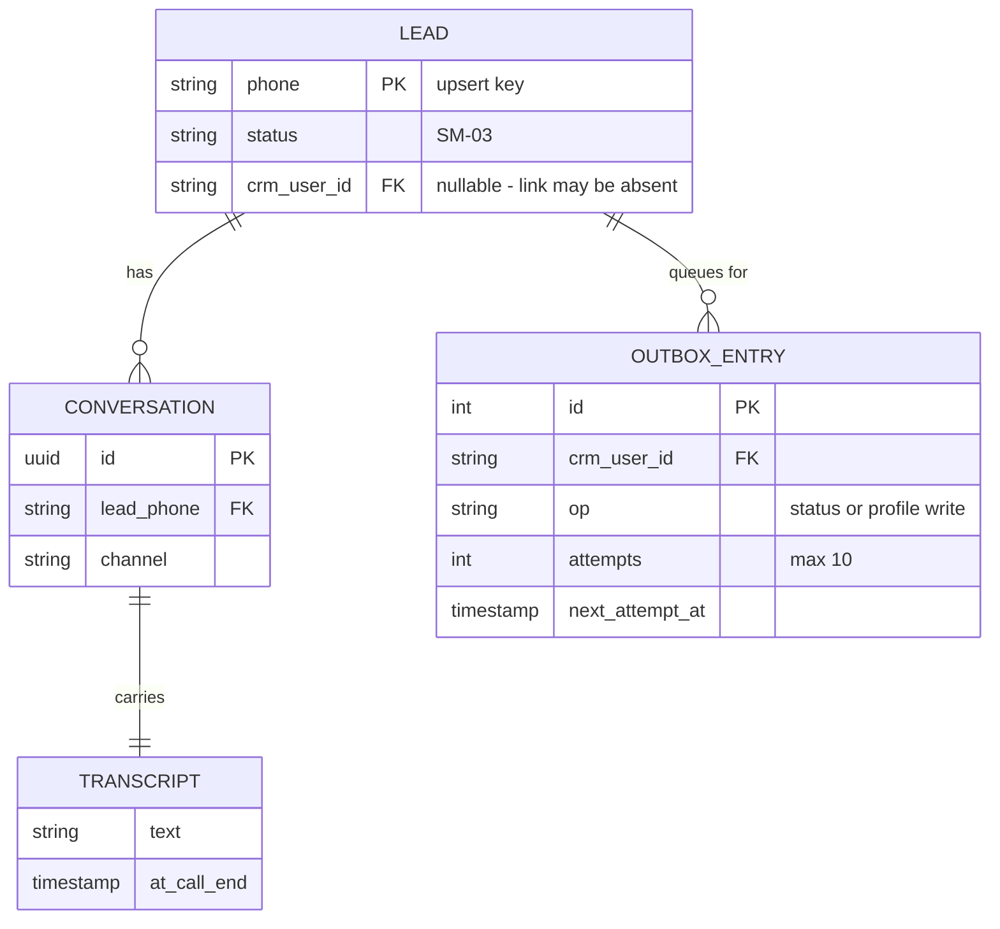

> **Lens:** BA (Part A) / TPO + Architect (Part B) · **Inputs:** `01-brd.md`, `02-use-cases-workflows.md`, `03-data-state-analysis.md`, `05-modularization.md`, `06-architecture.md`, `07-brownfield-reconciliation.md` · **Engagement:** Brownfield · **Defines:** TRD-17 … TRD-19

# Lead & CRM — MOD-05 [Lens: BA (Part A) / TPO + Architect (Part B)]

## Part A — Module BRD [Lens: BA]

### A.1 Module Objectives

Turn a conversation into a warm lead a counselor can act on. When a caller finishes a call, this module extracts who they are and what they asked about, records it against their phone number, and pushes it to Salesforce. When a caller asks for a human mid-call, it records that intent against the same lead rather than creating a second one.

Its defining property is *where* it runs, not what it does. This module is the only part of the system that talks to an external system that fails on its own schedule — Salesforce — and it runs strictly **after** the caller has hung up. That placement is deliberate and is the reason the caller never waits on the CRM: `06-architecture.md` §3 records it as the one genuinely asynchronous concern pushed off the hot path. The business value is therefore stated twice: leads are captured reliably, **and** capturing them cannot slow a call or fail one.

### A.2 Scoped Requirements

**Satisfies** (per `05-modularization.md`):

- `BRD-13` — Graceful degradation: failure of any single dependency, including the database and the CRM, produces a polite spoken fallback and does not fail the caller's call.
- `BRD-18` — Behaviour surface preserved: all 28 intents remain functional, judged on end-to-end task success.

**Contributes to** (named because this module carries the behaviour, not because the requirement is owned here):

- `BRD-09` — No quality regression on critical intents. Lead capture is one of the five named critical intents, so a change here is judged by the quality gate like any other (`01-brd.md` §5 business rules).
- `BRD-15` — Reversible change: every adopted change is revertible by configuration, and this module's gate is literally `CRM_ENABLED`.
- `BRD-05` / `BRD-07` — Concurrency requirements this module *protects* rather than satisfies: because it never runs during a turn, it cannot contribute to the degradation the other modules must avoid.

### A.3 Module Business Rules

| Rule | Condition → Action | Traces to |
|---|---|---|
| One lead per number | A call ends for a number that already has a lead → update, never insert a second record (upsert by phone) | `SM-03` repeatable transition; `DAT-06` |
| Never lose a business fact silently | A status write fails transiently → queue it and replay; a status write fails permanently → log it as terminal, never retry it forever | `BRD-13`, `UC-05` |
| Never send a null to the CRM | A field is absent from the change set → omit the key; sending an explicit null clears the field in Salesforce | `DAT-06` write contract |
| Refuse rather than guess | A value is outside the org's picklist vocabulary → refuse the write; do not invent a mapping | `BRD-18` |
| The caller hears the truth | Handoff cannot be arranged → the caller is told honestly, not left with a promise the system cannot keep | `UC-04` failure postcondition, `BRD-13` |
| Opt-out is respected | Caller declines to leave details → accepted gracefully, no pressure, no fabricated lead fields | `BRD-18`, `UC-04` A1 |
| No confidential values in artifacts | Credentials and tokens live in configuration only; no artifact records a secret value | Program rule |

### A.4 Actors

| Actor | Why it touches this module |
|---|---|
| **Caller** | Source of every field; can ask for a human mid-call (`UC-04`) and can decline to give details |
| **Admissions counselor** | The handoff recipient — receives a lead with context; acts outside this system, which is why `HANDED_OFF` is externally driven (`SM-03`) |
| **Developer** | Owner of the post-call handler, the extraction prompt and the CRM write contract (`UC-05`) |
| **Salesforce CRM API** (`:8098`) | System actor and the module's only independently-failing dependency |
| **Postgres** | System actor holding leads and transcripts (`DAT-05`, `DAT-06`) |
| **MOD-01 Voice Turn Path** | Hands off the transcript and any mid-call handoff request at call end |

### A.5 Module Acceptance Criteria

1. **Zero turn-path cost.** Adding, breaking or removing the CRM changes no turn's latency measurably; the module's work begins after the media stream closes (`BRD-13`).
2. **The CRM can be down and calls still work.** With the CRM unreachable, calls complete normally, the caller experiences no error, and the queued writes replay when it returns — demonstrated with the CRM stopped mid-run.
3. **No duplicate leads.** Two calls from the same number produce updates to one lead, never two records (`SM-03`, `UC-05` duplicate-request scenario).
4. **One lead, one handoff.** A caller requesting a human twice in one call produces one lead with one handoff intent; the lead is not duplicated (`UC-04`).
5. **A failed handoff is visible.** A lead created but not marked for handoff is detectable — the `UC-04` partial-completion gap is closed by a recorded, queryable state rather than silence.
6. **No loss on database failure.** With Postgres unavailable at call end, the call data is not silently dropped; the failure is recorded and observable (`UC-05` E2).
7. **It is off by one switch.** `CRM_ENABLED=false` makes every entry point a no-op, and this is the documented rollback (`BRD-15`).

## Part B — Module TRD [Lens: TPO + Architect]

### TRD-17 — Post-call extraction is off the turn path and bounded

Lead extraction and persistence shall run only after the media stream closes, shall never block or delay a turn, and shall fail into a durable, observable record rather than losing the call's data.

- **Serves:** `BRD-13`, `BRD-18`; contributes to `BRD-09` (lead capture is a critical intent).
- **Implements:** `SM-03` UNSEEN → PARTIAL / IDENTIFIED, and the `UC-05` main flow.
- **Evidence:** `app/database.py:224` `handle_post_call(transcript, phone_number)` — called when the WebSocket session disconnects; `app/leads/models.py` returns `None` / `False` / `[]` on database errors so callers do not crash.
- **Numbers:** 0 ms added to any turn's first-audio path by construction — the work is triggered by session teardown, not by a turn. Extraction is bounded by one LLM call on the post-call path, which has no interactive budget (`UC-05` timeout scenario: "extraction is post-call; no interactive budget").
- **Gap this closes:** `UC-05` E2 and the `03-data-state-analysis.md` B.3 matrix row "UC-05 — DB unavailable at call end → transcript lost; SM-03 never created → No / None (gap)". The requirement is that this failure becomes recorded and observable, not that it becomes impossible.
- **Empty-transcript path:** an empty or whitespace-only transcript saves nothing and logs the decision (`app/database.py:239–241`) — the `UC-05` A1 alternate flow, already implemented and preserved.

### TRD-18 — CRM write contract: idempotency, an explicit allowlist, and terminal-vs-transient retry

Every CRM write shall be idempotent, restricted to explicitly named fields, and classified as retryable or terminal before any retry occurs; transient failures shall queue for replay and permanent failures shall never be retried.

- **Serves:** `BRD-13`, `BRD-15`, `BRD-18`.
- **Implements:** `SM-03` IDENTIFIED → HANDOFF_PENDING (the promotion of a conversation's outcome onto the student record), and the `DAT-06` consistency requirement ("strong on identity").
- **Verified contract, live 2026-09-12** (`app/crm/status.py`, re-checked by `scripts/verify_gate7_status.py`):

| Fact | Consequence encoded in the requirement |
|---|---|
| One route writes the record: `PATCH /admissions/{id}`, keyed by the stored record Id | The write path is single-route and record-keyed; `PATCH /users/{id}/status` writes three fields and no more |
| The route dumps the body with `exclude_unset=True`, so an explicit `null` **is** sent and **clears the field** | A PATCH contains only the keys meant to change. A round-tripped object would wipe the record — reproduced in a dry run where `{"Conversation_ID__c": null}` erased a present value |
| Nothing is validated upstream against the org's picklists | An out-of-vocabulary value becomes a 500 at write time. An allowlist of writable fields is the only guard; the module refuses rather than guesses |

- **Numbers (defaults in `app/config.py`, verified):** connect timeout 2 s; read timeout 5 s; upload read timeout 30 s (`/complete` base64-encodes a file and re-fetches an OAuth token first, which does not fit in 5 s); the module's own bounded retry is 3 attempts (`app/crm/client.py:232`); the circuit breaker opens after 5 consecutive failures and holds for 60 s (`CRM_BREAKER_THRESHOLD` / `CRM_BREAKER_RESET_S`); the outbox replays at 30 s → 2 min → 10 min → 30 min → 1 h → 2 h thereafter and abandons an entry after 10 attempts.
- **Transient vs terminal:** retryable = connect failure, timeout, 429, unclassified 5xx. Never retryable = validation error, 4xx payload errors, and the restricted-picklist violation that surfaces as a 500 — a naive outbox would retry that forever (`app/crm/client.py:41–61, 199`, `app/crm/outbox.py` header).
- **Half-open probe:** the CRM breaker is a proper `closed` / `open` / `half_open` state machine that allows exactly one probe after the hold, and closes on one success (`app/crm/client.py:95–152`). This is the pattern `BRD-14` requires of the retrieval breaker, which today has no probe at all (`app/rag_mcp.py:272–290`) — see `B.8`.
- **What is deliberately not queued:** lookups and creates. A failed lookup degrades to "this conversation has no CRM link" and is logged; replaying a *create* against an API with no uniqueness constraint is how duplicate student records are made (`app/crm/outbox.py` header). This is a recorded, deliberate gap in exchange for identity integrity.

### TRD-19 — Handoff is durable, idempotent and observable

A handoff requested mid-call shall be persisted against the caller's lead and shall survive a process failure between the request and the push; a handoff that cannot be pushed shall remain visible as pending rather than silently disappearing.

- **Serves:** `BRD-13`, `BRD-18`; contributes to `BRD-09` (escalation is a critical intent).
- **Implements:** `SM-03` IDENTIFIED → HANDOFF_PENDING → HANDED_OFF, where the final transition is external (a counselor's action outside this system).
- **Evidence:** `SM-03` Q7 — "crash between lead creation and handoff marking → lead exists, handoff lost — recorded as a gap (also `UC-04` partial completion)"; `03-data-state-analysis.md` B.3 matrix row "UC-04 — handoff after lead created → SM-03 at IDENTIFIED, handoff lost → Yes, next call / None (gap)".
- **Requirement:** the handoff intent is written durably at the moment it is requested — not at call end — so a crash mid-call leaves a lead that is recoverable on the next call from the same number (`SM-03` Q8: "next call from the same number resumes at IDENTIFIED").
- **Idempotency:** repeated handoff requests in one call produce one lead with one pending handoff (`UC-04` duplicate-request scenario). The upsert key is the carrier number (`DAT-06` "upsert by phone").
- **Numbers:** the handoff write is a status-class write and therefore rides the `TRD-18` outbox when the CRM is unreachable — bounded at 10 attempts with the recorded backoff ladder, then abandoned as terminal and logged.
- **Known legacy constraint:** a record with no email is unreachable through the user API's identity path, which is why recovery falls back to the admissions listing by phone (`app/crm/sync.py:57–60`, `_recover_user_id_by_phone`). This constrains which leads can be linked, and it is a documented recovery path rather than an assumption.
- **Observability requirement:** `HANDOFF_PENDING` leads that never reach `HANDED_OFF` are countable. `SM-03` Q10 records that "a HANDOFF_PENDING lead never ages out" as a gap; this requirement makes that population visible even if the ageing policy stays out of scope.

### B.1 Technical Constraints

| Constraint | Value | Source |
|---|---|---|
| Language / runtime | Python 3.11, `async` throughout, Windows 11 | `requirements.txt` |
| HTTP client | `httpx==0.28.1` async client, single shared instance with explicit timeouts | `app/crm/client.py:245` |
| Database | Postgres, raw SQL via `psycopg2` (matching `app/database.py`) | `app/leads/models.py` header |
| CRM endpoint | Salesforce admission API at `http://127.0.0.1:8098`, started by `start_services.ps1:603` | `.env:206`, `start_services.ps1:56` |
| Enablement gate | `CRM_ENABLED` — defaults to `false` in code, set per deployment; `sync.enabled()` returns `False` and every entry point is a no-op | `app/config.py:108–110`, `app/crm/sync.py:50–52` |
| Secret handling | `CRM_API_KEY` and OAuth material are configuration values; no artifact records them | `.env`, program rule |
| Divergence from stack | None proposed. This module is deliberately the least-changed in the program | `05-modularization.md` ("least churn; lowest priority in this program") |

### B.2 Non-Functional Requirements

| NFR | Target |
|---|---|
| Performance | 0 ms added to the turn path by construction — all work is triggered by session teardown. Post-call extraction is one LLM call with no interactive budget (`UC-05` timeout scenario) |
| Security | Salesforce credentials in `.env` only; no lead PII in logs beyond what the existing handler already records; the transcript is caller-spoken data and is treated as such; no hosted inference on any path involving PII (`AS-03`) |
| Scalability | Scale unit: call completion. Bound to 2 concurrent calls by `MOD-01`, so post-call events arrive at ~0.13/s peak (`03-data-state-analysis.md` A.2). No queue-depth limit is reached at 10× — `06-architecture.md` §5 records "none at this scale" |
| Scale unit & limits | Unit: one lead per carrier number. Postgres write contention is the named 10× bottleneck and is not reached. Outbox bounded at 10 attempts per entry with a 30 s → 2 h backoff ladder |
| Degradation | Implemented exactly as `06-architecture.md` §5 MOD-05: retry with backoff; the lead is persisted on the next interaction. Recovery: next call. The CRM being down degrades *linkage*, never the call |
| Observability | Terminal failures logged with the attempt count and the classified reason (`app/crm/outbox.py:195–198`); the queue is drainable and its state is inspectable; a failed handoff remains a queryable `HANDOFF_PENDING` (`TRD-19`) |
| Availability | No independent SLO. The module's availability requirement is inverted: it must be *allowed* to fail without affecting the application's availability (`BRD-13`) |
| Data retention | Transcript retention policy is **not stated in the repo** (`01-brd.md` §12 open item). This module writes transcripts to Postgres, so it is the module a retention rule would land on — recorded as an open item, not invented |

### B.3 APIs / Interfaces

| Name | Direction | Style | Contract | AuthN/Z |
|---|---|---|---|---|
| `handle_post_call(transcript, phone_number) -> bool` | consumed by the app on session teardown | in-process async call | Extracts, upserts by phone, returns whether the lead was saved; never raises into the caller | In-process |
| `PATCH /admissions/{id}` | consumed from Salesforce | REST, record-Id keyed | Allowlisted fields only; omitted keys are never sent as null; `exclude_unset` body semantics | API key + OAuth (config) |
| `POST /complete` (offer document upload) | consumed from Salesforce | REST, multipart | Separate switch from `CRM_ENABLED`; 30 s read timeout override | Same |
| CRM outbox table | published / consumed internally | durable queue in Postgres | Idempotent status/profile writes; 10-attempt bound; terminal failures never queued | In-process |
| Postgres `leads`, `conversations` | consumed | pooled SQL | Upsert by phone; `None`/`False` returned on DB error rather than an exception | Connection credentials from config |

Consumers of the outbox are the background worker (`app/crm/worker.py`), which drains queued writes and expires lapsed offers on one loop started from the FastAPI lifespan.

### B.4 Data Model

Entities map to the `03-data-state-analysis.md` inventory: leads are `DAT-06` ("Postgres + Salesforce CRM"; consistency "strong on identity"), transcripts are `DAT-05` ("Postgres (post-call)", consistency "eventual").

| Entity | Key fields | Relation | Inventory |
|---|---|---|---|
| Lead | carrier number (upsert key), status, CRM record Id | One per number; many conversations | `DAT-06` |
| Conversation | id, lead reference, channel | Belongs to one lead | `DAT-05` lineage |
| Transcript | text, written at call end | One per conversation | `DAT-05` |
| Outbox entry | id, target record, operation, attempts, next attempt | Belongs to one lead's CRM linkage | `DAT-06` sync path |

The `status` field carries the `SM-03` lifecycle: UNSEEN → PARTIAL → IDENTIFIED → HANDOFF_PENDING → HANDED_OFF. Illegal transitions (`UNSEEN → HANDED_OFF`, `PARTIAL → HANDED_OFF` without IDENTIFIED) are enforced by the module, not by a database constraint.

### B.5 Tech Stack Choices

| Choice | Rationale | Why not the runner-up |
|---|---|---|
| Keep `httpx` async client with explicit timeouts and a bounded retry loop | Timeouts sized per call type against the API's real behaviour; a shared client avoids per-request connection churn | A retry library (tenacity et al.) would have to be taught the same permanent-vs-transient classification anyway, and the classification is the hard part, not the loop |
| Keep the hand-written circuit breaker class | It is a correct half-open implementation with a single probe and one-success-close semantics | Replacing it with a generic breaker library adds a dependency to a module whose entire value is being boring |
| Keep `psycopg2` raw SQL | Matches the existing pattern in `app/database.py`; the queries are simple upserts | An ORM adds a mapping layer to a module with four tables and no domain logic |
| Keep Postgres as the outbox store | The queue is durable, transactional with the lead write, and already deployed; no new infrastructure | Redis is present but is not the system of record for leads; splitting the queue from the record reintroduces the dual-write problem |
| Keep the CRM behind `CRM_ENABLED` | The gate is the rollback (`BRD-15`) and it is already implemented as a no-op switch | Removing the gate would make rollback a code change rather than a setting |

### B.6 Edge Cases & Error Handling

| Failure class | Strategy |
|---|---|
| Validation error (4xx, payload rejected) | Terminal. Never retried, never queued — a malformed payload retried is a malformed payload retried forever (`app/crm/client.py:199`) |
| Transient failure (timeout, connect failure, 429, unclassified 5xx) | Bounded retry (3 attempts) with exponential backoff and full jitter, then queue for replay on the outbox ladder (30 s → 2 h, 10 attempts max) |
| Restricted-picklist violation reported as a 500 | Classified terminal by the permanent-error markers despite the 5xx status — the specific trap a naive outbox falls into (`app/crm/outbox.py` header) |
| Duplicate creation risk | Creates and lookups are deliberately **not** queued. A failed lookup degrades to "no CRM link", which is logged and survivable; a replayed create is how duplicate student records are manufactured |
| Record with no email | Identity recovery falls back to the admissions listing by phone rather than assuming the user-API record is reachable (`app/crm/sync.py:57–60`) |
| Database unavailable at call end | `UC-05` E2 gap: transcript lost. `TRD-17` requires this to become a recorded, observable failure rather than a silent one |
| Empty transcript | Nothing is saved; the decision is logged (`app/database.py:239–241`) — `UC-05` A1 |
| Partial extraction | A lead with fewer fields is persisted as PARTIAL, not discarded; a later call completes the fields (`SM-03` repeatable transition) |
| Caller declines to leave details | No lead fields are fabricated; the opt-out is honoured (`UC-04` A1, `BRD-18`) |
| Crash between lead creation and handoff | `TRD-19`: the handoff intent is durable at request time, so the next call from that number resumes at IDENTIFIED (`SM-03` Q8) |
| No lifecycle timeout on HANDOFF_PENDING | Recorded gap (`SM-03` Q10). `TRD-19` makes the population visible; ageing policy is out of scope for this program |

### B.7 Tech Debt Accepted

- **Accepted: lookups and creates are not queued.** Trade: a missed CRM link is preferable to a duplicate student record. The TPO's reason is that the API has no uniqueness constraint and a non-deterministic lookup, so replay cannot be made safe by retrying.
- **Accepted: the outbox has a hard 10-attempt bound.** After it, the write is abandoned as terminal and logged. Rationale: the backoff ladder already spans ~4 hours; beyond that, a human is the correct recovery path, not an unbounded queue.
- **Accepted: no retention or consent policy for call transcripts exists.** Recorded in `01-brd.md` §12 as an open item and repeated here because this module is where transcripts land. Not invented, not silently ignored.
- **Accepted: `HANDOFF_PENDING` leads never age out.** `SM-03` Q10. Making them visible (`TRD-19`) is in scope; expiring them is not.
- **Accepted: a failed lookup leaves a conversation without a CRM link.** Logged, survivable, and deliberately not recoverable by replay.

### B.8 Reconciliation [Brownfield]

| Existing asset | Location | Class | Action in this module |
|---|---|---|---|
| Post-call handler | `app/database.py:224–258` | **Reusable** | Kept as-is; `TRD-17` adds the failure-visibility requirement around it |
| Lead CRUD | `app/leads/models.py`, `app/leads/schema.py` | **Reusable** | Kept; raw-SQL upsert by phone is the `SM-03` idempotency mechanism |
| CRM client (timeouts, retry, breaker, classification) | `app/crm/client.py` | **Reusable** | Kept unchanged; it already implements exactly what `TRD-18` requires |
| CRM status push with field allowlist and no-null discipline | `app/crm/status.py` | **Reusable** | Kept; the allowlist is the only guard against the org's unvalidated picklists |
| CRM outbox (durable retry queue) | `app/crm/outbox.py` | **Reusable** | Kept; the queue is the `BRD-13` degradation mechanism |
| CRM worker (drains the outbox, expires lapsed offers) | `app/crm/worker.py` | **Reusable** | Kept; started from the FastAPI lifespan like the other background workers |
| CRM identity recovery by phone (R18) | `app/crm/sync.py:57–60` | **Reusable** | Kept; it is the documented constraint on which leads can be linked |
| Lead/CRM pipeline as a whole | `app/leads/`, `app/crm/`, `app/database.py` | **Reusable** | `05-modularization.md` classifies this module as "least churn"; `07-brownfield-reconciliation.md` §1 records it as "correctly post-call; deliberately untouched". This module's TRDs are therefore mostly acceptance criteria over behaviour that already exists |
| Handoff durability | — | **Net-new** | No durable handoff-at-request-time exists today; `SM-03` Q7 and `UC-04` partial completion are open gaps (`TRD-19`) |

**Cross-module reuse worth recording:** `app/crm/client.py:95–152` already implements the half-open circuit breaker that `BRD-14` demands — one probe, one success closes. The retrieval path's breaker (`app/rag_mcp.py:272–290`) is a module-level dict with a 30 s cooldown and **no probe at all**, which is the `BRD-14` gap `MOD-02` owns. The requirement is not invented in `MOD-02`'s TRD; the correct implementation already exists in this module and is cited there as the pattern to reuse.

**Applicable REC notes:** `REC-10` (no explicit state machines in code — `SM-03` is an analytical instrument, and `TRD-17`/`TRD-19` do not mandate an enum). No REC note in `07-brownfield-reconciliation.md` flags a conflict in this module: it is the one area where the plan and the codebase agree, which is why `REC-01`–`REC-09` name it in their "affected artifacts" only as something to keep out of the change surface (`06-architecture.md` §3: push the asynchronous concern off the hot path).

## TPO Buildability Sign-off [Lens: TPO]

**TPO sign-off: this TRD is buildable against the BRD above.** Most of it is already built and verified against the live API on 2026-09-12; the genuinely new work is narrow — the durable handoff write and the failure-visibility requirement — and neither touches the caller's path.

Feasibility risks:

1. **The `TRD-19` durability change touches the call path, unlike everything else here.** Writing the handoff intent at request time means a write during a live conversation for the first time in this module, which is exactly the property that makes this module safe. *Mitigation:* the write is a local durable record, not a CRM call; it carries no external timeout and cannot block on Salesforce. The zero-turn-path-cost acceptance criterion (`A.5` #1) is measured after the change, not assumed, and `TRD-17`'s ordering constraint still holds.
2. **`UC-05` E2 (database unavailable at call end) may be unfixable without new infrastructure.** If Postgres is down there is nowhere to record the failure. *Mitigation:* the requirement is deliberately "recorded and observable", not "no data loss" — a local append-only failure log satisfies it and the honest limit is stated in the acceptance criteria rather than papered over.
3. **Duplicate-lead risk if the handoff write is retried.** The one thing the existing module refuses to queue is a create. *Mitigation:* `TRD-19` requires the handoff write to ride the same status-class path as `TRD-18` (idempotent, upsert-keyed by phone), never the create path — so the recorded decision is preserved, not reversed.
4. **Lowest priority in the program, and honestly so.** `05-modularization.md` puts this module last. If the program runs out of budget, this is the module that stops — and the gaps it carries (`UC-04` partial completion, `UC-05` E2, `SM-03` Q10) stay open and recorded rather than being quietly closed.
