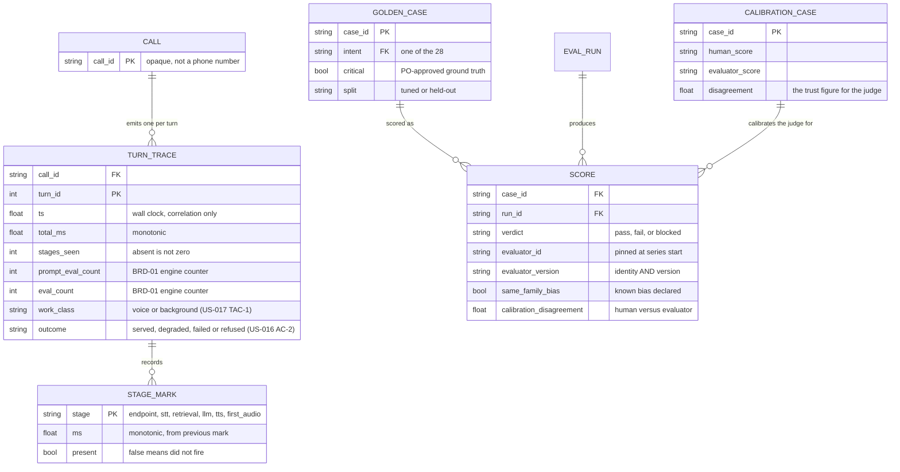

> **Lens:** BA (Part A) / TPO + Architect (Part B) · **Inputs:** `01-brd.md`, `02-use-cases-workflows.md`, `03-data-state-analysis.md`, `05-modularization.md`, `06-architecture.md`, `07-brownfield-reconciliation.md` · **Engagement:** Brownfield · **Defines:** TRD-20 … TRD-23

# Observability & Evaluation — MOD-06 [Lens: BA (Part A) / TPO + Architect (Part B)]

## Part A — Module BRD [Lens: BA]

### A.1 Module Objectives

Make the system measurable, so that every later decision in this program rests on a number produced by this machine rather than on an argument. Today the pipeline has never been instrumented end to end: latency is inferred from component measurements, and there is no frozen set of questions against which a change's effect on answer quality can be judged. Both gaps are this module's reason to exist.

It carries three deliverables that belong together because they share one property — they observe without participating:

1. **Per-stage turn traces** — one machine-readable record per voice turn, carrying the elapsed time at each stage boundary plus the inference engine's own counters.
2. **A reproducible load harness** — scripted caller audio replayed at carrier framing, at one and two concurrent callers, and under injected network conditions (jitter, delay, loss, disconnect/reconnect, late or out-of-order frames) to the extent the local socket can reproduce them, so concurrency and degradation can be tested without two humans on two phones.
3. **A frozen golden set and its scorer** — the task-representative question set that makes "no quality regression" a checkable claim instead of an opinion.

This module is the program's Phase A deliverable and gates every later decision (`05-modularization.md`; `WF-03`). Its defining constraint is a negative one: **it must not be able to break a call.** Tracing that can fail a call is worse than no tracing, so the module is deliberately dependency-free and its writes are deliberately non-blocking and non-throwing.

### A.2 Scoped Requirements

**Satisfies** (per `05-modularization.md`):

- `BRD-01` — Per-stage turn latency is measured, not inferred: every voice turn emits a machine-readable record with the elapsed time for endpointing, transcription, retrieval, generation, synthesis and first-audio-to-carrier, plus the engine's prompt and generation counters.
- `BRD-06` — Caller isolation: concurrent turns' records must not interleave or merge, and the isolation claim must be demonstrated under load.
- `BRD-08` — Frozen quality baseline: a task-representative evaluation set is frozen and scored before any change that alters what the model sees or says.
- `BRD-09` — No quality regression on critical intents.

**Contributes to** (the measurement instrument for, not the owner of):

- `BRD-02` / `BRD-03` — The latency target and the cold-start requirement are only checkable through this module's traces and harness.
- `BRD-05`, `BRD-07`, `BRD-11`, `BRD-12` — The concurrency and resource requirements are verified at N=2 by the harness.
- `BRD-14` — The bounded-timeout requirement is verified by killing a dependency mid-run and watching the other caller.
- `BRD-15` — "Every adopted change has a one-command rollback, demonstrated" is recorded per change in the experiment log this module's evaluation runner writes.

### A.3 Module Business Rules

| Rule | Condition → Action | Traces to |
|---|---|---|
| Tracing never fails a call | Any exception inside a trace call → swallowed; the turn proceeds unaffected | `BRD-01` |
| No dependency on the instrumented system | A trace module that imports application code → rejected; it is a hard design constraint, not a preference | `BRD-01`, `05-modularization.md` |
| Absent is not zero | A stage mark that never fired → recorded as absent; a fabricated `0` ms is a lie the analysis would believe | `BRD-01`, `UC-07` E1 |
| Sample size is stated | Any latency figure quoted without its turn count and condition → not reportable | `BRD-02` §11 success criteria |
| Cold and warm are reported separately | A blended p95 hides the cold-start requirement; they are never averaged together | `BRD-03` |
| Measurement beats consensus | A number about this machine comes from this machine; model agreement is not evidence | `01-brd.md` §5 |
| Quality runs in its own window | Evaluation never runs concurrently with latency measurement | `UC-08` concurrent-operation scenario |
| Blocked is not a pass | An evaluation that cannot run (missing ground truth, unavailable evaluator) reports **blocked**, never a score of zero or a pass; a substitute evaluator chosen for convenience is a new series, not a rescue | `UC-08` failure postcondition, `DG-03` |
| The evaluator is fixed for the series | A score produced by anything other than the evaluator pinned at the start of the series → not comparable; the change is recorded as a **new series**, never reported as a delta across evaluators | `BRD-09`, `UC-08` |
| No candidate scores itself | The model under test producing its own score → rejected. The evaluator's identity **and version** are pinned before the first score and recorded with every score produced | `BRD-09`, `AS-03` |
| A same-family evaluator is declared bias | Evaluator drawn from the same model family as a candidate (unavoidable on one local box) → recorded as a **known bias on every score it produces**, and the comparisons it decides are flagged as needing human calibration | `AS-03`, `UC-08` |
| A judge-derived score carries its trust figure | Any score the evaluator produces is reported with the human-versus-evaluator disagreement rate measured on the calibration set | `BRD-09`, `UC-08` |
| Held-out data is spent once | The held-out 20% is never used for tuning | `UC-08` A1 |
| Cost scales with the box, not with fashion | An observability stack larger than the system it observes → rejected at this scale | `06-architecture.md` §4 (Build vs Buy) |

### A.4 Actors

| Actor | Why it touches this module |
|---|---|
| **Developer** | Primary consumer: reads traces to locate latency, runs the harness, runs the quality gate (`UC-07`, `UC-08`) |
| **Operator** | Consumes degradation signals to know a call is degrading before the caller complains (`UC-06`) |
| **Product Owner** | Approves the critical-intent ground truth without which the golden set cannot be frozen (`AS-05`, `DG-03`) |
| **MOD-01 / MOD-02 / MOD-03 / MOD-04** | Emit stage marks and engine counters into this module; none of them may depend on it succeeding |

The system actors (Twilio, Ollama, ERC) appear as *sources* of timing boundaries — the carrier hop, the engine counters, the retrieval call — not as initiators.

### A.5 Module Acceptance Criteria

1. **A real call produces a complete trace.** One live call yields a record with at least six stages plus engine counters, and the stage durations decompose the total to within 5 ms (`BRD-01` §11 criterion 1).
2. **Absent stages are visibly absent.** A turn that short-circuits (noise gate, closing phrase) emits fewer stages with a count that says so; no stage reads `0` because it did not run (`UC-07` A1, E1).
3. **Two concurrent turns produce two clean records.** At N=2, records neither merge nor interleave, demonstrated over a 30-minute soak — **240 rows** (2 callers × 1800 s ÷ 15 s per turn; `DAT-07` scale profile, `UC-07` E2).
4. **A tracing failure is invisible to the caller.** With the trace sink made unwritable, calls complete normally and no turn fails (`BRD-01`).
5. **The harness reproduces N=1 and N=2 without humans.** Scripted multi-turn audio replays at 8 kHz µ-law carrier framing, and two callers can be driven simultaneously (`BRD-05`).
6. **The baseline is stated with sample size.** p50 and p95 over ≥100 turns per condition, cold and warm reported separately, with the sample size printed alongside every figure (`BRD-02`, `BRD-03`).
7. **A missing golden set blocks, loudly.** With ground truth absent for a critical intent, the evaluation reports blocked and escalates; it does not silently pass or score zero (`BRD-08`, `DG-03`).
8. **The quality gate is a rule, not a reading.** A change is adopted or rejected by the `BRD-09` rule — zero regression on critical intents and ≤2 pt aggregate movement — and the verdict is recorded with the numbers behind it.
9. **A score names its evaluator, and a judge-derived score carries its trust figure.** Every recorded score carries the evaluator's identity and version, pinned at the series start; where the score comes from the evaluator, the human-versus-evaluator disagreement rate from the calibration set is reported with it, and a same-family evaluator's known bias is declared. A score missing either is not reportable (`BRD-09`, `UC-08`).

## Part B — Module TRD [Lens: TPO + Architect]

### TRD-20 — Dependency-free trace emitter that cannot fail a call

The trace emitter shall be importable and usable without importing any application module, shall never raise into the turn path, and shall be silently inert when disabled.

- **Serves:** `BRD-01`; contributes to `BRD-06` (per-caller isolation of records).
- **Implements:** `DG-04` ("derive — instrumentation is the Phase A deliverable"); produces `DAT-07`.
- **Hard constraint (from `BRD-01` via `05-modularization.md`):** **no `app.*` imports.** `MOD-06` is the only module depended on by every runtime module and depending on none. This is not a style preference: a trace module that imports application code can fail to import when the application is mid-refactor, and the failure would land on a live call.
- **Existing asset — reconcile, do not rebuild.** An untracked `app/perf_trace.py` (113 lines, present in the working tree, not committed) already implements this shape: it imports only `json`, `os`, `time` and `pathlib`; `TurnTrace` exposes `mark`, `note` and `emit`, and every one of them wraps its body in `try/except Exception: pass`; the module is gated by `PERF_TRACE` (default on) and writes to `PERF_TRACE_FILE` (default `logs/perf_turns.jsonl`). `TRD-20` is therefore the **contract** this file must satisfy, not a greenfield design — see `B.8` and the conflict noted there.
- **Numbers:** a disabled emitter performs no I/O; an enabled one appends a single JSON object per turn — **240 rows** per 30-minute soak at N=2 (`DAT-07`), a few hundred bytes each. Overhead per mark is a dict write; the only I/O is one append on `emit`.
- **Degradation:** if the append fails (missing directory, full disk, locked file), the exception is swallowed and the turn continues; the trace is lost, never the call. The designed recovery is simply the next successful append (`06-architecture.md` §5 MOD-06).

### TRD-21 — Stage completeness and the honesty contract

Each trace record shall identify its caller and turn unambiguously, carry every stage mark that fired with the duration between consecutive marks, expose the inference engine's counters, and distinguish an absent stage from a zero-duration one.

- **Serves:** `BRD-01`; contributes to `BRD-06` and `BRD-03` (cold versus warm is only separable if the record can be partitioned).
- **Implements:** `SM-02` — the marks map onto the turn lifecycle's own transitions (`vad_end` ← ACCUMULATING → ENDPOINTED; `stt_done` ← → TRANSCRIBED; `llm_sent`/`llm_done` ← → GENERATING; `tts_done` ← → SYNTHESISING; `first_audio_sent` ← → EMITTED), and `DAT-07`.
- **Required record fields:** `call_id`, `turn_id`, wall-clock timestamp for correlation, a monotonic-clock duration for every stage, the total, the count of stages seen, and the engine counters from the inference response (`prompt_eval_count`, `eval_count` and their token rates — the counters `BRD-01` names explicitly).
- **Two gaps that must be closed, verified against the existing emitter:**

| Gap | Evidence | Requirement |
|---|---|---|
| **No retrieval mark.** The existing `STAGES` tuple is `vad_end, stt_done, llm_sent, llm_done, tts_done, first_audio_sent` — there is no mark between `stt_done` and `llm_sent`, so retrieval time is unattributable | `app/perf_trace.py` `STAGES` | A retrieval mark (start and end) must exist, because the program's first success criterion names `retrieval_ms ≥ 0` and because `MOD-02` is the named concurrency bottleneck — an unmeasurable retrieval stage makes the central claim of the program unfalsifiable |
| **Non-streaming has no TTFT.** `llm_sent` → `llm_done` measures the whole blocking call, so today the record cannot distinguish prefill from decode | `app/llm_backend.py:145` (`ollama.chat` without `stream=True`) | The record shall carry the engine's split (`prompt_eval_duration`, `eval_duration`) so prefill and decode stay separable; when streaming lands (`MOD-03`), a first-token mark is added rather than replacing the total |
| **`0` versus missing.** The existing emitter omits a mark that never fired, which is correct — but its `total_ms` is computed from the last mark present | `app/perf_trace.py` `emit()` | The count of stages seen must be explicit and every consumer must treat a missing key as "did not happen". A stage that fired in under a millisecond is recorded as its real duration, never dropped |

- **Numbers:** ≥6 stage marks plus counters on a full turn (`BRD-01`); the sum of consecutive stage durations shall reconcile to the total within 5 ms (`BRD-01` §11 criterion 1); turn identity is `(call_id, turn_id)` and is unique per turn — re-emission on a retry carries the same identity (`UC-07` retry scenario).
- **Isolation:** records for concurrent turns are distinguished by `call_id`; the emitter holds no shared mutable buffer between turns, so two turns cannot merge. This is the `TRD-22` N=2 assertion, not an assumption from code reading (`BRD-06`, `UC-07` E2).

### TRD-22 — Reproducible N=1 and N=2 load harness at carrier framing

The harness shall drive the live endpoint with scripted multi-turn caller audio, at one and two concurrent callers, reproducing carrier framing closely enough that the resulting latency figures are the figures a real caller would see.

- **Serves:** `BRD-05`, `BRD-07`, `BRD-11`, `BRD-12`; contributes to `BRD-13` (dependency-kill runs) and `BRD-14`.
- **Implements:** `DG-02` ("instrument call admissions during Phase A baseline" — the harness is how the assumed peak of 2 gets validated or corrected), and produces the N=2 half of `DAT-07`.
- **Requirement:** the harness speaks **8 kHz µ-law at the carrier's 20 ms framing**, because that is what the live path receives (`app/voice_handler.py:284`, `app/main.py` frame loop) and because a harness that sends a friendlier stream measures a friendlier system. It drives the real WebSocket endpoint, not an internal function call, so the measurement includes everything the caller's audio passes through.
- **Why not a general load tester:** the Build vs Buy decision records it — "the harness must speak µ-law at carrier framing, which general load testers do not do natively" (`06-architecture.md` §4).
- **Fixture requirements:** scripted multi-turn conversations covering the critical intents; the same fixture set is used for every condition so runs are comparable; the fixture file is versioned so a number can always be traced to the input that produced it.
- **Numbers:** ≥100 turns per condition (`BRD-02` §11 criterion 2) — a network-condition profile **is** a condition, so a clean-framing figure and a loss figure are never pooled; three consecutive runs for the concurrency claim (`BRD-05` §11 criterion 3); 30 minutes for the soak (`00-product-intent.md` §4 stability guardrail); **240 trace rows** at N=2 for that soak (`DAT-07`).
- **N=2 assertion:** both callers' traces are separated and complete, and neither caller's turn exceeds 3 s (`BRD-05`). A run where the two callers' records interleave is a discarded run, not a passing one (`WF-02` step 6).
- **Isolation from measurement:** the harness never runs concurrently with the quality evaluation — latency and quality are measured in separate windows (`UC-08` concurrent-operation scenario, `WF-03` step 3).
- **Network-condition coverage (a required harness capability, not an optional mode):** the harness shall be able to inject **jitter, packet delay, packet loss, and disconnect/reconnect**, and **late or out-of-order frames**, so that the turn path is exercised under conditions a real caller's link produces and not only under a perfect local stream. Each condition is a named, parameterised profile recorded in the run summary beside the fixture hash, so a figure measured under loss is never confused with one measured under clean framing.
  - **To the extent the local WebSocket path can reproduce them:** the harness owns the frame stream the app consumes, so it reproduces each condition **at the application boundary the app actually reads** — a frame delayed past its 20 ms slot (jitter and packet delay), frames dropped from the stream (loss), a frame delivered after its successor (late and out-of-order), and a socket closed then re-opened (disconnect/reconnect). The app reads only the media payload and consumes frames in arrival order (`app/main.py:610–616`), so what these profiles perturb is exactly what the endpointing, AEC and STT stages see.
  - **To the extent it cannot:** a loopback WebSocket cannot produce genuine network-layer loss or reordering — TCP on the local host retransmits silently — so the injected condition is a property of the **frame stream the app observes**, not of a carrier network. This is a strictly larger boundary than the Twilio RTT gap below.
  - **Carrier-side (Twilio PSTN) conditions cannot be reproduced locally at all.** Jitter introduced by the PSTN hop, loss on the carrier's leg, and carrier-side disconnect behaviour are outside the harness's reach and are validated **with real calls**, not simulated. A figure measured under an injected profile is reported as a local injected condition, never as a measurement of carrier behaviour.
  - **What is observed, not asserted:** the requirement is that the harness *can* inject these conditions and that the observed turn behaviour is recorded. Whether any particular injection produces a specific outcome is a measurement, not a threshold this module sets.
- **What the harness cannot see:** the Twilio round trip, and the carrier-side network conditions above. `01-brd.md` Discovery Matrix records "Twilio RTT unmeasured — the one hop the local harness cannot see". The requirement is that every figure derived from harness runs states that boundary, so a harness measurement is never presented as an end-to-end caller measurement.

### TRD-23 — Frozen golden set and evaluation runner

A task-representative evaluation set shall be authored, frozen and hashed, with Product-Owner-approved ground truth for the critical intents, and a runner shall score candidates against it, reporting blocked rather than passing when it cannot run.

- **Serves:** `BRD-08`, `BRD-09`.
- **Implements:** `DG-03` — the only **block** decision in Stage 4: "author the set; PO approves critical-intent ground truth … blocks `UC-08` and the quality gate; descope only by PO decision". Produces `DAT-08`.
- **Set composition (from the program's Phase A definition):** 60+ cases across the 28-intent surface, including 15 multi-turn, 10 noisy-ASR and 10 adversarial cases; a held-out 20% scored once at the end and never tuned against (`doc/perf/PLAN.md` §5 A5; `UC-08` A1).
- **Critical-intent ground truth:** fees, deadlines, eligibility and escalation, approved by the Product Owner (`BRD-08`, `AS-05`). **This is a human task on the critical path** — `01-brd.md` §10 lists "quality gate blocked by missing ground truth" as a High-impact risk, and no engineering work removes it.
- **Runner semantics:** deterministic checks first (format, containment, refusal behaviour), rubric scoring second, human spot-check on disagreements; format passing while the answer is wrong is an explicit failure mode the rubric must catch (`UC-08` E2).
- **Evaluator independence — a required property of the instrument, not a preference.** The evaluator is **fixed for the entire experiment series and is never the candidate under test**. Five rules follow, and each is checkable from the recorded output:
  1. **Pinned identity.** The evaluator's model identity **and version** are pinned at the start of the series and recorded with every score it produces. A score whose evaluator differs from the pinned one is not comparable to the series baseline.
  2. **Changing the evaluator is a new series.** It does not invalidate the earlier scores and it does not license a delta across the change: the comparison restarts, either by re-scoring the baseline with the new evaluator or by recording an explicit series break. "The judge changed and the score moved" is never reported as an improvement or a regression.
  3. **A candidate never scores itself.** Where the candidate under test is a model that could itself serve as an evaluator, it is scored by the pinned evaluator. Self-scoring is not a cheaper equivalent, for the same reason a candidate does not mark its own exam.
  4. **A same-family evaluator is declared bias.** On a single local box the evaluator will often be drawn from the same model family as a candidate, and residency (`AS-03`) leaves no alternative. That is not a reason to skip the evaluator — it is a **known bias recorded on every score it produces**, and the comparisons it decides are flagged as **needing human calibration**.
  5. **Human calibration set.** A calibration set is scored **once by humans and once by the evaluator**; the **disagreement rate** is reported alongside any judge-derived score, so a reader can see how much the judge is trusted on this task instead of being asked to assume it. A high disagreement rate does not silently nullify the run — it is stated with the score and marks the affected comparisons as needing human calibration.
- **An unavailable evaluator blocks the evaluation** (`B.6`): never a score of zero, never recorded as absent, never silently skipped, and never replaced by an evaluator chosen because it is reachable.
- **Blocked semantics (a required behaviour, not an error case):** missing ground truth for a critical intent, or an unavailable judge, reports **blocked** and escalates to the PO. It never reports a score of zero and never reports a pass (`UC-08` failure postcondition, E1).
- **Adoption rule:** zero regression on any critical intent, and ≤2 pt aggregate movement elsewhere; aggregate improvement may not be bought with a single critical-intent regression (`BRD-09`, `01-brd.md` §5).
- **Frozen means frozen:** the set is hashed at freeze time and the hash is recorded with the baseline score, so a later run's numbers are comparable only against the same hash (`UC-08` duplicate-request scenario: "re-running yields the same scores on a frozen set").
- **Numbers:** the baseline is recorded for the current configuration before any change alters model input or output; every candidate configuration is scored on the same hash; a re-run resumes from the last completed case (`UC-08` recovery scenario).

### B.1 Technical Constraints

| Constraint | Value | Source |
|---|---|---|
| Dependency freedom | **No `app.*` imports.** Standard library only | `BRD-01` via `05-modularization.md`; the hard design constraint of this module |
| Language / runtime | Python 3.11, Windows 11; runs in-process on the turn path and out-of-band for harness and evaluation | `requirements.txt` |
| Trace sink | Append-only JSONL, one object per turn, `logs/perf_turns.jsonl` | `DAT-07` |
| Dataset sink | `eval/golden_set.jsonl` — **does not exist today** | `DAT-08` |
| Harness transport | WebSocket to the live endpoint, 8 kHz µ-law, 20 ms framing | `app/voice_handler.py:284` |
| Evaluation judge | Local only. A hosted judge is prohibited on residency grounds | `AS-03`, `06-architecture.md` §4 |
| Evaluator identity | **Pinned for the whole series** (model identity + version) and recorded with every score; a different evaluator means a different series, not a delta | `BRD-09`, `UC-08` |
| Human calibration set | Scored once by humans and once by the evaluator; the disagreement rate is published with every judge-derived score | `BRD-09`, `UC-08` |
| Divergence from stack | Net-new module; no existing boundary is being changed. `05-modularization.md` is explicit that this is the one net-new module in the program | — |

### B.2 Non-Functional Requirements

| NFR | Target |
|---|---|
| Performance | A trace mark is a dict write; one JSON append per turn. Per-turn tracing overhead is not measurable in the turn total — if it becomes measurable, the designed response is sampling 1-in-N turns, not removing tracing (`06-architecture.md` §5 MOD-06). Harness and evaluation run out-of-band |
| Security | No caller PII in traces: `call_id` is an opaque identifier, not a phone number; no transcript text in a trace record; evaluation data is locally generated and locally stored (no hosted judge, `AS-03`) |
| Scalability | Scale unit: one turn. Volume: ~1 row per turn; **240 rows** per 30-minute soak at N=2 (`DAT-07` scale profile). No aggregation service, no database, no network sink |
| Scale unit & limits | Row-per-turn append; disk write throughput is the saturation limit and is not approached at this scale. Trace file size is bounded by sampling if it ever becomes an issue. Evaluation case count is bounded by the frozen set (60+ cases) |
| Degradation | Implemented exactly as `06-architecture.md` §5 MOD-06: sampling (trace 1 in N turns) if append cost becomes measurable; recovery re-enables full tracing. A failed append loses the trace and never the call — this is the designed behaviour, not a residual risk |
| Observability | This module *is* the observability surface: p50/p95 per stage, turn totals, engine counters, error-budget visibility via the trace stream. Alerting on p95 drift >20% and VRAM >92% is the operator-facing requirement inherited from the program's monitoring plan |
| Availability | No independent SLO; deliberately zero availability dependency. The application must run correctly with this module disabled entirely (`PERF_TRACE=0`), and that is a tested condition, not an aspiration |
| Data retention | Traces are append-only and unbounded by design at this scale; the retention question for call *transcripts* is recorded as open in `01-brd.md` §12 and does not apply to traces, which contain no transcript text |

### B.3 APIs / Interfaces

| Name | Direction | Style | Contract | AuthN/Z |
|---|---|---|---|---|
| `trace.mark(stage)` | consumed from `MOD-01`–`MOD-04` | in-process function call | Records a monotonic timestamp for a named stage; first write wins; never raises | In-process; no surface |
| `trace.note(**fields)` | consumed from `MOD-01`–`MOD-04` | in-process function call | Attaches non-timing context (engine counters, transcript length, flags); never raises | In-process |
| `trace.emit()` | consumed from `MOD-01` on turn end | in-process function call | Appends one JSON line; silently does nothing when disabled or on failure | In-process |
| `logs/perf_turns.jsonl` | published | append-only file, one JSON object per turn | `DAT-07`; consumed by stage analysis and by the experiment log | Local filesystem |
| `eval/golden_set.jsonl` | published / consumed | versioned fixture file, frozen and hashed | `DAT-08`; the input to every quality run | Local filesystem |
| `eval/calibration.jsonl` | published / consumed | versioned fixture file, human scores recorded once | The human-versus-evaluator disagreement rate; reported alongside every judge-derived score | Local filesystem |
| Evaluator identity (model + version) | published with every score | recorded field, pinned at series start | A score without it is not reportable; a changed value means a new series | Local; no surface |
| Harness → live WebSocket endpoint | consumed | WebSocket, 8 kHz µ-law, 20 ms frames | Drives the real turn path; the harness is an external client, not an internal caller | Local; same surface a carrier uses |

Events named with their consumer: the trace stream is consumed by the stage-analysis step and by `WF-03`'s experiment log; the golden set is consumed by the evaluation runner and by `UC-10`'s model sweep.

### B.4 Data Model

Both entities are net-new: `DAT-07` and `DAT-08` are the two inventory rows classified **Missing** in `03-data-state-analysis.md` A.1/A.3, and this module is their derivation (`DG-04`, `DG-03`).

| Entity | Key fields | Relation | Inventory |
|---|---|---|---|
| Turn trace | `call_id`, `turn_id`, timestamp, stage durations, total, stages seen, engine counters | One per turn | `DAT-07` |
| Stage mark | stage name, duration, presence | Many per trace | `DAT-07` |
| Golden case | case id, intent, critical flag, split, expected outcome | One per case, frozen | `DAT-08` |
| Score | case id, run id, verdict (pass / fail / **blocked**), evaluator identity and version, same-family bias flag, calibration disagreement | Many per run | `DAT-08` lineage |
| Evaluator identity | model id + version, pinned at series start | One per experiment series, recorded per score | `DAT-08` lineage |
| Human calibration case | case id, human score, evaluator score, disagreement | Scored once; the rate travels with every judge-derived score | `DAT-08` lineage |

**Consistency:** `DAT-07` requires **eventual** consistency and is append-only, read offline — a partial trace is honest, not corrupt. `DAT-08` requires the set to be immutable once hashed; a change to a case file invalidates comparability with the recorded baseline and must be recorded as a new freeze. The evaluator's identity is the second immutability axis on the same data: a score is comparable only against scores produced by the **same pinned evaluator**, which is why the identity and version are stored on the score rather than in a run-level note.

### B.5 Tech Stack Choices

| Choice | Rationale | Why not the runner-up |
|---|---|---|
| Bundled JSONL tracer | One box, two callers, one developer: a file that can be read with a text tool beats a service that needs operating. `06-architecture.md` §4 records the decision and its revisit trigger (N>10) | OpenTelemetry / Prometheus: over-engineered for the deployment, and both add a dependency to a module whose point is having none |
| Bundled harness | Must speak µ-law at carrier framing, which general load testers do not do natively | k6 / Locust: wrong protocol shape for telephony framing; adapting them is more work than the script |
| Bundled scorer + local judge | Residency prohibits a hosted judge (`AS-03`); deterministic checks catch the format-passes-correctness-fails failure mode before a judge is consulted. The judge is **pinned for the series**, never the candidate under test, and its known same-family bias is declared on every score it produces | A hosted evaluation service: prohibited, and it would place student data outside the box. Swapping the judge mid-series is worse than the bias it removes: the scores stop being comparable, and the fix would have cost more than the problem |
| Append-only JSONL for the golden set | Human-readable, diffable, hashable, and editable by the Product Owner without a tool | A database: friction on a file that changes rarely and is read by a script |
| Standard library only, no `app.*` imports | The module must be unable to fail because the application is mid-refactor; this is `BRD-01`'s constraint | Reusing an application logging module: creates exactly the coupling the design forbids |

### B.6 Edge Cases & Error Handling

| Failure class | Strategy |
|---|---|
| A stage mark never fires | Recorded as **absent**; the record carries a count of stages seen and every consumer treats a missing key as "did not happen" (`UC-07` E1). Never a fabricated zero |
| Engine counters unavailable | The record is emitted without them and is distinguishable from a genuine zero (`UC-07` E1). Counters come from the inference response, so their absence is a property of that response |
| Two concurrent turns | Records carry distinct `call_id` values and no shared buffer exists between turns; the N=2 assertion tests this rather than assuming it (`UC-07` E2) |
| Sink unwritable (directory missing, disk full, file locked) | The append raises, the exception is swallowed, the turn proceeds. The trace is lost; the call is not (`BRD-01`) |
| Tracing disabled | `PERF_TRACE=0` makes the emitter inert; no I/O, no cost, calls unaffected (`UC-07` recovery scenario) |
| Re-emission on retry | The same `(call_id, turn_id)` is carried, so a retried turn is not double-counted as two turns (`UC-07` retry scenario) |
| Malformed golden case | The runner rejects the case rather than skipping it, so a broken fixture cannot silently shrink the set (`UC-08` invalid-input scenario) |
| Missing ground truth for a critical intent | **Blocked**, escalated to the PO. Never a pass, never a zero (`UC-08` E1, `DG-03`) |
| Evaluator unavailable | Evaluation is **blocked**, not scored as zero and not recorded as absent (`UC-08` dependency-failure scenario). An evaluator chosen because it happens to be reachable is a new series, not a rescue |
| Evaluator changed mid-series | The earlier scores are retained and labelled with the evaluator that produced them; the series restarts. A cross-evaluator delta is reported as an incomparable series break, never as a regression or an improvement |
| The evaluator is the same model family as a candidate | Unavoidable on one local box (`AS-03`). Recorded as a **known bias on every score it produces**, and the comparisons it decides are flagged as needing human calibration (`BRD-09`) |
| A candidate would score itself | Prohibited. The candidate is scored by the pinned evaluator; self-scoring is not accepted as a cheaper equivalent |
| Calibration disagreement is high | Reported with the score rather than suppressing it; the judge does not silently become authoritative, and the affected comparisons need human calibration before any adoption decision rests on them |
| Partial evaluation run | Reported as partial with per-intent coverage stated; results are never extrapolated to the whole set (`UC-08` partial-data scenario) |
| Held-out split | Scored once at the end and never used for tuning; a run that tunes against it invalidates itself (`UC-08` A1) |
| Latency run collides with a quality run | The run is discarded, not reported; the two are measured in separate windows (`WF-03` step 3) |
| Harness cannot see the carrier hop | Every harness-derived figure states that the Twilio round trip is excluded (`01-brd.md` Discovery Matrix gap) |
| Harness injects a network condition (jitter, delay, loss, disconnect/reconnect, late or out-of-order frames) | The profile is named in the run summary beside the fixture hash, and the figures are reported as **local injected conditions**, never as carrier behaviour. A disconnect/reconnect is a **new session** — `SM-01` has no resume — and the harness records that outcome rather than expecting the call to resume |

### B.7 Tech Debt Accepted

- **Accepted: no aggregation service, no dashboards-as-code, no alerting integration.** The output is a JSONL file read by a script. Revisit trigger recorded: `06-architecture.md` §4 sets it at N>10.
- **Accepted: the trace file grows unbounded.** At **240 rows** per 30-minute N=2 soak this is kilobytes per hour; a retention or sampling policy is deferred until the append cost is measurable (`06-architecture.md` §5 MOD-06). **Log rotation is nonetheless required before production**: an unbounded append-only file alongside a long-running service is a disk-exhaustion path, and "kilobytes per hour" is an argument about *when* it matters, not whether. Rotation plus retention is a `US-001` acceptance criterion.
- **Accepted: no automated re-run of the quality gate in CI.** The gate is run by the developer as part of `WF-03`. Rationale: the gate needs a live stack, the GPU and the frozen set on one box; automating it would add infrastructure for a workflow performed a handful of times per program.
- **Accepted: the harness cannot see the Twilio round trip.** Structurally unfixable locally; the requirement is honest labelling, not a workaround.
- **Accepted: ground truth authoring is a human task on the critical path.** No engineering resolution exists (`AS-05`, `DG-03`); the accepted mitigation is to raise it early, which this document does.

### B.8 Reconciliation [Brownfield]

| Existing asset | Location | Class | Action in this module |
|---|---|---|---|
| Per-stage tracing | — | **Net-new** (claimed) | `07-brownfield-reconciliation.md` §1 and `03-data-state-analysis.md` A.3 classify `DAT-07` as missing. **An untracked implementation already exists** — see the conflict below |
| Load harness | — | **Net-new** | Does not exist; the `doc/perf/tools/` directory holds only the prefix-cache probe (`a4_prefix_cache_probe.py`), which is an experiment, not a harness |
| Golden set | — | **Net-new** | Neither `eval/` nor any case file exists; `DAT-08` is missing and `DG-03` is the only **block** decision in Stage 4 |
| Prefix-cache probe | `doc/perf/tools/a4_prefix_cache_probe.py` | **Reusable** | An existing experiment that answers the prefix-cache question; it is an input to `MOD-03`'s prompt work and its methods are a precedent for the harness's measurement discipline |
| Stage marks in `MOD-01`–`MOD-04` | `app/main.py`, `app/voice_handler.py`, `app/rag.py`, `app/llm_backend.py` | **Refactor** | Each runtime module adds marks; this is their change, made against `TRD-20`'s contract |
| Application logging (`session.log_event`, `voice_events`) | `app/voice_handler.py`, `app/main.py` | **Reusable** | Human-readable operational logging stays; it is not a substitute for structured per-turn traces and the two coexist |

**Conflict found — the "net-new" classification is already false in the working tree.** `07-brownfield-reconciliation.md` §1 records per-stage tracing as **Net-new**, and `03-data-state-analysis.md` A.3 records `DAT-07` as **Missing — does not exist**. The file `app/perf_trace.py` exists in the working tree (`git status`: `?? app/perf_trace.py`, untracked, uncommitted, 113 lines). It satisfies the module's hardest constraint as written — standard library only, no `app.*` imports, every public method swallowing exceptions, `PERF_TRACE`-gated, emitting to `logs/perf_turns.jsonl`. It is therefore not a build item but a **review-and-adopt item**, and this module's TRDs are written as the contract it must meet rather than as a design to be implemented from scratch.

**Two substantive gaps in that existing implementation, both recorded in `TRD-21`:**
1. Its stage set has no retrieval mark, so `retrieval_ms` — named in the first success criterion of `BRD-01` — cannot be computed from its output, and the program's central claim about `MOD-02` would be unfalsifiable.
2. Landed before the streaming change, it records `llm_sent` → `llm_done` around a blocking call, so it captures prefill and decode as one number; when `MOD-03` streams, a first-token mark must be added rather than the existing mark being redefined.

**Applicable REC notes:** `REC-10` (no explicit state machines in code — `TRD-21` maps marks to `SM-02` as an analytical instrument and does not mandate an enum); `REC-02` and `REC-05` are adjacent but not applicable — this module reads no configuration beyond its own two environment variables, which is itself a consequence of the dependency-free constraint.

## TPO Buildability Sign-off [Lens: TPO]

**TPO sign-off: this TRD is buildable against the BRD above.** The module is net-new, dependency-free and has no runtime coupling to the system it measures, which makes it the lowest-risk deliverable in the program and the reason it is built first.

Feasibility risks:

1. **The quality gate is blocked on a human, not on engineering.** `DG-03` is the only `block` decision in Stage 4, and `AS-05` requires the Product Owner to supply and approve ground truth for fees, deadlines, eligibility and escalation. Every Class B and C change in the program waits behind it. *Mitigation:* raise it now, in this document, as a named critical-path item; the fallback is a PO descope of the quality gate, which is a decision only the PO can make and must be recorded as such.
2. **The harness may not reproduce real caller behaviour.** It replays scripted audio, so it cannot reproduce a real caller's timing, accent or hesitation, and it cannot see the Twilio round trip. *Mitigation:* the harness is used for *comparative* measurement — the same fixture across conditions — and every figure derived from it states the carrier boundary. Real-call traces remain the ground truth for absolute latency (`BRD-02` §11 criterion 2).
3. **The existing untracked `app/perf_trace.py` may create a false "done".** A reviewer could see a tracer in the tree and conclude `BRD-01` is satisfied. It is not: it has no retrieval stage and no engine counters wired, and its emission sites in the runtime modules are unverified. *Mitigation:* `TRD-21` states the gaps explicitly and the acceptance criteria are stated over live-call output, not over the file's existence.
4. **Sampling may become necessary and change what is measurable.** If per-turn append cost becomes measurable, the designed response is sampling 1-in-N turns — which would make rare events (a cold start, a dependency failure) statistically invisible. *Mitigation:* sampling is a degradation mode with a defined recovery (`06-architecture.md` §5 MOD-06), and the conditions that matter most are measured in dedicated runs rather than in ambient tracing.
5. **Net-new work with an existing asset can still fail the program's own rule.** "Measurement beats consensus" cuts both ways: this module's numbers become the evidence for every later decision, so an error here propagates. *Mitigation:* the reconciliation above forces the existing implementation to be reviewed against a stated contract rather than assumed correct.

### B.9 Fields added by the performance program (as-built, 2026-09-19)

The record above is the design. These are the fields the running system actually
writes, added by the stories that needed them, and they are recorded here
because a field a reader cannot find is a field nobody uses.

| Field | Source | Why |
|---|---|---|
| `work_class` | `app/voice_handler.py`, at trace creation | `US-017` TAC-1. Every caller turn is stamped `voice`, so the priority invariant ("zero background starts during a voice turn") is countable from the records after the fact rather than only observable live. A rule that cannot be counted from the record can only be asserted. |
| `outcome` | `app/voice_handler.py` / `app/admission.py` | `US-016` AC-2. `served`, `degraded`, `failed`, `refused` — four distinct counters that are never collapsed. A refusal is not a failed call, and a degraded turn is not a served one. |
| `tts_cache_scope` | `app/voice_handler.py` | `US-012`. Which scope the turn ran under. Without it a figure measured under `shared` and one under `per_call` are indistinguishable in the log — which is how the first version of the isolation test reported the wrong scope. |
| `tts_cache_cross_call` | `app/voice_handler.py` | `US-012`. True when the entry served was created during a different call. This is `MOD-04` A.5.2's failure condition, recorded at the moment it happens rather than reconstructed afterwards. |
| `tts_cache_key_sha` | `app/voice_handler.py` | `US-012`. A 12-hex digest of the cache key, on **both** the hit and the miss path — the miss is what establishes a key's owner. One-way, so no agent text lands in the trace (`TAC-4`). |
| `tts_cache_owner` | `app/voice_handler.py` | `US-012`. The call reference that created the entry, so a cross-call hit names both parties. |
| `fixed_response_played` | `app/voice_handler.py` | `US-016` AC-5. True when the pre-synthesised asset was played instead of generated audio, with `degraded_reason` naming which failure caused it. |

**The rule these follow.** Each was added because a claim could not otherwise be
*measured* — and in three cases the attempt to measure without them produced a
wrong number rather than no number, which is worse. `tts_cache_scope` exists
because the isolation test read the scope off the oldest trace row and reported
whichever scope ran first; `tts_cache_key_sha` exists on the miss path because
its first version recorded it only on hits, so no key could be attributed to an
owner and the analysis found nothing while the app's own flag found 30.
