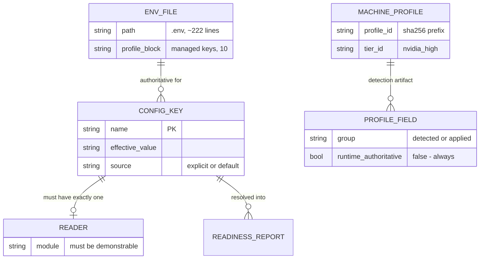

> **Lens:** BA (Part A) / TPO + Architect (Part B) · **Inputs:** `01-brd.md`, `02-use-cases-workflows.md`, `03-data-state-analysis.md`, `05-modularization.md`, `06-architecture.md`, `07-brownfield-reconciliation.md` · **Engagement:** Brownfield · **Defines:** TRD-24 … TRD-26

# Configuration & Boot — MOD-07 [Lens: BA (Part A) / TPO + Architect (Part B)]

## Part A — Module BRD [Lens: BA]

### A.1 Module Objectives

Give the operator one honest answer to two questions: *what is this system actually configured to do?* and *is it ready to take a call?*

Both are currently unanswerable. Configuration has two writers producing divergent values, and four settings are written by those writers and never read by any code — so a value in a file can differ from the value the system runs, and a reviewer can spend a day optimising a setting that never executes. Separately, the stack can start "successfully" with a model that was never loaded, which the caller experiences as a first turn that takes tens of seconds.

This module exists so that "set" and "live" are the same thing, and so that readiness is a fact the operator can check rather than an assumption made after a green log line.

### A.2 Scoped Requirements

**Satisfies** (per `05-modularization.md`):

- `BRD-15` — Reversible change: every adopted change is revertible by configuration or a single revertable commit, with a documented rollback.
- `BRD-16` — Single source of configuration truth: configuration written but never read shall be removed or wired; the effective value of every runtime setting shall be unambiguous.
- `BRD-17` — Boot-time readiness: the inference model and its prompt prefix shall be resident before the first call is accepted, and the GPU shall not be idle-clocked at the moment a call arrives. This module owns the **boot half** (resident at boot, prefix warm, GPU awake, readiness verifiable); `MOD-03`/`TRD-12` owns holding residency across the process's life (`REC-11`).

**Contributes to** (owns the mechanism, not the requirement):

- `BRD-04` — Endpointing reconciliation depends on this module's disposition of the dead Pipecat VAD block: "configuration that does not execute shall not be presented as the live setting".
- `BRD-03` — Cold-start first turn is a boot-readiness property; the requirement is owned by `MOD-01`/`BRD-03`, the warm state that satisfies it is produced here.
- `BRD-13` — Graceful degradation: a partially started stack must be detected and reported, never silently served.

### A.3 Module Business Rules

| Rule | Condition → Action | Traces to |
|---|---|---|
| Set ≠ live is a standing rule | A configuration value is cited as a cause or a lever → its reader must be demonstrated, not assumed | `BRD-16`, `REC-02` |
| One writer per effective value | A key has more than one writer → exactly one is authoritative; the others are detection artifacts or removed | `DG-05`, `BRD-16` |
| A written key with no reader is a defect | A key is written by configuration tooling and read by no code → removed, or wired and made live | `BRD-16`, `07-brownfield-reconciliation.md` §4 ("Resolve now") |
| Ready means ready | A "started" stack whose model is not resident → not ready; the operator is told before the first call, not after | `BRD-17` |
| Partial start is never silent | Any service or model that failed to start → reported explicitly with the degraded capability it implies | `UC-06` partial completion, `BRD-13` |
| No secret values in artifacts | A credential is printed, logged or documented → forbidden; artifacts reference the key, never the value | Program rule |
| One command to start, one step to revert | A change that requires a manual sequence to roll back → not adoptable | `BRD-15` |

### A.4 Actors

| Actor | Why it touches this module |
|---|---|
| **Operator** | Runs the stack with one command, needs to know it is healthy and warm (`UC-06`) |
| **Developer** | Needs config to describe what runs, so a change is attributable; consumes the readiness gate before every measurement run |
| **Product Owner** | Consumes the readiness report as evidence that a demo or a measurement is being taken on a properly warmed stack |
| **Inference engine (Ollama)** | System actor whose residency is the readiness gate's central fact |

### A.5 Module Acceptance Criteria

1. **Every runtime setting has one effective value.** For any key named in a runbook or a document, the value the running code uses is identifiable by a single command, and no key resolves to two different values (`BRD-16`).
2. **No key is written and unread.** Every key in the managed configuration set either has a demonstrable reader or has been removed; the check is automated, not a review promise (`BRD-16`).
3. **A stale detection artifact cannot mislead.** Reading the machine profile cannot produce a conclusion about runtime behaviour, because the profile's role is stated where it is read (`REC-05`, `DG-05`).
4. **The first call of the day is not the slowest.** A call arriving after a long idle period does not pay a cold model load, and the GPU is not idle-clocked when it arrives (`BRD-03`, `BRD-17`). At boot this module guarantees residency and a warm prefix; keeping them through the first chat is `TRD-12` (`REC-11`), and the readiness report states which of the two it is asserting.
5. **Starting the stack is one command; a half-started stack says so.** Partial completion is detected and reported with the specific capability that is degraded (`UC-06`).
6. **The reported effective config contains no secret value.** The readiness report names configuration keys and whether they are set, never their values for credential-bearing keys.
7. **Rollback is one step.** Every change this module makes is revertible by configuration or a single revertable commit (`BRD-15`).

## Part B — Module TRD [Lens: TPO + Architect]

### TRD-24 — One authoritative configuration source with per-key runtime resolution

Exactly one configuration source shall be authoritative for runtime behaviour; the second writer shall be reclassified as a detection artifact and documented as such at the point where it is read; and every runtime setting's effective value shall be resolvable from a single command.

- **Serves:** `BRD-16`, `BRD-15`.
- **Implements:** `DG-05` — "use-as-is (short term) with a verification step per change; **derive** the single source in Stage 8". This TRD is that Stage 8 derivation. It also implements the carried contradiction `CV-04`.
- **The conflict, precisely (`DG-05`, `REC-05`, `DAT-09`):** three writers exist and disagree.

| Writer | What it writes | Is it read at runtime? |
|---|---|---|
| `.env` | The effective values, plus a marked `MACHINE PROFILE` block generated by tooling | **Yes** — this is the runtime truth |
| `.machine_profile.json` | A snapshot of the machine it was sized for: `detected` hardware fields plus an `applied` block | **No.** It is read only by `check_drift()`, which compares the `detected` hardware fields and never the `applied` block |
| `app/config.py` defaults | Fallback values when a key is absent from `.env` | Yes, but only as a fallback |

- **The divergence, verified on this machine:** the profile's `applied` block records `WHISPER_NUM_THREADS: "6"` and `FASTAPI_WORKERS: "4"`; `.env:182` records `WHISPER_NUM_THREADS=4`. The difference is invisible to `check_drift()` and has **zero runtime effect** — `REC-05` closes this investigation thread so it cannot consume more budget, and this TRD records the resolution rather than re-opening it.
- **Requirement:** `.env` is authoritative. The profile is a detection artifact, and the place it is read (`check_drift()`) states that its `applied` block is not runtime configuration. A future reader must not be able to mistake the snapshot for the setting.
- **Requirement:** a single command prints the effective value of every runtime setting, with its source (explicit in `.env`, or the default it fell back to). The readiness report in `TRD-26` carries this table.
- **Numbers:** `.env` currently holds ~222 lines (`DAT-09`); the managed set written by tooling is 10 keys (`MANAGED_KEYS`: `LLM_PROVIDER`, `MLX_MODEL`, `MLX_EMBED_MODEL`, `OLLAMA_MODEL`, `OLLAMA_NUM_CTX`, `WHISPER_MODEL`, `WHISPER_NUM_THREADS`, `FASTAPI_WORKERS`, `RAG_TOP_K`, `RAG_FETCH_K`). Every one of those ten must have a demonstrable runtime reader or be removed.
- **Consistency requirement this implements:** `DAT-09`'s scale profile demands "**strong** — currently violated"; a config value is read at import time and never re-read at runtime, so the effective value is fixed at process start. The requirement is that the *reported* effective value is also fixed at process start and reported once, so the report cannot drift from the value in use.

### TRD-25 — Inert-key disposition: remove or wire, and prevent recurrence

Every configuration key that is written but never read shall be removed or wired; the four known inert items shall each receive a recorded disposition; and a boot-time check shall fail when a managed key has no reader.

- **Serves:** `BRD-16`; implements `BRD-04`'s clause that "configuration that does not execute shall not be presented as the live setting".
- **Implements:** `DG-05` and `CV-04`, which name the four keys; `REC-02` and `REC-04` carry the code evidence for two of them.
- **The four inert items, each verified in code:**

| Item | Where it is written | Why it is inert | Evidence | Disposition |
|---|---|---|---|---|
| `FASTAPI_WORKERS=4` | `.env:183`, `.machine_profile.json` `applied`, and every repo reference outside the test file is on the *writer* side (`app/hardware_profile.py:49, 319, 329`) | The launcher starts uvicorn with **no `--workers` argument**, so the app runs as one process | `start_services.ps1:559`: `ArgumentList = "-m", "uvicorn", "app.main:app", "--host", "127.0.0.1", "--port", "$FastAPIPort"` | **Remove** the key and its profile entry. The single-process design is deliberate (`06-architecture.md` §5 names the FastAPI process as a SPOF precisely because there is one), so wiring it would contradict a recorded architectural decision |
| Pipecat `VADParams(stop_secs=0.5, start_secs=0.3, confidence=0.7, min_volume=0.6)` | `app/pipeline.py:174–180` | The analyzer is constructed and never referenced again; the only caller of `create_local_voice_pipeline` is a test script | `app/pipeline.py:174–180`; `REC-01`; `07-brownfield-reconciliation.md` §3 ("Endpointing: docs claim 500 ms; code does 600 ms") | **Remove** the block, or mark it unmistakably as non-live. It is the single most dangerous inert value in the repository: it reads as the endpointing configuration and is 100 ms away from the live 600 ms RMS gate, which is 86% of the latency budget (`BRD-04`, `CV-02`) |
| ERC reranker (INT8 cross-encoder ONNX, ~22–23 MiB) | ERC `config.py:195–200` constructs it at boot when the model file is present | It is consulted only inside `execute_agent_context` (`enterprise_rag/orchestrator.py:78`), which **no code in this repository calls**; the app calls exactly one MCP tool, `retrieve_context` | `REC-04`; `app/rag_mcp.py:163` (`mcp_call_tool("retrieve_context", …)`) | **Remove from boot** for this program; re-add only when `UC-10` justifies wiring it, and that decision needs the frozen golden set (`DG-03`) |
| ERC semantic cache | ERC `cache.py`, configured in ERC `config.py` | Reachable only through the same unused `execute_agent_context` path (`orchestrator.py:59, 67`); `retrieve_context` bypasses it entirely | `REC-04` | **Remove until a caller exists for it.** Configuring a cache nothing consults is pure cost: it advertises a latency mitigation the live path does not receive |

- **Requirement (prevent recurrence):** the readiness check in `TRD-26` verifies that every key in the managed set has a reader. A key with no reader is a **failed** boot check, not a warning — the failure is what stops the fifth inert key from being written six months from now.
- **Requirement:** a documented rule carries forward — a configuration value may be cited as a cause or a lever only when its reader is demonstrated. `REC-02` records why: "this caused a wrong capacity conclusion earlier in the program".
- **Explicitly not in scope:** removing the `pipecat-ai` dependency itself. `REC-01` accepts it for this program; only the dead `VADParams` block is disposed of here.

### TRD-26 — Boot-time readiness gate: resident model, warm prefix, visible partial start

The stack shall not report itself ready until the inference model is resident and its prompt prefix is warm; until then the first call must not be accepted as a normal call; and any service or model that failed to start shall be reported with the capability it degrades.

- **Serves:** `BRD-17`, `BRD-03`, `BRD-15`; implements `BRD-13`'s partial-failure visibility for the boot path.
- **Implements:** `SM-01` OPENING → GREETING — the greeting is the first thing a caller hears and the first thing a cold model delays; `UC-06` main flow steps 3–4 ("Model and prompt prefix warmed"; "A test call confirms the path end-to-end") and its partial-completion row ("half-started stack must be detectable, never silent").
- **What exists today, verified in code:** `start_services.ps1:659–702` (Step 6, "Ollama model pre-warming") queries `/api/tags`, filters to completion-capable models, and issues a one-token `/api/generate` per model with `keep_alive: "24h"`. An earlier PowerShell 5.1 native-pipe bug that made this step skip while reporting success was fixed at line 676 (`Out-String` + `ConvertFrom-Json`), so the pre-warm now runs.
- **The defect is narrower than "no preload", and this module must not paper over it (`REC-11`):** `_chat_ollama` (`app/llm_backend.py:135–146`) sends only `num_ctx` and `temperature`. Ollama resets a model's keep-alive to the server default on any request that omits it, so **the first real chat after boot discards the 24-hour warm and reinstates the 5-minute default**; `OLLAMA_KEEP_ALIVE` is set nowhere in `.env` and read nowhere in `app/`. That is why a 32,919 ms cold load was measured *with working pre-warm code in the repository*.
- **Module boundary (binding, `REC-11`):** this module owns the **boot sequence** — the pre-warm, the prefix warm, and the gate that verifies them. Holding residency across the process's life (passing `keep_alive` on every chat, or setting `OLLAMA_KEEP_ALIVE`) is `MOD-03`'s scope under `TRD-12`. The readiness gate therefore reports residency as a **snapshot at boot** and must not present a boot-time success as a lifetime guarantee: a stack declared ready at 09:00 is not resident at 09:20 unless `TRD-12` lands.

| Property | Requirement | Status in code |
|---|---|---|
| Model resident before the first call | The model is loaded and held | **Partially met, and split across two modules.** Boot half: Step 6 sets `keep_alive=24h`, but only when Ollama already answered `/api/tags`. Nothing in the script starts Ollama, so where it is not already running the step is skipped and the first call pays the full cold load. Serving half: the first real chat discards the warm (`REC-11`), so boot-time residency alone cannot satisfy this row — `TRD-12` (`MOD-03`) completes it, and the gate reports the snapshot rather than a guarantee |
| Prompt prefix warm | The voice prompt prefix is in the KV cache, so the first turn skips prefill of the static prefix | **Not met**: the pre-warm sends the literal prompt `"ping"`. It warms model weights, not the voice prompt prefix. Prefix caching is measured working (identical repeat 2,909 ms → 50 ms), so a warm prefix is a real, reachable saving that nothing currently claims |
| GPU not idle-clocked at call arrival | Memory clock is not at idle when the first call lands | **Not met**: measured cold-idle state is P5 with memory clock 405 of 14,001 MHz. Pre-warming the model is what lifts it; the check exists so the state is verified rather than assumed |
| Partial start reported | A service or model that failed to start is named | **Partially met**: several steps warn on failure, but the script's exit state does not distinguish "all up" from "up but degraded", and `UC-06` names the requirement explicitly |

- **Numbers:** cold model load is a measured **32,919 ms** with **67,349 ms** to first token — the single largest latency term in the system and the reason `BRD-03` exists. The readiness gate's budget: the gate completes when the model reports resident; a gate that cannot confirm residency within a bounded window reports **not ready** rather than assuming success.
- **Readiness definition (all four must hold):** (1) every service the turn path needs is listening; (2) the inference model is resident and confirmed by the engine, not by the launcher's log; (3) the prompt prefix is warmed with the real voice prompt, not a placeholder; (4) every managed configuration key has a reader (`TRD-25`).
- **Degradation and recovery:** implemented exactly as `06-architecture.md` §5 MOD-07 — "partial start is detected and reported, never silent; recovery: restart". The gate never blocks the operator from starting services manually; it blocks the stack from *claiming* readiness it does not have.
- **Idempotency:** a repeated start is safe (`UC-06` duplicate-request scenario); an already-warm model makes the pre-warm step a no-op, not a second load.
- **Reversibility:** the gate and the prefix warm are additions to the startup path with no runtime behaviour change; removing them restores today's behaviour exactly (`BRD-15`).

### B.1 Technical Constraints

| Constraint | Value | Source |
|---|---|---|
| Language / runtime | PowerShell 5.1 `start_services.ps1` for orchestration; Python 3.11 for config resolution | `start_services.ps1`, `requirements.txt` |
| Configuration format | `.env` parsed by `app/config.py` field factories; a marked `MACHINE PROFILE` block written by `scripts/predeploy.py` | `app/config.py`, `app/hardware_profile.py:36–50` |
| Detection artifact | `.machine_profile.json`, written next to `.env`; read only by `check_drift()` | `app/hardware_profile.py:487–530, 551–575` |
| Engines | Ollama `:11434` (external, not started by the script); ERC MCP `:8010`; FastAPI `:8000`; CRM API `:8098` | `start_services.ps1:56, 559, 603` |
| Platform | Windows 11; the launcher is PowerShell | `01-brd.md` §8 |
| Divergence from stack | None. The module formalises an existing script and an existing config loader; it introduces no new configuration mechanism | `05-modularization.md` ("Config/boot is a module, not a script … `BRD-16` needs an owner") |

### B.2 Non-Functional Requirements

| NFR | Target |
|---|---|
| Performance | Boot-time only: the module adds no runtime load (`06-architecture.md` §5 MOD-07: saturation limit "none — no runtime load"). The readiness gate adds the model-residency wait to start-up, which is the 32,919 ms cold load paid once at boot instead of once per first call after idle |
| Security | No secret value is printed, logged or written into an artifact: the readiness report names keys and whether they are set, never credential values. Configuration files holding secrets are excluded from artifacts |
| Scalability | Not applicable — one box, one stack. Scale unit: a stack start. No concurrency, no queue |
| Scale unit & limits | Unit: one stack start. Managed key set: 10 keys. Services tracked for readiness: the turn path's dependencies (FastAPI, Ollama, ERC MCP, Postgres) — CRM and tunnels are reported but do not gate readiness, because the turn path does not depend on them (`MOD-05` runs post-call) |
| Degradation | Implemented exactly as `06-architecture.md` §5 MOD-07: partial start is detected and reported, never silent. Recovery: restart. A stack that cannot warm reports **not ready** and names what is missing rather than accepting calls it will serve badly |
| Observability | A readiness report at start-up naming: each service's state, the model's residency, whether the prompt prefix is warm, and the effective value and source of every managed key. The report is the operator's `UC-06` artefact |
| Availability | No independent SLO. The module's failure mode is a delayed or refused start, never a degraded call: refusing to declare readiness is cheaper than serving a cold first turn (`BRD-17`) |
| Reversibility | Every change is revertible by configuration or a single revertable commit (`BRD-15`); the readiness gate itself is a start-up addition with no runtime behaviour |

### B.3 APIs / Interfaces

| Name | Direction | Exposed / Consumed | Style | Contract | AuthN/Z |
|---|---|---|---|---|---|
| `start_services.ps1` | exposed | Operator entry point | PowerShell script | One command starts the stack; reports per-service state and readiness; non-zero exit or explicit "not ready" when the stack is degraded | Local operator; no auth layer (`UC-06`) |
| Readiness report | published | Operator, Developer | structured console/log output at start-up | Service states, model residency, prefix-warm state, effective config table with sources; no secret values | Local |
| `predeploy.py` (`--check`) | consumed by the operator | tooling | Python CLI | Sizes `.env` for the machine; `--check` exits non-zero when drifted or missing | Local; stdlib-only, runs before the venv exists |
| Config resolution | consumed by every module | in-process | `app/config.py` field factories | Each setting resolves from `.env` or a documented default; the effective value is fixed at import | In-process |
| Ollama `/api/tags`, `/api/generate` | consumed | local HTTP | readiness probe | Used to confirm residency and to warm; a non-200 is a **not-ready** signal, not a silent skip | Local |

### B.4 Data Model

The entity is the configuration set, `DAT-09` — whose inventory row reads "`.env` + `.machine_profile.json`", owner Developer, availability 100%, quality "**Low — 4 keys inert, 3 disagree**", trust "**conflicting**". Its classification is "**Conflicting / Stale**", with the consequence that "`FASTAPI_WORKERS`, `WHISPER_NUM_THREADS` disagree; 4 keys never read".

| Entity | Key fields | Relation | Inventory |
|---|---|---|---|
| `.env` | ~222 lines; a marked managed block holding 10 keys | Authoritative for every runtime setting | `DAT-09` |
| Config key | name, effective value, source (explicit or default) | Must resolve to exactly one reader | `DAT-09` |
| Machine profile | `profile_id`, `tier_id` (`nvidia_high`), `detected` block, `applied` block | Detection artifact; its `applied` block is never runtime-authoritative | `DAT-09` second writer |
| Readiness report | per-service state, model residency, prefix-warm state, effective config table | Produced once per stack start | `UC-06` artefact |

**Consistency:** `DAT-09`'s scale profile requires **strong** consistency and records it as "currently violated". The resolution is structural rather than transactional: because settings are read once at import, the requirement is that the *reported* effective value is the value in use — a report generated from the same resolution path the process used, not from a second reading of the files.

### B.5 Tech Stack Choices

| Choice | Rationale | Why not the runner-up |
|---|---|---|
| `.env` as the single authoritative source | It is already the runtime truth (`REC-05`); changing the authority would invalidate every existing deployment's configuration and every line of `app/config.py` | Promoting `.machine_profile.json` to authority: it was never read, so its semantics are unproven; and it is a *snapshot of a machine*, not a statement of intent — the wrong shape for authority |
| Keep the profile as a detection artifact | It records what the machine was when `.env` was sized, which is genuinely useful for drift detection | Deleting it: the drift check is legitimate; the defect is that its `applied` block looks like configuration, not that it exists |
| Keep PowerShell for orchestration | The stack is Windows-native, the launcher works, and `BRD-15`'s rollback story depends on the start path being familiar | Rewriting the launcher in Python: no requirement asks for it, and it would put the boot path at risk for no measured benefit |
| Automated reader check rather than a documentation rule | "Set ≠ live" already produced one wrong conclusion; a rule enforced by a person was already violated four times | A runbook note: `REC-02` is the evidence that documentation alone does not hold |
| Prefix warm using the real voice prompt | Prefix caching is measured working (identical repeat 2,909 ms → 50 ms); warming with a placeholder claims a benefit it does not deliver | Warming with `"ping"`: it is what the script does today, and it warms weights only |

### B.6 Edge Cases & Error Handling

| Failure class | Strategy |
|---|---|
| Ollama not running at pre-warm time | Today: the step logs "skip pre-warming" and continues, so the first call pays the cold load. Required: readiness is **not** declared; the missing residency is named as the degraded capability (`BRD-17`, `TRD-26`) |
| Model evicted between boot and the first call | The residency check is part of readiness; a residency window shorter than the expected idle gap is a configuration error to be surfaced, not a surprise to be discovered by a caller |
| A managed key has no reader | Failed readiness check naming the key (`TRD-25`). This is the mechanism that stops a fifth inert key appearing |
| Two writers disagree on a key | `.env` wins by rule; the divergence is reported as a drift, not resolved silently (`TRD-24`, `DG-05`) |
| Port held by an orphaned process | `UC-06` E1: start fails and the operator resolves ownership. The script already probes ports before starting (Steps 1–2) and warns when a port is held by another process (`start_services.ps1:635`) |
| A dependency starts but never listens | The script's startup deadline reports it (`UC-06` timeout scenario); readiness is not declared on a timeout |
| Half-started stack | Reported with the specific degraded capability; never silent (`UC-06` partial completion, `BRD-13`) |
| Repeated start | Idempotent; an already-running dependency is reused, not duplicated (`UC-06` A1, duplicate-request scenario) |
| Operator aborts a start | No partial readiness is claimed; the report reflects what actually came up (`UC-06` cancellation scenario) |
| A configured value is malformed | Start reports the parse failure rather than falling back silently — a malformed value that becomes a default is indistinguishable from an absent one (`UC-06` invalid-input scenario) |

#### As-built, 2026-09-19 — the gate closes six of these, and three have nothing behind them

This table was written prescriptively ("Today: … Required: …") before `US-007`'s
gate existed. The gate is now implemented and passes 30/30 checks, so the
"Required" column can be answered. **Six rows are implemented, one was already
handled outside the gate, and three have no implementation at all** — the last
group is the one worth acting on, because a table like this reads as a
specification that has been met.

**Implemented — verified by a named check in `test_us007_readiness.py`:**

| Row | Evidence |
|---|---|
| Ollama not running at pre-warm time | *"AC-2 engine absent → NOT READY"*, *"the error is surfaced, not swallowed"* |
| Model evicted between boot and the first call | *"TAC-1 not resident per `/api/ps` → NOT READY"*, *"residency failure names the model"* |
| A managed key has no reader | *"TAC-1 an unread key → NOT READY"*, plus *"US-011 keys read by ANOTHER PROCESS do not fail the clause"* — the exemption matters, or the check would fire on every correct cross-process key |
| Two writers disagree on a key | `hardware_profile.check_drift()` compares the live machine against the profile snapshot `.env` was sized for and returns `ok / drifted / no_profile / skipped_container / disabled` — reported, never resolved silently (`TRD-24`, `DG-05`). A second, unrelated drift check (`admission.asset_drift()`) covers the call assets and degrades rather than blocks |
| Half-started stack | *"a down Postgres degrades but does not block"*, *"a down ERC MCP degrades but does not block"* — degraded is named while ready is still declared, which is the distinction the row asks for |
| Repeated start | *"AC-4 a second start against a warm stack is still READY"*, *"the warm path records `load_ms` so a second load is visible"* |
| Port held by an orphaned process | Handled in `start_services.ps1` (port probes, and `Stop-PortOwner` walks to the orphan holding an inherited socket). Unchanged; not the gate's to own |

**No implementation found — open, and named rather than implied:**

| Row | Status |
|---|---|
| **A dependency starts but never listens** | **OPEN.** `boot_readiness.py` contains no such check (0 matches). The script has start-up deadlines per `UC-06`, but the *readiness gate* does not verify that a dependency which reported started is actually listening |
| **A configured value is malformed** | **OPEN.** No parse-failure reporting (0 matches). This is the row that would have caught `OLLAMA_KEEP_ALIVE="-1"` — a `.env` value that is always a string and that Ollama's Go duration parser rejects with `time: missing unit in duration`, a 400 on *every* request. That instance is handled by coercion in `_resolve_keep_alive`, but by hand at the call site, not by a gate that would catch the next one |
| **Operator aborts a start** | **OPEN.** Nothing implements it (0 matches). Low severity — an abort is visible to the operator who caused it — but the row claims a behaviour nothing provides |

The three open rows are **not** this module's DoD box; they are recorded here so
the box can be ticked honestly for the six that are real, without the table
implying three more are done than are.

### B.7 Tech Debt Accepted

- **Accepted: the `.machine_profile.json` file is retained rather than deleted.** Trade: a second file continues to exist that a careless reader could mistake for configuration. Rationale: the drift check is legitimate, and the fix is to make its role explicit where it is read, not to remove a working detection feature.
- **Accepted: `pipecat-ai` stays pinned and installed.** `REC-01` defers the dependency decision to `UC-10`; only the dead `VADParams` block is disposed of here. Revisit trigger: hand-rolled streaming under-delivers against the C2 prediction (`WF-03` step 5).
- **Accepted: the readiness gate adds start-up time.** It waits for model residency, which is a measured 32,919 ms cold. Rationale: paying it at boot, once, is strictly better than paying it on a caller's first turn, which is what happens today whenever Ollama was not already up.
- **Accepted: readiness gating covers the turn path's dependencies only.** CRM, tunnels and the Streamlit dashboards are reported but do not gate readiness, because the turn path does not depend on them — `MOD-05` runs post-call and `MOD-02` degrades to the local store when the retrieval service is absent. Gating on them would refuse calls the system can serve.
- **Accepted: no secret-scanning automation is added.** The program rule is "never write secret values into artifacts"; enforcement is the existing practice of referencing keys, not adding a scanner to a one-box deployment.

### B.8 Reconciliation [Brownfield]

| Existing asset | Location | Class | Action in this module |
|---|---|---|---|
| `start_services.ps1` orchestration (13 steps, port probes, GPU check, Docker check, service starts, tunnel, Twilio webhooks, summary) | repo root | **Refactor** | Add the readiness gate and the effective-config report; the existing step structure and the port/probe work are kept (`REC-03`-adjacent in `07-brownfield-reconciliation.md` §1: "Add preload + warm; reconcile config writers (`DG-05`)") |
| Step 6 model pre-warm (`keep_alive: "24h"` per completion-capable model) | `start_services.ps1:659–702` | **Refactor** | Keep, and extend at boot: warm the real voice prompt instead of the `"ping"` placeholder, and make a skipped pre-warm a not-ready condition rather than a warning. The earlier PowerShell 5.1 pipe bug is already fixed at line 676 |
| Serving-path `keep_alive` (`_chat_ollama` sending only `num_ctx` and `temperature`) | `app/llm_backend.py:135–146` | **Debt — not this module** | Recorded here because it is what neutralises this module's pre-warm; the fix belongs to `TRD-12` (`MOD-03`, `REC-11`). `MOD-07` reports residency as a boot snapshot and never claims the guarantee `TRD-12` owns |
| `app/config.py` settings loader | `app/config.py` | **Reusable** | Kept as the resolution path; `TRD-24` requires it to report its source per key |
| `app/hardware_profile.py` managed keys and drift check | `app/hardware_profile.py:36–50, 319–329, 487–575` | **Reusable** | Kept; the profile's role as a detection artifact is documented where it is read |
| `.machine_profile.json` | repo root | **Reusable** | Kept as a detection artifact. `REC-05`: never runtime-authoritative |
| `scripts/predeploy.py` | `scripts/predeploy.py` | **Reusable** | Kept; it is the writer of the managed block and its exit codes already support a drift check |
| Dead Pipecat `VADParams` block | `app/pipeline.py:174–180` | **Debt** | Dispose of under `TRD-25`; it must not be readable as the live endpointing setting (`BRD-04`) |
| `FASTAPI_WORKERS` key | `.env:183`, `.machine_profile.json`, `app/hardware_profile.py` | **Debt** | Remove under `TRD-25`; the single-process design is deliberate (`REC-02`) |
| ERC reranker at boot | ERC `config.py:195–200` | **Debt** | Remove from boot under `TRD-25`; re-add only via `UC-10` (`REC-04`) |
| ERC semantic cache | ERC `cache.py`, ERC `config.py` | **Debt** | Remove until a caller exists (`TRD-25`, `REC-04`) |

**Applicable REC notes:** `REC-02` (FASTAPI_WORKERS written and never read — and the reason "set ≠ live" is a standing rule), `REC-04` (reranker and semantic cache loaded and unreachable), `REC-05` (`.machine_profile.json` is never read at runtime; `WHISPER_NUM_THREADS` divergence has zero runtime effect; `cpu_threads` additionally inert on the CUDA path), `REC-06` (stale machine-sizing documents — the reason the readiness report states numbers from measurement rather than from a document), `REC-11` (the pre-warm exists, runs, and is undone by the first real chat — the binding boundary between this module and `TRD-12`), `REC-01` (Pipecat bypassed; only its dead configuration is touched here). This module also implements the carried contradiction `CV-04` and the data-gap decision `DG-05`.

**One plan/code conflict found while reconciling this module (detailed in `TRD-26`):** the plan's earlier claim that "Model preload — not present today" was false — `start_services.ps1:659–702` pre-warms with a 24-hour `keep_alive`, and the PowerShell pipe bug that once made it skip silently was already fixed. `REC-11` records the sharper, correct position now carried by `06-architecture.md` §2 and `MOD-03`: the pre-warm runs and is then **undone by the first real chat**, because `_chat_ollama` omits `keep_alive` and `OLLAMA_KEEP_ALIVE` is unset and unread — which is why 32,919 ms was measured with working pre-warm code in the repository. The consequence for this module is a **boundary, not a fix**: boot-time readiness is necessary but not sufficient for `BRD-17`, and the gate reports a boot snapshot instead of claiming a guarantee it cannot keep. (Minor residual drift inside the plan: `06-architecture.md`'s MOD-07 flow shows `keep_alive -1` in the diagram while its own prose and the code say `24h`; the prose is the accurate one.)

## TPO Buildability Sign-off [Lens: TPO]

**TPO sign-off: this TRD is buildable against the BRD above.** Three of the four inert items are removals or boot-time omissions rather than features; the readiness gate formalises work the launcher already attempts; and nothing in this module touches the caller's turn beyond making it start warmer.

Feasibility risks:

1. **Removing `FASTAPI_WORKERS` touches a key that other machinery writes.** `app/hardware_profile.py` clamps and writes it, and `tests/test_machine_profile.py` asserts its value in three places. *Mitigation:* the disposition is "remove the key **and its profile entry**, and update the tests in the same change" — a mechanical change, and the alternative (wiring it to real multiple workers) is forbidden because `06-architecture.md` §5 records the single process as deliberate.
2. **The prefix warm is a new claim about prefix caching.** It is measured (identical repeat 2,909 ms → 50 ms) but the warm has not been built, and a prefix warm that does not actually land in the cache would produce a false readiness signal. *Mitigation:* readiness requires confirmation from the engine, not from the launcher; if the warm cannot be confirmed, the stack reports not-ready rather than claiming a benefit it did not get.
3. **A stricter readiness gate can refuse to start a usable stack.** If the gate is wrong, the operator loses calls the system could have served. *Mitigation:* the gate covers only the turn path's dependencies — CRM, tunnels and dashboards never block readiness — and the whole gate is a single revertable commit (`BRD-15`).
4. **The reader check is a static analysis problem, not a runtime one.** "Every managed key has a reader" is easy to state and can be satisfied cosmetically. *Mitigation:* the check is demonstrated on a real key set and is required to fail loudly on a deliberately added inert key — a test of the check itself, not just of the config.
5. **Disposing of the ERC items means changing a separate repository.** `enterprise-rag-core` is a standalone package with its own build and test gates. *Mitigation:* the disposition is "remove from boot", which is an ERC-side change with an ERC-side test gate; if it cannot land in this program's window, the items are recorded as accepted cost rather than silently left — the boot cost (22–23 MiB and a session construction) is small, and the honest fallback is to record it, not to pretend it was fixed.
