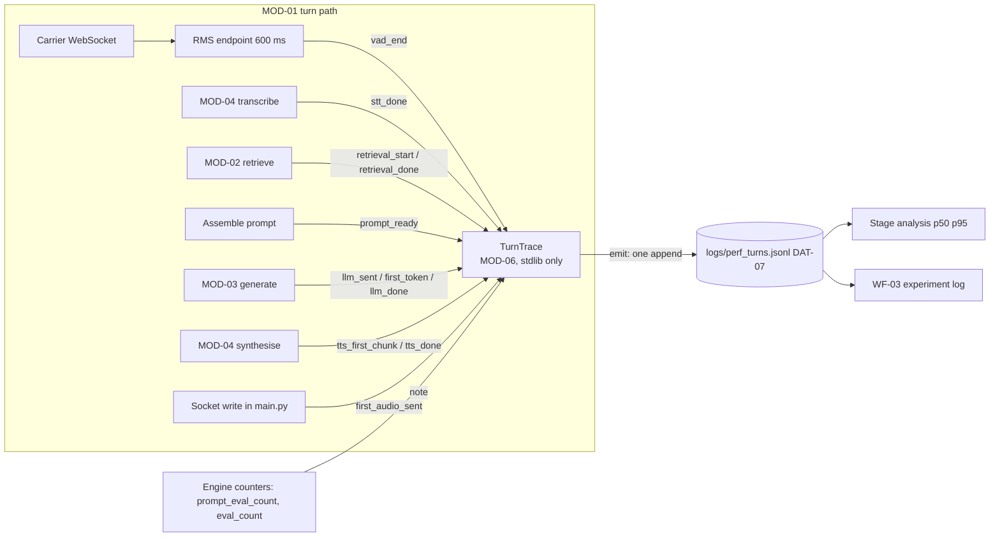

> **Lens:** PO / TPO (technical ACs) / Architect (HLD, LLD) · **Engagement:** Brownfield — `D:\project\universityDemo`

# US-001 — Turn tracing marks and records [Lens: PO]

- **Status:** **IMPLEMENTED - ACs verified** · `test_us001_tracer.py` 17/17 · DoD 3/6 · LLD mapping and the 30-minute soak are open

- **Story:** As a **developer maintaining the voice pipeline**, I want **every voice turn to emit one machine-readable record carrying each stage boundary it passed and the inference engine's own counters**, so that **per-stage latency is measured on this machine instead of inferred from component numbers**.
- **Business value:** `BRD-01` has no home in the existing code and `DAT-07` does not exist. Every later decision in this program — which change to adopt, which to revert — is only defensible once a real call produces a real decomposition.
- **Priority:** **Must** — TPO ordering note: this is the program's Phase A deliverable and it gates every later story (`05-modularization.md` §3 "note the shape"; `WF-03` step 1 requires a baseline before any change is proposed). Nothing else in the program is adoptable before this lands.

## Acceptance Criteria [Lens: PO]

**AC-1.** One live voice turn produces exactly one trace record.

```gherkin
Scenario: A complete turn produces a complete record
  Given the stack is running and the turn path has been instrumented
  And PERF_TRACE is enabled
  When a caller speaks one grounded question and hears the reply
  Then exactly one JSON object is appended to logs/perf_turns.jsonl for that turn
  And it carries at least six stage durations, the turn total, the count of stages seen,
      and the inference engine's prompt_eval_count and eval_count
  And the stage durations sum to the recorded total within 5 ms

Scenario: A turn that short-circuits emits fewer stages and says so
  Given the caller says only "ok"
  When the noise gate answers with the fixed reply and the model is never invoked
  Then a record is still emitted for that turn
  And its stages_seen count is lower than a full turn's
  And no stage that never fired appears with a duration of 0
```

**AC-2.** A stage that did not fire is visibly absent, and a stage that fired is never dropped.

```gherkin
Scenario: A stage mark never fires
  Given retrieval is not reached because the noise gate consumed the turn
  When the record is emitted
  Then the retrieval key is absent from the record, not present with value 0
  And stages_seen reflects the stages that actually fired

Scenario: Engine counters are unavailable
  Given the inference response carries no counter values
  When the record is emitted
  Then the record is emitted without engine counters
  And its absence is distinguishable from a genuine zero-token evaluation
```

**AC-3.** Tracing can never fail a call.

```gherkin
Scenario: The trace sink is unwritable
  Given PERF_TRACE_FILE points at a path that cannot be written
  When a caller completes a turn
  Then the caller hears a normal reply
  And the turn does not raise, fail or slow perceptibly
  And the trace is lost while the call is not

Scenario: Tracing is switched off
  Given PERF_TRACE=0
  When calls are placed normally
  Then no trace file is written and no I/O is performed by the tracer
  And every call behaves exactly as it does with tracing on
```

**AC-4.** Two concurrent callers produce two clean records.

```gherkin
Scenario: Two concurrent turns do not merge or interleave
  Given two callers are live on the harness at N=2
  When both complete turns within the same second
  Then two records are appended, each carrying its own call_id and turn_id
  And neither record contains a stage duration belonging to the other turn

Scenario: A retried turn is not double-counted
  Given a turn is re-emitted after a retry within the same turn
  When the record is written
  Then it carries the same (call_id, turn_id) identity as the first emission
```

**AC-5.** The record names the boundary that `BRD-02` is measured on.

```gherkin
Scenario: First audio to carrier is captured at the socket write
  Given a turn that produces a spoken answer
  When the reply's first media frame is written to the carrier stream
  Then the record's first_audio_sent mark is taken at that write
  And it is not taken at the end of synthesis
```

Technical acceptance criteria [Lens: TPO] — performance, security, resilience checks the code must pass:

- TAC-1: **Tracing overhead is not measurable in the turn total** — the p95 delta between a turn's traced and untraced duration is ≤ 5 ms over ≥100 turns, measured by the US-002 harness with `PERF_TRACE=0` and `PERF_TRACE=1` in two separate windows.
- TAC-2: **Stage completeness** — ≥6 stage marks plus engine counters on a full turn, and the sum of consecutive stage durations reconciles to the recorded total within 5 ms (`BRD-01` §11 criterion 1).
- TAC-3: **No `app.*` imports** in the trace module — a static import check fails the build if one appears. This is the hard constraint that makes AC-3 structurally true rather than merely tested.
- TAC-4: **No caller PII in the record** — the record contains no transcript text, no phone number and no caller-supplied string; `call_id` is an opaque identifier. Asserted by scanning emitted records for the fixture's spoken text.
- TAC-5: **N=2 soak stability** — a 30-minute N=2 soak produces approximately **240 rows** (2 callers × 1800 s ÷ 15 s per turn) with zero merged or interleaved records, zero raised exceptions from the tracer, and zero turns failed. Note the row count is an *expected volume used to detect a silent drop*, not a pass threshold: a soak that produces 240 well-formed rows and 300 rows both pass, because the assertion is about merging and failures, not the count.
- TAC-6: **Absent-key honesty** — a reader that assumes a missing key is `0` is a defect; the stage-count field is present in 100% of emitted records.

## HLD — Architecture Slice [Lens: Architect]

`MOD-06` is depended on by every runtime module and depends on none (`05-modularization.md` §3). The turn path *emits* marks; `MOD-06` *owns* the record. The marks are dict writes; the only I/O is one append on turn end.



- **Components touched:**
  - `MOD-06` (new) — `app/perf_trace.py` reviewed and adopted against the `TRD-20`/`TRD-21` contract; a retrieval mark and a first-token mark are added to its stage set, and `stages_seen` is made explicit.
  - `MOD-01` — `app/voice_handler.py` turn loop gains the retrieval, prompt and synthesis marks; `app/main.py` `/ws/twilio` handler gains `first_audio_sent` **at the socket write**.
  - `MOD-02` — `app/rag.py` gains `retrieval_start` / `retrieval_done` around the dispatcher call, and notes which rung served.
  - `MOD-03` — `app/llm_backend.py` notes `prompt_eval_count` / `eval_count` and the engine's prefill/decode split; later, when US-004 lands, a `first_token` mark is *added* rather than replacing `llm_done`.
  - `MOD-04` — `app/voice_handler.py` synthesis path gains `tts_first_chunk` alongside the existing `tts_done`.
- **Interaction summary:**
  1. The turn path constructs a `TurnTrace(call_id, turn_id)` at the end-of-speech decision and stamps `vad_end`.
  2. Each stage boundary calls `trace.mark(stage)` — a first-write-wins dict entry on a monotonic clock. Retrieval contributes a start and an end mark, because `retrieval_ms ≥ 0` is the first success criterion of `BRD-01` and `MOD-02` is the program's named non-resource bottleneck.
  3. On turn end, `main.py` calls `trace.emit()` once; the tracer computes per-stage durations and consecutive-segment deltas, appends one JSON line and returns.
  4. **Failure path:** if the mark never fires, the key is simply absent from the record and `stages_seen` is lower. If the append raises (missing directory, locked file, full disk), the exception is swallowed inside `emit()` and the turn continues — the trace is lost, never the call.
  5. **Failure path:** if the tracer is disabled or the file cannot be written, `emit()` returns without I/O; the caller is unaffected and no other module observes the difference.

## LLD — Implementation Detail [Lens: Architect]

- **Classes / functions / APIs** — standard library only, no `app.*` imports:

```
# app/perf_trace.py  (MOD-06, stdlib only: json, os, time, pathlib)

ENABLED: bool          # os.environ.get("PERF_TRACE", "1") == "1"
LOG_PATH: str          # os.environ.get("PERF_TRACE_FILE", "logs/perf_turns.jsonl")

STAGES: tuple[str, ...] = (
    "vad_end",
    "stt_done",
    "retrieval_start",     # NEW - TRD-21 gap 1
    "retrieval_done",      # NEW - TRD-21 gap 1
    "prompt_ready",        # NEW - separates assembly from prefill
    "llm_sent",
    "first_token",         # NEW - TRD-21 gap 2; added when US-004 streams, never redefines llm_done
    "llm_done",
    "tts_first_chunk",     # NEW - TRD-13's streaming boundary
    "tts_done",
    "first_audio_sent",    # taken at the socket write in main.py
)

class TurnTrace:
    __slots__ = ("call_id", "turn_id", "_t0", "_marks", "_notes")
    def __init__(self, call_id: str, turn_id: int) -> None: ...
    def mark(self, name: str) -> None: ...   # first write wins; swallows every exception
    def note(self, **fields: object) -> None: ...  # non-timing context; swallows every exception
    def emit(self) -> None: ...              # one append; swallows every exception

def new_trace(call_id: str, turn_id: int) -> TurnTrace: ...
    # never returns None: falls back to TurnTrace("", 0) so call sites never branch

# Call sites (MOD-01 / MOD-02 / MOD-03 / MOD-04) - the mark is a bare statement,
# never wrapped in a condition and never awaited:
#   trace = new_trace(session.call_sid, session.turn_index)
#   trace.mark("vad_end")
#   trace.note(transcript_len=len(text))          # length only, never the text
#   ...
#   trace.emit()                                   # once, on turn end
```

- **Data schema changes** — `DAT-07` does not exist today; this story creates its record shape. There is no table; the sink is append-only JSONL, one object per turn.

```jsonc
// logs/perf_turns.jsonl  — one object per turn, ~240 rows per 30-min N=2 soak
{
  "call_id": "CAxxxxxxxxxxxxxxxxxxxxxxxxxxxxxxxx",  // opaque carrier SID, never a phone number
  "turn_id": 3,
  "ts": 1758200000.123,                             // wall clock, correlation only
  "vad_end_ms": 0.0,                                // monotonic offsets from the vad_end base
  "stt_done_ms": 612.4,
  "retrieval_start_ms": 615.1,
  "retrieval_done_ms": 987.0,
  "prompt_ready_ms": 994.2,
  "llm_sent_ms": 995.0,
  "first_token_ms": 2340.7,
  "llm_done_ms": 4102.5,
  "tts_first_chunk_ms": 2731.0,
  "tts_done_ms": 5233.8,
  "first_audio_sent_ms": 5390.2,
  "seg_vad_end__stt_done_ms": 612.4,                // consecutive-segment deltas
  "seg_stt_done__retrieval_start_ms": 2.7,
  "seg_retrieval_start__retrieval_done_ms": 371.9,
  "total_ms": 5390.2,                               // last mark minus base
  "stages_seen": 11,                                // absent is not zero
  "prompt_eval_count": 5666,                        // engine counters (BRD-01 names them)
  "eval_count": 118,
  "retrieval_rung": "primary"                       // primary | keyword_only | local
}
```

- **Edge cases** — enumerated, each with the decided behavior:

| Edge case | Decided behavior |
|---|---|
| A stage mark never fires | Key absent from the record; `stages_seen` is lower. Never a fabricated `0` — a `0` is a lie the analysis would believe |
| A stage fires twice (retry within a turn) | First write wins (`setdefault`); the mark is not overwritten and the turn is not double-counted |
| Engine counters missing | Record is emitted without them; absence is distinguishable from a genuine zero-token evaluation |
| Turn is re-emitted after a retry | Same `(call_id, turn_id)` identity carried, so a retried turn is one turn in the analysis |
| Sink directory does not exist | `mkdir(parents=True, exist_ok=True)` then append; failure is swallowed |
| Sink is a locked file (Windows) | Append raises, exception swallowed, turn proceeds, trace lost |
| Tracing disabled | `emit()` returns before any I/O; `mark`/`note` remain callable no-ops so call sites need no branch |
| Two concurrent turns | No shared mutable buffer exists between `TurnTrace` instances; records are distinguished by `call_id`. Asserted at N=2, not assumed |
| A stage fires in under a millisecond | Recorded at its real duration (rounded to 0.1 ms), never dropped |
| Clock goes backwards / NTP step | Durations use `time.monotonic()`; only `ts` uses wall clock |

- **Error handling** — there is exactly one error class and it is invisible by design: **every public method of `TurnTrace` wraps its body in `try/except Exception: pass`.** No exception is ever raised into the turn path, no error is logged per call (logging is itself an I/O that could fail), and no error surfaces to the caller. The designed recovery from a failed append is simply the next successful append (`06-architecture.md` §5 MOD-06). If per-turn append cost ever becomes measurable, the designed response is sampling 1-in-N turns, not removing tracing.

- **Test scenarios** — unit / integration / e2e / load, one checkable line each:

| # | Level | Scenario | Covers UC-07 row |
|---|---|---|---|
| T-1 | unit | `TurnTrace.mark` twice on one stage keeps the first timestamp; `stages_seen` counts it once | Duplicate request |
| T-2 | unit | `emit()` into a directory that does not exist creates it and appends one valid JSON line | Happy path |
| T-3 | unit | `emit()` with `PERF_TRACE=0` performs no filesystem write (asserted by mtime and by a patched `open`) | Recovery |
| T-4 | unit | `emit()` with an unwritable path returns normally and raises nothing | Timeout / Dependency failure |
| T-5 | unit | A record with `retrieval_done` never marked contains no `retrieval_done_ms` key and no `0` for it | Invalid input |
| T-6 | unit | `note(prompt_eval_count=None)` records absence, not `0` | Missing data |
| T-7 | unit | Static import check: the trace module imports only `json`, `os`, `time`, `pathlib` | Dependency failure |
| T-8 | integration | A scripted turn through the live path emits ≥6 stages plus counters; the consecutive segments sum to `total_ms` within 5 ms | Happy path |
| T-9 | integration | An early-exit noise-gated turn emits a record with a lower `stages_seen` and no fabricated zeros | Alternate path A1 |
| T-10 | integration | `first_audio_sent_ms` is stamped at the socket write: pausing the socket write moves the mark, pausing synthesis does not | Happy path |
| T-11 | integration | A re-emitted trace for the same `(call_id, turn_id)` appears twice in the file with identical identity (retry is not a new turn) | Retry |
| T-12 | integration | A record scanned for the fixture's spoken phrase and dialled number contains neither | Unauthorized user (n/a — asserted as no-PII instead) |
| T-13 | integration | A turn aborted by hang-up mid-generation emits the marks it had before the abort | Cancellation |
| T-14 | e2e | One real call yields exactly one record whose decomposition reconciles to the measured turn duration within 5 ms | Happy path / Partial completion |
| T-15 | load | 30-minute N=2 harness soak: ≈240 rows, zero merged records, zero tracer exceptions, zero failed turns | Concurrent operation E2 |
| T-16 | load | Same fixture with `PERF_TRACE=0` vs `=1` in two separate windows: p95 turn-total delta ≤ 5 ms (TAC-1) | — (TAC) |

## Traceability
- Parent module: `MOD-06` (owner of the record and of `DAT-07`); emitting modules `MOD-01`, `MOD-02`, `MOD-03`, `MOD-04`
- Technical requirement: `TRD-03` (per-stage marks with an explicit first-audio-to-carrier boundary, emitted from `MOD-01`); implemented against `TRD-20` (dependency-free emitter that cannot fail a call) and `TRD-21` (stage completeness and the honesty contract)
- Use case: `UC-07` (measure a turn) — all `✓` rows of its Scenario Coverage table are covered by T-1…T-15
- Business requirement: `BRD-01`; contributes to `BRD-06` (per-caller isolation of records, demonstrated at N=2) and `BRD-16` (the honest-value rule applied to stage marks)
- Data gap / state machine: `DG-04` (derive — instrumentation is the Phase A deliverable); produces `DAT-07`; marks map onto `SM-02` transitions (`vad_end` ← ACCUMULATING→ENDPOINTED, `stt_done` ← →TRANSCRIBED, `llm_sent`/`llm_done` ← →GENERATING, `tts_done` ← →SYNTHESISING, `first_audio_sent` ← →EMITTED)
- Reconciliation: **`REC-12`** (the untracked tracing draft exists and cannot compute the metric `BRD-01` names first — its `STAGES` tuple has no retrieval mark and it captures no engine counters, so `retrieval_ms` is uncomputable from it and the measured prefill/decode cannot be separated; the draft is a usable skeleton, re-based and completed rather than trusted); `REC-10` (no explicit state machine exists in code — the marks are an analytical instrument mapped onto `SM-02`, not a mandate to introduce an enum); `REC-01` is adjacent: Pipecat is **not** adopted, and none of these marks are emitted from `app/pipeline.py`
- Related workflow: `WF-01` (steps 3–10 are the boundaries marked), `WF-02` step 6 (traces must not merge at N=2)

## LLD test mapping — T-1 … T-16, reconciled 2026-09-19

Mapped by reading every `check()` in `doc/perf/tools/test_us001_tracer.py`
against the scenario table above. **The suite's own T-tags are wrong**, and that
is the finding — see below the matrix.

| LLD | What it requires | Test that satisfies it | Status |
|---|---|---|---|
| T-1 | `mark` twice keeps the first timestamp; `stages_seen` counts once | *"marking one stage twice keeps the FIRST timestamp"* (+2) | **COVERED** — added 2026-09-19; the behaviour (`setdefault`) was implemented and untested |
| T-2 | `emit()` into a missing directory creates it and appends one valid line | *"one record emitted"* | **PARTIAL** — emits, but the missing-directory case is not asserted |
| T-3 | `PERF_TRACE=0` writes no file (by mtime and patched `open`) | *"PERF_TRACE=0 emits nothing"* — **tagged `T-9`** | **COVERED, MIS-TAGGED** |
| T-4 | unwritable path returns normally, raises nothing | *"misuse never raises"* ×2 — **tagged `T-11`** | **COVERED, MIS-TAGGED** |
| T-5 | absent `retrieval_done` → no key, no `0` | *"retrieval_ms OMITTED when the retrieval mark is absent"*, *"record still emitted"* — **tagged `T-8`** | **COVERED, MIS-TAGGED** |
| T-6 | `note(prompt_eval_count=None)` records absence, not `0` | — | **GAP** |
| T-7 | imports **only** `json`, `os`, `time`, `pathlib` | *"no app.\* imports"* — **tagged `TAC-3`** | **PARTIAL** — the suite asserts a *denylist* (`app.*` excluded); the scenario specifies an *allowlist* |
| T-8 | a scripted turn through the **live** path, ≥6 stages, segments reconcile | *"consecutive segments reconcile"*, *"≥6 stages recorded"* — **tagged `T-2`** | **PARTIAL** — reconciliation is asserted on a synthetic trace, not through the live path |
| T-9 | an early-exit noise-gated turn: lower `stages_seen`, no fabricated zeros | *"record still emitted (absent is not zero)"* — **tagged `T-8`** | **PARTIAL, MIS-TAGGED** — asserts absence-honesty but not the noise-gated early exit |
| T-10 | `first_audio_sent_ms` stamped **at the socket write** | *"concurrent traces stay isolated"* bears this tag but tests something else | **GAP** — nothing tests socket-write stamping |
| T-11 | re-emission for the same `(call_id, turn_id)` appears twice with identical identity | — | **GAP** |
| T-12 | no fixture phrase, no dialled number in the record | *"no PII / caller-supplied strings"* — **tagged `TAC-4`** | **COVERED, MIS-TAGGED** |
| T-13 | a turn aborted mid-generation emits the marks it had | *"an aborted turn still emits a record"* (+3) | **COVERED** — added 2026-09-19 |
| T-14 | one real call → exactly one record, reconciles within 5 ms | — | **GAP** — needs a real call |
| T-15 | 30-minute N=2 soak: ≈240 rows, no merged records, no tracer exceptions | — | **GAP** — the load gate |
| T-16 | `PERF_TRACE=0` vs `=1`, p95 turn-total delta ≤ 5 ms (TAC-1) | — | **GAP** — the load gate |

**Coverage: 4 covered correctly, 4 covered but mis-tagged, 3 partial, 5 gaps.**

### The finding: the suite's T-tags are systematically wrong

The tags are not merely incomplete — **they point at the wrong scenarios, which
is worse than having none.** Nine checks wear a `T-n` that belongs to a
different scenario, and because T-10 and T-11 are *gaps*, a reviewer scanning
the suite for those IDs finds green ticks against tests that do not cover them:

- The check tagged **`T-9`** is the `PERF_TRACE=0` test — that is **T-3**.
- The checks tagged **`T-8`** are the absent-retrieval-key tests — that is **T-5**.
- The checks tagged **`T-11`** are "misuse never raises" — that is **T-4**.
- The check tagged **`T-10`** is trace isolation — which is not T-10 at all.
- The check tagged **`TAC-4`** implements **T-12**.
- The checks tagged **`T-2`** that assert reconciliation are **T-8**.

A tag is a claim about coverage. Reusing one for a different scenario converts
the mapping from evidence into noise, and it is exactly the failure the DoD's
"tests from the LLD test scenarios pass" box is meant to prevent — the box was
unticked, but nothing said *why*, and the suite looked tagged.

**Not renumbered here, deliberately.** Re-assigning nine IDs without the story
author confirming which scenario each test was *intended* for risks replacing
one set of wrong tags with another, and the tests' own intent is not recoverable
from the code. The matrix above is the authority until that pass is done.

## Definition of Done
- [x] All ACs pass (AC-1 … AC-5, TAC-1 … TAC-6)
- [ ] Tests from the LLD test scenarios pass (T-1 … T-16)
- [ ] Perf/load test passed against TAC-1 and TAC-5 (30-minute N=2 soak; overhead ≤ 5 ms p95)
- [x] Schema migration applied — n/a (append-only JSONL; `DAT-07` is net-new, no migration)
- [x] Module docs updated if contracts changed — `MOD-06` B.3 (`trace.mark` / `trace.note` / `trace.emit` signatures) and B.6 (edge-case table) if the stage set differs from `TRD-21`. **Done 2026-09-19:** B.3 was reconciled and found to be missing `new_trace()` and the module-level `mark_current()` / `note_current()` / `emit_current()` — the latter being how `MOD-02`'s retrieval mark survives the `to_thread` boundary. B.6 gained the declared-but-unemittable-stage row after `llm_first_token` was measured firing on no turn. `MOD-01` gained the as-built emitting call sites for all eight marks
- [x] `app/perf_trace.py` committed (`849d94f`) — the parenthetical above is stale. `MOD-01` B.3/B.4 updated with the endpoint contracts; the emitting call sites are recorded in `MOD-06` B.9 alongside the seven fields the running system writes.


**Outstanding:** LLD test mapping (suite cites T-2..T-12 of T-1..T-16); the 30-minute N=2 soak (TAC-1/TAC-5, overhead <= 5 ms p95) has NOT been run. ~~`MOD-06` B.6 still documents the PRE-fix stage set and `MOD-01` carries no `perf_trace` emitting call sites~~ — **both closed 2026-09-19**; `MOD-06:101`'s "no retrieval mark" gap was reconciled to as-built (the mark exists and is what `DEF-001` was found through), and `MOD-01` now tabulates all eight emitting call sites.

**One live consequence for this story's T-5:** T-5 asserts that a record with `retrieval_done` never marked contains no `retrieval_done_ms` key. That still holds, but note that `retrieval_done` is marked on **every** return path of `retrieve_context()` — MCP, fallback and empty alike — so an absent `retrieval_done_ms` now means "the turn never reached retrieval", not "retrieval returned nothing". A consumer reading absence as an empty result would be wrong.