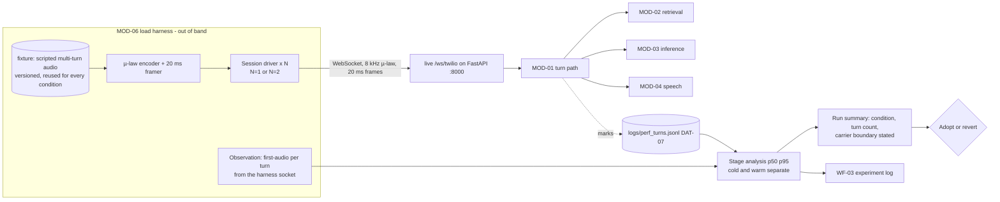

> **Lens:** PO / TPO (technical ACs) / Architect (HLD, LLD) · **Engagement:** Brownfield — `D:\project\universityDemo`

# US-002 — N=1/N=2 load harness at carrier framing [Lens: PO]

- **Status:** **IN PROGRESS - harness drives the live WS; TAC-1 framing FAILS; 2 gaps open**

- **Story:** As a **developer running performance experiments**, I want **scripted caller audio replayed into the live WebSocket endpoint at 8 kHz µ-law and 20 ms framing, at one and two concurrent callers**, so that **concurrency can be measured without two humans on two phones and without a harness that flatters the system**.
- **Business value:** `BRD-05` (two simultaneous callers) cannot be claimed, and `BRD-07`/`BRD-11`/`BRD-12` cannot be verified, by any means that exists today. This story turns "two callers" from an assumption (`AS-01`) into a measured condition.
- **Priority:** **Must** — TPO ordering note: builds with US-001 and US-003 as the Phase A deliverable; every concurrency story downstream (US-008, US-012, US-013) has no pass/fail evidence until this harness exists.

## Acceptance Criteria [Lens: PO]

**AC-1.** The harness drives the real endpoint, at real framing.

```gherkin
Scenario: A scripted single-caller conversation completes against the live stack
  Given the stack is running and warmed
  When the harness plays a multi-turn fixture at 8 kHz µ-law, 20 ms per frame, into the live WebSocket endpoint
  Then the app answers every turn of the fixture
  And the harness reports each turn's first-audio time as observed from its own socket

Scenario: Two callers are driven simultaneously
  Given the same fixture set is used for every condition
  When the harness opens two sessions and replays a fixture on each
  Then both sessions complete their turns
  And the harness attributes every measurement to the session that produced it
```

**AC-2.** A measurement is never reported without its sample size and condition.

```gherkin
Scenario: A latency figure is reported
  Given a harness run has completed
  When the run summary is produced
  Then it states the turn count, whether the run was N=1 or N=2, and whether it was cold or warm
  And a figure quoted without a turn count and condition is not reportable

Scenario: Cold and warm are reported separately
  Given a run includes a first turn after an idle gap
  When the summary is produced
  Then the cold turn is reported in its own bucket
  And it is never averaged into the warm p95
```

**AC-3.** The harness says what it cannot see.

```gherkin
Scenario: A harness figure is quoted
  Given a figure derived from a harness run
  When it is written into a run report or an experiment log
  Then it states that the Twilio round trip is excluded
  And it is never presented as an end-to-end caller measurement
```

**AC-4.** A run whose records interleave is discarded, not reported.

```gherkin
Scenario: The two callers' traces interleave at N=2
  Given both callers' records merge or interleave in logs/perf_turns.jsonl
  When the run is assessed
  Then the run is discarded and re-run
  And no latency claim is taken from it

Scenario: A fixture file is not in the expected shape
  Given a fixture contains a malformed turn entry
  When the harness loads it
  Then the harness fails loudly with the offending entry named
  And the run does not proceed with a silently shortened fixture
```

**AC-5.** The harness is versioned with its numbers.

```gherkin
Scenario: A number is traced back to its input
  Given a reported figure
  When the fixture file that produced it is requested
  Then the fixture file is version-controlled and identifiable
  And the same fixture set is reused for every condition so runs are comparable
```

Technical acceptance criteria [Lens: TPO] — performance, security, resilience checks the code must pass:

- TAC-1: **Framing fidelity** — the harness emits 8 kHz µ-law frames at 20 ms; a frame-timing audit shows no frame more than 5 ms off its 20 ms slot over a 60-second stream.
- TAC-2: **Sample size** — a standard run delivers ≥100 turns per condition (`BRD-02` §11 criterion 2).
- TAC-3: **Concurrency claim** — the N=2 assertion is validated on three consecutive runs, each with both callers' records separated and complete (`BRD-05` §11 criterion 3).
- TAC-4: **Soak** — a 30-minute N=2 soak completes producing approximately **240 trace rows** (2 callers × 1800 s ÷ 15 s per turn; `DAT-07` scale profile) with no session dropped by the harness itself. The figure is the expected volume for detecting a silent drop, not a pass threshold.
- TAC-5: **Turn ceiling** — the harness reports any turn exceeding 3,000 ms as a failure of the run, not as an outlier to be trimmed (the per-turn cap in `BRD-05`).
- TAC-6: **No hosted service and no new dependency** — the harness speaks the carrier protocol itself; no k6, no Locust, no Pipecat pipeline (`REC-01` is not reopened).
- TAC-7: **Window isolation** — a latency run refuses to start while a quality evaluation is in progress, and vice versa (`WF-03` step 3).
- TAC-8: **Network-condition injection** — the harness can inject **jitter, packet delay, packet loss, disconnect/reconnect, and late or out-of-order frames**, each as a **named, parameterised profile**. The profile is recorded in the run summary beside the fixture sha256, and a run with no profile states `"clean"` explicitly rather than leaving the field absent. Injection perturbs the frame stream the app consumes; no application code is modified, and no application code is aware of the harness.
- TAC-9: **An injected profile is a condition, not a footnote** — ≥100 turns per profile (`BRD-02` §11 criterion 2), and a figure measured under an injected profile is never pooled with a clean-framing figure. Every such figure is reported as a **local injected condition**, never as carrier behaviour: a loopback socket cannot produce genuine network-layer loss or reordering, and carrier-side (Twilio PSTN) conditions are validated with **real calls**, not simulated.

## HLD — Architecture Slice [Lens: Architect]

The harness is an **external client**, not an internal caller: it drives the same WebSocket surface a carrier uses, so the measurement includes everything the caller's audio passes through.



- **Components touched:**
  - `MOD-06` (new) — the harness script and its fixture set; lives beside `doc/perf/tools/a4_prefix_cache_probe.py`, which is an experiment, not a harness.
  - `MOD-01` — not modified. The harness is a client of `/ws/twilio`; if the endpoint refuses a third session (the designed degradation), the harness reports it rather than forcing admission.
  - `MOD-06` trace sink — consumed read-only by the run summary; the harness never writes traces itself.
  - `MOD-07` — consumed, not modified: the harness requires a warmed stack and a readiness report before a run starts, and reports the stack's state with the numbers.
- **Interaction summary:**
  1. The operator warms the stack (`US-007`) and confirms readiness; the harness refuses to run against a stack that reports not-ready.
  2. The harness loads a versioned fixture, frames it as 8 kHz µ-law at 20 ms, and opens one or two WebSocket sessions against the live endpoint.
  3. Each session replays its scripted turns; the harness timestamps first-audio arrival on its own socket and the app appends one `DAT-07` record per turn.
  4. The run summary joins the two views: harness-observed first-audio and app-observed stage decomposition, at the stated condition, with the carrier boundary named.
  5. **Failure path:** if the two callers' records interleave, the run is discarded and re-run — a discarded run is not a passing run (`WF-02` step 6). If a turn exceeds 3,000 ms, the run fails.
  6. **Failure path:** if a dependency is killed mid-run (the `BRD-13`/`BRD-14` drill), the harness continues the other session and records whether it was disturbed.

## LLD — Implementation Detail [Lens: Architect]

- **Classes / functions / APIs** — Python 3.11, standard library plus the `websockets` client already in the environment; no `app.*` imports in the harness's measurement path:

```
# doc/perf/tools/harness.py  (MOD-06)

ULAW_FRAME_BYTES = 160        # 20 ms of 8 kHz µ-law = 160 samples = 160 bytes
FRAME_INTERVAL_S = 0.020

@dataclass(frozen=True)
class FixtureTurn:
    audio_ulaw: bytes         # already framed, or PCM to be framed at load
    expect_keywords: tuple[str, ...]   # deterministic check, not a judge

@dataclass(frozen=True)
class Fixture:
    fixture_id: str           # versioned; every number traces back to this id
    sha256: str               # frozen alongside the run summary
    turns: tuple[FixtureTurn, ...]
    intent: str               # one of the 28; used for per-intent reporting

def load_fixture(path: Path) -> Fixture: ...
    # raises FixtureError naming the offending entry; never skips a bad case

class SessionDriver:
    def __init__(
        self, url: str, fixture: Fixture, label: str,
        profile: NetworkProfile = CLEAN,
    ) -> None: ...
    async def run(self) -> SessionResult: ...
        # opens one WebSocket, paces frames on a 20 ms monotonic schedule
        # (shifted and perturbed by the profile), records first_audio_ms per
        # turn from its own socket

@dataclass
class SessionResult:
    label: str                # "A" | "B"
    turns: list[TurnObservation]   # first_audio_ms, turn_index, exceeded_cap: bool

@dataclass(frozen=True)
class NetworkProfile:
    """A named injection applied to the frame stream the app consumes.
    Not a network emulator: a loopback socket cannot drop or reorder packets,
    so the profile perturbs arrival, not the wire. (TAC-8)"""
    profile_id: str                    # "clean" is a profile too, and is recorded
    frame_delay_ms: float = 0.0        # added to every frame's 20 ms slot
    jitter_ms: float = 0.0             # per-frame variation around the slot
    loss_percent: float = 0.0          # frames dropped from the stream
    reorder_percent: float = 0.0       # frames sent after their successor
    disconnect_at_turns: tuple[int, ...] = ()   # close, then re-open the socket

CLEAN = NetworkProfile(profile_id="clean")

async def run_condition(
    url: str,
    fixtures: Sequence[Fixture],
    n: int,
    warm_gate: bool = True,
    profile: NetworkProfile = CLEAN,
) -> RunSummary: ...
    # The profile is carried into the summary so a figure measured under loss
    # is never confused with one measured under clean framing (TAC-9).

@dataclass
class RunSummary:
    condition: str            # "N=1" | "N=2"
    thermal_state: str        # "cold" | "warm"  - never blended
    turn_count: int
    fixture_sha256: str
    network_profile: str      # "clean" or the profile id; always stated
    p50_ms: float; p95_ms: float; worst_ms: float
    carrier_boundary_excluded: bool = True   # always True; printed in every summary
    discarded: bool           # True when records interleaved
    discard_reason: str | None
```

- **Data schema changes** — no durable schema. The harness consumes `DAT-07` (created by US-001) and writes run summaries:

```jsonc
// doc/perf/runs/<fixture_sha256>__N2__warm__<timestamp>.json
{
  "condition": "N=2",
  "thermal_state": "warm",
  "turn_count": 128,
  "fixture_sha256": "…",
  "fixtures": ["fees-01", "deadline-03", "handoff-02"],
  "network_profile": "clean",
  "profile_parameters": { "frame_delay_ms": 0.0, "jitter_ms": 0.0,
                          "loss_percent": 0.0, "reorder_percent": 0.0,
                          "disconnect_at_turns": [] },
  "first_audio_ms": { "p50": 2412.0, "p95": 2880.4, "worst": 2994.1 },
  "per_stage_ms": { "endpoint": 600.0, "stt": 286.0, "retrieval": 391.0,
                    "prefill": 702.0, "decode_first_clause": 388.0,
                    "synthesis_first_chunk": 244.0, "carrier": null },
  "carrier_boundary_excluded": true,
  "records_separated": true,
  "turns_over_3000ms": 0,
  "stack_readiness": "ready"
}
```

- **Edge cases** — enumerated, each with the decided behavior:

| Edge case | Decided behavior |
|---|---|
| A malformed fixture entry | `FixtureError` naming the entry; the run does not start. A broken fixture must not silently shrink the set |
| The endpoint refuses a third session | Reported as the designed degradation (`06-architecture.md` §5 MOD-01), not forced; the N=2 run itself is unaffected |
| Two callers' trace records interleave | Run marked `discarded: true` with the reason; no claim taken from it |
| A turn exceeds 3,000 ms | `turns_over_3000ms` increments; the run fails its cap assertion and is not reported as a pass |
| A session drops mid-run | The surviving session continues to completion; the run is reported as partial with the dropped turn count stated |
| The stack is not warmed | The harness refuses to start and names the unmet readiness condition (it is a *comparative* instrument, so a cold start contaminates every condition) |
| A quality evaluation is running | The harness refuses to start — latency and quality are measured in separate windows (`WF-03` step 3) |
| Fixture audio longer than the max-utterance cap | The harness expects the ~6 s forced-turn behavior and asserts it rather than treating the extra turn as noise |
| Clock drift between sessions | Frame pacing uses a per-session monotonic base; cross-session comparison uses the app's own `DAT-07` marks, not harness wall clocks |
| Frames are delayed past their 20 ms slot (jitter / packet delay) | The profile is named and its parameters recorded in the summary. The observed turn behaviour is recorded as a **measurement**, not asserted against a threshold — the harness sets no requirement on what jitter should do to the turn |
| Frames are dropped from the stream (packet loss) | Same: the injected loss is a property of the frame stream the app consumes, the profile is named, and the effect is measured. The app is unmodified and unaware |
| A frame is delivered after its successor (late / out-of-order) | The app reads only the media payload and no sequence number (`app/main.py:610–616`), so reordering is indistinguishable from lateness at the boundary it consumes. The harness records that limit rather than claiming to have reproduced true out-of-order delivery |
| The socket is closed mid-call (disconnect/reconnect) | The app ends the session on the drop — `SM-01` has **no resume** — and a re-opened stream is admitted as a **new session**. The harness records that outcome instead of expecting the call to resume, and the re-connection is reported as a new session in the summary |
| A carrier-side condition is attributed to a harness run | Rejected: PSTN jitter, carrier-leg loss and carrier disconnect behaviour are not reproducible locally. They are validated with **real calls**, and no harness figure is presented as carrier behaviour (`TAC-9`) |
| GRPC/HTTP retries inside a dependency | Not a harness concern; the harness observes only what reaches its socket, which is the point |

- **Error handling** — `FixtureError` (malformed input, raised before the run), `ReadinessError` (stack not warm, `BRD-17` unmet, raised before the run), and `RunDiscarded` (records interleaved or a per-turn cap exceeded, raised after the run and carried in the summary's `discarded`/`discard_reason` fields). Nothing is retried silently: a discarded run is re-run deliberately, and the discard is recorded. No harness exception reaches the app; the harness is an out-of-band client and the app has no knowledge of it. An injected network condition is **not** an error path: a dropped frame or a closed socket under a profile is the condition being measured, and it is recorded in the summary's profile fields rather than raised as a harness fault.

- **Test scenarios** — unit / integration / e2e / load, one checkable line each:

| # | Level | Scenario | Covers UC-07 row |
|---|---|---|---|
| T-1 | unit | Frame audit: a 60-second stream contains 3,000 frames, each within 5 ms of its slot (TAC-1) | — (TAC) |
| T-2 | unit | A fixture with a malformed turn raises `FixtureError` naming the entry; nothing is skipped | Invalid input |
| T-3 | unit | `RunSummary` for a blended cold+warm run is refused; cold and warm are separate buckets | — (AC-2) |
| T-4 | unit | Every emitted summary carries `carrier_boundary_excluded: true` and the fixture sha256 | — (AC-3/AC-5) |
| T-5 | integration | One scripted single-caller conversation completes end to end against the live stack | Happy path |
| T-6 | integration | An early-exit noise-gated fixture turn completes and is counted as a turn | Alternate path A1 |
| T-7 | integration | A fixture turn that exercises the clarification loop completes within the one-shot cap | Retry |
| T-8 | integration | A fixture whose intent has no KB content produces the not-relevant path and the turn still completes | Missing data |
| T-9 | integration | The harness refuses to start against a stack reporting not-ready | Dependency failure |
| T-10 | integration | The harness refuses to start while a quality evaluation is running (TAC-7) | Concurrent operation (isolation of measurement windows) |
| T-11 | integration | A session cancelled mid-run leaves the other session's turns intact and the summary marked partial | Cancellation |
| T-12 | e2e | Killing the ERC MCP service mid-run: the affected caller degrades and the other caller's in-flight turn completes unchanged | Dependency failure / Partial completion |
| T-13 | e2e | A 100+ turn N=1 warm run produces a summary with a stated turn count and a warm-only p50/p95 | Happy path |
| T-14 | load | N=2 run: both callers complete; the summary reports `records_separated: true` and `turns_over_3000ms: 0` | Concurrent operation |
| T-15 | load | Three consecutive N=2 runs each pass TAC-3; a run with interleaved records is marked discarded and excluded | Duplicate request / Recovery |
| T-16 | load | 30-minute N=2 soak completes with ≈240 rows and no harness-dropped session (TAC-4) | Recovery |
| T-17 | load | A deliberately injected 2,500 ms stall on caller A's retrieval: caller B's first-audio time is reported alongside it for US-008 to assert against | Partial data / Timeout |
| T-18 | unit | Every summary names a network profile — `"clean"` when none was applied — beside the fixture sha256, with the profile's parameters (TAC-8) | — (TAC) |
| T-19 | unit | A delay/jitter profile shifts frames past their 20 ms slots by the configured amount; the pacing audit attributes the lateness to the profile, not to a harness fault | Timeout |
| T-20 | integration | A loss profile drops frames from the stream; the turn still completes, the profile is named in the summary, and the observed effect is recorded without a threshold being asserted | Missing data |
| T-21 | integration | A late/out-of-order frame is sent after its successor; the harness records that the app consumes frames in arrival order and reads no sequence, so the reordering is indistinguishable from lateness at that boundary | Invalid input |
| T-22 | integration | A disconnect/reconnect profile closes the socket and re-opens it mid-call: the app ends the session and admits the re-opened stream as a new session (`SM-01` has no resume), and the summary reports both events | Cancellation / Recovery |
| T-23 | e2e | An N=2 run under a loss-and-jitter profile: both callers' records stay separated, the summary names the profile, and no figure from the run is reported as carrier behaviour (TAC-9) | Concurrent operation |
| T-24 | load | ≥100 turns under an injected profile produced as its own condition, reported separately from the clean-framing condition and never pooled with it (TAC-9) | — (TAC) |

## Traceability
- Parent module: `MOD-06` (the harness is one of its three deliverables)
- Technical requirement: `TRD-22` (reproducible N=1 and N=2 load harness at carrier framing, including its network-condition coverage requirement — jitter, packet delay, packet loss, disconnect/reconnect, late or out-of-order frames, to the extent the local WebSocket path can reproduce them)
- Use case: `UC-07` (measure a turn) as instrument owner; the harness is the evidence source for `UC-03` (serve a second caller concurrently) and `WF-02`
- Business requirement: `BRD-01` (the baseline measurement is only obtainable through this harness) and `BRD-05` (two simultaneous callers — verified, not asserted); contributes to `BRD-07`, `BRD-11`, `BRD-12`, `BRD-13`, `BRD-14`
- Data gap / state machine: `DG-02` (no arrival-rate measurement exists — the harness is how the assumed peak of 2 is validated or corrected); produces the N=2 half of `DAT-07`
- Reconciliation: `REC-01` (Pipecat is **not** adopted — the harness speaks the carrier protocol itself, and a general load tester cannot speak µ-law at carrier framing)
- Related workflow: `WF-02` (two concurrent calls) and `WF-03` step 3 (latency runs in their own window)
- Honest boundary (stated, not worked around): the harness reproduces network conditions **at the frame stream the app consumes**, because a loopback socket cannot drop or reorder packets. **Carrier-side (Twilio PSTN) conditions cannot be reproduced locally at all** and are validated with **real calls** — every figure from an injected profile is reported as a local injected condition, never as a measurement of carrier behaviour (`TAC-9`)

## LLD test mapping — T-1 … T-24, reconciled 2026-09-19

US-002 has **no `test_us002*.py` suite**. Its acceptance evidence is the
harness's own `--self-test` (`doc/perf/tools/load_harness.py:3324`), and unlike
US-006 and US-007 that self-test **does cite scenario ids** — `fixture
validation T-2`, `summary contract T-3/T-4/T-18/TAC-5/AC-4`, `profile injection
T-19/T-20/T-21`. So this story's mapping was partly present already, and this
reconciliation extends it to all 24 rather than starting from nothing.

| LLD | Requires | Satisfied by | Status |
|---|---|---|---|
| T-1 | 60 s stream = 3,000 frames, each within 5 ms of its slot (TAC-1) | `_st_frame_audit(60.0)` | **COVERED AND FAILING.** Measured on this host: 15 frames over 5 ms, max deviation 25.7 ms, `tac1_holds_strict False`. The harness documents it itself at `:833-845` ("strict TAC-1 is not reachable on this host"). A failing gate that says so is worth more than a passing one that cannot |
| T-2 | Malformed fixture raises `FixtureError` naming the entry | `_st_fixture_validation` | **COVERED** |
| T-3 | A blended cold+warm summary is refused | `_st_summary_contract` | **COVERED** |
| T-4 | Every summary carries `carrier_boundary_excluded: true` + fixture sha256 | `_st_summary_contract` | **COVERED** |
| T-5 | One scripted single-caller conversation completes end to end | — | **GAP** — needs a live stack; the self-test is offline by design |
| T-6 | A noise-gated fixture turn completes and is counted | — | **GAP** |
| T-7 | A clarification-loop turn completes within the one-shot cap | — | **GAP** |
| T-8 | An intent with no KB content produces the not-relevant path | — | **GAP** |
| T-9 | The harness refuses to start against a stack reporting not-ready | `ReadinessError` exists (`:156`) | **GAP — and structurally so.** The harness cannot refuse on readiness because there is no readiness surface to report against; it records `stack_readiness: "assumed - no readiness surface exists"` instead. The refusal path exists and has nothing to consult |
| T-10 | The harness refuses to start while a quality evaluation runs (TAC-7) | `eval/.eval_in_progress` | **GAP — and self-documented.** The harness looks for the lock and records "no runner creates this lock today (US-003 writes none); this is the hook the interlock needs, not a working interlock". The check is present; the lock is never written |
| T-11 | A cancelled session leaves the other's turns intact, summary marked partial | — | **GAP** |
| T-12 | Killing the ERC MCP mid-run: one caller degrades, the other is unaffected | — | **GAP** |
| T-13 | A 100+ turn N=1 warm run with stated count and warm-only p50/p95 | N=1 runs exist (99 scored turns) | **PARTIAL** — runs of the right size exist and have been analysed; T-13 as written is a scenario, not a run |
| T-14 | N=2: both complete; `records_separated: true`; `turns_over_3000ms` reported | five N=2 runs in `doc/perf/runs/` | **COVERED BY RUNS** — and every one reports `records_separated: true` with 0 unattributed rows, which is the TAC-8/`TRD-22` separation assertion actually passing under load |
| T-15 | Three consecutive N=2 runs each pass TAC-3 | — | **GAP** — this is US-008's gate too |
| T-16 | 30-minute N=2 soak, ≈240 rows, no harness-dropped session (TAC-4) | — | **GAP** — the soak has not been run |
| T-17 | A 2,500 ms injected stall on A: B's first-audio time is not moved by it | — | **GAP** |
| T-18 | Every summary names a network profile beside the fixture hash | `_st_summary_contract` | **COVERED** |
| T-19 | A delay/jitter profile shifts frames past their 20 ms slots by the configured amount | `_st_profile_injection` | **COVERED** |
| T-20 | A loss profile drops frames; the turn still completes; the profile is named | `_st_profile_injection` | **COVERED** |
| T-21 | A late/out-of-order frame is sent after its successor; the app behaviour is recorded | `_st_profile_injection` | **COVERED** |
| T-22 | A disconnect/reconnect profile closes and re-opens mid-call; the app ends the session | `disconnect_at_turns` in the profile | **PARTIAL** — the mechanism exists and is exercised by the self-test's injection case, but no scenario drives an actual reconnect against the live stack |
| T-23 | N=2 under loss-and-jitter: records stay separated, the summary is marked | — | **GAP** |
| T-24 | ≥100 turns under an injected profile, reported as its own condition | — | **GAP** |

**Coverage: 8 covered (one of them failing), 1 covered by runs, 2 partial, 13 gaps.**

### What this story's mapping says that the others did not

**This is the first D1 story whose mapping was already partly there.** The
self-test cites its scenarios by id, which is why the traceability gate found
fewer uncited ids here than the raw count suggested — and why the gate's
file-discovery matters, for the reason below.

**T-9 and T-10 are gaps with nothing wrong in the code.** Both are refusal
paths the harness *built* and cannot exercise: T-9 needs a readiness surface to
refuse against (`US-007`'s open half, now appearing a fourth time), and T-10
needs `eval/.eval_in_progress` to be written by a runner that does not exist
(`US-003`'s unbuilt half). The harness says both out loud in its own output.
That is the right behaviour and it still means two scenarios cannot pass.

**T-1 is covered, failing, and honestly reported.** The 60-second frame audit
returns 15 late frames and `tac1_holds_strict False` on this host, and the
harness documents the limitation rather than lowering the bar. It is the only
scenario in the programme found *failing by design* rather than missing.

**A correction to an earlier version of this very paragraph.** It first
claimed the traceability gate under-counts because it did not scan
`load_harness.py`. That was wrong, and checking it took one command. The truth
is the reverse: the story **never named its own deliverable** — `grep -c
load_harness` over the file before this matrix was **0** — so the gate had no
path to resolve and found one evidence file instead of three. Writing this
matrix is what added the reference, which is why the gate now sees ten of the
self-test's T-ids and reports US-002 at **14 uncited LLD scenarios, not 24**.

The distinction matters for how the number is read. The gate was not failing to
look where the evidence was; the story was not pointing at it. That is a
different defect with a different fix — and it is the same shape as the rest of
this audit, where the document and the artefact had drifted apart rather than
either being broken.

**One thing this leaves open and I am not resolving here.** After the matrix was
written the gate also began reporting US-002 with **0 uncited ACs and 0 uncited
TACs**, up from 5 and 9. The evidence list now includes files that carry generic
`AC-n` / `TAC-n` strings of their own, and a scoped-by-story citation model can
be fooled by that. Either the jump is legitimate — the story now names files
that genuinely cite those ids — or the gate is granting credit it should not.
**It has not been checked, so the AC and TAC columns for this story should be
treated as unverified until it is.**

## Definition of Done
- [ ] All ACs pass (AC-1 … AC-5, TAC-1 … TAC-9)
- [ ] Tests from the LLD test scenarios pass (T-1 … T-24)
- [ ] Perf/load test passed against the story's TACs (TAC-1 framing audit, TAC-3 three consecutive N=2 runs, TAC-4 30-minute soak, TAC-9 ≥100 turns under an injected profile reported as its own condition)
- [ ] Schema migration applied — n/a; the harness consumes `DAT-07` and writes run summaries
- [ ] Module docs updated if contracts changed — `MOD-06` B.3 (harness → live WebSocket endpoint row) and B.2 (numbers) if the fixture set or pacing differs; `TRD-22`'s network-condition coverage if a profile's parameters or the injectable set changes
- [ ] Fixture set committed and versioned; every reported figure traceable to a fixture sha256 and a named network profile
- [ ] The carrier boundary is stated on every figure, including figures produced under an injected profile: a local injected condition is never presented as carrier behaviour, and carrier-side PSTN conditions are validated with real calls (`TAC-9`)
