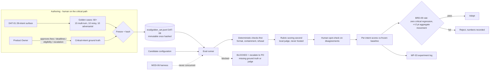

> **Lens:** PO / TPO (technical ACs) / Architect (HLD, LLD) · **Engagement:** Brownfield — `D:\project\universityDemo`

# US-003 — Frozen golden set and evaluation runner [Lens: PO]

- **Story:** As a **Product Owner accountable for answer quality**, I want **a frozen, hashed, task-representative evaluation set with my approved ground truth for the critical intents, and a runner that scores candidates against it**, so that **"no quality regression" is a checkable claim instead of an opinion, and a change that would hurt a fee or deadline answer is stopped before a caller hears it**.
- **Business value:** `BRD-08`/`BRD-09` are the only defence for the 28-intent behaviour surface while the program changes what the model sees and how fast it speaks. Without this set, every Class B and C change in the program ships unmeasured.
- **Priority:** **Must** — TPO ordering note: this is `DG-03`, the **only `block` decision** in Stage 4. It gates the quality half of `WF-03` and it is blocked on a human (PO ground truth, `AS-05`), not on engineering — so it is started first and finished first, and the engineering half (runner, freeze, hashing) proceeds while the ground truth is authored.

## Acceptance Criteria [Lens: PO]

**AC-1.** The set is frozen, hashed and scored before any change alters what the model sees or says.

```gherkin
Scenario: The baseline is recorded before a change lands
  Given the set is authored and the critical-intent ground truth is approved
  When the set is frozen
  Then its hash is recorded together with the baseline per-intent scores
  And every later candidate is scored against the same hash

Scenario: The set is changed after the freeze
  Given a case file is edited after its hash was recorded
  When a new run is attempted
  Then the run is refused against the recorded baseline
  And the change is recorded as a new freeze, not as a comparison
```

**AC-2.** A missing ground truth blocks, loudly — it is never a pass and never a zero.

```gherkin
Scenario: Ground truth is missing for a critical intent
  Given fees, deadlines, eligibility or escalation has no approved ground truth
  When the evaluation runs
  Then the run reports BLOCKED for that intent and escalates to the Product Owner
  And it does not report a score of zero
  And it does not report a pass

Scenario: The judge is unavailable
  Given the local judge model cannot be reached
  When the evaluation runs
  Then the run reports BLOCKED
  And no case is scored as zero on its behalf
```

**AC-3.** A critical intent may not be traded for an aggregate gain.

```gherkin
Scenario: Aggregate improves while a critical intent regresses
  Given a candidate scores higher on aggregate
  And it regresses fees, deadlines, eligibility, escalation or lead capture
  When the adoption rule is applied
  Then the candidate is rejected
  And the rejection records the regressed intent and the numbers behind it

Scenario: A format check passes while the answer is wrong
  Given a case whose answer is well-formatted but factually wrong
  When it is scored
  Then the rubric catches it and the case fails
  And a deterministic format pass alone does not carry the case
```

**AC-4.** The set is representative, and the held-out split is spent once.

```gherkin
Scenario: The set covers the intent surface
  Given the set is authored
  Then it holds 60+ cases across the 28-intent surface
  And it includes 15 multi-turn, 10 noisy-ASR and 10 adversarial cases
  And a held-out 20% split is marked and never used for tuning

Scenario: A run tunes against the held-out split
  Given a candidate was tuned against held-out cases
  When the run is reported
  Then the run invalidates itself for that split
```

**AC-5.** Evaluation never runs concurrently with latency measurement.

```gherkin
Scenario: A candidate is evaluated
  Given the stack is up and no latency run is in progress
  When the evaluation runs
  Then it completes in its own window, with no harness traffic
  And a run that collided with a latency measurement is discarded, not reported
```

Technical acceptance criteria [Lens: TPO] — performance, security, resilience checks the code must pass:

- TAC-1: **Determinism** — re-running the runner on a frozen set against an unchanged configuration yields byte-identical per-case verdicts, demonstrated twice.
- TAC-2: **Malformed case rejection** — the runner rejects a malformed case and names it; it never skips one, so a broken fixture cannot silently shrink the set.
- TAC-3: **Coverage is stated** — every run summary prints the case count and the per-intent coverage it achieved; a partial run is reported as partial and never extrapolated to the whole set.
- TAC-4: **No hosted judge** — the judge is local and the data stays on the box (`AS-03`); a configuration pointing at a hosted endpoint fails the run's preflight.
- TAC-5: **Resumability** — an interrupted run resumes from the last completed case without re-scoring it or losing it.
- TAC-6: **Run duration budget** — a full 60+ case run completes within the developer's experiment window so the gate is actually run rather than skipped; the measured duration is recorded in the experiment log.
- TAC-7: **Ground truth ownership is explicit** — every critical case carries an approver field; a case marked critical with no approver blocks rather than scores.

## HLD — Architecture Slice [Lens: Architect]

The runner is **out of band**: it never sits on the turn path, it is never imported by the app, and it is gated by the same readiness condition as the harness so a run is taken on a properly warmed stack.



- **Components touched:**
  - `MOD-06` (new) — `eval/golden_set.jsonl` (`DAT-08`), the case schema, the freeze/hash step, and the runner.
  - `MOD-06` — the runner consumes the harness's absence as a precondition and records the window in the experiment log (`WF-03` step 3).
  - `MOD-07` — consumed: the runner requires a readiness report and records it with the scores, so a score is never attached to an unwarmed stack.
  - `MOD-03` — not modified by this story, but it is the module every candidate configuration is applied to, and `UC-10`'s model sweep is its first consumer.
- **Interaction summary:**
  1. Cases are authored against the 28-intent surface and the Product Owner approves ground truth for the four critical intents (`AS-05`); this is a human task on the critical path and no engineering work removes it.
  2. The set is hashed at freeze time; the hash is recorded with the baseline per-intent scores for the current configuration.
  3. A candidate configuration is applied; the runner executes deterministic checks first, rubric scoring second, and a human spot-check on disagreements.
  4. Per-intent results are compared against the frozen baseline and the `BRD-09` rule is applied: zero regression on any critical intent, ≤2 pt aggregate movement elsewhere.
  5. **Failure path:** if ground truth for a critical intent is absent, or the judge is unavailable, the run reports **BLOCKED** and escalates to the Product Owner — never a zero, never a pass.
  6. **Failure path:** if a latency run was in progress, the evaluation window is discarded and re-run; if the case file changed under the frozen hash, the run is refused and recorded as a new freeze.

## LLD — Implementation Detail [Lens: Architect]

- **Classes / functions / APIs** — Python 3.11, standard library plus the local model client; no `app.*` imports in the runner's scoring path:

```
# eval/runner.py  (MOD-06)

@dataclass(frozen=True)
class GoldenCase:
    case_id: str
    intent: str                    # one of the 28
    critical: bool                 # fees | deadlines | eligibility | escalation
    approved_by: str | None        # PO approver; None on a critical case => BLOCKED
    split: Literal["tuned", "held_out"]
    question: str
    expected: ExpectedOutcome      # keywords / refusal / escalation / multi-turn chain
    tags: tuple[str, ...]          # "multi_turn" | "noisy_asr" | "adversarial"

class GoldenSet:
    def __init__(self, path: Path) -> None: ...
    @property
    def sha256(self) -> str: ...   # computed once; the freeze identity
    def cases(self) -> tuple[GoldenCase, ...]: ...
    # load() rejects and NAMES a malformed case; it never skips

class Verdict(StrEnum):
    PASS = "pass"; FAIL = "fail"; BLOCKED = "blocked"

@dataclass(frozen=True)
class Score:
    case_id: str; run_id: str; verdict: Verdict; detail: str; intent: str

class DeterministicChecks:
    def run(self, case: GoldenCase, answer: str) -> Verdict | None: ...
    # format, containment, refusal behaviour; returns None when it cannot decide

class RubricJudge:
    def score(self, case: GoldenCase, answer: str) -> Verdict: ...
    # local model only; raises JudgeUnavailable rather than returning a verdict

class EvalRunner:
    def __init__(self, golden: GoldenSet, baseline: Baseline | None,
                 checkpoint: Path) -> None: ...
    def run(self, candidate: str) -> RunReport: ...
    def resume(self) -> RunReport: ...      # from the last completed case

@dataclass(frozen=True)
class RunReport:
    run_id: str; golden_sha256: str; candidate: str
    per_intent: dict[str, IntentScore]
    aggregate_delta_pt: float
    critical_regressions: tuple[str, ...]
    coverage: CoverageReport               # case count, per-intent coverage achieved
    blocked: tuple[str, ...]               # intents blocked, with the reason
    verdict: Literal["adopt", "reject", "blocked"]
    latency_run_overlapped: bool           # True => run discarded
```

- **Data schema changes** — `DAT-08` does not exist today; this story creates it. The sink is a versioned, human-readable, hashable JSONL file the Product Owner can edit without a tool.

```jsonc
// eval/golden_set.jsonl - one case per line, immutable once hashed
{
  "case_id": "fees-001",
  "intent": "fees",
  "critical": true,
  "approved_by": "PO",                       // required on a critical case
  "split": "tuned",
  "question": "how much is the tuition for the MSc programme",
  "expected": {
    "kind": "answer",
    "must_contain": ["<PO-approved figure>"],   // ground truth supplied by the PO, not invented
    "must_not_contain": ["connection error", "timeout"]
  },
  "tags": []
}
```

```jsonc
// eval/runs/<golden_sha256>__<candidate>__<timestamp>.json
{
  "run_id": "…", "golden_sha256": "…", "candidate": "streaming=on,floor=0.42",
  "coverage": { "cases_total": 64, "cases_scored": 64, "per_intent": { "fees": 6, "deadlines": 5 } },
  "per_intent": { "fees": { "baseline_pt": 91.2, "candidate_pt": 91.2, "delta_pt": 0.0 } },
  "aggregate_delta_pt": 0.4,
  "critical_regressions": [],
  "blocked": [],
  "verdict": "adopt",
  "latency_run_overlapped": false,
  "stack_readiness": "ready"
}
```

- **Edge cases** — enumerated, each with the decided behavior:

| Edge case | Decided behavior |
|---|---|
| Malformed case line | `FixtureError` naming the case; the run refuses to start. A broken fixture must not silently shrink the set |
| Missing ground truth for a critical intent | `BLOCKED` for that intent, escalated to the PO with the intent named. Never a zero, never a pass |
| A critical case with `approved_by: null` | Treated as missing ground truth — blocked, not scored |
| Judge model unavailable | `JudgeUnavailable` → the run reports BLOCKED; no case is scored as zero on the judge's behalf |
| Partial run | Reported as partial with per-intent coverage stated; results are never extrapolated to the whole set |
| Held-out split reused | The run invalidates itself for that split; the held-out 20% is scored once at the end |
| Case file edited after freeze | Comparison against the recorded baseline is refused; recorded as a new freeze with a new hash |
| Latency run overlaps the evaluation | The window is discarded, not reported |
| Re-run on a frozen set | Byte-identical per-case verdicts; a re-run resumes from the last completed case |
| Aggregate improves with one critical regression | Rejected by rule; the regressed intent and numbers are recorded (`BRD-09`) |
| Format passes, content wrong | The rubric fails the case; a deterministic pass alone never carries a case (`UC-08` E2) |
| An intent with zero cases | Reported as uncovered in `coverage`, not omitted — silence would read as a pass |

- **Error handling** — `FixtureError` (malformed case or unfrozen comparison, raised before scoring), `JudgeUnavailable` (dependency failure, converts the run to BLOCKED), `LatencyWindowConflict` (a harness run is live, run discarded), and `EvalBlocked` (ground truth missing — the designed behaviour of `BRD-08`/`DG-03`, not an error case). Nothing is ever caught and downgraded to a pass: the runner has three verdicts and no fourth, and the fallback for every uncertainty is **blocked**. No hosted judge is reachable by construction (`AS-03`); a preflight fails a run whose judge endpoint is not loopback.

- **Test scenarios** — unit / integration / e2e / load, one checkable line each:

| # | Level | Scenario | Covers UC-08 row |
|---|---|---|---|
| T-1 | unit | Two consecutive runs on a frozen set produce byte-identical per-case verdicts (TAC-1) | Duplicate request |
| T-2 | unit | A malformed case line raises `FixtureError` naming it; no case is skipped (TAC-2) | Invalid input |
| T-3 | unit | A critical case with `approved_by: null` yields BLOCKED, not a score | Missing data |
| T-4 | unit | A judge outage converts the run verdict to `blocked`; no case is scored zero | Dependency failure |
| T-5 | unit | A summary from a run covering 40 of 64 cases states `cases_scored: 40` and never extrapolates | Partial data |
| T-6 | unit | A run against a case file whose hash differs from the baseline is refused and recorded as a new freeze | Invalid input |
| T-7 | unit | A candidate with a critical regression and a positive aggregate delta renders `reject` | Happy-path rule (adoption decision) |
| T-8 | unit | A well-formatted but factually wrong answer fails on the rubric alone | Happy path / E2 |
| T-9 | integration | A held-out case appears in the run's held-out bucket and is refused as a tuning input | Alternate path A1 |
| T-10 | integration | Interrupting a run mid-way and resuming scores only the remaining cases (TAC-5) | Recovery / Cancellation |
| T-11 | integration | A run started while the US-002 harness is live is marked `latency_run_overlapped` and discarded | Concurrent operation |
| T-12 | integration | A candidate that answers a fees question from an unrelated chunk fails that case | Partial data |
| T-13 | e2e | Authoring preflight: a case file with an uncovered intent reports the intent as uncovered | Partial completion |
| T-14 | e2e | A full 60+ case run on the frozen set completes inside the experiment window (TAC-6) and records its duration | Timeout (the window is bounded) |

## Traceability
- Parent module: `MOD-06` (frozen golden set and its scorer are one of its three deliverables)
- Technical requirement: `TRD-23` (frozen golden set and evaluation runner)
- Use case: `UC-08` (evaluate quality against the frozen set) — all `✓` rows of its Scenario Coverage table are covered by T-1…T-14
- Business requirement: `BRD-08` (frozen quality baseline) and `BRD-09` (no quality regression; aggregate gain may not buy a critical-intent regression)
- Data gap / state machine: `DG-03` (**block** — the only block decision in Stage 4; this story is its engineering half and the PO ground truth is its human half); produces `DAT-08`. `AS-05` (a human supplies critical-intent ground truth) is the constraint this story carries rather than resolves
- Reconciliation: none applicable — `MOD-06` is the program's only net-new module and this asset is classified **Net-new** in `07-brownfield-reconciliation.md` §1 with no existing code to reconcile. `REC-01` is not reopened: the local judge is used, and Pipecat is not adopted
- Related workflow: `WF-03` steps 1, 4–7 (the quality half of the adoption gate), and `UC-10` (the model sweep consumes this set and is blocked by `DG-03` until it exists)

## Definition of Done
- [ ] All ACs pass (AC-1 … AC-5, TAC-1 … TAC-7)
- [ ] Tests from the LLD test scenarios pass (T-1 … T-14)
- [ ] Perf/load test passed — n/a for the turn path (out-of-band tool); TAC-6's run-duration budget is measured and recorded instead
- [ ] Schema migration applied — n/a; `DAT-08` is a net-new versioned JSONL file, not a database
- [ ] Module docs updated if contracts changed — `MOD-06` B.3 (`eval/golden_set.jsonl` row) and B.4 (`GOLDEN_CASE` / `SCORE` entities) if the case schema differs from `TRD-23`
- [ ] **Product Owner ground truth for fees, deadlines, eligibility and escalation authored and approved, or the gate is formally descoped by PO decision** (`DG-03`; the descope is recorded as a PO decision, not a silent omission)
- [ ] Baseline scores recorded with the frozen hash before any Class B/C change is proposed

## Golden set — build status [authoring half of `DG-03`]

**This section records what exists, not a claim that the story is complete.** The engineering
half (case file, held-out split, deterministic checks) is built and runs. The human half —
Product Owner ground truth — has not happened, so **the set is not frozen and nothing in it is
approved**.

**Artefacts.** `eval/golden_set.jsonl` (161 cases, `DAT-08`), `eval/heldout.txt` (32 ids, 19.9%),
`eval/checks.py` (deterministic checks, standard library only, no `app.*` imports),
`eval/README.md` (schema, held-out rule, status policy). Content hash of the case file at this
revision: `9e14a134735053564584e3683d3d2e693b5ace6ef7b5b1aa489d4fb3e4daeaa0` — a build identity
only; it is **not** a freeze, because AC-1 requires the critical ground truth to be approved
before a hash is recorded as a baseline.

**Coverage** (28/28 intents; every intent has at least one case). `verified` = mechanically
transcribed from the knowledge base; `pending` = not approved.

| # | Intent | Cases | Criticality | verified | pending |
|---|---|---|---|---|---|
| 1 | Undergraduate programs | 3 | — | 3 | 0 |
| 2 | Postgraduate programs | 2 | — | 2 | 0 |
| 3 | Doctoral / PhD programs | 3 | — | 2 | 1 |
| 4 | Fees structure | 16 | Critical | 0 | 16 |
| 5 | Scholarships / financial aid | 8 | Critical | 0 | 8 |
| 6 | Important dates / deadlines | 10 | Critical | 0 | 10 |
| 7 | Admission process / eligibility | 10 | Critical | 0 | 10 |
| 8 | Campus / hostel / logistics | 4 | — | 3 | 1 |
| 9 | Accreditation / rankings / overview | 9 | Critical | 7 | 2 |
| 10 | Leadership / history | 2 | — | 2 | 0 |
| 11 | Contact information | 3 | — | 3 | 0 |
| 12 | FAQ | 2 | — | 2 | 0 |
| 13 | Lead capture | 9 | Critical | 0 | 9 |
| 14 | Escalation / handoff to human | 8 | Critical | 0 | 8 |
| 15 | Callback / appointment change | 8 | Critical | 0 | 8 |
| 16 | Outbound call handling | 2 | — | 0 | 2 |
| 17 | Opt-out / decline | 8 | Critical | 0 | 8 |
| 18 | Call termination (sign-off) | 8 | Critical | 0 | 8 |
| 19 | Noise / fragment / unintelligible | 5 | — | 0 | 5 |
| 20 | STT error correction / clarification | 4 | — | 0 | 4 |
| 21 | Multiple requests in one turn | 2 | — | 0 | 2 |
| 22 | Interruption / barge-in | 8 | Critical | 0 | 8 |
| 23 | Backchannel ("mm-hm") | 3 | — | 0 | 3 |
| 24 | Caller silence | 2 | — | 0 | 2 |
| 25 | Topic change | 2 | — | 0 | 2 |
| 26 | Distressed caller | 3 | — | 0 | 3 |
| 27 | Out-of-scope | 9 | — | 0 | 9 |
| 28 | Consequential action confirmation | 8 | Critical | 0 | 8 |
| | **Total** | **161** | **12 Critical** | **24** | **137** |

Category quotas (`AC-4`): **20 multi-turn** (3–6 caller turns), **10 noisy-ASR**, **10
adversarial / out-of-scope / prompt-injection**, **5 interruption**, held-out 20% marked and
cross-checked against the case file in both directions.

**Ground truth: 24 verified, 137 PENDING — 0 approved.** All 137 pending cases are
`approved_by: null`. Six intents are the catalog's *PO sign-off required* rows (4, 5, 6, 7, 14,
22); the rest are pending because their ground truth is behavioural (prompt / deterministic path
/ `app/leads/`) or because the case requires a disambiguation, refusal, correction or capture
move that the knowledge base does not state as a fact. `verified` means *transcribed from
`content/meridian/meridian_knowledge_base.md` and mechanically traced to it* — it does **not**
mean approved. `checks.py` refuses to start if a `verified` case's source names no existing KB
section or a required fact is absent from the knowledge base.

**Consequence today: every one of the 12 Critical intents reports BLOCKED** (`US-003` AC-2,
`BRD-08`) — not a pass, not a zero. The quality half of `WF-03` and `UC-10`'s model sweep stay
gated on `DG-03` exactly as `MOD-06` records.

**What remains before the set can be frozen**
1. **PO verification of the six sign-off intents** — the human task `AS-05` names. Until it
   happens the set cannot be hashed as a baseline, no candidate can be scored against it, and
   `blocked` is the only honest verdict for those intents. This is not removable by engineering.
2. **PO/BA ruling on a criticality discrepancy.** The catalog's table marks **12** rows Critical
   (4, 5, 6, 7, 9, 13, 14, 15, 17, 18, 22, **28**); its own prose and `BRD-18` say **eleven**.
   This set gives every table-marked row ≥8 cases, so it satisfies either reading — but the
   artifacts contradict each other and the count cannot be stated in a report until it is ruled.
3. **`US-014`'s interruption decision.** `CV-01` discards caller audio, so row 22's expected
   behaviour is unreachable today. The five interruption cases are written to the catalog's
   aspiration and flagged as such; their ground truth cannot be approved before the decision.
4. **The runner itself** — the rubric/judge stage, freeze-and-hash step, baseline recording,
   resumability and the `BRD-09` non-inferiority reporting are not built here. Only the
   deterministic half exists.
5. **Sample size.** 15 of 28 intents are below the 8-case floor and are reported
   **underpowered** per `BRD-09`; at n = 8 (the critical-intent floor) the worst-case 95%
   interval half-width is still ±28.5 pt. The set detects gross regression, not fine movement.
6. **Knowledge-base versioning** (`US-010`) — an unversioned KB silently changes ground truth;
   the golden set cannot be tied to the KB revision it was scored against.
