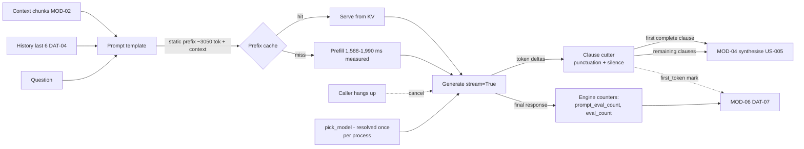

> **Lens:** PO / TPO (technical ACs) / Architect (HLD, LLD) · **Engagement:** Brownfield — `D:\project\universityDemo`

# US-004 — Stream LLM generation to the caller [Lens: PO]

- **Status:** **PARTIAL — BUILT BEHIND `LLM_STREAM` (2026-09-20); adoption BLOCKED - `DG-03` (changes what the model returns)** · `test_us004_stream_llm.py` 17/17 · batch path retained for BRD-15 (the flag is the revert) · Live N=2 warm, LLM+TTS streams on: first-audio **p50 1,625 ms** (batch 2,453; US-005-only 2,250), **p90 2,015 ms** (batch 3,891), **over-cap 6%** (batch 27%); `retrieval_done → llm_first_token` **p50 281 ms**; 33/33 turns carried both `llm_first_token` and `tts_first_chunk` marks · **ROOT-CAUSED + FIXED (2026-09-20): the freeze was `ClauseCutter.feed` re-matching its own boundary forever** (py-spy: MainThread inside `feed()`; the short-clause merge re-added the whitespace the regex had just consumed, so a "Sure. " opening clause hung the whole loop) — fixed by re-joining WITHOUT the whitespace + a non-progress guard, with the exact shape as a regression test. Post-fix N=2 warm, 60 turns/session: **120/120 streamed, zero errors, no 1011** — first-audio **p50 1,579 ms · p90 2,562 ms · over-cap 8%** · TTFT p50 266 ms. Remaining before adoption: DG-03 ground truths; 1011 keepalive timeouts (21:36 PDT, run `T043413Z`); the log stops at the first clause-TTS of the concurrent streams. Prime suspect: misaki/espeak phonemization running ON the loop inside `kokoro.create_stream` under two concurrent streams (a race, not a deterministic block — the first 35 turns streamed clean). Root-cause + fix (phonemization in a worker thread / serialized) pending; until then `LLM_STREAM` stays default-OFF and the batch path is the shipped path. The harness ping bug this run exposed (pings were never actually disabled) is fixed in the harness with a regression check.

- **Story:** As a **caller waiting on the line**, I want **the assistant to start speaking from the first clause the model produces**, so that **I stop waiting in silence for a whole answer to be written before I hear a single word**.
- **Business value:** The non-streaming call is the single largest architectural defect this program addresses (`06-architecture.md` §1). Today the caller waits for the *worst* term in the chain; after this change the caller waits for the *first*.
- **Priority:** **Must** — TPO ordering note: this is the largest single latency lever and it is the prerequisite for US-005 (streaming synthesis has nothing to consume until generation streams). It is flag-gated so the revert is a config change, not a code revert (`BRD-15`).

## Acceptance Criteria [Lens: PO]

**AC-1.** The first clause reaches synthesis before the answer is complete.

```gherkin
Scenario: A multi-sentence answer is spoken incrementally
  Given streaming generation is enabled
  When a caller asks a question whose answer runs to several sentences
  Then the first token is consumed and the first clause is handed to synthesis before the last token is generated
  And the caller hears the opening of the answer before the model has finished writing it

Scenario: Streaming is disabled
  Given streaming generation is disabled by its setting
  When the same question is asked
  Then the previous fully-buffered behaviour returns exactly
  And no code revert is required
```

**AC-2.** An empty or failed generation is never silence.

```gherkin
Scenario: Generation fails or returns empty
  Given the inference engine errors or yields no tokens
  When the turn reaches generation
  Then the failure is surfaced to the turn path rather than swallowed into an empty string
  And the caller hears a spoken apology in that same turn

Scenario: The stream truncates mid-sentence
  Given the token stream ends after a partial clause
  When the turn decides what to speak
  Then what arrived is used only if it forms a complete clause
  And a half-sentence is never spoken
```

**AC-3.** The turn's decomposition stays honest under streaming.

```gherkin
Scenario: Prefill and decode stay separable
  Given a streamed generation completes
  When the trace record is emitted
  Then it carries the engine's prompt_eval_count and eval_count
  And it carries a first-token mark in addition to the completion mark
  And the existing completion mark is not redefined by the new one
```

**AC-4.** A hang-up stops the work.

```gherkin
Scenario: The caller hangs up mid-generation
  Given a generation stream is in flight
  When the carrier socket closes
  Then decoding for that turn stops
  And the sequence's KV allocation is released
  And no queued audio is written to a closed socket
```

**AC-5.** No per-utterance HTTP round trip is paid to resolve the model.

```gherkin
Scenario: A turn begins
  Given the process has already resolved the model once
  When a turn reaches generation
  Then no /api/tags request is issued for that turn
  And model resolution occurs at most once per process lifetime
```

Technical acceptance criteria [Lens: TPO] — performance, security, resilience checks the code must pass:

- TAC-1: **Time to first token, warm** — p95 ≤ **1,000 ms** for this module's share (excluding the 600 ms endpointing floor owned by `MOD-01`), basis: residual prefill of 2,108 tokens at the measured 2,847–3,568 tok/s ≈ 590–740 ms plus first-clause decode ≈ 390 ms.
- TAC-2: **First clause available** — the first complete clause is handed to synthesis within ~390 ms of generation beginning, at the measured 36.6–38.9 tok/s decode rate and ~15 tokens to a clause (25.7–27.3 ms/token).
- TAC-3: **Decode rate is not degraded by streaming** — ≥ **36.6 tok/s** per stream at N=1, measured against the pre-change baseline (the measured range is 36.6–38.9 tok/s, which is 77% of the 448 GB/s memory-bandwidth ceiling).
- TAC-4: **Removed overhead** — zero `/api/tags` round trips per utterance; **1** model resolution per process lifetime, asserted by counting requests at the engine.
- TAC-5: **Cancellation latency** — a hang-up during generation stops decoding within `Assumed: 200 ms` and releases the sequence's KV allocation.
- TAC-6: **Load** — at N=2 both streams generate concurrently and neither caller is refused to protect the other. The per-stream decode rate is **recorded, not required**: report aggregate tok/s, per-stream tok/s, queue time and prefill interference (`TRD-22`). No floor is asserted. This TAC previously carried "decode halves per added stream, each stream ≥ 18 tok/s" — that figure is **withdrawn** (`MOD-03` A.5 criterion 3).
- TAC-7: **Counters reconcile** — the recorded `prompt_eval_count` and `eval_count` match the prompt and answer actually exchanged; a missing counter is recorded as absent, never `0`.
- TAC-8: **The event loop is never blocked** — a synchronous stream read that would stall the single event loop is a defect (`REC-02`: one process, one event loop). Measured as: caller B's turn is not delayed by caller A's in-flight stream read.

## HLD — Architecture Slice [Lens: Architect]

`MOD-03` assembles the prompt, holds the model resident and serves generation. The defect is in *how the result is consumed*: `llm_backend.chat()` returns a complete string and the caller waits for all of it.



- **Components touched:**
  - `MOD-03` / `app/llm_backend.py` — `chat()` becomes a streamed generator; `_chat_ollama` passes `stream=True` and captures the engine's final response object for counters; the client call moves off the event loop.
  - `MOD-03` / `app/llm_backend.py` — `pick_model()` caches its result for the process lifetime, removing the uncached `/api/tags` round trip that runs **per utterance** today (classified "resolve now" in `07-brownfield-reconciliation.md` §4).
  - `MOD-01` / `app/voice_handler.py` — consumes deltas instead of a string; cuts on clause boundaries; keeps the serial structure, the gates and the history window (`REC-03`'s concern is the store, not the window).
  - `MOD-01` / `app/main.py` — cancellation propagates from the carrier socket close to the generation stream.
  - `MOD-06` — a `first_token` mark is **added** beside `llm_done`; the counters are noted on the trace.
- **Interaction summary:**
  1. The turn path assembles the prompt (`[invariant static prefix]` → `{context}` → `[history]` → `[question]`) and resolves the model from the process-lifetime cache.
  2. `generate(prompt, stream=True)` yields token deltas; the caller does not wait for the completion.
  3. Deltas accumulate into clauses; on a punctuation-and-silence boundary the completed clause is handed to synthesis, so the first audio can be produced while the model still decodes.
  4. On completion the engine's final response object supplies `prompt_eval_count` and `eval_count`; the `first_token` and `llm_done` marks and the counters are noted on the trace.
  5. **Failure path:** an engine error or an empty stream surfaces as a generation failure to `MOD-01`, which speaks the fallback (`TRD-04`) — never an empty string that reaches synthesis and leaves the caller in silence.
  6. **Failure path:** a carrier socket close during generation cancels the stream, aborts decoding and frees the KV allocation; nothing is queued to a closed socket.

## LLD — Implementation Detail [Lens: Architect]

- **Classes / functions / APIs** — Python 3.11, `ollama` client already pinned; no new dependency:

```
# app/llm_backend.py  (MOD-03)

@dataclass(frozen=True)
class EngineCounters:
    prompt_eval_count: int | None    # None => absent, never 0 (UC-07 E1)
    eval_count: int | None
    prompt_eval_duration_ns: int | None
    eval_duration_ns: int | None

@dataclass(frozen=True)
class Clause:
    text: str
    is_final: bool

async def generate(
    prompt: str,
    *,
    stream: bool = True,
    cancel: asyncio.Event | None = None,
) -> AsyncIterator[str | EngineCounters]: ...
    # yields str deltas, then exactly one EngineCounters as the final item
    # raises GenerationFailed(reason) rather than yielding an empty string
    # raises GenerationCancelled when `cancel` is set; the underlying stream is closed

def pick_model() -> str: ...
    # resolved ONCE per process and cached; no /api/tags per utterance (TRD-10)

class ClauseCutter:
    """Accumulates deltas and emits complete clauses on punctuation + silence."""
    MIN_CLAUSE_CHARS: int = 12
    def feed(self, delta: str) -> list[Clause]: ...
    def flush(self) -> Clause | None: ...     # a trailing partial clause is dropped if incomplete

async def chat(
    prompt: str,
    *,
    on_clause: Callable[[Clause], Awaitable[None]],
    cancel: asyncio.Event | None = None,
) -> EngineCounters: ...
    # MOD-01's entry point: consumes generate(), invokes on_clause per complete clause,
    # returns the counters for the trace
```

- **Data schema changes** — none durable. The change is to the `MOD-03` interface contract and to the prompt's *consumption*, not its content; the `DAT-07` record gains a `first_token_ms` key (see US-001).

```python
# app/llm_backend.py - before / after, the two lines that carry the defect
# BEFORE
#   response = ollama.chat(model=..., messages=..., options={"num_ctx":…, "temperature":…})
#   return response["message"]["content"]          # complete string; caller waits for all of it
# AFTER
#   for chunk in ollama.chat(model=..., messages=..., stream=True, options={...}):
#       yield chunk["message"]["content"]           # delta
#   yield EngineCounters(**_counters_from(chunk))   # final item carries the engine's own account
```

- **Edge cases** — enumerated, each with the decided behavior:

| Edge case | Decided behavior |
|---|---|
| Generation returns empty or errors | Surfaced as a failure to `MOD-01`; the turn speaks the fallback. Never swallowed into an empty string that reaches synthesis |
| Engine unreachable | Fail fast on a short connect timeout, not the full generation budget, so the turn path can speak within its own deadline |
| Stream truncates mid-sentence | What arrived is used only if it forms a complete clause; a half-sentence is never spoken |
| Model evicted mid-call | The single largest stall in the system (32,919 ms load / 67,349 ms to first token); prevented by US-006's serving-path keep-alive, detected by the trace when it still happens |
| Caller hangs up mid-generation | Stream cancelled, decoding stopped, KV allocation released, answer discarded and not spoken |
| Per-turn value lands in the static prefix | Detected by the token-level prompt diff; shows up as a prefill regression, not an error (a cache-invalidating defect) |
| Two callers generate at once | Both queue on the engine; decode halves per added stream. Below the threshold, context is reduced rather than a caller refused |
| Counter capture fails | Record the turn without counters and mark them absent; never write `0` |
| Engine returns a stop-token-only completion | Treated as an empty generation → the failure path, not an empty spoken turn |
| Retry / idempotency | Generation is read-only w.r.t. state; no result cache is introduced (`REC-04` records the semantic cache as unreachable and this story does not wire it) |
| Cancel arrives between deltas | Checked on each iteration; cancellation is cooperative and bounded by one decode step |

- **Error handling** — `GenerationFailed(reason)` (engine error, empty completion, unreachable engine — carries the reason to the trace and to `MOD-01`'s fallback branch; never converted to an empty string), `GenerationCancelled` (carrier hang-up; expected and not logged as an error), and `EngineTimeout` (the connect/read bound; fails fast so the turn path owns the deadline). Counter absence is **not** an error: it is recorded as absent per `UC-07` E1. Every failure leaves the turn path able to speak something, because silence is a defect and not a degradation mode (`MOD-01` R1).

- **Test scenarios** — unit / integration / e2e / load, one checkable line each:

| # | Level | Scenario | Covers UC-02 row |
|---|---|---|---|
| T-1 | unit | `generate()` on a multi-sentence answer yields deltas and never yields the whole string as one item | Happy path |
| T-2 | unit | `ClauseCutter.feed(" fee is ")` returns no clause; `"₹1,20,000. "` returns one complete clause | Happy path |
| T-3 | unit | `ClauseCutter.flush()` on a trailing fragment drops it if it is not a complete clause | Partial completion |
| T-4 | unit | An engine returning an empty completion raises `GenerationFailed`, not a yield of `""` | Dependency failure E2 |
| T-5 | unit | A response with no counter fields yields `EngineCounters` with `None`s, and the trace key is absent rather than `0` | Missing data |
| T-6 | unit | `pick_model()` called twice issues exactly one `/api/tags` request (TAC-4) | Duplicate request |
| T-7 | unit | Setting `cancel` between deltas raises `GenerationCancelled` within one decode step and closes the stream | Cancellation |
| T-8 | unit | The static prefix contains no per-turn value: assembling two turns with different history yields an identical prefix byte-for-byte | Invalid input (cache-invalidating defect check) |
| T-9 | integration | A streamed turn hands the first complete clause to synthesis before the final token arrives | Happy path |
| T-10 | integration | A noise-gated turn never reaches generation; the model is not invoked | Alternate path A1 |
| T-11 | integration | A clarification-forced turn (A3) streams and completes normally | Alternate path A3 |
| T-12 | integration | A caller hang-up mid-stream stops decoding within 200 ms and the sequence's KV is released (TAC-5) | Cancellation |
| T-13 | integration | `/ws/voice/text` still works after the shared generation path changes (`REC-09`) | — (regression guard) |
| T-14 | integration | `first_token` and `llm_done` both appear in the trace; the prefill/decode split is recoverable from the counters | Happy path |
| T-15 | e2e | A live call answers a multi-sentence question with the first audio arriving before the model's last token | Happy path |
| T-16 | load | N=1: TTFT p95 ≤ 1,000 ms and decode ≥ 36.6 tok/s over ≥100 turns (TAC-1, TAC-3) | — (TAC) |
| T-17 | load | N=2: both callers complete; aggregate and per-stream decode recorded (no floor); neither caller refused; caller B's turn is not stalled by A's stream read (TAC-6, TAC-8) | Concurrent operation |
| T-18 | load | Cold-vs-warm split reported separately for TTFT; the cold turn is never blended into the warm p95 | — (AC-2 of US-002) |
| T-19 | load | Timeout drill: with the engine made slow, the turn fails fast and speaks the fallback within the turn's own deadline | Timeout |
| T-20 | load | Embedding-hop failure at N=2 degrades the affected caller to keyword-only and does not disturb the other | Dependency failure |
| T-21 | load | Recovery: after the engine returns, the next turn streams normally and history is preserved | Recovery |

## Traceability
- Parent module: `MOD-03` (Inference Serving & Prompt Assembly)
- Technical requirement: `TRD-10` (stream generation, capture engine counters, stop paying an HTTP round trip per utterance)
- Use case: `UC-02` (receive a grounded answer) — every `✓` row of its Scenario Coverage table that this story touches is covered by T-1…T-21
- Business requirement: `BRD-02` (the latency target this change attacks) and `BRD-01` (the engine counters the record must carry)
- Data gap / state machine: implements the `SM-02` GENERATING state and the GENERATING → SYNTHESISING transition, which today cannot begin until a full completion returns
- Reconciliation: `REC-02` (one process, one event loop — a synchronous stream read would stall both callers); `REC-04` (the semantic cache is unreachable and this story does not wire it); `REC-09` (the prompt template and the generation path are shared with `/ws/voice/text`)
- Related workflow: `WF-01` steps 7–9 and its partial-completion row for step 8 (generation fails → **gap** today, spoken fallback after this story)

## Definition of Done
- [ ] All ACs pass (AC-1 … AC-5, TAC-1 … TAC-8)
- [ ] Tests from the LLD test scenarios pass (T-1 … T-21)
- [ ] Perf/load test passed against the story's TACs (TAC-1 TTFT p95 ≤ 1,000 ms, TAC-3 decode ≥ 36.6 tok/s at N=1, TAC-6 N=2 with decode recorded rather than floored, TAC-8 no event-loop stall)
- [ ] Schema migration applied — n/a (no durable store; the `DAT-07` record gains `first_token_ms` per US-001)
- [ ] Module docs updated if contracts changed — `MOD-03` B.3 (`generate(prompt, stream=True)` contract) and B.6 (edge-case table) if the interface differs from `TRD-10`
- [ ] `BRD-15` rollback demonstrated: streaming disabled by one setting restores the buffered behaviour with no code revert
- [ ] Quality gate: the change does not alter prompt *content*, only consumption; the frozen-set run (US-003) is recorded with the adoption verdict
