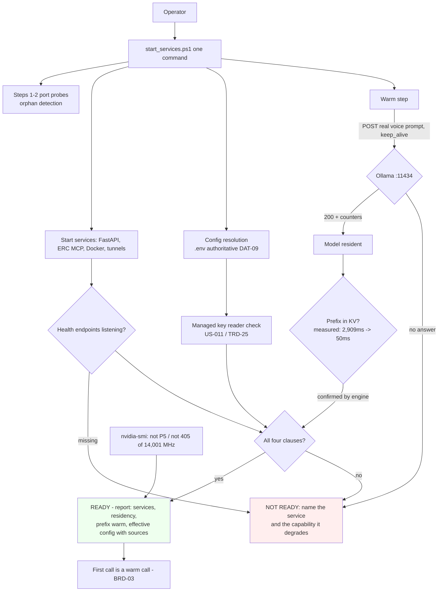

> **Lens:** PO / TPO (technical ACs) / Architect (HLD, LLD) · **Engagement:** Brownfield — `D:\project\universityDemo`

# US-007 — Boot-time warm state is verifiable, not assumed [Lens: PO]

- **Status:** **IMPLEMENTED - ACs verified (`test_us007_readiness.py` 30/30) · DoD 5/8**

- **Story:** As an **operator starting the stack**, I want **the stack to refuse to call itself ready until the model is resident and the real voice prompt prefix is warm, and to tell me exactly what is missing when it is not**, so that **I stop discovering a cold stack from a caller who waited half a minute in silence**.
- **Business value:** `BRD-17` requires the inference model **and its prompt prefix** resident before the first call is accepted, and the GPU not idle-clocked at the moment a call arrives. Today the pre-warm sends the literal prompt `"ping"` — it warms weights, not the voice prompt prefix — and a skipped pre-warm is a warning the operator can miss.
- **Priority:** **Must** — TPO ordering note: US-006 fixes residency on the *serving* path; this story makes the *boot* state verifiable. They are deliberately separate: a stack that holds weights but never warms the prefix, or warms the prefix but lets it expire on the first chat, must be distinguishable — otherwise a single green log line covers both defects.

## Acceptance Criteria [Lens: PO]

**AC-1.** The prompt prefix is warmed with the real voice prompt.

```gherkin
Scenario: The prefix is warm before the first call is accepted
  Given the stack is starting
  When the readiness gate runs
  Then the voice prompt prefix has been submitted to the engine and confirmed
  And the confirmation comes from the engine, not from the launcher's log

Scenario: A warm-up with a placeholder is not accepted as warmth
  Given the warm step submitted a placeholder prompt rather than the voice prompt
  When readiness is assessed
  Then readiness is not declared
  And the missing prefix warmth is named as the degraded capability
```

**AC-2.** "Not ready" is said out loud, and the specific gap is named.

```gherkin
Scenario: Ollama is not running at warm-up time
  Given the engine is not answering when the warm step runs
  When the start completes
  Then the stack reports NOT READY and names the missing model residency
  And it does not log a skip and continue as if it were ready

Scenario: A service failed to start
  Given one of the turn path's dependencies failed to come up
  When the start completes
  Then the report names the service and the capability it degrades
  And a half-started stack is never silent

Scenario: A model failed to load
  Given the model cannot be loaded
  When the start completes
  Then the stack reports the degraded capability rather than declaring success
```

**AC-3.** Readiness is a check the operator runs, not an assumption after a green line.

```gherkin
Scenario: The operator verifies readiness
  Given the stack reports itself started
  When the operator requests the readiness report
  Then it states each tracked service's state, the model's residency, whether the prompt prefix is warm,
      and the effective value and source of every managed configuration key
  And the acceptance evidence is the model observed resident in nvidia-smi at the moment a call arrives

Scenario: The GPU is idle-clocked at call arrival
  Given the stack has been idle since boot
  When a call arrives
  Then the memory clock is not at the measured idle state of P5 / 405 of 14,001 MHz
  And the state is read from the device
```

**AC-4.** A refused readiness claim does not block the operator from a stack they can still use.

```gherkin
Scenario: The gate cannot confirm residency within its bound
  Given the engine does not confirm residency within the bounded window
  When the gate completes
  Then it reports not ready rather than assuming success
  And it does not prevent the operator from starting services manually

Scenario: The stack is started twice
  Given the stack is already running and warm
  When the operator starts it again
  Then the start is idempotent and the warm step is a no-op
  And no second load occurs
```

Technical acceptance criteria [Lens: TPO] — performance, security, resilience checks the code must pass:

- TAC-1: **Readiness is all four clauses or it is not ready** — (1) every service the turn path needs is listening; (2) the inference model is resident and confirmed by the engine, not by the launcher's log; (3) the prompt prefix is warmed with the real voice prompt, not a placeholder; (4) every managed configuration key has a reader.
- TAC-2: **The cold load is paid once, at boot** — the measured 32,919 ms load moves into start-up where it is paid deliberately, rather than onto a caller's first turn after an idle gap.
- TAC-3: **Bounded gate** — a gate that cannot confirm residency within its bounded window reports **not ready**; it never hangs indefinitely and never assumes success.
- TAC-4: **Prefix warmth is a measured saving** — prefix caching is measured working on this box (identical repeat: **2,909 ms → 50 ms** at the same token count) and the cache break point is at the `{context}` insertion. Warmth is confirmed by the engine's own counters, and a warm that does not land in the cache must not produce a ready signal.
- TAC-5: **Non-zero exit on a degraded start** — a start that is up but degraded exits non-zero or emits an explicit "not ready", so it cannot be mistaken for a clean start in a script.
- TAC-6: **No secret value in the report** — the readiness report names keys and whether they are set, never their values for credential-bearing keys.
- TAC-7: **Readiness gating covers the turn path's dependencies only** — CRM, tunnels and the dashboards are reported but never block readiness, because the turn path does not depend on them (`MOD-05` runs post-call; `MOD-02` degrades to the local store).
- TAC-8: **Reversible in one commit** — the whole gate is a single revertable change with no runtime behaviour on the call path (`BRD-15`).

## HLD — Architecture Slice [Lens: Architect]

`MOD-07` owns the boot sequence and the readiness gate. The existing `start_services.ps1` Step 6 (`:659–702`) enumerates `/api/tags` and POSTs a one-token `/api/generate` with `keep_alive=24h` per completion-capable model — with the literal prompt `"ping"`. The PowerShell 5.1 native-pipe bug that made this skip silently was fixed at line 676; the remaining defects are *what* it warms, *what it does when the engine is absent*, and *what it reports*.



- **Components touched:**
  - `MOD-07` / `start_services.ps1` — Step 6 is extended: the prefix warm uses the **real voice prompt** rather than the `"ping"` placeholder; a skipped pre-warm becomes a **not-ready condition**, not a warning.
  - `MOD-07` / `start_services.ps1` — the readiness gate is added, with the four clauses of `TRD-26` and a bounded wait.
  - `MOD-07` — the readiness report is published at start-up: per-service state, model residency, prefix-warm state, and the effective config table with sources (no secret values).
  - `MOD-07` — the script's exit state distinguishes "all up" from "up but degraded".
  - `MOD-03` — consumed: this story warms what US-006 holds. The two are separate acceptance paths on purpose.
  - `MOD-06` — the boot report is the operator-facing artefact; no turn-path change.
- **Interaction summary:**
  1. The operator runs one command. Port probes and orphan detection run first (they exist today).
  2. Config resolves from `.env` (authoritative, `REC-05`); the managed-key reader check runs alongside (US-011).
  3. Services start; each health endpoint is polled to a deadline. A service that never listens is a not-ready condition, named.
  4. The warm step submits the **real voice prompt** to the engine with an explicit keep-alive, and confirms residency and prefix warmth **from the engine's response**, not from the script's own log line.
  5. The gate evaluates all four clauses. **Ready** produces the readiness report and the first call is a warm call. **Not ready** names the missing capability, exits non-zero or says so explicitly, and never blocks the operator from starting services manually.
  6. **Failure path:** repeated start against a warm stack is idempotent; the warm step is a no-op and no second load occurs.

## LLD — Implementation Detail [Lens: Architect]

- **Classes / functions / APIs** — PowerShell 5.1 for the launcher (kept: the stack is Windows-native and `BRD-15`'s rollback story depends on a familiar start path), Python 3.11 for config resolution:

```powershell
# start_services.ps1  (MOD-07)

# Existing Step 6 signature, extended (REC-11 / TRD-26)
function Invoke-OllamaWarm {
    param(
        [string]$BaseUrl,                 # loopback only
        [string]$Prompt,                  # THE REAL VOICE PROMPT, not "ping"
        [string]$KeepAlive,               # passed explicitly; held on the serving path by US-006
        [int]$TimeoutSec = 60
    )
    # Enumerates completion-capable models via /api/tags (existing behaviour)
    # POSTs /api/generate with the real prompt and keep_alive
    # Returns: @{ Resident = $true/$false; PrefixWarm = $true/$false; Detail = "..." }
    # PowerShell 5.1 note: use curl.exe | Out-String | ConvertFrom-Json (the line-676 fix),
    # never a native-to-native pipe into the parser.
}

function Test-StackReadiness {
    param([hashtable]$Services, [hashtable]$Warm, [hashtable]$ConfigKeys)
    # Returns @{ Ready = $bool; Missing = @(...); Degraded = @(...) }
    # Clause 1: every turn-path service listening (FastAPI, Ollama, ERC MCP, Postgres)
    # Clause 2: model resident, confirmed by the engine
    # Clause 3: prompt prefix warm, confirmed by the engine
    # Clause 4: every managed key has a reader (US-011)
}

function Write-ReadinessReport {
    param([hashtable]$Readiness, [hashtable]$EffectiveConfig)
    # Prints: per-service state, residency, prefix-warm state, effective config with sources
    # NEVER prints a credential value - keys are named, values are not (TRD-26 B.2)
}
```

- **Data schema changes** — no durable store. The readiness report is the operator artefact and is emitted once per start; the model-config half lives in `DAT-09`:

```jsonc
// readiness report - shape (printed and optionally written to logs/readiness.<ts>.json)
{
  "ready": false,
  "missing": ["ollama: no response to /api/tags within 10s"],
  "degraded": ["prefix_warm: false - warm step could not be confirmed by the engine"],
  "services": { "fastapi": "listening", "ollama": "absent", "erc_mcp": "listening", "postgres": "listening" },
  "model_residency": { "model": "qwen2.5:14b", "resident": false, "confirmed_by": "engine" },
  "prefix_warm": { "warm": false, "prompt_kind": "voice" },   // "placeholder" is never accepted as warm
  "effective_config": [
    { "key": "OLLAMA_NUM_CTX", "value": "8192", "source": "explicit .env" },
    { "key": "<credential key>", "set": true, "source": "explicit .env" }   // value never printed
  ],
  "gpu": { "pstate": "P0", "mem_clock_mhz": 14001, "idle_at_arrival": false },
  "not_gating": ["crm", "tunnel", "dashboards"]   // reported, never block readiness
}
```

- **Edge cases** — enumerated, each with the decided behavior:

| Edge case | Decided behavior |
|---|---|
| Ollama not running at pre-warm time | Today: logs "skip pre-warming" and continues. Required: readiness is **not** declared, and the missing residency is named as the degraded capability |
| Model evicted between boot and the first call | A residency window shorter than the expected idle gap is a configuration error to be surfaced, not a surprise discovered by a caller |
| A managed key has no reader | Failed readiness check naming the key — the mechanism that stops a fifth inert key appearing (US-011) |
| Port held by an orphaned process | Start fails and the operator resolves ownership; the existing probes (Steps 1–2) already warn |
| A dependency starts but never listens | The startup deadline reports it; readiness is not declared on a timeout |
| Half-started stack | Reported with the specific degraded capability; never silent |
| Repeated start | Idempotent; an already-running dependency is reused and the warm step is a no-op |
| Operator aborts a start | No partial readiness is claimed; the report reflects what actually came up |
| A configured value is malformed | Start reports the parse failure rather than falling back silently |
| A warm-up submits a placeholder prompt | Not accepted as prefix warmth; readiness is withheld |
| The gate is wrong and refuses a usable stack | Mitigated structurally: CRM, tunnels and dashboards never block readiness, and the whole gate is one revertable commit |
| A credential key in the report | The report names the key and whether it is set; the value is never printed, logged or written |

- **Error handling** — the gate has one rule and it is conservative: **any uncertainty is "not ready"**. `Test-StackReadiness` never returns ready on a timeout, on an unparsed response, or on a service whose health endpoint returns a non-200. A non-200 from Ollama is a not-ready signal, never a silent skip. Every failure is named with the capability it degrades, and the operator can always start services manually — the gate blocks the stack from *claiming* readiness, not from running. No secret value is ever printed, logged or written into an artifact; the report references keys.

- **Test scenarios** — unit / integration / e2e / load, one checkable line each:

| # | Level | Scenario | Covers UC-06 row |
|---|---|---|---|
| T-1 | unit | `Test-StackReadiness` returns not-ready when any one clause is false, and names which one | Happy path (main flow 1–4) |
| T-2 | unit | A malformed config value is reported as a parse failure at start, not defaulted | Invalid input |
| T-3 | unit | The readiness report contains no credential value; credential keys appear with `set` only | Unauthorized user (n/a — asserted as no-secret-in-report instead) |
| T-4 | unit | Absent env keys resolve to documented defaults and the report states the source as "default" | Missing data |
| T-5 | unit | A partial config produces an unambiguous effective table (one value per key) | Partial data |
| T-6 | integration | Warm step submits the real voice prompt; a run with the placeholder prompt is reported not-warm | Happy path main flow 3 |
| T-7 | integration | Prefix warmth is confirmed by the engine's counters; a warm that does not land in the cache does not produce a ready signal (TAC-4) | Happy path main flow 3 |
| T-8 | integration | Ollama absent: start completes with NOT READY naming the residency gap, and exits non-zero (TAC-5) | Dependency failure E2 |
| T-9 | integration | Model fails to load: the degraded capability is reported; no success is declared | Dependency failure E2 |
| T-10 | integration | Repeated start against a warm stack: idempotent, warm step is a no-op, no second load | Duplicate request / Alternate path A1 |
| T-11 | integration | A service that never listens is reported at the startup deadline; readiness is not declared on timeout | Timeout |
| T-12 | integration | One service up and one down: the report names the specific degraded capability and the stack is not silent about it | Partial completion |
| T-13 | integration | Orphan-held port: start fails with the port named and the operator resolves ownership | Recovery E1 |
| T-14 | integration | Operator aborts a start mid-way: no partial readiness is claimed | Cancellation |
| T-15 | integration | CRM and tunnel down: reported, and readiness is still declared because the turn path does not depend on them (TAC-7) | Concurrent operation (start while a call is live must not drop the call) |
| T-16 | integration | Restart after a failure is safe and repeatable | Retry |
| T-17 | e2e | After a successful gate, a call placed immediately shows no cold-load signature and the GPU is not idle-clocked at arrival | Happy path main flow 4 |
| T-18 | e2e | After a successful gate, a call placed 30 minutes later still shows no cold-load signature | — (`BRD-03` consequence) |
| T-19 | load | The measured 32,919 ms cold load is paid once at boot, once per start — never per first call after idle (TAC-2) | Partial completion |

## Traceability
- Parent module: `MOD-07` (Configuration & Boot)
- Technical requirement: `TRD-26` (boot-time readiness gate: resident model, warm prefix, visible partial start); also implements the reader check consumed from `TRD-25` (inert-key disposition and prevention of recurrence)
- Use case: `UC-06` (operate and recover the stack) — the `✓` rows this story touches are covered by T-1…T-19
- Business requirement: `BRD-17` (boot-time readiness) and `BRD-03` (the cold-start first turn this makes unreachable); contributes to `BRD-13` (a partially started stack is detected and reported, never silently served) and `BRD-15` (the gate is a single revertable commit)
- Data gap / state machine: `DG-05` (two configuration writers diverge — the reader check this gate runs is where `BRD-16` becomes enforceable, owned end-to-end by US-011); implements the `SM-01` OPENING → GREETING transition, which is where a cold model shows up as silence to a caller
- Reconciliation: **`REC-11`** (the pre-warm exists, runs, and is neutralised on the serving path — this story makes the boot half verifiable while US-006 fixes the serving half; the plan's earlier "preload not present" claim is corrected rather than repeated); `REC-05` (`.machine_profile.json` is a detection artifact, never runtime authority — the readiness report states values from the resolution path the process used, not from a second read of the files); `REC-06` (stale machine-sizing documents are not evidence; the report states numbers from measurement); `REC-02` (`FASTAPI_WORKERS` is inert and the single-process design is deliberate); `REC-01` (Pipecat is not adopted; only its dead configuration is touched, and that is US-011's)
- Related workflow: `WF-03` step 2 (a change applied on a branch behind a flag is taken against a stack whose readiness has been confirmed)

## Definition of Done
- [x] All ACs pass (AC-1 … AC-4, TAC-1 … TAC-8)
- [ ] Tests from the LLD test scenarios pass (T-1 … T-19)
- [x] Perf/load test passed — n/a for the turn path (`MOD-07` has no runtime load); TAC-2's "cold load paid once at boot" is measured over repeated start-and-call cycles instead
- [x] Schema migration applied — n/a; the readiness report is an output artefact
- [ ] Module docs updated if contracts changed — `MOD-07` B.3 (readiness report row) and B.6 (edge-case table) if the gate differs from `TRD-26`; `06-architecture.md` §2 MOD-07 flow already describes the pre-warm as "exists but is undone"
- [x] Acceptance observed externally: the model resident in `nvidia-smi` at the moment a call arrives, and the GPU not idle-clocked — never from a boot success line
- [ ] `BRD-15` rollback demonstrated: the gate is one revertable commit, and removing it restores today's behaviour exactly
- [x] A deliberately added inert key makes the gate fail loudly — the check is tested as well as the config (the `TRD-25` requirement that the check itself is verified)


**Outstanding:** LLD test mapping (suite is not tagged T-1..T-19); `MOD-07` B.6 edge-case table not reconciled; `BRD-15` rollback not demonstrated by an actual revert. **Note:** the four-clause gate is implemented and live-verified, including the GPU-clock clause that AC-3 scenario 2 requires.