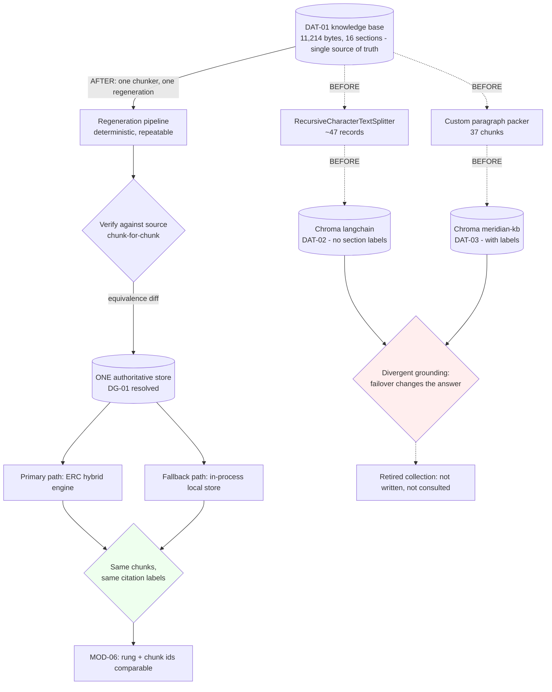

> **Lens:** PO / TPO (technical ACs) / Architect (HLD, LLD) · **Engagement:** Brownfield — `D:\project\universityDemo`

# US-010 — One authoritative knowledge store [Lens: PO]

- **Story:** As a **caller**, I want **the same question to get the same answer regardless of which internal path serves it**, so that **a failover does not silently change what the assistant tells me about a fee or a deadline**.
- **Business value:** Two divergent stores hold different chunks of the same knowledge base, so a failover changes the **answer text** and not merely its packaging. `DG-01`/`REC-03` classify this as a **correctness** problem, not redundancy: two stores returning different chunks for one question is a defect.
- **Priority:** **Must** — TPO ordering note: this is the **highest-effort item in the plan** (`BRD-07`'s module note records it), and it is deliberately sequenced **independently of the streaming work** so a data-verification change cannot confound a latency experiment.

## Acceptance Criteria [Lens: PO]

**AC-1.** One answer per question, on every path.

```gherkin
Scenario: The primary and fallback paths are compared
  Given one authoritative store has been regenerated from the knowledge base content
  When the same question is asked through the primary path and through the fallback path
  Then both return the same chunk set
  And both return the same citation labels
  And a diff between the two paths is empty

Scenario: A failover happens mid-life
  Given the primary retrieval service becomes unavailable
  When the fallback answers a question it has also answered before on the primary path
  Then the caller receives the same chunks and the same section labels as before
  And only the timing differs
```

**AC-2.** The store is regenerated from the source, not hand-carried.

```gherkin
Scenario: The store is rebuilt
  Given the knowledge base content is the single source of truth
  When the store is regenerated
  Then every chunk traces to the source content
  And the regeneration is reproducible: running it twice produces the same chunk set

Scenario: Content is present in one store and absent from the other
  Given consolidation finds a chunk in one store with no counterpart in the other
  When the discrepancy is resolved
  Then it is resolved against the source content and recorded as a finding
  And it is not a reason to keep both stores
```

**AC-3.** The retired store is retired, not left answering.

```gherkin
Scenario: The legacy store is asked to answer
  Given consolidation is complete
  When any path retrieves
  Then it retrieves from the one authoritative store
  And the retired collection is not consulted and is not still being written on boot

Scenario: Consolidation is reverted
  Given the change is reverted
  When the system retrieves
  Then the previous behaviour returns
  And the revert is a configuration change or a single revertable commit
```

**AC-4.** Answer quality does not move.

```gherkin
Scenario: Answers before and after consolidation are compared
  Given the frozen set is scored before and after the change
  When the results are compared
  Then no critical intent (fees, deadlines, eligibility, escalation, lead capture) regresses
  And aggregate movement is at most 2 points
```

Technical acceptance criteria [Lens: TPO] — performance, security, resilience checks the code must pass:

- TAC-1: **Chunk-for-chunk verification** — for every case in the frozen set, the primary and fallback paths return an identical chunk set and identical citation labels; a diff between the two paths is empty, asserted programmatically and not by reading.
- TAC-2: **One store is written on boot** — after the change, exactly one collection is populated; the retired collection is not written and is not consulted. Asserted by inspecting the store contents and the boot path.
- TAC-3: **Determinism** — regenerating the store twice from the same source produces a byte-identical chunk set and identical embeddings inputs, so a retrieval result can always be traced to its input.
- TAC-4: **No citation-label loss** — the divergence is not only chunk boundaries: the legacy path's citation formatting differs from ERC's (`rag_legacy.py:443` vs `rag_mcp.py:169–178`). After consolidation, section labels appear on **both** paths, and the label text is identical.
- TAC-5: **No latency regression** — retrieval p95 stays within the 400 ms allowance at N=1 and N=2 after consolidation; the store swap is not a latency change and must not become one.
- TAC-6: **Quality gate applied** — the change alters what the model sees, so it is a gated change: frozen-set scores before and after, with zero critical-intent regression and ≤2 pt aggregate movement (`BRD-08`, `BRD-09`).
- TAC-7: **Load** — an N=2 run after consolidation completes with `turns_over_3000ms: 0` and no turn exhibiting a retrieval failure that the pre-change baseline did not have.
- TAC-8: **Reversible** — the consolidation is revertible by configuration or a single revertable commit; the retired collection is recoverable until the change is adopted (`BRD-15`).

## HLD — Architecture Slice [Lens: Architect]

Both stores are derived from the same 11,214-byte, 16-section source (`content/meridian/meridian_knowledge_base.md`), by two different chunkers: local Chroma `langchain` (~47 records, LangChain `RecursiveCharacterTextSplitter`) and ERC `meridian-kb` (37 chunks, a custom paragraph packer). They differ in chunk boundaries **and** in whether citation labels appear at all. Which store survives is decided here; the dispatcher's shape is not (`REC-03`: the MCP-first/local-fallback seam is sound and is kept).



- **Components touched:**
  - `MOD-02` — the surviving store is regenerated from `DAT-01` with **one** chunker; the other collection is retired.
  - `MOD-02` / `app/rag_legacy.py` — the fallback path reads the surviving store and emits the **same citation labels** as the primary path.
  - `MOD-02` / `app/rag.py` — the dispatcher is unchanged in shape; `USE_MCP_RAG` semantics (`auto` prefer MCP and fall back / `on` / `off`) behave identically under failover and under an explicit choice.
  - `enterprise-rag-core` — the ERC-side collection is regenerated or retired to match; the `retrieve_context` tool contract is unchanged (`REC-04`: the app calls exactly one tool).
  - `MOD-07` — consumed: the boot path must populate exactly one collection; the "which store is written on boot" question is answered by this change, not left to the ingest script.
  - `MOD-06` — the trace's rung note plus chunk identity, so a failover's equivalence is checkable from records rather than from a code read.
- **Interaction summary:**
  1. A chunker is chosen and the store is regenerated from `DAT-01`; the regeneration is deterministic and repeatable.
  2. The regenerated store is verified against the source chunk-for-chunk; any content present in one store and absent from the other is resolved against the source and recorded as a finding.
  3. The surviving collection is populated on boot; the retired collection is neither written nor consulted.
  4. **Failure path:** if the primary path is unavailable, the fallback answers from the same store and therefore returns the same chunks with the same section labels — a failover changes the timing, not the answer.
  5. **Failure path:** if verification finds a discrepancy at a scale that changes answers for a critical intent, the change stops and the PO's ground truth (`AS-05`) is required before the retired store can be dropped.
  6. **Failure path:** the change is reverted by configuration or a single revertable commit; the retired collection is recoverable until adoption.

## LLD — Implementation Detail [Lens: Architect]

- **Classes / functions / APIs** — Python 3.11; the ingest is a script the developer runs, not a runtime path:

```
# scripts/regenerate_store.py  (MOD-02, developer-time)
def chunk_source(text: str) -> list[SourceChunk]: ...
    # ONE chunker for both paths; deterministic and repeatable (TAC-3)

def embed(chunks: Sequence[SourceChunk]) -> list[Embedding]: ...
    # nomic-embed-text via Ollama :11434 (MOD-03's engine)

def write_store(store_id: str, chunks: Sequence[SourceChunk],
                vectors: Sequence[Embedding]) -> None: ...
    # writes exactly ONE collection

def verify_equivalence(store_id: str, source: str) -> EquivalenceReport: ...
    # chunk-for-chunk against the source; reports content present in only one store

@dataclass(frozen=True)
class EquivalenceReport:
    chunks_in_store: int
    chunks_in_source: int
    only_in_store: tuple[str, ...]
    only_in_source: tuple[str, ...]
    label_mismatches: tuple[str, ...]

# app/rag_legacy.py  (MOD-02, runtime)
def _format_with_labels(chunk: Chunk) -> str: ...
    # AFTER: emits the same section label text as the primary path (TAC-4)
    # BEFORE: omitted labels entirely (:443) - the divergence this story closes
```

- **Data schema changes** — `DAT-02` and `DAT-03` collapse to one surviving collection; the change is a store operation against an 11 KB source with both stores already on disk, so the work is **verification, not invention**:

```python
# Data inventory after consolidation
# BEFORE: DAT-02 local Chroma `langchain` (~47 records)  +  DAT-03 ERC Chroma `meridian-kb` (37 chunks)
# AFTER : ONE authoritative collection, regenerated from DAT-01; the other is retired.
#
# Chunk record shape (unchanged in kind; labels become mandatory on both paths)
# { "id": "<section>-<n>", "text": "...", "section_label": "<## heading text>",
#   "source_ref": "content/meridian/meridian_knowledge_base.md#<heading>",
#   "embedding": "<nomic-embed-text vector>" }
```

- **Edge cases** — enumerated, each with the decided behavior:

| Edge case | Decided behavior |
|---|---|
| Content present in one store, absent from the other | A finding about `DAT-01` or the chunker, resolved against the source and recorded — never a reason to keep both |
| Citation labels missing on a path | After consolidation section labels appear on **both** paths with identical text; a path that omits them is a defect (`TAC-4`) |
| The two stores return different distances for the same question | Resolved by consolidation — a floor is only meaningful when both paths return the same distances (this is `US-009`'s precondition) |
| The regenerated store is missing content the retired store had | The change is not adopted; the discrepancy is resolved against the source first |
| Boot populates the retired collection | A defect: exactly one collection is written on boot (`TAC-2`) |
| The primary service is down at the moment of a query | The fallback answers from the same store and returns identical chunks; the trace records the rung |
| A retrieval fails on the surviving store | The local in-process path is the fallback (not a third store), so there is exactly one authoritative answer and one fast degraded path |
| Ingest run twice | Idempotent and deterministic; a re-run produces a byte-identical chunk set |
| The change alters answers for a critical intent | The quality gate stops it (TAC-6); PO ground truth is required before the retired store is dropped |
| Revert after adoption | Revertible by configuration or a single revertable commit; the retired collection is recoverable until adoption |

- **Error handling** — `IngestError` (a chunker or embedding failure during regeneration; the store is not partially written), `EquivalenceFailure` (verification found a discrepancy; the change stops rather than adopting an unverified store), and `StoreUnavailable` (the surviving store cannot be opened; the turn takes the degraded rung as today). The consolidation is a **developer-time** operation and none of these errors are in the caller's path: once adopted, the only runtime behaviour is that one store answers, and a store problem degrades exactly as it does today. No new runtime failure class is introduced.

- **Test scenarios** — unit / integration / e2e / load, one checkable line each:

| # | Level | Scenario | Covers UC-02 row |
|---|---|---|---|
| T-1 | unit | `chunk_source` run twice on the same input yields a byte-identical chunk set (TAC-3) | Duplicate request |
| T-2 | unit | `verify_equivalence` reports `only_in_source` and `only_in_store` separately and names the chunks | Partial data |
| T-3 | unit | `_format_with_labels` emits the same label text as the primary path for the same chunk (TAC-4) | Happy path |
| T-4 | unit | A missing store raises `StoreUnavailable`; no silent empty result | Dependency failure |
| T-5 | unit | `IngestError` on an embedding failure leaves the store unmodified | Invalid input |
| T-6 | integration | For every frozen-set case, the primary and fallback paths return an identical chunk set and identical labels; the diff is empty (TAC-1) | Happy path |
| T-7 | integration | A failover mid-life answers a previously-asked question identically — same chunks, same labels | Missing data |
| T-8 | integration | After the change, exactly one collection is written on boot and the retired one is not consulted (TAC-2) | Partial completion |
| T-9 | integration | `USE_MCP_RAG=off` and `auto`-with-failover produce the same chunks for the same question | Partial data |
| T-10 | integration | A query with no relevant content behaves identically through both paths (the `US-009` marker path) | Missing data |
| T-11 | integration | `/ws/voice/text` retrieves identical chunks after consolidation (`REC-09`) | — (regression guard) |
| T-12 | integration | Reverting by configuration restores the previous store selection and behaviour (TAC-8) | Recovery |
| T-13 | integration | A store read failure on one caller takes the degraded rung; the other caller is unaffected | Concurrent operation (each session retrieves independently) |
| T-14 | e2e | Frozen-set scoring before and after: zero critical-intent regression, ≤2 pt aggregate movement (TAC-6) | Happy path (end-to-end task success) |
| T-15 | e2e | A retrieval that failed before the change still fails cleanly after it, and a retrieval that succeeded before still succeeds | Dependency failure |
| T-16 | e2e | A partial ingest (interrupted mid-run) leaves no partially-written store | Partial completion |
| T-17 | load | N=2 after consolidation: retrieval p95 within the 400 ms allowance at N=1 and N=2, `turns_over_3000ms: 0` (TAC-5, TAC-7) | Concurrent operation |

## Traceability
- Parent module: `MOD-02` (Retrieval & Grounding — "decide when context is not good enough to answer from"; the module contains `DG-01`, the store consolidation)
- Technical requirement: `TRD-06` (consolidate to one authoritative knowledge store, regenerated from `DAT-01` and verified chunk-for-chunk)
- Use case: `UC-02` (receive a grounded answer) — the `✓` rows this story touches are covered by T-1…T-17; `UC-03`'s per-session grounding rows are touched through T-13
- Business requirement: `BRD-09` (no quality regression — a change to what the model sees is gated); contributes to `BRD-10` (the floor is only meaningful if both paths return the same distances for the same question — this story is that precondition) and `BRD-13` (the fallback rung answers identically rather than differently)
- Data gap / state machine: **`DG-01`** (derive — consolidate to one store, verified against `DAT-01`; affects `UC-02`, `WF-01`); collapses `DAT-02` and `DAT-03` into one authoritative store; R1 of `MOD-02`'s business rules is the requirement this implements
- Reconciliation: **`REC-03`** (central — the plan implies one knowledge base and there are two, with different chunk boundaries and different citation formatting); `REC-04` (the app calls exactly one tool; the ERC-side change must not widen that contract); `REC-09` (the text path shares the dispatcher); `REC-07` (the stale RAG report's figures — `top_k=2`, `num_ctx 2048` — are excluded as evidence and must not drive the ingest)
- Related workflow: `WF-01` step 6 and `UC-01` E2 (retrieval service unavailable → fallback to the local store, answer still produced — the flow where divergent stores become a caller-visible defect)

## Definition of Done
- [ ] All ACs pass (AC-1 … AC-4, TAC-1 … TAC-8)
- [ ] Tests from the LLD test scenarios pass (T-1 … T-17)
- [ ] Perf/load test passed against the story's TACs (TAC-5 retrieval p95 within allowance at N=1/N=2, TAC-7 N=2 run with no new retrieval failures)
- [ ] Schema migration applied — yes: one collection regenerated, the other retired; the ingest script and the boot path both updated to write exactly one store
- [ ] Module docs updated if contracts changed — `MOD-02` B.4 (`STORE` entity: "ONE authoritative store (DG-01)") and B.6 if the implementation differs from `TRD-06`
- [ ] Equivalence report recorded: chunk counts, `only_in_store` / `only_in_source` findings, and how each was resolved against the source
- [ ] `BRD-15` rollback demonstrated: revert by configuration or a single revertable commit, with the retired collection recoverable until adoption
- [ ] Quality gate: frozen-set scores before and after recorded with the adoption verdict; no critical intent regressed and aggregate movement ≤2 pt (`BRD-08`, `BRD-09`)
