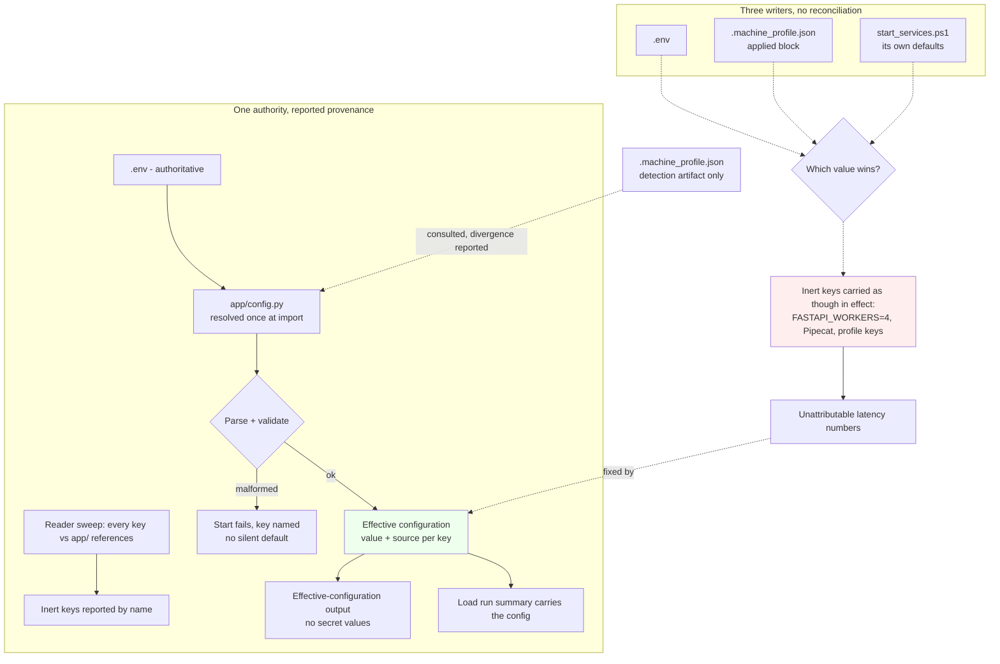

> **Lens:** PO / TPO (technical ACs) / Architect (HLD, LLD) · **Engagement:** Brownfield — `D:\project\universityDemo`

# US-011 — One source of configuration truth [Lens: PO]

- **Story:** As an **operator who changes a setting and restarts the stack**, I want **the value I typed to be the value the running process uses**, so that **I am not debugging a latency number that was produced by a setting I never chose**.
- **Business value:** `BRD-16` requires that the effective value of any setting is discoverable and unambiguous. Today three documents describe configuration (`.env`, `.machine_profile.json`, `start_services.ps1` defaults) and nothing reconciles them; five keys have been found written but never read, including one that records a tuning decision (`FASTAPI_WORKERS=4`) that the runtime silently discards. Every performance number the program reports rests on knowing which values were actually in force.
- **Priority:** **Must** — TPO ordering note: this is sequenced **before** the measurement stories are trusted rather than before they are run. A harness that records a `DAT-07` row without recording the configuration behind it produces an unattributable number, and the plan's phase gate (`WF-03` step 5: a gain below half the prediction stops and debugs) needs an attribution to be possible at all.

## Acceptance Criteria [Lens: PO]

**AC-1.** One authority, and it is the one the process reads.

```gherkin
Scenario: A setting is changed in the authoritative place
  Given the authoritative configuration file carries a value for a setting
  When the process starts
  Then the effective value in the running process is that value
  And no other file overrides it without the override being reported

Scenario: A setting exists in a second file
  Given a setting appears in both the authoritative file and a generated detection artifact
  When the process resolves it
  Then the authoritative file wins
  And the divergence is reported at start rather than resolved silently
```

**AC-2.** A written key is a read key.

```gherkin
Scenario: An inert key is present in configuration
  Given a key is written in configuration but referenced from no code path
  When the stack starts
  Then the key is reported as inert, by name
  And it is not silently carried as though it were in effect

Scenario: A tuning key was written to make a change
  Given a key records an intended runtime change (a worker count, a residency duration)
  When the stack starts
  Then the code that must honour it references it
  And if the runtime cannot honour it, that is reported rather than implied
```

**AC-3.** The reported configuration is the running configuration.

```gherkin
Scenario: The effective configuration is inspected
  Given the stack is running
  When the effective configuration is requested
  Then every key reports its effective value and where that value came from
  And no secret value is included in the output

Scenario: A key is malformed
  Given a key's value cannot be parsed
  When the stack starts
  Then the start fails with the key named
  And no default is substituted silently in its place
```

**AC-4.** A measurement can be attributed to the configuration that produced it.

```gherkin
Scenario: A load run is recorded
  Given a load run completes and writes its summary
  When the summary is read back
  Then the effective configuration at run time is recoverable from the run's own artifacts
  And a later review can tell which values produced the number
```

Technical acceptance criteria [Lens: TPO] — performance, security, resilience checks the code must pass:

- TAC-1: **Exactly one authority** — `.env` is the runtime authority (`REC-05`), resolved once through `app/config.py`; no settings are read from `os.environ` directly in `app/`, and no second file silently wins.
- TAC-2: **Zero unreported inert keys** — every key written in configuration is referenced from at least one code path, or is reported as inert at start. The **five** known instances (`REC-01` Pipecat, `REC-02` `FASTAPI_WORKERS`, `REC-05` `.machine_profile.json`, the pre-warm PowerShell pipe, `REC-11`'s serving-path keep-alive) are each resolved to "read" or "reported inert" — none remain in a third state.
- TAC-3: **`FASTAPI_WORKERS=4` resolves to the truth** — the key's value and the Uvicorn configuration must agree, or the key is removed/renamed so the intent is not misrepresented. `REC-02` records that one process with one event loop is the architecture; a key that says otherwise is either wired to something that honours it or reported as not in effect.
- TAC-4: **No secret values in the effective-configuration output** — the dump lists key names and sources; values are shown only for non-sensitive keys, with sensitive keys rendered as a presence marker. Asserted by scanning the output for the configured credential values (zero matches).
- TAC-5: **Malformed values fail at start, not at first use** — a value that cannot be parsed is a boot-time failure naming the key, never a silent fallback to a default that is indistinguishable from a deliberate choice.
- TAC-6: **Provenance is reported** — each key's effective value states its origin (authoritative file, documented default, or detection artifact consulted and overridden), so "why is it this value" is answerable without reading the loader.
- TAC-7: **Run attribution** — a load run's summary (`DAT-07`) carries or references the effective configuration, so a number can never be orphaned from the settings that produced it.
- TAC-8: **Load** — the resolution above adds no measurable start-time cost (startup budget unchanged) and no per-turn cost; asserted by comparing start duration and per-turn p95 before and after.

## HLD — Architecture Slice [Lens: Architect]

Configuration is resolved in three places that do not agree: `app/config.py` (pydantic settings over `.env`), `.machine_profile.json` (a detection artifact recording what was applied), and `start_services.ps1` (which passes environment into child processes and carries its own defaults). The plan's rule is stated in `REC-05`: `.env` is the runtime truth, and the profile is a **detection artifact, not a configuration source**. The change is to make that rule enforceable rather than aspirational.



- **Components touched:**
  - `MOD-07` / `app/config.py` — the single resolution point: keys load once at import, malformed values fail at start, provenance is recorded per key.
  - `MOD-07` / `start_services.ps1` — the child-process environment is assembled from the authoritative resolution rather than from script-local defaults; any default the script carries is either surfaced as a documented default or removed.
  - `MOD-07` / `.machine_profile.json` — demoted to a detection artifact: it may be read for comparison, but it does not supply values, and a divergence is reported.
  - `MOD-07` — a reader sweep that answers "is this key referenced from `app/`?" for every configured key, and reports the answer at start.
  - `MOD-06` — consumed: the run summary records or references the effective configuration so a `DAT-07` number is attributable.
- **Interaction summary:**
  1. The process imports configuration once; each key resolves to a value and a provenance.
  2. Malformed values fail the start with the key named; no default is substituted.
  3. The reader sweep reports every key that is written but referenced from no code path, by name — including any that record a tuning decision.
  4. The effective configuration is inspectable with values and sources; sensitive values are rendered as presence markers, never as text.
  5. **Failure path:** a key present in both the authoritative file and a detection artifact resolves to the authoritative file and the divergence is reported — never resolved silently in either direction.
  6. **Failure path:** a key that names a capability the runtime does not have is reported as not in effect, rather than leaving the impression that it was applied.

## LLD — Implementation Detail [Lens: Architect]

- **Classes / functions / APIs** — Python 3.11, pydantic-settings already pinned:

```python
# app/config.py  (MOD-07) - the single resolution point

class Settings(BaseSettings):
    model_config = SettingsConfigDict(env_file=".env", extra="ignore")

    # ... existing keys unchanged ...
    OLLAMA_KEEP_ALIVE: str = "24h"        # US-006's key, resolved here
    RAG_SIMILARITY_THRESHOLD: float = 0.0 # US-009's key, resolved here

settings = Settings()

@dataclass(frozen=True)
class EffectiveValue:
    key: str
    value: str | None        # None for sensitive keys - never the text
    source: Literal["env", "default", "overridden_detection_artifact"]
    sensitive: bool

def effective_configuration() -> tuple[EffectiveValue, ...]: ...
    """Value + provenance per key. Sensitive values are never rendered (TAC-4)."""

def sweep_inert_keys() -> tuple[str, ...]: ...
    """Keys written in configuration but referenced from no code path (TAC-2).
    Answered by static reference search over app/, reported by name at start.
    The answer is a set of names - never a value."""
```

```
# start_services.ps1  (MOD-07) - child environment assembled from the resolution
# BEFORE: script-local defaults passed into the child, silently winning over .env
# AFTER : the script passes through what the authoritative resolution produced,
#         and surfaces any default it still carries as a documented default
```

- **Data schema changes** — `DAT-09` is the configuration inventory; the change is a **provenance field per key** and the demotion of `.machine_profile.json`'s `applied` block to non-authoritative. No secret value is written to any artifact:

```jsonc
// Effective configuration fragment (keys and sources only)
{
  "OLLAMA_NUM_CTX":        { "value": "8192",  "source": "env" },
  "OLLAMA_KEEP_ALIVE":     { "value": "<duration>", "source": "env" },
  "FASTAPI_WORKERS":       { "value": "<present>", "source": "env",
                             "in_effect": false,
                             "note": "runtime is one process; see REC-02" },
  "CRM_API_KEY":           { "value": null, "source": "env", "sensitive": true }
}
// .machine_profile.json remains a detection artifact; its `applied` block is not a source
```

- **Edge cases** — enumerated, each with the decided behavior:

| Edge case | Decided behavior |
|---|---|
| A key in both `.env` and the detection artifact | `.env` wins and the divergence is reported at start; never resolved silently either way |
| A key written but read nowhere | Reported as inert by name at start (`TAC-2`); it is not carried as though it were in effect |
| A key that records an intended runtime change the runtime cannot make | Reported as not in effect, with the reason (the architecture is one process, `REC-02`) rather than left implying it applied |
| A malformed value | Start fails naming the key; no silent default — a default is indistinguishable from a choice |
| A sensitive key | Reported as present/absent with its source; its value never appears in the output or in any artifact (`TAC-4`) |
| The authoritative file is absent | Documented defaults apply and each key's source reads `default`, so a defaulted run is distinguishable from a configured one |
| The detection artifact is stale (it records a different machine) | Harmless: it is not a source. `REC-05`/`REC-06`/`REC-13` record the stale-6 GB-machine instances (including the executable one in `app/memory_budget.py`) and they stay excluded as evidence |
| A key is renamed | The old name is reported inert at start, so a rename cannot leave a silently-ignored setting behind |
| A load run outlives a configuration change | The run summary carries the configuration as resolved at run start, so the number stays attributable (`TAC-7`) |
| A start script default disagrees with `.env` | The authoritative value is used and the disagreement is visible; a script default never silently wins |

- **Error handling** — `ConfigurationError` (a malformed or unparseable value; raised at **start**, never at first use, and naming the key), and `InertKeyReport` (not an error — a boot-time report of keys that are written but not referenced, so the condition is visible without blocking a start). A missing authoritative file is **not** an error: it yields documented defaults with `source="default"` on every key, which is itself the report. No runtime error path is added; this story's failures all happen before the first request, which is the point of `BRD-16`.

- **Test scenarios** — unit / integration / e2e / load, one checkable line each:

| # | Level | Scenario | Covers UC-06 row |
|---|---|---|---|
| T-1 | unit | A key present in both `.env` and the artifact resolves to `.env` and records `overridden_detection_artifact` for the other | Partial data |
| T-2 | unit | A malformed value raises `ConfigurationError` naming the key; no default is substituted | Invalid input |
| T-3 | unit | A sensitive key renders `value: null` with `sensitive: true` | — (TAC-4) |
| T-4 | unit | The effective-configuration output contains none of the configured credential values (TAC-4) | — (TAC-4) |
| T-5 | unit | `sweep_inert_keys()` returns the known inert keys as names, and returns no values | Partial data (`BRD-16`) |
| T-6 | unit | A key referenced from `app/` is not reported inert (the sweep is not a blanket warning) | Happy path |
| T-7 | unit | `FASTAPI_WORKERS` reports `in_effect: false` with the `REC-02` reason, or is wired so the runtime honours it — asserted as one of the two, not neither | Partial completion |
| T-8 | integration | Changing a value in the authoritative file changes the effective value after a restart | Happy path |
| T-9 | integration | A start script default disagrees with `.env`; the authoritative value is in force and the disagreement is visible | Partial data |
| T-10 | integration | Removing the authoritative file yields documented defaults with `source="default"` on every key | Missing data |
| T-11 | integration | A renamed key leaves the old name reported inert | Recovery |
| T-12 | integration | The five known instances (`REC-01`, `REC-02`, `REC-05`, the pre-warm pipe, `REC-11`) each resolve to "read" or "reported inert" — none in a third state (TAC-2) | Partial completion |
| T-13 | integration | The stack starts with the full resolution path and no start-time budget regression (TAC-8) | Happy path |
| T-14 | e2e | A load run's summary carries the effective configuration, and a later review recovers it from the run's own artifacts (TAC-7) | Happy path |
| T-15 | e2e | A malformed key stops the stack before it accepts a call, with the key named in the operator-visible output | Invalid input |
| T-16 | e2e | Reverting a setting through the authoritative file restores the previous effective value (`BRD-15`) | Cancellation / Recovery |
| T-17 | load | Per-turn p95 and start duration are unmoved by the resolution path (TAC-8) | — (TAC) |

## Traceability
- Parent module: `MOD-07` (Configuration & Boot — this is the module's own contract with the operator)
- Technical requirement: `TRD-24` (one authoritative configuration source, resolved once, with reported provenance) and `TRD-25` (no inert keys: a written key is a read key); consumed by `TRD-26` (readiness is reported, and it reports what is actually in force)
- Use case: `UC-06` (operate and recover the stack) — the `✓` rows this story touches (happy path, invalid input, missing data, partial data, recovery, partial completion) are covered by T-1…T-17
- Business requirement: `BRD-16` (configuration truth: the effective value of any setting is discoverable and unambiguous); protects `BRD-03` and `BRD-01` indirectly — a latency number produced under an unknown configuration cannot support either
- Data gap / state machine: **`DG-05`** (derive — one configuration truth with reported provenance; affects `UC-06`); `DAT-09` gains a provenance field per key and the detection artifact is demoted to non-authoritative
- Reconciliation: **`REC-05`** (central — `.env` is the runtime truth and `.machine_profile.json` is a detection artifact; the plan's inference that keys in `applied` are in force is wrong); **`REC-02`** (`FASTAPI_WORKERS=4` is written but not in force — the architecture is one process, one event loop); `REC-06` (the stale 6 GB machine appears in `doc/model_vram_analysis.md` and is excluded as evidence); `REC-13` (the same stale machine is executable in `app/memory_budget.py`, whose `safe_threshold_percent: 95` sits above `BRD-11`'s 90% ceiling — a configured threshold that cannot protect its own requirement); `REC-11` (the pre-warm's keep-alive was set at boot and lost on the serving path — the fifth instance, resolved by US-006 and swept here); `REC-01` (the Pipecat record: not adopted, and this story does not adopt it)
- Related workflow: `WF-03` step 5 (the phase gate — a measured gain below half the prediction stops and debugs, which requires the configuration behind the number); `UC-06`'s startup and recovery rows

## Definition of Done
- [ ] All ACs pass (AC-1 … AC-4, TAC-1 … TAC-8)
- [ ] Tests from the LLD test scenarios pass (T-1 … T-17)
- [ ] Perf/load test passed against the story's TACs (TAC-8 no start-time or per-turn regression)
- [ ] Schema migration applied — yes: `DAT-09` gains per-key provenance; `.machine_profile.json`'s `applied` block is marked non-authoritative in the docs and in the loader
- [ ] Module docs updated if contracts changed — `MOD-07` B.4 (`DAT-09` inventory gains provenance) and B.6 if the implementation differs from `TRD-24`
- [ ] Inert-key sweep recorded: every configured key listed with its resolution (read, or reported inert by name); the five known instances each resolved to one of the two
- [ ] Effective-configuration output verified to contain no secret values (TAC-4), and the verification is a test rather than a review
- [ ] `BRD-15` rollback demonstrated: a setting reverted through the authoritative file restores the previous effective value
