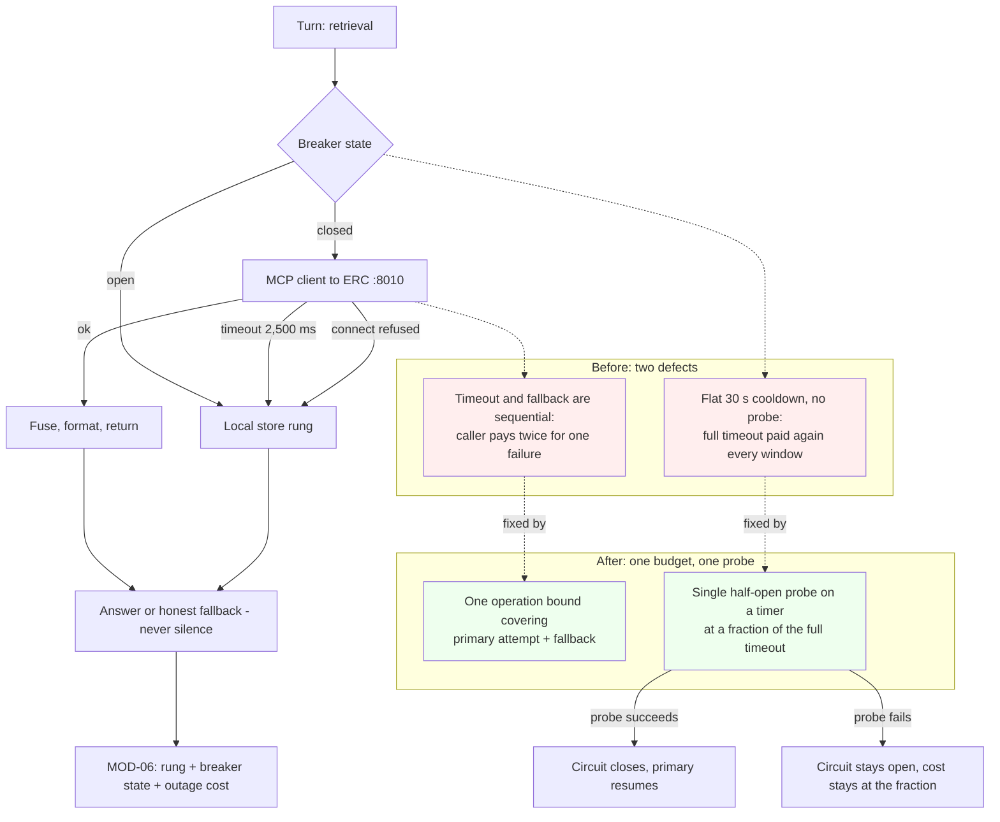

> **Lens:** PO / TPO (technical ACs) / Architect (HLD, LLD) · **Engagement:** Brownfield — `D:\project\universityDemo`

# US-013 — Bound every dependency call and probe for recovery [Lens: PO]

- **Status:** **IMPLEMENTED - ACs verified** · `test_us013_breaker.py` 39/39 · `test_brd15_rollback.py` demonstrates the revert · DoD 2/8

- **Story:** As a **caller during a retrieval outage**, I want **to wait once for the failure and not once every thirty seconds for as long as the outage lasts**, so that **a service that is already down does not keep taking my answer's time budget away from me**.
- **Business value:** `BRD-14` requires every outbound dependency call to carry a timeout justified against the latency budget, and a tripped circuit to **probe for recovery** rather than paying the timeout on every subsequent request. Today a failed retrieval costs the caller the 2,500 ms read timeout **plus** a full re-retrieval from the local store — the caller pays twice for one failure — and the flat 30 s cooldown retries the dead service with the full timeout again and again for the duration of the outage.
- **Priority:** **Must** — TPO ordering note: the bound is what makes `US-008`'s "abandon rather than await" achievable, and it is the cheapest item in the plan: no model, no data, no dependency change, and the designed recovery is already specified in `06-architecture.md` §5. It ships with `US-008`'s client change because both live in the same place.

## Acceptance Criteria [Lens: PO]

**AC-1.** One failure costs one budget, not two.

```gherkin
Scenario: The primary retrieval service is down at the moment of a query
  Given the primary retrieval service is not answering
  When a turn retrieves
  Then the whole operation, fallback included, completes inside one retrieval budget
  And the caller does not pay the timeout and then the full fallback cost on top of it

Scenario: The connect fails immediately
  Given the service refuses the connection
  When a turn retrieves
  Then the fallback serves without waiting for the read timeout to expire
  And the caller's turn stays inside the per-turn cap
```

**AC-2.** A tripped circuit probes rather than retries blind.

```gherkin
Scenario: The outage lasts longer than the cooldown
  Given the circuit is open after a failed call
  When the cooldown window passes
  Then a single probe is issued on the timer, at a fraction of the full timeout
  And a request is not sent to the dead service with the full timeout every window

Scenario: The service comes back
  Given the circuit is open and the service has recovered
  When the probe succeeds
  Then the circuit closes and primary serving resumes
  And the recovery required no restart and no operator action

Scenario: The service is still down
  Given the circuit is open and the service is still failing
  When the probe fails
  Then the circuit stays open
  And the cost of finding that out stays at the probe's fraction, not the full timeout
```

**AC-3.** One caller's outage is not another caller's latency.

```gherkin
Scenario: One caller meets a failing dependency
  Given caller A's retrieval fails and degrades
  When caller B's turn runs in the same window
  Then caller B is not delayed by A's outage and not served from A's failed state

Scenario: Both callers meet the same outage
  Given both callers retrieve while the circuit is open
  When both are served
  Then both take the local rung and neither waits for a probe
  And the probe is not duplicated per caller
```

**AC-4.** Degradation is spoken, and recovery is automatic.

```gherkin
Scenario: Retrieval cannot serve at all
  Given every rung of the retrieval ladder is unavailable
  When the turn completes
  Then the caller hears a polite spoken outcome rather than silence
  And the turn is recorded with the rung that served

Scenario: The Stack recovers
  Given the stack has been serving on the local rung
  When the primary path returns
  Then subsequent turns take the primary path without intervention
  And the transition is visible in the turn records
```

Technical acceptance criteria [Lens: TPO] — performance, security, resilience checks the code must pass:

- TAC-1: **One budget per retrieval operation, fallback included** — the primary attempt plus the local fallback completes within a single bounded operation; the caller never pays the 2,500 ms read timeout *and* the fallback cost for one failure. Ceilings unchanged in kind: 2,500 ms read / 1,000 ms connect (`rag_mcp.py:35–38`), now applied to the operation rather than to each attempt in sequence.
- TAC-2: **Connect failure does not wait for the read timeout** — a refused connection degrades to the local rung immediately; an immediate failure is not treated as a slow one.
- TAC-3: **Recovery is a probe, not a retry** — after a trip, the cooldown window is followed by **one** half-open probe at a fraction of the full timeout; a full-timeout request to a known-dead service is the defect being removed. Asserted by counting what is sent to the service while the circuit is open.
- TAC-4: **Outage cost is bounded per window, not per request** — over an N=2 run with the primary service killed, the wall time attributable to the dead service is bounded by (trips × probe cost) and does not grow with the number of turns served.
- TAC-5: **No per-turn probing** — while the circuit is open, a turn does not probe the known-dead service; the probe belongs to the timer (`MOD-02` edge case: "no per-turn probing of a known-dead service").
- TAC-6: **Retrieval p95 within the 400 ms allowance when healthy**; with the dependency down, no turn exceeds the 3,000 ms per-turn cap (`BRD-05`) because of retrieval.
- TAC-7: **Breaker state is not cross-caller state** — one caller's failure does not place another caller's turn into a failed state, and the breaker's shared state is bounded and single-purpose. This is `DG-06`'s discharge for `MOD-02`'s shared state, and it is an assertion to be observed at N=2, not argued.
- TAC-8: **Every rung still speaks** — with all retrieval rungs unavailable, the turn ends in a polite spoken outcome and the other caller's call is unaffected (`BRD-13`).
- TAC-9: **Reversible** — the bound and the probe are settings with documented defaults; reverting restores today's flat 30 s cooldown exactly (`BRD-15`).
- TAC-10: **Load** — an N=2 run with the primary retrieval service killed mid-run: `turns_over_3000ms: 0`, both callers served on the local rung, and the recovery transition visible in the records on service restart.

## HLD — Architecture Slice [Lens: Architect]

The failure is a composition of two costs. First, the timeout and the fallback are **sequential**, so one failure is charged twice against a single retrieval budget. Second, the breaker is a single global `{failed_at}` with a flat 30 s cooldown and **no probe** — after the window expires the next request is sent to the dead service with the full 2,500 ms read timeout, so an outage costs the caller the full timeout again every 30 s for as long as it lasts.



- **Components touched:**
  - `MOD-02` / `app/rag_mcp.py` — the client (shared with `US-008`) gains an operation-level bound and a probe-on-timer breaker replacing the flat cooldown; one reused HTTP client rather than one per request.
  - `MOD-02` / `app/rag.py` — the dispatcher composes the primary attempt and the fallback inside **one** budget instead of charging them in sequence; the ladder and its order are unchanged (`MOD-02` B.2: deadline → keyword-only → breaker open, local serves).
  - `MOD-02` / `app/rag_legacy.py` — the fallback path is cheap enough to be reached inside a shared budget (`US-008` reuses the client rather than rebuilding it per call).
  - `MOD-07` — the bound and the probe interval are configuration with documented defaults, and their effective values are reported (`US-011`), so an outage's numbers are attributable.
  - `MOD-06` — the record carries the rung that served, the breaker state, and the wall time charged to a dead dependency, so the outage cost is measurable rather than inferred.
- **Interaction summary:**
  1. A turn issues retrieval; if the circuit is closed the primary attempt runs under the operation's bound.
  2. The primary succeeds: chunks are fused, formatted and returned — the healthy path is unchanged.
  3. **Failure path:** the primary fails — connect refused (immediate) or read timeout (bounded). The operation continues to the local rung **inside the same budget**, so the caller pays the failure once.
  4. **Failure path:** the failure trips the circuit; subsequent turns take the local rung with no per-turn probing of the dead service.
  5. **Failure path:** the timer fires one half-open probe at a fraction of the full timeout. Success closes the circuit and resumes primary serving; failure keeps it open at the probe's cost.
  6. **Failure path:** if every rung is unavailable, the turn still ends in a polite spoken outcome (`BRD-13`) and the other caller's turn is untouched.

## LLD — Implementation Detail [Lens: Architect]

- **Classes / functions / APIs** — Python 3.11, `httpx` already pinned:

```python
# app/rag_mcp.py  (MOD-02) - shared with US-008's client change

@dataclass
class Breaker:
    """Replaces the flat {failed_at} + 30 s cooldown with probe-on-timer."""
    threshold: int                       # consecutive failures before opening
    cooldown_s: float                    # quiet window before the probe
    probe_timeout_s: float               # a FRACTION of read_timeout_s, never the full one
    state: Literal["closed", "open", "half_open"]

    def allow(self) -> bool: ...
        # closed -> True; open and window not elapsed -> False (no per-turn probing);
        # open and window elapsed -> transitions to half_open and returns True exactly once

    def record(self, ok: bool) -> None: ...
        # success closes and resets the counter; failure re-opens and restarts the window

class McpClient:
    def __init__(self, base_url: str,
                 read_timeout_s: float = 2.5,        # unchanged ceiling
                 connect_timeout_s: float = 1.0,     # unchanged ceiling
                 operation_budget_s: float | None = None) -> None: ...
    async def retrieve_context(self, query: str) -> list[Chunk]: ...
        # the WHOLE operation - attempt plus fallback - is bounded by operation_budget_s,
        # not each attempt in sequence (TAC-1)

# app/rag.py  (MOD-02) - composition, not restructure
async def retrieve_context(question: str) -> RetrievalResult: ...
    # rung recorded: "primary" | "keyword_only" | "local"
    # the fallback is reached INSIDE the budget, not after it
```

```
# Behavioural contract - what the retrieval operation costs when the service is down
# BEFORE: 2,500 ms read timeout  ->  then the full local re-retrieval   (paid twice)
#         every cooldown window ->  another full 2,500 ms to a dead service
# AFTER : one bounded operation covering both attempts;
#         one half-open probe per window, at probe_timeout_s << 2,500 ms
```

- **Data schema changes** — none. The breaker is in-process state with a documented shape; `DAT-07` gains the fields that make the outage measurable (shared with `US-001`'s record):

```jsonc
// DAT-07 record fragment
{ "retrieval_rung": "local",
  "retrieval_breaker": "open",
  "retrieval_dead_dependency_ms": 1000,   // wall time charged to a known-dead service
  "retrieval_outcome": "ok" }             // the turn still answered, on a lower rung
```

- **Edge cases** — enumerated, each with the decided behavior:

| Edge case | Decided behavior |
|---|---|
| Read timeout on the primary | The operation continues to the local rung **inside the same budget**; the caller pays the failure once (`TAC-1`) |
| Connect refused | Immediate degradation; a connect failure is never waited out as if it were a slow response (`TAC-2`) |
| Circuit open, a turn arrives | The local rung serves; **no** per-turn probe of the known-dead service (`TAC-5`) |
| Cooldown elapses | Exactly one half-open probe, at a fraction of the read timeout; the outcome closes or re-opens the circuit |
| Probe succeeds | Circuit closes, primary serving resumes automatically, no restart and no operator action |
| Probe fails | Circuit stays open; the cost of finding out stays at the probe's fraction, not the full timeout |
| Both callers retrieve while the circuit is open | Both take the local rung; the probe is not duplicated per caller (`TAC-7`) |
| The embedding hop is down | Keyword-only rung; bounded like every other dependency call, not exempt from the budget |
| Every rung is unavailable | The turn ends in a polite spoken outcome, never silence (`BRD-13`); the other caller is unaffected |
| A caller hangs up mid-retrieval | The retrieval is abandoned; abandonment is per-request and does not disturb the other caller (`US-008`) |
| The malformed-response case | A parse failure is a retrieval failure and takes the degraded rung — never an empty context (`US-008`) |
| Revert to the flat cooldown | Restores today's behaviour exactly, by configuration (`TAC-9`) |

- **Error handling** — `RetrievalTimeout`, `RetrievalConnectError` and `RetrievalMalformed` (`US-008`) are the three failure classes; this story adds the **composition rule** rather than a fourth class: any of the three ends the primary attempt and the operation continues to the next rung inside the remaining budget. A probe that fails raises nothing into the turn path — it updates breaker state and returns. The one thing this story must not do is convert a failure into an **empty context**, because an empty context is indistinguishable from "the knowledge base has nothing" and would silently change what the caller hears; a failure always takes a *rung*, and the rung is recorded. When no rung can serve, the outcome is the spoken fallback (`BRD-13`), which is a completed turn, not an exception.

- **Test scenarios** — unit / integration / e2e / load, one checkable line each:

| # | Level | Scenario | Covers UC-02 row |
|---|---|---|---|
| T-1 | unit | A read timeout ends the primary attempt and the operation continues inside the remaining budget; total ≤ the operation bound (TAC-1) | Timeout |
| T-2 | unit | A connect failure degrades immediately and does not consume the read timeout (TAC-2) | Dependency failure |
| T-3 | unit | `Breaker.allow()` returns `False` while open and the window has not elapsed — no per-turn probing (TAC-5) | Dependency failure |
| T-4 | unit | After the window, `allow()` returns `True` exactly once (half-open), and again only after the probe resolves | Recovery |
| T-5 | unit | The probe uses `probe_timeout_s`, strictly less than the full read timeout (TAC-3) | — (TAC-3) |
| T-6 | unit | A successful probe closes the circuit and resets the failure counter | Recovery |
| T-7 | unit | A failed probe re-opens and restarts the window; no full-timeout request is issued while open | Dependency failure |
| T-8 | unit | The embedding hop failing degrades to keyword-only under the same bound — not exempt | Dependency failure |
| T-9 | unit | A malformed response takes the degraded rung and never returns an empty context | Invalid input |
| T-10 | integration | Primary killed: a turn completes on the local rung and its wall time stays inside one budget, not two sequential costs (TAC-1) | Timeout |
| T-11 | integration | The record shows the rung, the breaker state and the wall time charged to the dead dependency (TAC-4) | Partial data |
| T-12 | integration | Service restarted: the probe closes the circuit and a later turn takes the primary rung with no intervention | Recovery |
| T-13 | integration | Two callers in the same outage window: both on the local rung, one probe, neither delayed by the other's failure (TAC-7) | Concurrent operation |
| T-14 | integration | All rungs unavailable: the turn ends in a spoken outcome and the other caller's turn is unaffected (TAC-8) | Dependency failure |
| T-15 | integration | A turn that was abandoned at its deadline still emits a record stating the outcome | Partial completion |
| T-16 | integration | Reverting the bound and the probe restores the flat 30 s cooldown behaviour (TAC-9) | Retry |
| T-17 | integration | `/ws/voice/text` degrades the same way after the change (`REC-09`) | — (regression guard) |
| T-18 | e2e | A live call during an outage still receives an answer or an honest spoken outcome — never silence | Missing data |
| T-19 | load | N=2 with the primary service killed mid-run: `turns_over_3000ms: 0`, both callers served on the local rung, outage cost bounded per window and not growing with turns (TAC-4, TAC-10) | Concurrent operation |
| T-20 | load | N=2 healthy: retrieval p95 reported against the 400 ms allowance, unchanged from the pre-change baseline (TAC-6) | Happy path |
| T-21 | load | N=2, service restored mid-run: the recovery transition is visible in the records and subsequent turns take the primary rung | Recovery |
| T-22 | load | N=2 with a 2.5 s artificial stall on one caller's retrieval: the other caller is unaffected (shared with `US-008`'s condition) | Timeout / Partial completion |

## Traceability
- Parent module: `MOD-02` (Retrieval & Grounding — the module's degradation ladder and its recovery are defined here, and this story implements them rather than inventing a rung)
- Technical requirement: `TRD-09` (bound every retrieval dependency call, and replace the flat cooldown with a recovery probe); interacts with `TRD-07`'s concurrency change, with which it shares the client
- Use case: `UC-02` (receive a grounded answer) — the `✓` rows this story touches (happy path, timeout, dependency failure, recovery, retry, partial completion, concurrent operation) are covered by T-1…T-22; `UC-03` E3 (A's retrieval times out at 2.5 s, A pays the fallback cost, B is unaffected) is covered by T-13 and T-22
- Business requirement: **`BRD-14`** (bounded timeouts and recovery — "a tripped circuit shall probe for recovery rather than paying the timeout on every subsequent request"); contributes to `BRD-13` (a dependency failure produces a polite spoken fallback rather than silence, and does not fail the other caller's call) and `BRD-05` (no turn above 3,000 ms)
- Data gap / state machine: discharges **`DG-06`**'s isolation condition for `MOD-02`'s shared state (the breaker), the `MOD-02` half of the test whose `MOD-04` half is `US-012`; `SM-02` RETRIEVING → GENERATING is the transition the bound protects, and the degraded rungs are the state machine's failure branches
- Reconciliation: `REC-04` (the `retrieve_context` tool contract is unchanged; the bound and the probe are client-side and do not widen it); `REC-02` (one process, one event loop — the bound must not be a blocking wait); `REC-09` (the text path shares this code and degrades the same way); `REC-05` (`WHISPER_NUM_THREADS` is inert on the CUDA path and is not used to justify any number here); `REC-01` (Pipecat is not adopted)
- Related workflow: `WF-01` step 6 and its dependency-failure row; `WF-02` steps 3–5 for the two-caller case (one caller's degradation must not become the other's)

## Definition of Done
- [ ] All ACs pass (AC-1 … AC-4, TAC-1 … TAC-10) — **AC-1…AC-4 pass offline; the TAC-4/TAC-6/TAC-10 load figures are unmeasured**
- [ ] Tests from the LLD test scenarios pass (T-1 … T-22) — **11 of 22; see the coverage table below.** The 11 open are the embedding hop, malformed input, the live/text paths and every load scenario
- [ ] Perf/load test passed against the story's TACs (TAC-4 outage cost bounded per window and not growing with turns; TAC-6 retrieval p95 within the 400 ms allowance when healthy; TAC-10 N=2 with the service killed, `turns_over_3000ms: 0`) — **not met: no outage run has been made**
- [x] Schema migration applied — n/a (in-process breaker state; the `DAT-07` fields are `US-001`'s record)
- [ ] Module docs updated if contracts changed — `MOD-02` B.2 (degradation ladder, unchanged in order) and B.7/B.8 (the breaker row: "flat breaker → probe-on-timer" implemented), and B.3 if the client's bound changes the interface description
- [ ] Outage-cost evidence recorded: the wall time charged to a dead dependency per window, showing the probe's fraction rather than the full 2,500 ms per window — **the probe's budget is recorded and asserted (1.5 s vs 6.0 s), but the per-window wall time against a real dead service has not been measured**
- [ ] `DG-06` verdict recorded for `MOD-02`'s shared state (the breaker), jointly with `US-012`'s cache verdict, before any `BRD-06` claim is made — **`US-012`'s half is recorded (per-call adopted); this half is not**
- [x] `BRD-15` rollback demonstrated: `test_brd15_rollback.py` restores the two-state breaker, observes an elapsed cooldown retrying the dead service blind at the full timeout, and restores the three-state one. Not asserted — watched

### LLD test coverage — T-1 … T-22

| LLD | Covered by | Status |
|---|---|---|
| T-1 | `test_us013_breaker.py` AC-1 (budget arithmetic) | **PASS** |
| T-2 | AC-1 (connect bounded below the read) | **PASS** |
| T-3 | AC-2 (open refuses the primary, no per-turn probing) | **PASS** |
| T-4 | AC-2 (half-open admits exactly once) | **PASS** |
| T-5 | AC-2 (probe budget strictly below the full read) | **PASS** |
| T-6 | AC-2 (a successful probe closes the circuit) | **PASS** |
| T-7 | AC-2 (a failed probe reopens and restarts the window) | **PASS** |
| T-8 | — embedding hop under the same bound | OPEN |
| T-9 | — malformed response never yields empty context | OPEN |
| T-10 | — primary killed, turn inside one budget | OPEN (live) |
| T-11 | LLD T-11 (state, probe budget and counts are reported) | **PASS** |
| T-12 | AC-2 (recovery needs no restart and no operator action) | **PASS** |
| T-13 | AC-3 (two callers, one probe) | **PASS** |
| T-14 | — all rungs unavailable, spoken outcome | OPEN |
| T-15 | LLD T-15 (an abandoned probe still leaves its record) | **PASS** |
| T-16 | `test_brd15_rollback.py` | **PASS** |
| T-17 | — `/ws/voice/text` regression guard | OPEN |
| T-18 | — e2e during an outage | OPEN |
| T-19 | — load, service killed mid-run | OPEN |
| T-20 | — load, healthy retrieval p95 | OPEN |
| T-21 | — load, service restored mid-run | OPEN |
| T-22 | — load, 2.5 s stall on one caller | OPEN |

**Why the 11 remain open.** They divide into two groups and neither is breaker work: the rungs *below* the breaker (T-8, T-9, T-14, T-17) live in the retrieval ladder rather than the circuit, and the rest need a service killed mid-run (T-10, T-18…T-22), which is a harness capability the program does not have yet. The breaker's own contract — states, single probe, cost, recovery, revert — is covered by T-1…T-7 and T-11…T-16.
