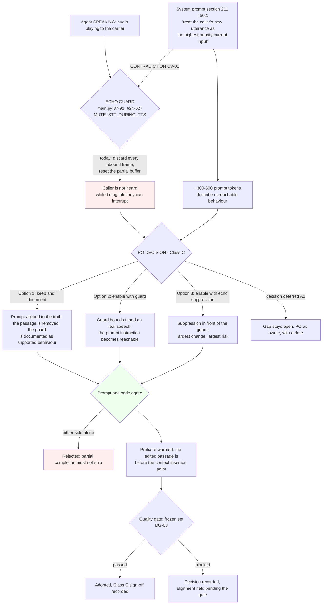

> **Lens:** PO / TPO (technical ACs) / Architect (HLD, LLD) · **Engagement:** Brownfield — `D:\project\universityDemo`

# US-014 — Decide caller-interruption behaviour and make code and prompt agree [Lens: PO]

- **Status:** **IN PROGRESS - DECIDED (2026-09-19, Phase 4a PO ruling): enable with echo-suppression** — caller audio continues during TTS playback with echo-suppression on the mic bleed; barge-in becomes possible pre-Wave-1

> **CLASS C — REQUIRES PRODUCT OWNER SIGN-OFF.** This story changes user-perceivable turn-taking. Under `01-brd.md` §5 ("Behaviour-changing work needs sign-off") it may not be adopted on engineering judgement, and `UC-09` exists precisely because the decision is the Product Owner's. `DG-03` additionally gates every Class B/C change: the decision can be **taken** now, but the prompt alignment may not **ship** until the quality gate can score it.

- **Story:** As a **Product Owner**, I want **a recorded decision on whether a caller can interrupt the agent, with the code and the agent's own instructions agreeing afterwards**, so that **the assistant never tells callers it will yield to them while the platform silently discards what they say**.
- **Business value:** `BRD-19` requires the system to either support interruption or explicitly document that it does not and why, and to remove instructions in the agent's prompt that describe unreachable behaviour. Today `CV-01` records a live contradiction: the system prompt instructs the agent to treat the caller's new utterance as the highest-priority current input, while the echo guard discards every inbound frame while the agent speaks. Roughly **300–500 prompt tokens** describe behaviour the architecture prevents, and a caller who interrupts is not heard while being told they can be.
- **Priority:** **Must** (decision) / **gated** (adoption) — TPO ordering note: the decision is separable and does not block streaming, so `TRD-05` lands independently. The prompt alignment is a change to model input and therefore waits behind the quality gate (`BRD-08`/`BRD-09`, `DG-03`).

## Acceptance Criteria [Lens: PO]

**AC-1.** The decision exists, is owned, and is recorded once.

```gherkin
Scenario: The decision is taken
  Given the current behaviour is restated and the echo-cancellation constraint is understood
  When the Product Owner decides among keep-and-document, enable-with-guard and enable-with-echo-suppression
  Then the decision, its class (Class C) and its date are recorded against UC-09
  And a later duplicate request cites the recorded decision rather than re-deciding it

Scenario: The echo-cancellation constraint is not understood at decision time
  Given the trade cannot be stated honestly because the carrier behaviour is unmeasured
  When the decision is requested
  Then it is deferred with the Product Owner as owner and a date
  And the contradiction is carried as an open gap rather than resolved by default
```

**AC-2.** Code and prompt agree — the mismatch is the defect, in either direction.

```gherkin
Scenario: The decision is to keep the current behaviour
  Given the callers cannot interrupt while the agent speaks
  When the agent's instructions are aligned to the decision
  Then the prompt no longer instructs the agent to yield to the caller mid-speech
  And the guard's behaviour is documented as the supported behaviour

Scenario: The decision is to enable interruption
  Given the Product Owner has approved enabling interruption
  When the behaviour is implemented
  Then the guard no longer discards the caller's speech unconditionally
  And the prompt's instruction becomes reachable

Scenario: Only one side is changed
  Given the prompt is updated but the guard is not, or the guard is updated but the prompt is not
  When the change is proposed for shipping
  Then it is rejected as a partial completion
  And the two sides ship together
```

**AC-3.** A change to turn-taking is signed off, gated, and reversible.

```gherkin
Scenario: Barge-in is enabled
  Given the Product Owner has signed off the Class C change
  When it is adopted
  Then the frozen-set evaluation has been run and passed the quality gate
  And the change alters turn-taking only as approved

Scenario: Enabling interruption degrades transcription
  Given interruption is enabled and the agent transcribes its own speech
  When the degradation is observed
  Then the change is reverted and the discard behaviour is restored
  And the revert is a configuration change

Scenario: The decision is withdrawn before adoption
  Given a decision is recorded but not yet implemented
  When the Product Owner withdraws it
  Then nothing has shipped that depends on it
  And the record shows the withdrawal rather than a silent supersession
```

**AC-4.** Two callers interrupting at once is the test case, not an afterthought.

```gherkin
Scenario: Both callers speak while their agents speak
  Given two live sessions with interruption enabled
  When both callers speak during their agent's speech
  Then each session handles its own interruption
  And neither session's audio or transcript reaches the other
```

Technical acceptance criteria [Lens: TPO] — performance, security, resilience checks the code must pass:

- TAC-1: **The decision is data, not prose** — the recorded decision names one of the three options, its class, its sign-off, and the artefacts it touches (the guard, the prompt, and if enabled, the endpointing interaction). A decision that cannot be machine-read back is not a decision.
- TAC-2: **Prompt alignment is measurable** — after alignment, the unreachable-instruction passage is **absent** from the assembled system prompt, verified by searching the assembled prompt rather than the source file (the prompt is assembled, not read verbatim). The measured system prompt is 3,558 tokens; the passage accounts for roughly 300–500 of them, and both the before and after counts are recorded rather than estimated.
- TAC-3: **The prefix cache is re-warmed after the edit** — the passage sits **before** the `{context}` insertion point (`voice_system_prompt.py:600`), which is the measured break point of the prefix cache (2,909 ms → 50 ms when warm). Editing it invalidates the cached prefix, so the boot warm must be re-run and warmth confirmed by engine counters, not by a log line (`BRD-17`, `US-007`).
- TAC-4: **If interruption is enabled, the guard is bounded and tuned** — the replacement guard's thresholds are tuned on real speech and recorded, because an over-sensitive guard makes the agent answer the caller's cough and an under-sensitive one reproduces today's behaviour while claiming otherwise. Threshold values are recorded with the evidence behind them.
- TAC-5: **Interruption does not sacrifice the endpointing floor's honesty** — the 600 ms end-of-speech decision remains the single live turn decision (`BRD-04`); an interruption mechanism must not create a second, competing end-of-turn decision.
- TAC-6: **Isolation holds at N=2** — with interruption enabled, no session's audio, partial transcript or turn state reaches the other (`BRD-06`), observed under the two-caller harness.
- TAC-7: **Reversible by configuration** — whichever option is adopted, reverting restores the previous discard behaviour exactly (`BRD-15`), demonstrated.
- TAC-8: **Behaviour surface preserved** — the 28 supported intents still work after the change, judged end-to-end (`BRD-18`); removing prompt tokens must not remove a behaviour those tokens were carrying.
- TAC-9: **No Pipecat** — the option set does not include adopting a voice framework; `REC-01` records Pipecat as installed, bypassed and **not adopted** in this program, and this story does not reopen it.
- TAC-10: **Load** — if interruption is enabled, an N=2 run with both callers interrupting shows no turn above the 3,000 ms per-turn cap and no cross-session audio.

## HLD — Architecture Slice [Lens: Architect]

The contradiction is at one seam. The prompt says the agent yields; the guard (`main.py:87–91, 624–627`, `MUTE_STT_DURING_TTS`) discards every inbound frame while the agent speaks and resets the partial buffer. The guard exists for a real reason — the carrier stream has **no echo cancellation**, so an open microphone during playback means the agent hearing itself. `TRD-05` places this at a single decision point; `UC-09` decides; this story implements whichever side is chosen and removes the other claim.



- **Components touched:**
  - `MOD-01` / `app/main.py` — the echo guard (`:87–91, 624–627`) is either kept and documented or replaced by a bounded, tuned mechanism, per the decision. The guard's *purpose* (no carrier-side echo cancellation) is not changed by the decision; only what it does with the caller's speech is.
  - `MOD-01` / `app/voice_system_prompt.py` — the unreachable-instruction passage (§211/§502) is removed or made reachable, so the prompt stops describing behaviour the platform prevents. The edit lands before the `{context}` insertion point (`:600`).
  - `MOD-01` / `MOD-04` — if interruption is enabled, the endpointing decision and the transcription path meet a second source of caller audio; `BRD-04`'s single end-of-speech decision must survive (`TAC-5`), and `MOD-04` must not be handed audio it may transcribe as the agent's own speech.
  - `MOD-07` — consumed: the changed prompt prefix is re-warmed at boot and the warmth is **verified** (`US-007`), because an edited prefix is a cold cache.
  - `MOD-06` — consumed: the frozen set scores the alignment (`US-003`), and the trace distinguishes an interrupted turn from a normal one if interruption is adopted.
- **Interaction summary:**
  1. The current behaviour and the trade are restated honestly: the caller's audio is discarded during playback, and the reason is the absence of echo cancellation on the carrier stream.
  2. The options are costed — keep-and-document, enable-with-guard, enable-with-echo-suppression — and the Product Owner decides; the class (Class C) and the sign-off are recorded.
  3. The chosen side is implemented and the **other claim is removed**: the prompt no longer describes behaviour the system lacks, or the guard stops discarding speech it now supports.
  4. **Failure path:** only one side is changed — the prompt without the guard, or the guard without the prompt. The change is rejected as a partial completion and does not ship (`UC-09`'s partial-completion row).
  5. **Failure path:** interruption is enabled and degrades transcription (the agent transcribes itself). The change is reverted per `BRD-15` and the discard behaviour is restored.
  6. **Failure path:** the decision is deferred. The gap stays open with the Product Owner as owner and a date, and the contradiction is carried — explicitly, not by default.

## LLD — Implementation Detail [Lens: Architect]

- **Classes / functions / APIs** — Python 3.11. The artefacts of the chosen option; which of the first two exists is the Product Owner's decision:

```python
# app/main.py  (MOD-01) - the guard, at ONE decision point (TRD-05)

MUTE_STT_DURING_TTS: bool = settings.MUTE_STT_DURING_TTS   # today: unconditional discard

def _handle_inbound_frame(frame: bytes, session: CallSession) -> None:
    """The single place caller audio is admitted or discarded while the agent speaks.

    Option 1 (keep and document): unchanged. The prompt is aligned instead.
    Option 2/3 (enable): the discard becomes conditional on a bounded, tuned guard.
    """
    if session.state is SM01.SPEAKING and not self._interruption_admitted(frame):
        session.reset_partial()          # today's behaviour, now the DOCUMENTED one
        return
    session.buffer.append(frame)

def _interruption_admitted(frame: bytes) -> bool: ...
    # Only exists if interruption is adopted. Thresholds tuned on REAL speech and
    # recorded (TAC-4) - never a value chosen to make the demo work.
```

```
# app/voice_system_prompt.py  (MOD-01) - the alignment, and WHY it is not a text tweak

# Sections 211 / 502 sit BEFORE the {context} insertion point (line 600).
# Measured: the prefix cache takes prefill from 2,909 ms to 50 ms, and {context}
# is the measured break point. Editing the passage INVALIDATES the cached prefix.
# => the boot warm must be re-run and warmth confirmed by engine counters (US-007).
# Removing ~300-500 of 3,558 measured system-prompt tokens changes model input,
# which is why the alignment is gated (BRD-08/BRD-09) and not shipped on judgement.
```

- **Data schema changes** — none to a store. Two records change:

```jsonc
// The decision record (UC-09)
{ "decision": "keep_and_document" | "enable_with_guard" | "enable_with_echo_suppression",
  "class": "C",
  "signed_off_by": "<Product Owner>",
  "date": "<ISO-8601>",
  "options_considered": ["keep_and_document", "enable_with_guard", "enable_with_echo_suppression"],
  "artifacts_touched": ["app/main.py", "app/voice_system_prompt.py"] }

// The trace note, if interruption is adopted (DAT-07 - timings and flags, never audio or text)
{ "interrupted": true, "interruption_admitted": true }   // absent when not applicable, never 0
```

- **Edge cases** — enumerated, each with the decided behavior:

| Edge case | Decided behavior |
|---|---|
| The decision is deferred | The gap stays open with the Product Owner as owner and a date; the contradiction is carried explicitly, never resolved by default (`UC-09` A1) |
| The latency baseline does not exist yet | The decision is scoped to what is known, or deferred until measured; a decision made without the baseline is recorded as such |
| The carrier's echo behaviour is unmeasured | Stated as an unknown in the decision record: the trade cannot be costed honestly without it, and pretending otherwise is the failure this story exists to prevent |
| Only one side is aligned | Rejected: a partial completion must not ship (`UC-09` partial-completion row, `AC-2`) |
| The prompt is edited but the prefix is not re-warmed | A cold prefix on every first turn after boot — the edit is incomplete until the warm is verified by engine counters (`TAC-3`) |
| Removing tokens removes a carried behaviour | Caught by the frozen set (`BRD-18`): the alignment is a gated change precisely because those tokens may be doing work beyond the passage's stated intent |
| A guard threshold tuned to the demo rather than to speech | Rejected: thresholds are tuned on real speech and recorded with their evidence (`TAC-4`) |
| Both callers interrupt at once | Each session handles its own; no shared state (`BRD-06`, `TAC-6`) |
| Interruption causes self-transcription | Revert per `BRD-15`, restoring the discard behaviour; the revert is a configuration change |
| The decision is withdrawn before adoption | Nothing has shipped that depends on it; the withdrawal is recorded rather than silently superseded |
| A voice-framework proposal arrives as an option | Not in the option set: `REC-01` records Pipecat as bypassed and not adopted (`TAC-9`) |

- **Error handling** — this story introduces no new runtime error class. Its failure modes are **process** failures, not call failures: a decision that is not recorded (the default-and-move-on failure), a one-sided alignment (rejected before shipping), and a prompt edit shipped without re-warming the prefix (visible as a first-turn regression, which is `US-007`'s readiness gate catching it). If interruption is adopted, the guard's failure mode is bounded and stated: a false positive admits the agent's own speech into the transcript, which the transcription path's low-confidence signal (`MOD-04` `TRD-16`) flags rather than silently accepts, and which is the condition `UC-09` E1 reverts.

- **Test scenarios** — unit / integration / e2e / load, one checkable line each:

| # | Level | Scenario | Covers UC-09 row |
|---|---|---|---|
| T-1 | unit | The decision record contains exactly one of the three options, its class and its sign-off (TAC-1) | Happy path main flow 4 |
| T-2 | unit | A second decision request cites the recorded one instead of re-deciding | Duplicate request |
| T-3 | unit | The assembled system prompt does **not** contain the unreachable-instruction passage after alignment (TAC-2) | Happy path main flow 5 |
| T-4 | unit | The prompt token count before and after the edit is recorded, not estimated (TAC-2) | Partial data |
| T-5 | unit | Under the keep option, the guard is unchanged and its behaviour is documented as the supported behaviour | Happy path main flow 1–2 |
| T-6 | unit | A guard threshold outside the tuned range is rejected by configuration validation (TAC-4) | Invalid input |
| T-7 | unit | The endpointing decision remains the single live end-of-speech decision with interruption enabled (TAC-5) | Invalid input |
| T-8 | integration | The prompt edit invalidates the cached prefix; an un-warmed stack shows the first-turn signature (TAC-3) | Missing data |
| T-9 | integration | After the boot warm, engine counters confirm prefix warmth following the edit (TAC-3) | Recovery |
| T-10 | integration | Prompt aligned without the guard aligned: the change is rejected as a partial completion (AC-2) | Partial completion |
| T-11 | integration | Guard aligned without the prompt aligned: rejected on the same rule | Partial completion |
| T-12 | integration | Reverting the adopted option restores the previous discard behaviour exactly (TAC-7) | Recovery |
| T-13 | integration | The decision is withdrawn before adoption: nothing shipped depends on it, and the withdrawal is recorded | Cancellation |
| T-14 | integration | Under the keep option, an interrupted caller still hears the agent's full utterance and must repeat — the documented behaviour, not a surprise | Happy path (today's behaviour, now documented) |
| T-15 | integration | A noisiest-case false positive: the agent's own speech is flagged low-confidence rather than silently transcribed (TAC-4) | Invalid input |
| T-16 | e2e | Interruption enabled: a caller interrupts mid-sentence and is heard, and the agent's reply reflects the new utterance | Happy path (A2 in `UC-01`, now decided) |
| T-17 | e2e | Keep option: the caller is not heard and the prompt promises nothing it cannot do | Alternate path A1 |
| T-18 | e2e | Frozen-set scoring after alignment: no intent regressed and no critical intent touched (TAC-8) | Happy path (end-to-end task success) |
| T-19 | e2e | Self-transcription observed under interruption → reverted, discard behaviour restored | Dependency failure E1 |
| T-20 | load | N=2 with both callers interrupting simultaneously: each handled independently, no cross-session audio, no turn above 3,000 ms (TAC-6, TAC-10) | Concurrent operation (this is the test case) |
| T-21 | load | N=2, three consecutive runs with interruption enabled: isolation holds and no turn is lost | Concurrent operation |
| T-22 | load | N=2 under the keep option: unchanged latency profile, confirming the decision itself costs nothing | — (TAC) |

## Traceability
- Parent module: `MOD-01` (Voice Turn Path — `TRD-05` owns the session-scoped state, the single ownership of `SM-01` and the interruption decision point)
- Technical requirement: `TRD-05` (session-scoped state, single ownership of `SM-01`, and a decision point for interruption — it "implements whichever side is chosen and removes the other claim"); interacts with `TRD-04`'s failure branches and with `MOD-04` `TRD-16` when the agent's own speech can reach transcription
- Use case: **`UC-09`** (decide caller-interruption behaviour) — all `✓` rows of its Scenario Coverage table are covered by T-1…T-22; `UC-01` A2 (caller speaks before the greeting finishes) is the caller-visible instance
- Business requirement: **`BRD-19`** (interruption behaviour is a decision, not an accident); governs `BRD-06` (isolation if interruption is adopted) and `BRD-15` (revertible), and is bound by `01-brd.md` §5's sign-off rule and by `BRD-18` (the 28-intent behaviour surface)
- Data gap / state machine: `SM-01`'s SPEAKING → PROCESSING transition is illegal today because the guard discards the audio (`03-data-state-analysis.md` B.2: "a turn cannot begin while the agent speaks"); if interruption is adopted this becomes a legal transition **with a race that needs its own decision**, which is why it is Class C. `SM-02` gains the `interrupted` note only if adopted
- Reconciliation: **`CV-01`** (the prompt instructs behaviour the architecture prevents — the contradiction this story resolves); `REC-01` (Pipecat is bypassed and not adopted, and is not among the options); `REC-02` (one process, one event loop — the guard lives on the single event loop, so a guard that blocks is a blocked turn path)
- Related workflow: `WF-01` (the turn workflow) and `UC-01` E-flows for the greeting; the decision does not create a new workflow, it removes a contradiction inside an existing one

## Definition of Done
- [ ] All ACs pass (AC-1 … AC-4, TAC-1 … TAC-10)
- [ ] Tests from the LLD test scenarios pass (T-1 … T-22) — those applicable to the chosen option; the remainder are recorded as not-applicable with the option named, never silently skipped
- [ ] Perf/load test passed against the story's TACs (TAC-10 N=2 with interruption, if adopted; TAC-3 prefix re-warm verified by engine counters either way)
- [ ] Schema migration applied — n/a (no durable store; the decision record and the trace note are the artefacts)
- [ ] Module docs updated if contracts changed — `MOD-01` B.3 (the inbound-frame contract at the guard) and B.8 ("Keep `MUTE_STT_DURING_TTS` until `UC-09` decides" is replaced by the decision and its date); `06-architecture.md` §4's AEC-guard row moves from "blocks barge-in" to the decided behaviour
- [ ] **Class C sign-off recorded** with the Product Owner's name, the date, and the option chosen — this box is not satisfiable by engineering approval
- [ ] Prompt and code ship **together**; a one-sided change is rejected (`AC-2`, `T-10`, `T-11`)
- [ ] Quality gate: frozen-set scores recorded before and after the alignment, with no critical intent regressed and aggregate movement ≤2 pt; if `DG-03` blocks the frozen set, the decision is recorded and the alignment is **held** rather than shipped unmeasured
- [ ] `BRD-15` rollback demonstrated: the adopted option reverts by configuration and restores the previous discard behaviour exactly
