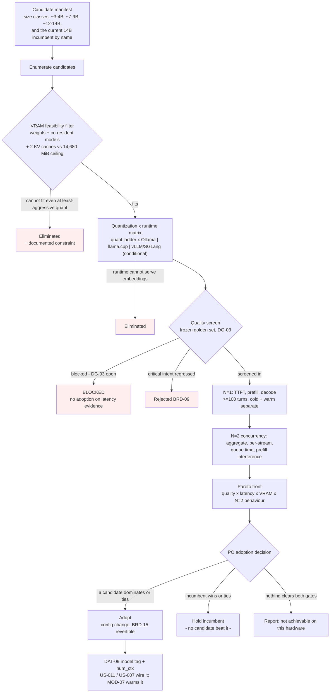

> **Lens:** PO / TPO (technical ACs) / Architect (HLD, LLD) · **Engagement:** Brownfield — `D:\project\universityDemo`

# US-015 — Gated model and runtime comparison with Pareto selection [Lens: PO]

- **Story:** As a **developer and Product Owner deciding what the admissions line runs on**, I want **every credible model size class and serving runtime put through one gated funnel — VRAM feasibility, quantization × runtime, quality on the frozen set, N=1 latency, N=2 concurrency — and selected on a Pareto front**, so that **whatever serves callers is the measured best fit for this box rather than the component that happened to be installed first**.
- **Business value:** `00-product-intent.md` §6b withdraws the assumption this program started with. The measured 77% of the 448 GB/s ceiling describes the *efficiency achievable for the incumbent model*; it says nothing about a model that reads fewer bytes per token. §6b's correction is explicit: a 7B Q4 (~4.7 GB) moves the ceiling from 49.8 to ~95 tok/s, which at the same measured efficiency is roughly **2× decode** and halves weight bytes for prefill as well. The consequence recorded there governs this story: **`UC-10` is promoted from "fallback if gates fail" to a gated comparison that runs regardless.** Two things follow, and both are acceptance criteria below — the incumbent receives **no preferential treatment**, and the comparison is **not a contingency branch**.
- **Priority:** **Must** — TPO ordering note: this is not a fallback and it is not deferred behind a gate failure, but it also **cannot complete before its instruments exist**. The quality screen needs the frozen golden set (US-003) and the N=2 stage needs the harness (US-002); the N=1 stage needs the counter capture and the TTFT mark (US-001, US-004). The funnel therefore runs *after* Phase A's instruments and *before* the model identity is frozen for the demonstration. Its output is a **Product-Owner adoption decision under `BRD-09`**, not an engineering preference.

## Acceptance Criteria [Lens: PO]

**AC-1.** The comparison runs regardless of whether streaming and concurrency meet their targets.

```gherkin
Scenario: Streaming and concurrency already meet their gates
  Given streaming and the two-caller path already meet BRD-02 and BRD-05 on their own
  When the program's phase gates are reviewed
  Then the model and runtime comparison is still run to completion
  And its result is recorded even when no candidate displaces the incumbent

Scenario: The comparison is scheduled as a contingency
  Given a schedule or plan that defers the comparison until a latency or VRAM gate fails
  When that plan is reviewed against 00-product-intent.md §6b
  Then the deferral is rejected
  And the comparison is treated as a phase deliverable with its own budget

Scenario: Model size is described as a last resort
  Given any artifact that repeats the withdrawn claim that model size is a "weak lever" or a "last lever"
  When the artifact is reviewed
  Then the claim is corrected: the measured 77% is retained, the inference drawn from it is not
  And the correction cites the §6b note rather than restating it as a preference
```

**AC-2.** Every candidate traverses the same funnel, and every elimination is documented rather than silent.

```gherkin
Scenario: A candidate is eliminated before it is measured
  Given a candidate cannot fit the VRAM budget at its least aggressive admissible quantization
  When it reaches the feasibility filter
  Then it is eliminated without a full benchmark run
  And the elimination names the documented feasibility constraint that eliminated it
  And it appears in the funnel report with that reason

Scenario: A candidate is missing from the report
  Given the funnel report is produced
  When it is reviewed
  Then every candidate named in the manifest is either measured or eliminated with a recorded reason
  And a candidate that is simply absent is a defect, not an omission to be inferred

Scenario: A runtime leg cannot be verified
  Given the vLLM/SGLang runtime leg depends on WSL2 and Blackwell support verifying on this box
  When that verification fails or is not performed
  Then the leg is eliminated by a documented feasibility constraint
  And llama.cpp server and Ollama remain compared on the same axes
```

**AC-3.** The incumbent is a baseline candidate with no preferential treatment.

```gherkin
Scenario: The incumbent competes on the same terms as everything else
  Given qwen2.5:14b on Ollama is the running configuration
  When the funnel runs
  Then it enters as one candidate among the others, in its own size class
  And it receives no exemption from any stage, and no stage is skipped for it
  And its measurements are taken on the same harness, the same fixture and the same frozen set

Scenario: The incumbent is retained
  Given the funnel has completed
  When the incumbent is kept as the serving configuration
  Then it is kept only because it wins or ties on the measured gate set
  And the report names the axes on which it won or tied
  And the recorded reason is "no candidate beat it on the measured gates", not "it was already there"

Scenario: The incumbent is retained without measurement
  Given the incumbent is kept and no funnel report exists, or the report has no measurement for it
  When the decision is reviewed
  Then the decision is rejected under 00-product-intent.md §6b
  And the incumbent is re-entered into the funnel before any adoption is recorded
```

**AC-4.** The quality screen is gated by the frozen golden set, and blocked is never a pass.

```gherkin
Scenario: The frozen set is unavailable
  Given DG-03 is open and the critical-intent ground truth has not been approved
  When a candidate reaches the quality screen
  Then the screen reports blocked and escalates to the Product Owner
  And no candidate is adopted on latency, VRAM or N=2 evidence alone
  And the funnel report states the stage at which it stopped, rather than presenting a partial funnel as complete

Scenario: A candidate regresses a critical intent
  Given a candidate's per-intent scores are in
  When fees, deadlines, eligibility, escalation or lead capture regresses against the frozen baseline
  Then the candidate is rejected
  And its latency or VRAM advantage does not enter the decision

Scenario: A candidate improves the aggregate
  Given a candidate raises the aggregate score
  When a critical intent has regressed at the same time
  Then the candidate is rejected
  And the aggregate gain is not treated as compensation
```

**AC-5.** N=2 behaviour is measured for every candidate and never derived from N=1.

```gherkin
Scenario: A candidate's concurrency stage runs
  Given a candidate completed the N=1 stage
  When its N=2 stage runs
  Then aggregate throughput, per-stream throughput, queue time and prefill interference are recorded as measurements
  And no per-stream figure is produced by halving an N=1 number
  And none of those fields carries a threshold asserted by this story

Scenario: An N=2 figure is quoted
  Given any artifact that quotes an N=2 decode or throughput figure
  When the figure is reviewed
  Then it cites a measurement taken by the harness at N=2
  And the withdrawn "≥ 18 tok/s per stream", derived by halving the measured N=1 rate, is not reinstated
```

**AC-6.** Selection is a Pareto decision across quality, latency, VRAM and N=2 behaviour.

```gherkin
Scenario: The comparison closes
  Given every surviving candidate has quality, N=1 latency, peak VRAM at N=2 and N=2 behaviour recorded
  When the funnel closes
  Then the non-dominated set is presented as the Pareto front across those four axes
  And no composite score is constructed that could hide a critical-intent regression behind an aggregate
  And the Product Owner records the adoption decision against the front

Scenario: No candidate clears both gates
  Given no candidate meets the quality gate and the latency gate together
  When the funnel closes
  Then the honest outcome "not achievable on this hardware" is reported with the numbers behind it
  And the incumbent is held rather than replaced
  And no candidate is adopted at a lower quality bar to produce a result
```

**AC-7.** Predictions are written before measurement and are never stated as acceptance thresholds.

```gherkin
Scenario: A candidate's expected advantage is stated
  Given a prediction about a candidate is recorded before its run
  When the run completes
  Then the prediction, the measurement and the decision taken are recorded together
  And the prediction is labelled a prediction wherever it appears

Scenario: A prediction is reviewed
  Given a prediction appears in an acceptance criterion, a TAC or a Definition of Done item
  When the story or the report is reviewed
  Then it is a defect: predictions live in their own section and carry a measurement and a decision
```

Technical acceptance criteria [Lens: TPO] — performance, security, resilience checks the code must pass:

- TAC-1: **N=1 stage protocol.** ≥100 turns per candidate per condition, cold and warm reported separately (`BRD-02` §11 criterion 2, `BRD-03`); prefill and decode are reported from the engine's own counters (`prompt_eval_count`, `eval_count`, `prompt_eval_duration`, `eval_duration`), never inferred from wall-clock deltas around a blocking call (`TRD-10`, `TRD-21`).
- TAC-2: **Every candidate is measured at N=2**; no candidate's N=2 behaviour is extrapolated from N=1 (`UC-10` main flow step 2). The recorded fields are aggregate throughput, per-stream throughput, queue time and prefill interference (`TRD-22`). **This story asserts no threshold on any of them.**
- TAC-3: **One variable at a time** (`01-brd.md` §5). Each candidate declares the prompt configuration it ran under, and the incumbent is measured under **both** the pre-`TRD-11` ordering and the reordered prompt, so the model effect is separable from the prompt effect (`TRD-11`). A comparison that varies model and prompt together is discarded, not reported.
- TAC-4: **Quality is scored on the frozen set at its recorded hash**; blocked ≠ pass (`TRD-23`); a critical-intent regression rejects regardless of every other axis (`BRD-09`, `BRD-08`).
- TAC-5: **`BRD-11` applies to whatever is adopted**: peak VRAM at N=2 ≤ **14,680 MiB** (90% of the measured 16,311 MiB budget) with no sysmem spill. The VRAM feasibility filter derives from that ceiling, **not** from `app/memory_budget.py`'s `"nvidia"` block, whose `safe_threshold_percent: 95` sits above the requirement it is supposed to guard (`REC-13`).
- TAC-6: **No hosted inference at any stage** (`AS-03`), including as a fallback when a local candidate fails to pull or load. A candidate that cannot run locally is eliminated, never re-homed.
- TAC-7: **The funnel never runs while calls are live** (`UC-10` concurrent-operation row) and never in the same window as a latency run (`MOD-06` B-rules: quality and latency are measured in separate windows). A run that overlapped is discarded, not reported.
- TAC-8: **Reversibility.** Adopting a candidate is a configuration change revertible in one step to the incumbent, and the revert is demonstrated before the decision is closed (`BRD-15`).
- TAC-9: **A failed candidate leaves no partial state.** A pull or load failure rejects the candidate cleanly and never leaves the stack serving a half-loaded or unknown model (`UC-10` dependency-failure and partial-completion rows).
- TAC-10: **The runtime leg preserves the embeddings path.** `MOD-02` consumes `nomic-embed-text` through Ollama's embeddings endpoint (`MOD-03` B.3); a runtime that cannot serve query embedding is eliminated, because `BRD-10`'s grounding depends on it.

## Predictions — recorded before measurement [Lens: TPO]

The plan's rule is **prediction first, measurement second** (`WF-03` step 1: "Hypothesis and numeric prediction written before the run"; step 5: "Actual compared to prediction"). Every row below is a **prediction**, each with the measurement that will test it and the decision that follows. **None of these is an acceptance threshold**, and none may be copied into an AC, a TAC or a Definition of Done item (`AC-7`).

| # | Prediction (not a threshold) | Basis | Measured by | Decision if it holds / fails |
|---|---|---|---|---|
| P-1 | A 7–9B candidate at Q4-class quantization will decode materially faster than the incumbent at N=1 | §6b's correction: the incumbent is bandwidth-bound at 77% of the 448 GB/s ceiling; a smaller weight per token moves that ceiling (7B Q4 ~4.7 GB → 49.8 → ~95 tok/s at the same efficiency) | The N=1 stage, decode from `eval_count` / `eval_duration` | If the measured gain is **< 50% of predicted**, stop and investigate before proceeding — `WF-03` step 5's phase gate; the change is suspect, not merely disappointing |
| P-2 | A 3–4B candidate will leave materially more VRAM headroom at N=2 than the incumbent's measured ~90% occupancy | Model bytes are the dominant resident term against the measured 16,311 MiB budget, alongside whisper (~0.8 GiB), kokoro (~0.35 GiB) and two ~1.5 GiB KV caches | Peak VRAM at N=2, read from the device | If it holds, it becomes evidence for the `AS-06` burst question (whether a third line is even conceivable); it does **not** by itself justify adoption |
| P-3 | At least one smaller candidate will regress a critical intent on the frozen set | The 3,558-token static instruction surface and the 28-intent behaviour surface (`BRD-18`) are a large instruction-following load for a small model | Per-intent scores on the frozen set | Rejection, regardless of latency or VRAM — `BRD-09`. This prediction exists to make the rejection unsurprising rather than to argue for the incumbent |
| P-4 | A runtime migration alone will not move N=1 decode materially | The ceiling is 448 GB/s of device memory bandwidth (`AS-07`), a property of the box, not of the scheduler; a runtime changes scheduling and prefix-cache behaviour, not bandwidth | The runtime leg's N=1 decode and its N=2 behaviour | A runtime is adopted only on the N=2 axis or on prefix-cache behaviour — **never** on N=1 decode, where the prediction says it cannot win |

## HLD — Architecture Slice [Lens: Architect]

The funnel is a decision procedure over measured facts this program already has, plus facts it does not yet have and will not infer. The incumbent is the only candidate whose numbers exist today: N=1 decode **36.6–38.9 tok/s** (77% of the 448 GB/s ceiling), prefill **1,588–1,990 ms**, a **5,666-token** prompt of which **3,558 tokens** are static instructions, peak VRAM **~90%** of the 16,311 MiB budget at N=2, and a cold load of **32,919 ms** (67,349 ms to first token). Those are the numbers a candidate has to beat; they are not a description of the target.



- **Components touched:**
  - `MOD-03` / funnel tooling — this story **decides** the serving configuration; it does not itself hold the model. The runner is developer-time tooling, in the same class as the existing prefix-cache probe (`doc/perf/tools/a4_prefix_cache_probe.py`), and it drives the live stack through the harness rather than calling the engine directly.
  - `MOD-06` — consumed, not modified. The harness supplies N=1 and N=2 (`TRD-22`), the frozen set and the runner supply quality (`TRD-23`), and the trace supplies the per-turn counters (`TRD-20`, `TRD-21`). This story adds no new instrument, and it must not: a benchmark that invents its own measurement path measures a different system from the one callers reach.
  - `MOD-02` — the embeddings boundary is a surviving constraint on the runtime leg (`TAC-10`); `nomic-embed-text` is served through the same engine process, so a runtime swap is never a generation-only change.
  - `MOD-07` — consumed. The model tag lives in `DAT-09`; the boot warm enumerates completion-capable models (`REC-11`). An adopted candidate changes what the operator must warm, and the boot path is US-007's to change.
  - `MOD-01` — the consumer. Whatever wins must meet `MOD-01`'s turn budget with the measured stage split intact; a candidate that improves decode but lengthens prefill has moved the latency, not reduced it.
- **Interaction summary:**
  1. The candidates are enumerated from a manifest that names size classes rather than products, and the incumbent is placed in its own class by name — with no exemption from any stage (`AC-3`).
  2. The feasibility filter eliminates candidates that cannot fit alongside whisper, kokoro and two KV caches inside the 14,680 MiB ceiling, and **records the constraint for each elimination** so an elimination is a documented fact rather than an unstated judgement (`AC-2`).
  3. Survivors are measured at N=1 over ≥100 turns, cold and warm separately, with each candidate declaring the prompt configuration it ran under; the incumbent is measured under both prompt orderings so the model effect separates from the prompt effect (`TAC-3`).
  4. Survivors are measured at N=2 for throughput, queue time and prefill interference. **Nothing in this stage is a threshold** — it produces a distribution per candidate (`AC-5`).
  5. The quality screen runs on the frozen set at its hash. **Failure path:** if `DG-03` is open, the screen reports **blocked**, the funnel stops there and the report says so; no candidate is adopted on latency evidence alone (`AC-4`).
  6. **Failure path:** the Pareto front is presented with no composite score, the Product Owner records the decision, and if no candidate clears both gates the recorded outcome is "not achievable on this hardware" with the incumbent held (`AC-6`).

## LLD — Implementation Detail [Lens: Architect]

- **Classes / functions / APIs** — Python 3.11, developer-time tooling that consumes the existing instruments; it calls the harness and the evaluation runner rather than the engine directly, so every number it records passed through the same path a caller's audio does:

```
# doc/perf/tools/model_funnel.py   (MOD-03 decision tooling; drives MOD-06's instruments)

class SizeClass(StrEnum):
    SMALL     = "small_3_4B"      # ~3-4 B parameters
    MID       = "mid_7_9B"        # ~7-9 B
    LARGE     = "large_12_14B"    # ~12-14 B, excluding the incumbent
    INCUMBENT = "current_14B"     # qwen2.5:14b, entered by name, no exemption (AC-3)

@dataclass(frozen=True)
class Candidate:
    candidate_id: str
    model_tag: str                 # resolved against the engine's own model list
    size_class: SizeClass
    quantization: str              # e.g. Q4_K_M | Q5_K_M | Q8_0 | upstream default
    runtime: str                   # ollama | llama_cpp | vllm | sglang
    prompt_config: str             # "pre_reorder" | "reordered"  -- TAC-3, one variable at a time
    is_incumbent: bool = False

class Stage(StrEnum):
    FEASIBILITY = "vram_feasibility"
    MATRIX      = "quant_runtime_matrix"
    QUALITY     = "quality_screen"
    LATENCY_N1  = "latency_n1"
    CONCURRENCY_N2 = "concurrency_n2"
    PARETO      = "pareto"

@dataclass(frozen=True)
class Elimination:
    candidate_id: str
    stage: Stage
    reason: str
    constraint: str              # the documented constraint that permits elimination pre-measurement
    # AC-2: an Elimination without a constraint string is a defect, not a shortcut

@dataclass(frozen=True)
class VramFeasibility:
    device_budget_mib: int       # 16311, measured
    ceiling_mib: int             # 14680 = 90% of the measured budget (BRD-11, REC-13)
    co_resident_mib: int         # whisper ~0.8 GiB + kokoro ~0.35 GiB, read from the running stack
    kv_per_sequence_mib: int     # ~1.5 GiB at num_ctx 8192, two sequences at N=2
    def admits(self, c: Candidate) -> bool | Elimination: ...

@dataclass(frozen=True)
class LatencyProfile:
    candidate_id: str
    ttft_p50_ms: float; ttft_p95_ms: float
    prefill_ms: float                    # from prompt_eval_duration, not wall clock
    decode_tok_s: float                  # from eval_count / eval_duration
    cold: bool                           # cold and warm are never averaged (BRD-03)
    turns: int                           # the sample size travels with the figure

@dataclass(frozen=True)
class ConcurrencyProfile:
    candidate_id: str
    aggregate_tok_s: float               # MEASURED
    per_stream_tok_s: tuple[float, ...]  # MEASURED -- never N=1 divided by two (AC-5)
    queue_ms: tuple[float, ...]          # MEASURED
    prefill_interference_ms: float       # MEASURED
    peak_vram_mib: int                   # MEASURED, checked against BRD-11's ceiling
    sysmem_spill: bool
    # NO threshold is asserted on any field of this record by this story.

def pareto_front(profiles: Sequence[Scored], axes: Axes) -> tuple[Scored, ...]:
    """Non-dominated set across quality, latency, VRAM, N=2 behaviour.
    A flat composite is deliberately not computed: it could rank a
    critical-intent regression as a net win (AC-6, BRD-09)."""
```

- **Data schema changes** — no durable store is added and `DAT-09` is **not** modified by this story; the adoption, when it happens, is a configuration change recorded under `BRD-15` and wired by `US-011`/`US-007`. What this story creates is a versioned manifest and a report:

```json
// doc/perf/model_candidates.json  (new) - the funnel's input, versioned so a number traces to its input
{
  "manifest_version": "1",
  "device_budget_mib": 16311,
  "ceiling_mib": 14680,
  "candidates": [
    { "candidate_id": "incumbent-14b-q4", "model_tag": "<14B incumbent tag, from DAT-09>",
      "size_class": "current_14B", "quantization": "<as configured>", "runtime": "ollama",
      "prompt_config": "pre_reorder", "is_incumbent": true }
  ]
}
```

```json
// doc/perf/model_funnel_report.json  (new) - the funnel's output; one record per candidate
{
  "report_id": "…", "frozen_set_sha256": "…",
  "stopped_at_stage": "quality_screen | null",
  "blocked_reason": "DG-03 open: critical-intent ground truth not approved | null",
  "measured": [ { "candidate_id": "…", "latency_n1": {…}, "concurrency_n2": {…}, "quality": {…} } ],
  "eliminated": [ { "candidate_id": "…", "stage": "vram_feasibility", "reason": "…", "constraint": "…" } ],
  "pareto_front": ["…"],
  "decision": "adopt | hold_incumbent | not_achievable_on_this_hardware",
  "decision_reason": "incumbent won or tied on: …"
}
```

- **Edge cases** — enumerated, each with the decided behavior:

| Edge case | Decided behavior |
|---|---|
| A candidate cannot fit VRAM at any admissible quantization | Eliminated at the feasibility filter **with a recorded constraint**; the run is never attempted to "see what happens", because an OOM during a measured window invalidates the window |
| A candidate fits only at a quantization aggressive enough to be a different model behaviourally | It enters the quality screen at that quantization — the quantization is part of what the model *is*, not a performance suffix (`MOD-03` R1: a quantization change alters what the assistant says) |
| The frozen set is unavailable (`DG-03`) | **Blocked**, escalated, funnel stops; the report names the stage. Never a partial funnel presented as complete (`UC-10` E1, `TRD-23`) |
| The runtime leg cannot be verified on WSL2/Blackwell | Eliminated by a documented feasibility constraint; the remaining runtimes are still compared (`06-architecture.md` §4) |
| The chosen runtime cannot serve `nomic-embed-text` | Eliminated — retrieval grounding depends on the embeddings boundary (`TAC-10`, `BRD-10`) |
| The incumbent is measured only under the reordered prompt | The comparison is confounded; the report must carry the incumbent under **both** orderings or the model effect is not separable (`TAC-3`) |
| A candidate's model pull fails or stalls | The candidate is rejected cleanly; the pull is bounded and a failure aborts the candidate rather than holding the funnel open (`UC-10` timeout / dependency-failure rows) |
| A candidate loads but is not adopted | Reverted explicitly, so the stack is never left running an unadopted model (`UC-10` partial-completion row) |
| A live call arrives mid-funnel | The funnel never runs concurrently with calls; the run is discarded and re-taken (`TAC-7`) |
| The memory guard fires during an N=2 candidate run | The guard's threshold derives from `BRD-11`'s 90% ceiling, not from `app/memory_budget.py`'s stale 95% (`REC-13`); a guard that cannot fire before the ceiling is breached is not evidence that the ceiling held |
| A stale VRAM document is cited as a sizing input | Rejected — `doc/model_vram_analysis.md` budgets a 6 GB machine at `num_ctx=2048` and is excluded as evidence (`REC-06`) |
| A runtime swap is proposed on N=1 decode evidence | Rejected: `P-4` predicts no material N=1 gain, and a runtime is adoptable only on the N=2 or prefix-cache axis |
| A candidate matches the incumbent on every axis | "Wins or ties" is the criterion — a tie keeps the incumbent (`BRD-15`: change costs something; a tie buys nothing) |
| The comparison is asked to also cover Pipecat | Out of scope by `REC-01`; the hand-rolled loop is not a candidate in this funnel and this story does not reopen that |

- **Error handling** — a funnel run is developer-time and offline, so its failures are loud rather than degraded: an unavailable golden set raises `EvaluationBlocked` (`DG-03`), a model pull failure raises `CandidateRejected`, and a run that overlapped a live call or a latency window raises `RunInvalidated` and is discarded rather than reported (`TAC-7`). None of these exceptions can reach a caller: the tooling runs out-of-band, and the serving configuration it may change is applied only after the decision is recorded and is revertible in one step (`TAC-8`).

- **Test scenarios** — unit / integration / e2e / load, one checkable line each:

| # | Level | Scenario | Covers UC-10 row |
|---|---|---|---|
| T-1 | unit | A candidate that cannot fit the ceiling returns an `Elimination` carrying a non-empty constraint string | Invalid input |
| T-2 | unit | An `Elimination` with an empty constraint fails the report's own schema check | — (`AC-2`) |
| T-3 | unit | The incumbent is present in the manifest with `is_incumbent` true and is not skipped by any stage | Happy path |
| T-4 | unit | `pareto_front` returns the non-dominated set and never a composite score | — (`AC-6`) |
| T-5 | unit | The feasibility filter derives its ceiling from 14,680 MiB and not from `app/memory_budget.py` | — (`REC-13`) |
| T-6 | integration | The N=1 stage reads prefill and decode from the engine's counters, not from wall-clock deltas | Happy path step 2 |
| T-7 | integration | A cold turn and a warm turn are bucketed separately and never averaged | — (`BRD-03`) |
| T-8 | integration | The incumbent is measured under both prompt orderings and both profiles reach the report | Partial data |
| T-9 | integration | The N=2 stage records a per-stream distribution and no halved N=1 value appears in the report | Concurrent operation |
| T-10 | integration | With `DG-03` open the screen reports `blocked`, `stopped_at_stage` is set, and the decision field is not `adopt` | Missing data |
| T-11 | integration | A candidate regressing a critical intent is rejected even when its aggregate score rises | Alternate path |
| T-12 | integration | A runtime that cannot serve `nomic-embed-text` is eliminated with the embeddings constraint named | Dependency failure |
| T-13 | integration | A model pull failure rejects the candidate and leaves no half-loaded model resident | Dependency failure |
| T-14 | integration | A run that overlapped a live call is invalidated, not reported | Concurrent operation |
| T-15 | integration | Adopting a candidate and reverting it restores the incumbent in one step, demonstrated | Recovery / Cancellation |
| T-16 | integration | Re-running the funnel on an unchanged manifest and frozen-set hash reproduces the same result | Duplicate request |
| T-17 | integration | An interrupted sweep leaves no partial adoption and resumes without adopting anything unadopted | Cancellation / Partial completion |
| T-18 | e2e | The adopted configuration serves a full scripted conversation at N=2 within `MOD-01`'s budget with the stage split intact | Happy path |
| T-19 | load | N=1, ≥100 turns per candidate: TTFT, prefill and decode recorded cold and warm separately (TAC-1) | — (TAC) |
| T-20 | load | N=2 per candidate: aggregate, per-stream, queue time and prefill interference recorded as measurements; peak VRAM ≤ 14,680 MiB, zero sysmem spill (TAC-2, TAC-5) | — (TAC) |
| T-21 | load | An N=3 window: the third call is refused and neither live caller's p95 moves beyond `BRD-05`'s 1.5× allowance | Concurrent operation |
| T-22 | e2e | The final report names the axes on which the decision was taken and never states a prediction as a threshold | — (`AC-7`) |

## Traceability
- Parent module: `MOD-03` (Inference Serving & Prompt Assembly — the model identity and its residency are this module's to hold, and `TRD-12` is explicitly "consulted by `UC-10` for any model or quantization change")
- Use case: **`UC-10`** (evaluate a model or quantization change) — the `✓` rows this story touches (happy path, alternate path, invalid input, missing data, partial data, duplicate request, timeout, dependency failure, retry, concurrent operation, cancellation, recovery, partial completion) are covered by T-1…T-22
- Technical requirements: `TRD-12` (consulted — residency and the VRAM budget at N=2 set the feasibility filter's ceiling); `TRD-20`, `TRD-21`, `TRD-22`, `TRD-23` (the instruments this story consumes and does not replace); `TRD-10` and `TRD-11` (the streaming and prompt-ordering baseline every candidate is measured against, and the reason `TAC-3` requires the incumbent under both prompt orderings)
- Business requirement: **`BRD-02`** (the latency target every candidate must meet), **`BRD-05`** (two simultaneous callers — the N=2 stage and the adoption condition), **`BRD-11`** (the VRAM ceiling the filter derives from), **`BRD-09`** (no quality regression — the rule that rejects a fast candidate outright); governs `BRD-08` (the frozen set), `BRD-03` (cold and warm reported separately), `BRD-15` (one-step revert), `BRD-18` (the 28-intent surface is what the quality screen is scoring)
- **Governing rule:** `00-product-intent.md` **§6b — solution-neutrality**: "No architecture component is the final solution until it has either passed a comparative evaluation against named alternatives, or been eliminated by a documented feasibility constraint. The existing implementation receives no preferential treatment for already existing." §6b's correction to `AS-07` is the reason this is a **gated comparison that runs regardless** rather than a fallback; `AS-03` (no hosted inference) is the one door the funnel may not open, and `AS-05`/`DG-03` is the human precondition the quality screen waits behind
- Data gap / state machine: `DG-03` (**block** — the quality screen cannot run and no candidate may be adopted until critical-intent ground truth is approved); `DG-04` and `DAT-07` (the trace is where the counters come from); `DAT-08` (the frozen set and its hash, consumed); `DAT-09` (the model tag and `num_ctx` that an adoption changes — **recorded, not modified by this story**); `SM-02`'s GENERATING stage is the state a candidate's decode rate is measurable in
- Reconciliation: **`REC-06`** (the stale `doc/model_vram_analysis.md` must not drive a model decision — it budgets a 6 GB machine at `num_ctx=2048`); **`REC-13`** (`app/memory_budget.py`'s `"nvidia"` block sizes a 6 GB machine and its `safe_threshold_percent: 95` sits above `BRD-11`'s 90% ceiling — the filter derives from the requirement, not from the guard); **`REC-11`** (an adopted model changes what the boot warm must hold warm — `MOD-07`'s boundary); `REC-01` (Pipecat is **not** a candidate in this funnel and this story does not reopen it); `REC-02` (one process, one event loop — the funnel's own runs must not perturb the serving loop); `REC-12` (`DAT-07` must be able to compute what the funnel reads: `retrieval_ms`, the prefill/decode split and the TTFT mark)
- Related workflow: `WF-03` (change adoption — this story **is** `WF-03` run for the model and runtime: prediction before the run, separate latency and quality windows, comparison to prediction, adopt or revert per `BRD-15`)
- Related stories: `US-002` (the N=1/N=2 harness this story drives), `US-003` (the frozen set and runner the quality screen uses), `US-004` (streaming — the baseline the candidates are compared against), `US-006`/`US-007` (residency and the boot warm an adoption depends on)

## Definition of Done
- [ ] All ACs pass (AC-1 … AC-7, TAC-1 … TAC-10)
- [ ] Tests from the LLD test scenarios pass (T-1 … T-22)
- [ ] Perf/load test passed against the story's TACs (TAC-1 N=1 ≥100 turns cold and warm; TAC-2/TAC-5 N=2 measured with peak VRAM ≤ 14,680 MiB and no spill)
- [ ] Schema migration applied — n/a: no durable store is added; `DAT-09` is recorded as unchanged by this story and the adoption, if any, is a config change wired by `US-011`/`US-007`
- [ ] Module docs updated if contracts changed — `MOD-03` B.5 and B.7 ("model and quantization are untouched; `UC-10` owns any change and `DG-03` blocks its gate") move from *accepted* to *resolved by measurement*, with the funnel report cited; `06-architecture.md` §4's inference-engine row and §7's "Keep Ollama" decision record the comparison and its outcome; `00-product-intent.md` §6b's status column for `qwen2.5:14b` and Ollama is updated from "baseline candidate" to the measured result
- [ ] The incumbent was measured under **both** prompt orderings, so the model effect is separable from the prompt effect (TAC-3)
- [ ] **No N=2 threshold is asserted anywhere in this story**, and the withdrawn "≥ 18 tok/s per stream" figure is not reinstated (AC-5)
- [ ] Every elimination in the report carries a documented constraint (AC-2), and a missing candidate is treated as a defect rather than an omission
- [ ] Predictions P-1 … P-4 are recorded with their measurements and the decisions taken; none appears as an AC, TAC or DoD item (AC-7)
- [ ] `BRD-15` rollback demonstrated: the adopted configuration reverts to the incumbent in one step, with the revert observed before the decision closes
- [ ] Quality gate: frozen-set scores recorded per candidate at the set's hash, with zero critical-intent regression and ≤2 pt aggregate movement; if `DG-03` blocks the screen, the funnel reports **blocked** and no candidate is adopted
- [ ] If the outcome is "no candidate beat the incumbent", that is recorded as a **result**, not as an unrun comparison — with the incumbent's measured numbers on the same gates every other candidate faced
