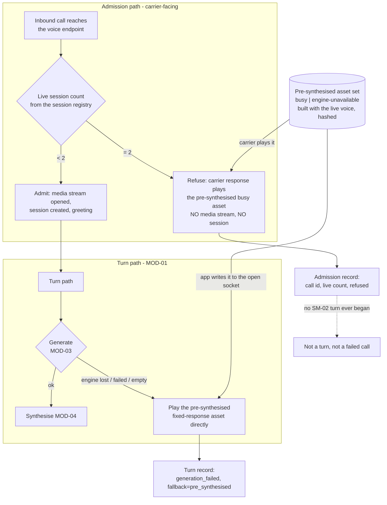

> **Lens:** PO / TPO (technical ACs) / Architect (HLD, LLD) · **Engagement:** Brownfield — `D:\project\universityDemo`

# US-016 — Two-caller admission control and the deterministic fixed response [Lens: PO]

- **Status:** **IMPLEMENTED - ACs verified; PO wording approval outstanding** · `test_us016_admission.py` 56/56, refusal path observed on the live server · DoD 4/10

- **Story:** As a **caller who reaches the line at the worst possible moment — when both lines are already live, or when the assistant's model has just gone away**, I want **to hear a sentence played from an asset that was prepared in advance, on a contract that was decided before the moment arrived rather than improvised inside it**, so that **a full line and a broken dependency both sound like a service that is still in control**.
- **Business value:** `06-architecture.md` §5 and `MOD-01` R3 currently own this as **one sentence** — "refuse a third call rather than degrade all three" — with no implementation contract behind it, while `BRD-13`'s failure-capability matrix has just made a second obligation explicit: an inference-engine loss must end in a **deterministic fixed response**, "which is a build item, not an accepted gap". Neither obligation has a home today. Both are the same shape at the point of delivery — *a caller hears a prepared sentence with no model and no synthesis running at request time* — which is why they are one story and one asset set.
- **Priority:** **Must** — TPO ordering note: the refusal path is the only thing standing between a third caller and a three-way degraded call, and it must exist **before** any N=3 traffic meets the stack. It sequences *after* `US-005` (streaming synthesis) because both paths need to know what the synthesis path can and cannot do, and *after* `US-002` because the N=3 window cannot be demonstrated without the harness. It is independent of `US-006`/`US-014`: it changes no existing caller's turn.

## Acceptance Criteria [Lens: PO]

**AC-1.** A third call is answered by the carrier and refused by the app — the refusal happens at the voice endpoint, not at the socket.

```gherkin
Scenario: A third caller dials while two calls are live
  Given two sessions are live
  When a third inbound call reaches the voice endpoint
  Then the call is answered by the carrier, because an inbound PSTN call cannot be declined by the app
  And the app returns a carrier response that speaks the busy message and connects no media stream
  And no session, no history and no KV allocation is created for that call

Scenario: A slot is free
  Given fewer than two sessions are live
  When an inbound call reaches the voice endpoint
  Then it is admitted exactly as it is today
  And no refusal path is taken

Scenario: A refused caller dials again
  Given a caller was refused a moment ago and one of the two live sessions has since ended
  When that caller dials again
  Then the new call is admitted normally as a fresh session
  And it is never resumed into, or merged with, the earlier refusal
```

**AC-2.** The third call never enters the app, and it is not counted as a failed call.

```gherkin
Scenario: The refused call is counted
  Given a third call was refused
  When the admission records and the trace for that window are inspected
  Then an admission record exists naming the refusal and the live session count that produced it
  And no SM-02 turn record exists for that call, because no turn ever began
  And it is not counted as a failed call

Scenario: A refusal is reported as a failure
  Given a summary that counts refusals inside an availability or failure figure
  When the summary is reviewed
  Then it is a defect: refused is a fourth outcome alongside served, degraded and failed, and the four are never collapsed into one another

Scenario: The two live sessions during the refusal
  Given caller A and caller B are mid-conversation
  When the third call is refused
  Then neither live session's turn is disturbed
  And neither caller hears anything from the third call
```

**AC-3.** The busy response is pre-synthesised, and nothing is synthesised or generated at the moment of refusal.

```gherkin
Scenario: The refusal happens while synthesis is unavailable
  Given two live sessions and the synthesis path is down
  When a third caller dials
  Then the caller still hears the busy response
  And it is served from the pre-synthesised asset set
  And the synthesis path is not invoked at refusal time, and neither is the inference engine

Scenario: The busy response is played repeatedly
  Given the busy response has been played on several occasions
  When the played audio is compared
  Then it is byte-identical every time
  And it was produced once, ahead of time, in the agent's own voice

Scenario: The assets and the live voice have drifted apart
  Given the voice configuration has changed since the assets were produced
  When the stack boots
  Then the drift is reported to the operator
  And the assets are regenerated before a caller can hear a mismatch between the assistant's voice and the recorded one
```

**AC-4.** A third call does not wait, and the admission decision is single-valued.

```gherkin
Scenario: A third caller is refused
  Given two sessions are live
  When the third call is refused
  Then the caller hears the busy response and the call ends
  And it was never held, queued, parked or reserved a slot
  And no waiting state exists in the call-session lifecycle

Scenario: Caller A disconnects at the instant of the admission decision
  Given caller A's session ends concurrently with a third call's admission decision
  When the decision is taken on the single event loop
  Then it is single-valued: admitted or refused, never both and never neither
  And the outcome is recorded together with the live session count that produced it

Scenario: A refused caller rings back within the refusal window
  Given a caller was refused and a slot has since freed
  When the caller rings back
  Then the call is admitted as a new session
  And no state from the refusal is carried into it
```

**AC-5.** Loss of the inference engine ends in the deterministic fixed response, not in silence.

```gherkin
Scenario: The engine is lost mid-call
  Given a call is in progress and a turn reaches generation
  When the engine is unreachable or returns a failed or empty generation
  Then the caller hears the fixed response within that same turn
  And the response is played from the pre-synthesised asset set
  And the turn ends without silence

Scenario: The fixed response is deterministic
  Given the same failure occurs on two different turns, in two different calls
  When the two utterances are compared
  Then they are byte-identical
  And no model generated any part of either one

Scenario: The fixed response is spoken while synthesis is also down
  Given the engine is lost and the synthesis path is unavailable at the same time
  When a turn reaches generation
  Then the caller still hears the fixed response, because nothing is synthesised at request time
  And if no pre-synthesised asset applies to this turn, the call terminates cleanly rather than hanging in silence

Scenario: The caller is told a dependency failed
  Given the fixed response or the busy response is played
  When its wording is reviewed
  Then it contains no internal vocabulary — no "error", "timeout", "connection" or model name
  And it makes no promise the surviving components cannot keep
```

**AC-6.** The refusal path does not consume the resources it exists to protect.

```gherkin
Scenario: A third call is refused
  Given two live sessions are generating
  When the third call is refused
  Then no generation request reaches the engine
  And no transcription or synthesis is performed
  And no session, KV allocation or conversation history is created
  And CPU and RAM stay within BRD-12's ceilings across the window
```

Technical acceptance criteria [Lens: TPO] — performance, security, resilience checks the code must pass:

- TAC-1: **The admission decision is taken from the live session count at the carrier-facing voice endpoint** and is observable. An N=3 window — two live sessions plus a third call — produces **exactly one refusal record and zero new sessions** (`BRD-05`, `06-architecture.md` §5 MOD-01).
- TAC-2: **The two live sessions are not degraded by the refusal.** Neither caller's p95 in the refusal window exceeds its solo p95 beyond `BRD-05`'s 1.5× allowance, and no turn exceeds 3,000 ms (`BRD-05`, `WF-02` step 5).
- TAC-3: **Zero engine calls and zero synthesis calls per refusal and per fixed-response play**, counted at both boundaries (target: 0 per event). This is the check that proves `BRD-13`'s "pre-synthesised audio is the only path" is actually the path taken, rather than a claim about the code.
- TAC-4: **The pre-synthesised assets are byte-identical across plays**, verified by hashing the served audio over ≥10 plays.
- TAC-5: **No new `SM-01` state.** The call-session lifecycle's state list is unchanged by this story — there is no QUEUED, HOLDING or REFUSED state, because there is no queue (`REC-10`). `SM-02`'s failure branch `GENERATING → fixed response → EMITTED` **is** added, and is recorded as an explicit amendment to the machine rather than smuggled in as a transition the machine calls illegal.
- TAC-6: **Both paths are reachable with the corresponding dependency killed mid-run** — the engine killed for the fixed response, the synthesis path killed for the refusal — and `BRD-15`'s revert restores the prior behaviour in one step.
- TAC-7: **CPU ≤ 80% and RAM ≤ 80% across an N=3 window** with no single core pinned by the event loop (`BRD-12`). The refusal path adds no sustained load; its whole cost is one HTTP response and one static asset fetch.
- TAC-8: **No caller text anywhere in the admission record.** It carries an opaque call identifier, a timestamp, the live session count and the outcome — no transcript, no phone number, no caller speech (`MOD-06` B.2; `DAT-07` carries timings and counters, not text).
- TAC-9: **The asset set is verified against the voice configuration at boot**, and a mismatch is reported rather than played. A pre-synthesised asset set that has silently drifted from the live voice is the "set ≠ live" pattern applied to audio, and it is detectable for the cost of one recorded hash.
- TAC-10: **The refusal decision is single-valued under a concurrent disconnect**, asserted by a race test rather than argued from the single-event-loop assumption (`REC-02` makes it decidable, but decidable is not the same as tested).

## HLD — Architecture Slice [Lens: Architect]

Two obligations meet at one asset set. The refusal and the fixed response are both "speak a prepared sentence while the components that normally produce speech are not available", and the difference between them is only *where* the prepared sentence is played: at the carrier-facing voice endpoint for a refusal (no media stream is ever opened) and on the already-open media socket for an engine loss. Splitting them across two stories would produce two asset sets, two playback paths and one voice that sounds different in two failure modes.



- **Components touched:**
  - `MOD-01` / `app/main.py` — the carrier-facing voice endpoint gains the admission decision, taken from the live session registry at the moment of the request. This is the same handler that already builds the carrier response; the decision is one branch inside it, and it is the only place the third call touches the app.
  - `MOD-01` — the call-session lifecycle (`SM-01`) is **unchanged** (`TAC-5`). A refusal is not a session state because no session exists; adding a state would make an absence look like a lifecycle, which is the opposite of what the contract needs.
  - `MOD-01` — the turn path gains the engine-loss branch: on a failed or empty generation the turn plays the pre-synthesised asset instead of today's empty reply. This amends `SM-02` with an explicit failure branch and removes `WF-01` step 8's recorded gap ("Empty reply; caller hears nothing — **gap**").
  - `MOD-04` — the synthesis path is **not** called on either path (`TAC-3`); the assets are produced by the same TTS model at build/boot time, which is what keeps the recorded voice identical to the live one.
  - `MOD-06` — the admission record and the `generation_failed` turn note. The refusal is deliberately **not** a `DAT-07` turn row: `DAT-07`'s shape is a turn, and a row with every stage absent would be indistinguishable from a broken turn (`MOD-06` B.6: absent is not zero).
  - `MOD-07` — consumed. Boot verifies the asset set against the voice configuration and reports drift (`TAC-9`); the assets are an artefact of the running stack, the same way residency is.
- **Interaction summary:**
  1. An inbound call reaches the carrier-facing voice endpoint; the handler reads the live session count from the session registry.
  2. **Under the ceiling:** unchanged behaviour — the carrier response opens the media stream, the session is created and the greeting is spoken.
  3. **At the ceiling:** the carrier has already answered the PSTN call and cannot be told to decline it; the app returns a response that plays the pre-synthesised busy asset and connects no media stream. The caller hears a sentence within normal call-setup time and the call ends. **No session, no stream, no turn, no engine call.**
  4. **Failure path — engine lost mid-turn:** generation fails; the turn plays the pre-synthesised fixed response on the socket it already holds, marks `generation_failed` on the turn record, and ends. The session stays `SM-01` LISTENING and the next turn is attempted normally — a caller mid-conversation is not disconnected because one turn could not be generated.
  5. **Failure path — engine and synthesis both lost:** identical to step 4, because nothing was going to be synthesised at request time anyway; if no asset applies to the turn, the call terminates cleanly rather than hanging (`BRD-13`'s LLM-and-TTS row).
  6. **Recovery:** the engine returning means the next turn generates normally; a live session that frees means the next inbound call is admitted normally. Nothing on either path is sticky.

## LLD — Implementation Detail [Lens: Architect]

- **Classes / functions / APIs** — Python 3.11, single FastAPI process, one event loop (`REC-02`). The explicit-choice point in this story is where the decision is taken and what it reads:

```
# app/admission.py   (MOD-01)

class Outcome(StrEnum):
    SERVED    = "served"       # a normal turn
    DEGRADED  = "degraded"     # a turn that spoke a fallback (BRD-13)
    REFUSED   = "refused"      # a call that never became a session
    FAILED    = "failed"       # a turn that ended without speech
    # Four outcomes. Collapsing refused into failed makes the availability
    # picture lie and hides the AS-06 burst signal. (AC-2)

@dataclass(frozen=True)
class AdmissionDecision:
    call_id: str                  # opaque; never the phone number (TAC-8)
    live_sessions: int            # the count the decision was taken from
    outcome: Outcome
    asset_id: str | None          # the busy asset, when refused

class SessionRegistry:
    def live_count(self) -> int: ...
    # Read at the moment of the carrier-facing request. No reservation, no
    # hold, no queue: the decision is single-valued under a concurrent
    # disconnect because it is taken once, on the single event loop (AC-4).
    def admit(self, call_id: str) -> bool | AdmissionDecision: ...

def voice_endpoint_response(req: VoiceRequest, reg: SessionRegistry) -> CarrierResponse:
    """Slot free -> connect the media stream (today's behaviour).
    At the ceiling -> play the busy asset and connect nothing.
    The PSTN call is already answered; the refusal is the app's, not the carrier's."""
```

```
# app/pre_synthesised.py   (MOD-01 playback; assets produced with MOD-04's voice)

class AssetId(StrEnum):
    BUSY_ALL_LINES   = "busy_all_lines"
    ENGINE_UNAVAILABLE = "engine_unavailable"
    # the set is keyed by intent, never by caller: no PII in an asset (TAC-8)

class AssetSet:
    def __init__(self, root: Path) -> None: ...
    @property
    def manifest_hash(self) -> str: ...   # compared against the voice config at boot (TAC-9)
    def path_for(self, asset: AssetId) -> Path: ...
    def frames_for(self, asset: AssetId) -> Iterator[bytes]: ...
    # Returns the stored bytes, resampled and framed at build time.
    # NOTHING is synthesised here at request time (TAC-3).

def on_generation_failure(turn: Turn, assets: AssetSet) -> Outcome:
    """The SM-02 failure branch this story adds:
       GENERATING -> fixed response -> EMITTED (no SYNTHESISING state).
       Marks generation_failed on the turn record; the session stays LISTENING."""
```

- **Data schema changes** — no durable store is gained and `DAT-09` is not modified. What is new is a versioned, hashed asset set and the admission record:

```json
// assets/pre_synthesised/manifest.json   (new)
{
  "manifest_version": "1",
  "voice_config_hash": "<hash of the TTS voice/model settings the assets were built with>",
  "assets": [
    { "asset_id": "busy_all_lines",      "file": "busy_all_lines.wav",      "sha256": "…", "text_approved_by": "<PO sign-off>" },
    { "asset_id": "engine_unavailable",  "file": "engine_unavailable.wav",  "sha256": "…", "text_approved_by": "<PO sign-off>" }
  ]
}
// Boot compares voice_config_hash against the live configuration and reports drift
// rather than playing it silently (TAC-9).
```

```json
// logs/admissions.jsonl   (new) - one record per refused call; NOT a DAT-07 turn row
{
  "call_id": "…", "ts": "…", "live_sessions": 2,
  "outcome": "refused", "asset_id": "busy_all_lines"
  // no transcript, no phone number, no caller text (TAC-8)
}
```

> **Registry note — resolved.** The pre-synthesised asset set and the admission record are new data assets that had **no `DAT-xx` slot** when this story was written. They have since been allocated: **`DAT-12`** (pre-synthesised critical audio set — durable, versioned, hashed, with a boot-time drift check) and **`DAT-13`** (admission records). Both are recorded in `03-data-state-analysis.md` A.1 and A.3, and both appear in the `plan-state.md` registry. The distinction this story drew still holds: the asset set is `DAT-10`-adjacent but is **not** `DAT-10`, because `DAT-10` is transient in-process audio whereas this is a durable asset — which is precisely why it needed its own slot rather than reuse.

- **Edge cases** — enumerated, each with the decided behavior:

| Edge case | Decided behavior |
|---|---|
| Third call arrives while a slot is freeing | The decision is taken once, from the count at the moment of the request, on the single event loop: **admitted or refused, never both, never neither**, and recorded with the count that produced it (`TAC-10`) |
| Caller A hangs up while the third call is "waiting" | There is no waiting state. The refused caller has already heard the busy response and the call has ended; if they ring back after the slot frees they are admitted as a fresh session, with no state carried over (`AC-4`) |
| The refused caller immediately redials into a still-full line | Refused again, identically. Refusals are not throttled and not merged with each other — a refusal is a call outcome with a call identifier, not a state on the caller |
| The busy asset is missing or unreadable at request time | The refusal still happens and the call ends without the message; the missing asset is reported loudly at boot by the manifest check (`TAC-9`). A silent fall-through to the synthesis path is **not** permitted — that path may be the failed component |
| The asset is stale relative to the live voice | Reported at boot; regenerated before a caller can hear a recorded voice that does not match the assistant's (`AC-3`) |
| Generation fails on the first turn of a call | The fixed response is played and the session continues; the caller is not disconnected for one failed turn, and the next turn is attempted normally |
| Generation fails on several consecutive turns | Each turn plays the same asset. Consecutive failure is visible on the turn records as `generation_failed`; the session ends by the caller's own sign-off or the carrier's close, never by the app going silent |
| Engine and synthesis are both down | Identical to the engine-only case, because nothing was synthesised at request time; if no asset applies, the call terminates cleanly rather than hanging (`BRD-13`) |
| CRM is also down while the fixed response is played | The response's wording must not promise something the surviving components cannot keep; if it offers a callback, the CRM row's local outbox is what makes that promise keepable, and the two rows are read together |
| The would-be caller's own network drops during the refusal | The call ends at the carrier; the refusal record still exists, because it records the app's decision, not the caller's experience |
| A duplicate carrier retry of the same call | A retry is a new call with a new identifier (`SM-01`, no dedupe — accepted); two retries at a full line produce two refusal records, and this is correct rather than a defect |
| The third call is long — the caller talks into the busy message | No media stream is connected, so there is no audio to receive; nothing to do, and no state to reset |
| The app itself is unreachable | The carrier has no response to fetch; the call ends at the carrier. This is `BRD-13`'s "Carrier / whole app" row and is out of this story's reach |
| The refusal rate rises during a burst | This is the signal, not a bug: refusals are counted separately so a real burst (`AS-06`) is visible rather than inferred. A bounded hold is the future change it would justify, and this story does not pre-empt it |
| Reverting the change | Reverting restores today's behaviour exactly — a third call is admitted and three callers degrade (`BRD-15`, demonstrated) |

- **Error handling** — the two paths add no new exception class to the turn path. A refusal is a normal response, not an error: the endpoint returns the busy response and the call ends, and nothing is logged at error severity. The engine-loss branch is entered on the same signal `US-004` already carries (`GenerationFailed`, covering unreachable, erroring and empty generations), and it **converts a failure into speech** rather than propagating it — which is exactly what `TRD-04` requires. The only loud failures are build/boot-time: a missing or stale asset set raises at boot (`TAC-9`), because a refusal that cannot speak and a fixed response that cannot play are both silent failures at the worst moment, and the time to find them is not during a burst.

- **Test scenarios** — unit / integration / e2e / load, one checkable line each:

| # | Level | Scenario | Covers UC-03 row |
|---|---|---|---|
| T-1 | unit | `SessionRegistry` returns the live count and the admit/refuse decision from the same read, with no reservation | Concurrent operation |
| T-2 | unit | `Outcome` has four distinct members and no code path maps `REFUSED` onto `FAILED` | — (`AC-2`) |
| T-3 | unit | `frames_for()` reads stored bytes and calls nothing on the synthesis path | — (`TAC-3`) |
| T-4 | unit | The asset manifest's `voice_config_hash` mismatch raises at boot | Invalid input |
| T-5 | integration | Two live sessions plus a third call yields exactly one refusal and zero new sessions (TAC-1) | Concurrent operation |
| T-6 | integration | The refusal response connects no media stream and creates no session, history or KV allocation | Happy path (boundary) |
| T-7 | integration | The admission record contains no transcript, no phone number and no caller text (TAC-8) | — (`TAC-8`) |
| T-8 | integration | No `DAT-07` turn row is written for a refused call, and the refusal is still visible | Missing data |
| T-9 | integration | The busy asset plays byte-identically over ≥10 plays (TAC-4) | Duplicate request |
| T-10 | integration | With the engine killed mid-turn, the caller hears the fixed response in that same turn (AC-5) | Dependency failure |
| T-11 | integration | With the synthesis path killed, the refusal and the fixed response both still play (AC-3) | Dependency failure |
| T-12 | integration | With engine and synthesis both killed, the fixed response still plays; with no applicable asset the call terminates cleanly | Partial completion |
| T-13 | integration | The fixed response is byte-identical across two failures in two different calls (AC-5) | Duplicate request |
| T-14 | integration | A refused caller redialling after a slot frees is admitted as a fresh session with no carried state | Retry / Recovery |
| T-15 | integration | Caller A disconnects concurrently with the admission decision: the outcome is single-valued and recorded (TAC-10) | Cancellation |
| T-16 | integration | Reverting the change admits the third call and restores today's behaviour exactly (`BRD-15`) | Recovery |
| T-17 | e2e | Two scripted callers converse while a third scripted call is refused; neither live caller hears anything from it and neither turn is disturbed | Concurrent operation |
| T-18 | e2e | A live call survives an engine kill: the fixed response plays, the session stays LISTENING, and the next turn generates normally once the engine returns | Recovery |
| T-19 | load | N=3 window: exactly one refusal per third call, zero engine calls and zero synthesis calls on both paths (TAC-3, TAC-1) | — (TAC) |
| T-20 | load | N=3 window: neither live caller's p95 moves beyond `BRD-05`'s 1.5× allowance and no turn exceeds 3,000 ms (TAC-2) | Concurrent operation |
| T-21 | load | N=3 window: CPU ≤ 80%, RAM ≤ 80%, no single core pinned by the event loop (TAC-7, `BRD-12`) | — (TAC) |
| T-22 | load | Sustained refusals over a 30-minute window: the refusal record grows, the live sessions' latency does not drift, and no session is ever refused a slot it should have had | Partial completion |

## Traceability
- Parent module: `MOD-01` (Voice Turn Path — `TRD-04` owns "bound every stage, and degrade to speech rather than to silence", and `TRD-05` owns single ownership of `SM-01`; the admission decision and the failure branch both live on this module's boundary)
- Use case: **`UC-03`** (serve a second caller concurrently) — the `✓` rows this story touches are covered by T-1…T-22, and its **E2** row (VRAM exhausted by two KV caches) is precisely why the third call is refused rather than admitted. `UC-03` defines the ceiling; **this story defines what happens one caller past it**, which is the boundary `UC-03` stops at. Also `UC-01` E1–E3 (a caller's turn meeting a degraded dependency) and `UC-09`'s concurrent-operation row
- Technical requirements: `TRD-04` (every stage bounded, every failure a spoken outcome — the engine-loss branch is this TRD's first implementation for the generation stage, and it closes `WF-01` step 8's recorded gap); `TRD-05` (single ownership of `SM-01` — the session registry the admission decision reads is that ownership made countable); `TRD-03` (the mark that distinguishes a turn that spoke a fallback); `TRD-22` (the harness that drives the N=3 window)
- Business requirement: **`BRD-05`** (two simultaneous callers, neither degraded and no turn over 3 seconds — the ceiling this story enforces), **`BRD-06`** (caller isolation — a refused call must be able to contaminate nothing), **`BRD-13`** (graceful degradation per the failure-capability matrix — this story owns the **inference-engine row** and the **pre-synthesised-audio path** the matrix names, and is the build item `BRD-13`'s scope note requires), **`BRD-12`** (the refusal must add no sustained load); governs `BRD-15` (one-step revert) and `BRD-18` (the fixed response is caller-facing scripted content and is judged against the 28-intent surface, not outside it)
- **Governing rule:** `00-product-intent.md` §6b's solution-neutrality rule applies to the response itself — the pre-synthesised path is chosen over both the app's own synthesis and the carrier's rendering **because those alternatives fail the same feasibility test**, not because hand-rolled is preferred. `MOD-01` R3 ("A turn is admitted only when the line is free") and `06-architecture.md` §5 ("refuse a third call rather than degrade all three") are the decisions this story turns into a contract; the ADR's rationale — "degrading three callers to serve a third is worse than a clear 'all lines busy'" — is the reason the decision is a refusal and not a queue
- Data gap / state machine: `SM-01` is **unchanged** — no REFUSED or QUEUED state, because a refused call never became a session (`TAC-5`, `REC-10`). `SM-02` gains the explicit failure branch `GENERATING → fixed response → EMITTED`, recorded as an amendment to the machine; `03-data-state-analysis.md` B.2 lists `GENERATING → SENDING` as illegal, and this story does not smuggle the branch past that — it amends it and says so. `DAT-07` is deliberately **not** written for a refusal (no turn began); `DAT-10` is the framing format the played asset takes; the asset set itself is a new asset with **no `DAT-xx` slot** — flagged, not invented
- Reconciliation: **`REC-02`** (one process, one event loop — the admission decision is decidable without a lock *because* of this, and `TAC-10` still requires it tested rather than assumed); **`REC-10`** (the state machines are analytical instruments, so `SM-02`'s amendment is a documented change and does not mandate an enum in code); **`REC-01`** (Pipecat is not adopted; its streaming TTS is not part of either path); `REC-11` (the same "prepared in advance, verified at boot" shape as residency — and `TAC-9` is the same lesson applied to audio rather than weights)
- Related workflow: `WF-02` (two concurrent calls — its step 5 "both audio streams are written only to their own carrier sockets" and its partial-completion matrix's "either session crashes → one call drops; the other continues" are the properties T-17 and T-20 assert). `WF-01` step 8's recorded gap ("generation fails → empty reply; caller hears nothing — **gap**") is closed by this story
- Related stories: `US-005` (streaming synthesis — the reason the assets are pre-produced rather than synthesised at request time), `US-002` (the harness that drives the N=3 window), `US-013` (bounded dependency calls and the half-open probe — the engine-loss branch is what the caller hears while the engine is gone), `US-014` (the interruption decision, which changes `SM-01`'s SPEAKING transitions and must not collide with this story's admission branch)

## Definition of Done
- [ ] All ACs pass (AC-1 … AC-6, TAC-1 … TAC-10) — **AC-1…AC-6 pass offline, and the refusal path was observed on the live server**; the TAC-2/TAC-7 load figures under an N=3 window are unmeasured
- [ ] Tests from the LLD test scenarios pass (T-1 … T-22) — **16 of 22; see the coverage table below.** The 6 open are the two scripted-caller e2e scenarios and the four load scenarios
- [ ] Perf/load test passed against the story's TACs (TAC-1 N=3 refusal count; TAC-2 live-session p95 within 1.5× and no turn over 3,000 ms; TAC-7 CPU/RAM ≤ 80%) — **not met: the harness drives `--n 1|2` only, so no N=3 window has been produced**
- [ ] Schema migration applied — n/a for a durable store; the new assets (`app/static/audio/`) and the admission sink are recorded, and the missing `DAT-xx` registry slot for the asset set is raised as a follow-on rather than assumed — **the asset set exists and is gitignored, which is itself the finding: a clone has no assets until the build script runs, and the refusal now degrades to carrier `<Say>` rather than to silence**
- [ ] Module docs updated if contracts changed — `MOD-01` B.3 (the carrier-facing endpoint gains the admission branch), B.6 (the "Third caller arrives" row gains its contract, and the "Generation fails or returns empty" row's **gap** is closed), and R3 (the refusal is now a specified behaviour, not a sentence); `06-architecture.md` §5 MOD-01's "refuse **or queue**" is closed to **refuse**, with the rejected queue alternative and the trigger that would reopen it recorded; `01-brd.md` `BRD-13`'s scope note gains the pointer that its inference-engine row is built
- [ ] **The scripted caller-facing text of both assets carries Product-Owner approval**, recorded with the asset manifest — **OPEN, and not an engineering decision.** The wording is drafted and its mechanical rules are enforced, but this is caller-facing content in the same sign-off class as `DG-03`, and it is the Product Owner's to approve. The two lines are in `app/admission.py` as `BUSY_TEXT` and `FIXED_RESPONSE_TEXT`
- [x] The wording review is recorded: no internal vocabulary, no model name, no promise the surviving components cannot keep (`AC-5`) — enforced at build time by `scripts/build_call_assets.py` and re-asserted by the test suite, so a hand-edited line cannot reach a caller
- [x] `BRD-15` rollback demonstrated: `test_brd15_rollback.py` sets `ADMISSION_ENABLED=0`, observes the third call being admitted again and the refusal path not being taken, and restores. Not asserted — watched
- [ ] `SM-01`'s state list is confirmed unchanged; `SM-02`'s amendment is recorded in `03-data-state-analysis.md` B.2 rather than left as a transition the machine calls illegal
- [x] Refusals are confirmed to be counted as neither failed calls nor turns, and the four outcomes (served, degraded, refused, failed) are distinguishable in whatever summary the operator reads — `Admission.snapshot()["outcomes"]` reports all four separately, and the test asserts a refusal is never folded into `failed`

### LLD test coverage — T-1 … T-22

| LLD | Covered by | Status |
|---|---|---|
| T-1 | `test_us016_admission.py` AC-4 (decision from one read, no reservation) | **PASS** |
| T-2 | AC-2 (four outcomes, no REFUSED→FAILED path) | **PASS** |
| T-3 | AC-3 (the play path reads bytes and touches no synthesiser) | **PASS** |
| T-4 | LLD T-4 (a manifest/voice mismatch is reported) | **PASS** |
| T-5 | TAC-1 (two live + a third → one refusal, zero new sessions) | **PASS** |
| T-6 | AC-1 (no `<Connect>`, no session, no history) | **PASS** |
| T-7 | LLD T-7 (no phone number, no caller text in the record) | **PASS** — *this found a real defect; see below* |
| T-8 | AC-2 (no turn row for a refused call, refusal still visible) | **PASS** |
| T-9 | TAC-4 (busy asset byte-identical over 12 plays) | **PASS** |
| T-10 | AC-5 (engine loss → fixed response in the same turn) | **PASS** (code path) |
| T-11 | AC-3 (synthesis down → both still play) | **PASS** |
| T-12 | AC-5 (both down → fixed response; no asset → clean end) | **PASS** |
| T-13 | AC-5 (byte-identical across two failures) | **PASS** |
| T-14 | AC-1 (redial after a slot frees → fresh session) | **PASS** |
| T-15 | AC-4 (24 concurrent decisions, all definite) | **PASS** |
| T-16 | `test_brd15_rollback.py` | **PASS** |
| T-17 | — e2e, two scripted callers plus a refused third | OPEN |
| T-18 | — e2e, a live call surviving an engine kill | OPEN |
| T-19 | — load, N=3 window | OPEN |
| T-20 | — load, N=3 p95 and cap | OPEN |
| T-21 | — load, N=3 CPU/RAM | OPEN |
| T-22 | — load, 30-minute sustained refusals | OPEN |

**The T-7 result is the one to read.** The first version of `Decision.as_record()` stored `call_sid` verbatim — and `call_sid` arrives as the carrier's `From`, which is the caller's **phone number**. A refused caller's number would have been written into the admission record. The scenario caught it; the record now stores a truncated one-way digest, and the test asserts the number does not appear.

**The harness now drives the N=3 window** (2026-09-19). `--n 3` runs two sessions and drives a third call at the carrier-facing endpoint — it is not three media streams, because the app refuses the third call *before* a stream exists. One run:

```powershell
.venv/Scripts/python.exe doc/perf/tools/load_harness.py --n 3 --turns 100
```

The harness reads the app's own records through `/api/perf/policy` — a new endpoint, because the invariants are properties of the app's decision points and the harness is a separate process — and reports them as verdicts, not counts:

```
[HOLDS] US-016 TAC-1 one refusal per third call
[HOLDS] US-016 TAC-1 zero new sessions from a refusal
         peak live sessions while the third call was being refused: 2 (the 2 driven).
         A refusal that created a session would read 3.
[HOLDS] US-016 AC-6 no engine or synthesis call per refusal
[HOLDS] US-016 AC-3 every refusal played the prepared asset
```

Two defects were found writing that verdict path, both caught by the self-test and both the same shape — a number read from the wrong place: the live-session count was sampled *after* the run (an empty stack) instead of at each probe, and the classifier's "ambiguous" branch was unreachable because the refusal test could never be true alongside a `<Connect>`.

**What remains open.** T-19…T-22 are now *runnable* but not yet *run at power*: the demonstration windows were 5–10 turns, and these scenarios want ≥100. T-17 and T-18 still need scripted callers with an engine killed mid-conversation, which is a separate capability. The admission contract itself is covered by T-1…T-16.
