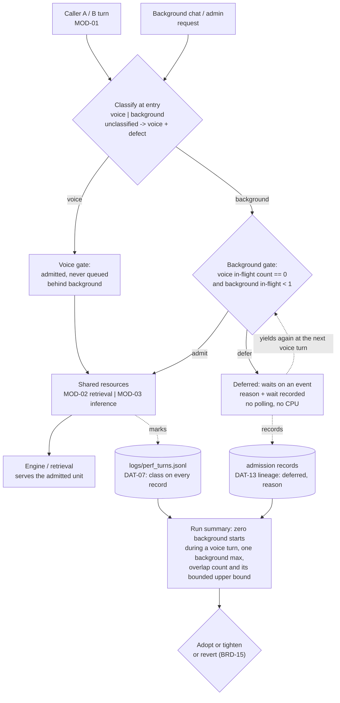

> **Lens:** PO / TPO (technical ACs) / Architect (HLD, LLD) · **Engagement:** Brownfield — `D:\project\universityDemo`

# US-017 — Background work yields to the caller, by policy [Lens: PO]

- **Story:** As a **caller on a live line while the same box is also answering a chat or admin request**, I want **every background request to be held back rather than allowed to take its turn between the pieces of mine**, so that **my caller's turn is decided by my own conversation and never by work that no one is waiting to hear**.
- **Business value:** `BRD-20` states the operating scenario this box actually has to survive — **two concurrent voice calls plus one background chat/admin request** — and it is an *acceptance condition, not a footnote*: a configuration that passes at two voice callers alone and collapses at two-plus-one has not met the requirement. Today nothing owns the enforcement: `03-data-state-analysis.md` A.2 lists the 2-voice+1-chat row as **Assumed, unquantified**, `08-coverage-verification.md` §2 records `BRD-20`'s enforcement mechanism as an unowned gap, and `06-architecture.md` §5's degradation ladder begins at retrieval — it has no rung for the class of work that should degrade before anything a caller can hear. This story supplies the policy and the rung.
- **Priority:** **Must** — TPO ordering note: the policy is cheap (a classification and a gate, no new service) and it is what makes `BRD-20` checkable rather than aspirational. It sequences *after* `US-016`, whose single admission decision point on the single event loop is the same decision point this story extends from calls to units of work, and *after* `US-002`, because the 2+1 condition cannot be measured at all until the harness can drive a voice pair and a background request together. It changes no caller's turn in the solo case, and it is independent of `US-008`/`US-012`.
- **This story asserts no throughput figure.** The requirement here is an **ordering invariant** — who is admitted while whom is in flight — plus the citation of ceilings that already exist (`BRD-05`, `BRD-12`). Every performance number the policy produces is a **measurement** reported by the run, and the predictions below are labelled predictions with a measurement and a decision attached, never acceptance thresholds.

## Acceptance Criteria [Lens: PO]

**AC-1.** A background request is deferred, never interleaved into a caller's turn.

```gherkin
Scenario: A background request arrives while a voice turn is in flight
  Given caller A's turn has entered retrieval or generation
  When a background chat or admin request is submitted
  Then the background request does not begin until that turn has finished emitting audio
  And no background retrieval or inference call starts while any caller's turn is in flight

Scenario: A background request is already in flight when a caller speaks
  Given the single admitted background unit is executing
  When a caller's turn begins
  Then the caller is not queued behind the background unit beyond that unit's own bounded dependency call
  And the overlap is counted and reported with the run's numbers rather than assumed away

Scenario: Both callers are silent
  Given no voice turn is in flight on either session
  When a background request is waiting
  Then it is admitted, because the resource it needs is genuinely idle
  And it yields again at the next voice turn
```

**AC-2.** The priority rule is measurable from the records, and it is the rule — not a hope.

```gherkin
Scenario: A run is assessed
  Given a 2-voice + 1-background window has been measured
  When the records are counted
  Then the number of background units that started while a voice turn was in flight is zero
  And the number of background units in flight at any instant never exceeds one
  And the voice queue wait attributable to the background class is zero

Scenario: A background unit is deferred
  Given a background request is waiting for an idle window
  When the deferral is recorded
  Then the record names the reason and the wait so far
  And the wait is visible to an operator rather than being silence

Scenario: A background request is refused
  Given a background request cannot be admitted within its own budget
  When it is refused
  Then the refusal names its reason
  And it is never counted as a voice failure, and never collapsed into the caller-facing outcomes
```

**AC-3.** No caller is starved, and no caller's turn is a victim of background work.

```gherkin
Scenario: The background class is under sustained load
  Given background requests are submitted continuously during two live calls
  When the window is assessed
  Then both callers meet BRD-05, including its interference budget and the 3-second per-turn cap
  And no voice turn is delayed past its cap, refused, or ended because of background work
  And neither caller's turn waits for a background unit to release a shared resource

Scenario: Background work is submitted during a caller's turn boundary
  Given a background request arrives in the instant a caller's turn is about to begin
  When the gate takes its decision on the single event loop
  Then the decision is single-valued and taken once, as the call-admission decision is
  And the caller is admitted on the same terms it would have been without the background request
```

**AC-4.** The caller never pays for background work that has no human waiting on it.

```gherkin
Scenario: The box is at its realistic peak
  Given two voice sessions and one background request are live together
  When resource ceilings are read from the window
  Then CPU and RAM stay within BRD-12's ceilings and no single core is pinned by the event loop
  And a deferred background request consumes no sustained CPU while it waits

Scenario: The background request is deferred for a long time
  Given the deferral continues across several caller turns
  When the deferral mechanism is inspected
  Then it is waiting on an event, not polling in a loop
  And the wait itself adds no load to the box it is waiting for
```

**AC-5.** The policy is a decision that can be reversed in one step.

```gherkin
Scenario: The policy is reverted
  Given the priority policy is disabled by configuration
  When the 2+1 window is re-run
  Then the stack returns to today's interleaved behaviour exactly
  And the run that showed the difference is recorded with the revert (BRD-15)

Scenario: The policy is enabled on a box with no background traffic
  Given no background request is ever submitted
  When the normal single-caller and two-caller runs are re-measured
  Then the numbers are unchanged within run-to-run variation
  And the policy adds no caller-visible behaviour in its absence
```

Technical acceptance criteria [Lens: TPO] — performance, security, resilience checks the code must pass:

- TAC-1: **Classification is total, and fails toward the caller.** Every unit of work entering retrieval or inference carries a class (`voice` or `background`). A unit that arrives unclassified is admitted **as voice** and recorded as a classification defect — the failure that matters is a caller starved, not a background job admitted, so the default is the caller-safe direction.
- TAC-2: **Zero background starts during a voice turn**, counted from the records over the window. This is the priority invariant, and it is binary rather than statistical.
- TAC-3: **Background concurrency never exceeds one**, across both callers and for the whole window. This bounds the residual overlap exposure to a single bounded dependency call.
- TAC-4: **Voice queue wait attributable to background is zero**, and any residual overlap between the one admitted background unit and a voice turn is **reported with its measured upper bound** — the unit's own `BRD-14` timeout — rather than argued to be small.
- TAC-5: **No caller is starved:** no voice turn delayed past the 3,000 ms cap, refused, or ended by background work; and `BRD-05`'s existing interference budget is held under the 2+1 mix (`BRD-20` requires both callers to keep meeting `BRD-05`).
- TAC-6: **Deferral is recorded, and silence is prohibited.** Every deferral carries a reason and a wait; a refusal names its reason; a background unit is never dropped without a record. `BRD-20` permits the background request to be slowed without limit — it does not permit the wait to be invisible.
- TAC-7: **The deferral mechanism does not spin.** A waiting background request blocks on an event; a poll loop that holds a core would breach `BRD-12`'s "no single core pinned by the event loop" while doing no useful work.
- TAC-8: **No new `SM-01` state, and no session depends on the background class.** A deferred background request is not a session and not a lifecycle state; the call-session machine is unchanged, and the two callers' states are decided only by their own conversations (`REC-10`, `SM-01`).
- TAC-9: **Every figure is a measurement, not a threshold asserted here.** The run reports voice p50/p95 at N=2 and at 2+1, the background wait distribution, the overlap count and its bound. Beyond TAC-2/TAC-3's ordering invariants and the ceilings already owned by `BRD-05` and `BRD-12`, **no number in that report is a requirement of this story**.
- TAC-10: **One-step revert.** Disabling the policy restores today's interleaved behaviour with no data migration and no residual state, demonstrated on a re-run rather than asserted (`BRD-15`).

## HLD — Architecture Slice [Lens: Architect]

The change is a **class-aware gate in front of the two shared resources**, not a new service and not a scheduler: the box has one FastAPI process, one event loop and one GPU (`REC-02`), so the decision is a single read-then-admit at the point of entry, exactly as `US-016`'s call admission is. What is new is that the thing being admitted is a **unit of work** rather than a call, and that units carry a class.

`BRD-20` states the mechanism in one sentence — "a background request that cannot be admitted within its budget is deferred, not interleaved into a caller's turn" — and this story is that sentence made countable. The background class is the rung *before* the ladder in `06-architecture.md` §5: the ladder's five rungs all degrade something a caller can hear, and background work is what gives way before the first of them is touched.



- **Components touched:**
  - `MOD-01` — the turn path gains the **classification at entry** and the voice-side admission, which is "admitted, never behind background". `SM-01` is **unchanged** (`TAC-8`): a deferred background unit is not a session state, and a caller's state never depends on the background class.
  - `MOD-02` / `MOD-03` — consumed, not re-architected. They are the two shared resources the gate fronts: retrieval is the named single-threaded bottleneck (`BRD-07`) and inference is the GPU-bound one (`06-architecture.md` §5). The gate sits at their entry, so a deferred background unit never reaches either.
  - `MOD-01` / `app/admission.py` (from `US-016`) — extended rather than duplicated: the same single-decision point on the same event loop, widened from "may this call be served" to "may this unit run now, and in which class". `US-016`'s four call outcomes are untouched; background adds its own outcomes (`deferred`, `refused_with_reason`) and they are **never collapsed into a caller-facing outcome**.
  - `MOD-06` — the record stream gains the class on every turn record, plus the deferral records on the admission stream (`DAT-13` lineage). Without the class on the record, the priority rule is not checkable after the fact, which is the whole point.
  - `MOD-07` — consumed: the policy is a configuration flag so `BRD-15`'s one-step revert is a setting, not a code change.
- **Interaction summary:**
  1. A unit of work enters — a caller's turn from the voice path, or a chat/admin request from the background path — and is classified at entry (`TAC-1`).
  2. A voice unit is admitted immediately. It is never queued behind a background unit; the voice side of the gate exists to record that fact, not to hold anything.
  3. A background unit is admitted only when no voice turn is in flight and no other background unit is in flight (`TAC-2`, `TAC-3`). Otherwise it is deferred: it waits on an event, with its reason and wait recorded (`TAC-6`, `TAC-7`).
  4. The admitted unit runs against the shared resource. When it completes, a deferred background unit re-evaluates its gate at the next idle window.
  5. **Failure path:** if a voice turn begins while the single admitted background unit is executing, the caller is not made to wait beyond that unit's own `BRD-14` bounded call; the overlap is counted and its bound reported (`TAC-4`). Where the turn path can cancel an in-flight call (the streaming path from `US-004`), the arriving voice turn may preempt it — that is a capability this story **uses if present** and does not assume.
  6. **Failure path:** if the background request is refused, the refusal is recorded with its reason and is never reported as a caller-facing failure (`AC-2`). Nothing is dropped silently (`TAC-6`).
  7. **Recovery:** the policy is stateless across windows — a deferred request that is finally admitted behaves as a fresh request; disabling the policy restores interleaved behaviour with no migration (`TAC-10`).

## LLD — Implementation Detail [Lens: Architect]

- **Classes / functions / APIs** — Python 3.11, one process, one event loop (`REC-02`). The gate is an in-process decision taken once, at the entry point, from a count:

```
# app/work_class.py   (MOD-01; the gate US-016 opened, widened)

class WorkClass(StrEnum):
    VOICE      = "voice"        # a live caller's turn; a human is listening
    BACKGROUND = "background"   # chat / admin; nobody is waiting on audio

class BackgroundOutcome(StrEnum):
    SERVED    = "served"
    DEFERRED  = "deferred"      # waiting for an idle window; visible, not silent
    REFUSED   = "refused"       # names its reason; never a voice failure
    # Caller-facing outcomes (served / degraded / refused / failed) are
    # US-016's and are NOT extended by these. Collapsing the two sets
    # would make a background wait look like a caller problem. (AC-2)

class WorkGate:
    """One read, one decision, on the single event loop.
    Voice is never held; background is admitted only into an idle window."""
    def classify(self, unit: WorkUnit) -> tuple[WorkClass, str | None]:
        ...  # unknown -> (VOICE, "unclassified: admitted as voice, defect recorded")
             # TAC-1: the default fails toward the caller, never toward the
             # background class, because a starved caller is the worse error
    def try_admit_background(self, unit: WorkUnit) -> BackgroundOutcome:
        ...  # admitted iff voice_in_flight == 0 and background_in_flight == 0
             # TAC-2, TAC-3. No reservation, no hold, no priority queue:
             # a deferred unit waits on an event (TAC-7), it does not spin
    def voice_in_flight(self) -> int: ...

@dataclass(frozen=True)
class WorkUnit:
    work_id: str                 # opaque; never caller text
    cls: WorkClass
    submitted_ts: float
    deferred_reason: str | None  # set when the gate holds it back
```

```
# The deferral, in the turn path's own terms (MOD-01)

def run_background(unit: WorkUnit, gate: WorkGate, *, budget_s: float) -> BackgroundOutcome:
    """Admit into an idle window, or defer. A deferral is never silent:
    it is recorded with its reason and its wait so far (TAC-6).
    The wait is event-driven; nothing polls (TAC-7)."""
```

- **Data schema changes** — no durable schema change. The class is added to the existing per-turn record, and deferrals ride the admission stream `US-016` created (`DAT-13` lineage):

```jsonc
// logs/perf_turns.jsonl  (DAT-07) - one added field, no new file
{
  "call_id": "…", "turn_id": 4,
  "work_class": "voice",           // new: makes the priority rule countable
  "stages_seen": 6, "total_ms": 2412.0
  // …
}
```
```jsonc
// logs/admissions.jsonl  (DAT-13 lineage) - one record per deferral or refusal
{
  "work_id": "…", "ts": "…",
  "work_class": "background",
  "outcome": "deferred",           // served | deferred | refused
  "reason": "voice turn in flight",  // named, not silent (TAC-6)
  "waited_ms": 4120.0,
  "voice_in_flight_at_decision": 1
  // no caller text, no transcript, no prompt content
}
```

- **Edge cases** — enumerated, each with the decided behavior:

| Edge case | Decided behavior |
|---|---|
| A background request arrives during a caller's turn | Deferred, with the reason recorded. It is not "almost admitted" and it is not put on the engine to race the caller |
| A voice turn begins while the one admitted background unit is running | The caller waits at most that unit's own bounded call (`BRD-14`); the overlap is counted and its bound reported (`TAC-4`). Where cancellation exists on the streaming path, the turn may preempt it — used if present, never assumed |
| A background request waits through several caller turns | It keeps waiting, and its wait grows in the record. `BRD-20` permits an unbounded wait; it does not permit an invisible one (`TAC-6`) |
| A background request waits so long it is no longer useful | It is refused with a named reason and recorded as such. It is never silently dropped, and the refusal is not a caller-facing failure |
| A unit arrives with no class | Admitted **as voice** and recorded as a classification defect (`TAC-1`). Fail toward the caller: the misclassification that starves a caller is worse than the one that admits a background job |
| Both callers are silent for a long stretch | The background request is admitted and makes progress; it yields again the moment a voice turn begins. Idle capacity is not wasted by the policy, which is the point of gating on the count rather than on a timer |
| Two background requests arrive at once | One is admitted, the other is deferred. Background concurrency is capped at one (`TAC-3`) so the residual overlap exposure stays a single bounded call |
| A background request is a long admin job | It is admitted in idle windows only, and it is interrupted at the next voice turn at an admission point. A job that cannot tolerate that is not a background unit in this sense, and is run outside the caller's windows deliberately — recorded as a decision, not left to chance |
| The gate is disabled | Today's interleaved behaviour returns exactly (`TAC-10`, `BRD-15`); the re-run is recorded with the revert |
| The deferral mechanism is a poll loop | Rejected. It would hold a core while doing nothing and breach `BRD-12`'s "no single core pinned by the event loop" (`TAC-7`) |
| A caller's turn is refused or ended while background work is pending | A correctness failure of this story, not a trade-off: background work never ends a call, never causes a refusal, and never counts as an explanation (`TAC-5`) |
| A background request is served *between* a caller's stages | Impossible by construction: the gate fronts retrieval and inference together, so there is no shared-resource entry point between a turn's stages at which a background unit could be admitted (`AC-1`) |

- **Error handling** — a deferral and a refusal are both **normal outcomes**, not errors, and neither raises into the caller's turn path: the gate returns an outcome and the background path records it. The only loud failures are configuration ones: a policy that is enabled but whose classification is missing for a live path raises at boot rather than silently classifying everything as background, because the silent version of that bug degrades callers while looking healthy. No background exception reaches a caller's turn; the two paths share resources, not failure domains.

- **Test scenarios** — unit / integration / e2e / load, one checkable line each:

| # | Level | Scenario | Covers UC-03 row |
|---|---|---|---|
| T-1 | unit | `classify()` returns `background` for the chat/admin path and `voice` for the turn path; an unknown unit is admitted as voice with a defect recorded (TAC-1) | Invalid input |
| T-2 | unit | `try_admit_background()` returns `DEFERRED` whenever `voice_in_flight() > 0`, and `SERVED` only at zero | Concurrent operation |
| T-3 | unit | Two background units submitted together: one `SERVED`, one `DEFERRED` — the concurrency ceiling is one (TAC-3) | Duplicate request |
| T-4 | unit | A deferral record carries outcome, reason and wait; no path produces a deferral without a record (TAC-6) | — (TAC) |
| T-5 | unit | The background outcome set and the caller-facing outcome set are distinct; no code path maps one onto the other (AC-2) | — (AC-2) |
| T-6 | unit | The deferral waits on an event: a unit deferred for the length of a turn consumes no measurable CPU (TAC-7) | — (TAC) |
| T-7 | integration | A background request submitted mid-turn is not served until the turn's audio is emitted (AC-1) | Concurrent operation |
| T-8 | integration | A background request submitted while both callers are silent is served, and then yields at the next voice turn | Alternate path |
| T-9 | integration | A background request refused for budget names its reason; the refusal is absent from any caller-facing failure figure (AC-2) | — (AC-2) |
| T-10 | integration | A `DAT-07` record carries `work_class: "voice"` for every caller turn, making the priority rule countable after the fact | — (TAC-2) |
| T-11 | integration | A voice turn arriving while the one background unit is in flight completes within the unit's bounded call; the overlap is counted and its bound reported (TAC-4) | Timeout |
| T-12 | integration | A caller hangs up while a background request is deferred: the deferral is unaffected and no state is shared with the ended session | Cancellation |
| T-13 | e2e | Two scripted callers converse while background requests are submitted continuously: the callers' turns are indistinguishable from a run with no background traffic (AC-3) | Happy path |
| T-14 | e2e | The policy is disabled and the 2+1 window is re-run: interleaved behaviour returns exactly and the before/after runs are recorded (`BRD-15`, TAC-10) | Recovery |
| T-15 | load | 2 voice + 1 background for ≥100 turns per condition: zero background starts during a voice turn, background concurrency ≤ 1, voice queue wait attributable to background = 0 (TAC-2, TAC-3, TAC-4) | Concurrent operation |
| T-16 | load | The same window with `BRD-05`'s interference budget and `BRD-12`'s CPU/RAM ceilings read from it: no caller starved, no turn over 3,000 ms (TAC-5, AC-4) | Concurrent operation |
| T-17 | load | A background request deferred across the whole window: its wait is recorded and bounded by the window, and the box's CPU/RAM figures are unchanged from the no-background run beyond run-to-run variation | Partial completion |

- **Predictions — labelled, each with its measurement and its decision. None of these is an acceptance threshold.**

| # | Prediction (a belief to be tested, not a requirement) | Measured by | Decision the measurement drives |
|---|---|---|---|
| P-1 | Voice p95 under 2+1 will stay within `BRD-05`'s **existing** interference budget, because the gate removes background work from the caller's windows entirely | T-15, T-16 (voice p50/p95 at N=2 and at 2+1, same fixture) | If it does not, the background class is tightened — admitted only in longer idle windows, or moved off the engine — and the tightening is recorded in `WF-03`'s experiment log. `BRD-05` is not renegotiated |
| P-2 | The background request's own latency will grow approximately with the number of caller turns it yields to, and will remain finite while callers are talking | T-17 (background wait distribution alongside the voice turn count) | If the wait makes the background request useless in practice, that is a **PO decision**: accept the wait, or give the background class a bounded share. Recorded either way |
| P-3 | The residual overlap — a voice turn starting while the one admitted background unit runs — will be rare and bounded by that unit's own `BRD-14` timeout | T-11, T-15 (overlap count and its measured upper bound) | If the bound is large enough to be caller-perceptible, the background class's dependency timeouts are tightened rather than the overlap being excused |
| P-4 | Turning the policy off will change the 2+1 figures visibly, which is the evidence that the policy is doing work rather than being decorative | T-14 (before/after on the same fixture) | If the figures are unchanged, the policy is not the thing holding the budget: the search moves to the next rung of `06-architecture.md` §5, and that is recorded |

## Traceability
- Parent module: `MOD-01` (Voice Turn Path — `TRD-04` owns "bound every stage, and degrade to speech rather than to silence", which is the caller-facing side of this policy; `TRD-05` owns session-scoped state and single ownership of `SM-01`, which this story leaves untouched). The gate itself sits on `MOD-01`'s boundary because that is where work enters the shared resources; `MOD-02`'s `TRD-07` (no caller waits behind another caller's query) and `MOD-03`'s queueing behaviour are the resources it fronts
- Use case: **`UC-03`** (serve a second caller concurrently) — its resource-interference dimension is exact: "no OOM, no sysmem spill, no core pinned by the event loop, **no caller starved in a queue**". This story makes the last clause enforceable for a class of work that `UC-03` does not itself generate. Also `UC-01` E3 (a second caller arriving) and `UC-06` (the operator sees a deferral rather than inferring it)
- Technical requirements: `TRD-05` (the gate is a session-scoped, single-owner decision — no session reads another's state, and the background class has no session at all); `TRD-04` (the caller-facing degradation path is unchanged by this story: deferring background work is a rung *above* the ladder, not a fifth fallback); `TRD-22` (the harness that must now drive the 2+1 condition — `US-002` carries that scenario as T-18…T-24 and TAC-8/TAC-9)
- Business requirement: **`BRD-20`** (the requirement this story exists to discharge: two concurrent voice calls plus one background chat/admin request, both callers still meeting `BRD-02` and `BRD-05`, background degrading first, no caller starved, and "priority enforced by policy, not by hope" — the gate is that policy); **`BRD-05`** (its interference budget and 3-second cap are the ceilings the 2+1 window is read against, unchanged and not renegotiated); **`BRD-12`** (CPU ≤ 80%, RAM ≤ 80%, no core pinned by the event loop — the deferral must not spin, `TAC-7`); governs `BRD-15` (one-step revert, `TAC-10`)
- Data gap / state machine: `SM-01` is **unchanged** — a deferred background request is not a session and not a lifecycle state (`TAC-8`, `REC-10`). The priority rule is countable only because `DAT-07` carries `work_class` on every turn record; deferrals ride the admission stream `US-016` created (the `DAT-13` lineage), which is where a background outcome belongs, since it is not a turn and has no `DAT-07` row to live on. The load-model row that motivates the whole story is `03-data-state-analysis.md` A.2's **WF-02 + background** row, recorded there as **Assumed and unquantified** — this story plus `US-002`'s 2+1 scenario are how that assumption becomes a measurement
- Reconciliation: `REC-02` (one process, one event loop — the gate's decision is single-valued without a lock, and `AC-3`'s boundary case still requires it to be tested rather than reasoned); `REC-09` (`/ws/voice/text` shares `MOD-02`/`MOD-03` with the voice path, which is precisely why the class must be assigned at entry rather than inferred from the endpoint's identity); `REC-10` (the state machines remain analytical instruments, so this story adds none)
- Related workflow: **`WF-02`** (two concurrent calls — its steps 3 and 4 are the queueing points the gate sits in front of, and its partial-completion matrix's "B's generation queued; both slower — **gap**" row is the gap this story closes for background work specifically). `WF-03` step 3 (latency and quality measured in separate windows) is unaffected: the background class is not a quality evaluation, and the harness still refuses a run that collides with one
- Related stories: `US-016` (the admission decision point and the four caller-facing outcomes this story reuses and does not extend), `US-002` (the harness, whose 2+1 scenario this story depends on and which `08-coverage-verification.md` §2 already required it to add), `US-008` (retrieval concurrency — a deferred background unit is one fewer requester at a single-threaded resource), `US-012` (TTS cache isolation — the background path shares the cache, and isolation is unchanged by class), `US-003`/`US-015` (the golden set and the model funnel are not background work: they are evaluation, and `MOD-06`'s rule that evaluation never runs concurrently with latency measurement is untouched)
- Honest boundary: the design assumes the background class is a **chat/admin** request whose requester is not listening to audio. If a future caller-facing text channel is promoted to background, that is a PO decision about who waits, not an engineering default — and the classification point makes it a one-line change with a recorded decision rather than a silent one

## Definition of Done
- [ ] All ACs pass (AC-1 … AC-5, TAC-1 … TAC-10)
- [ ] Tests from the LLD test scenarios pass (T-1 … T-17)
- [ ] Perf/load test passed: the 2-voice + 1-background window measured at ≥100 turns per condition, with the ordering invariants (TAC-2, TAC-3, TAC-4) reported as counts and every performance figure reported as a measurement (TAC-9)
- [ ] `BRD-05`'s interference budget and `BRD-12`'s CPU/RAM ceilings read from the 2+1 window, with no caller starved and no turn over the cap (TAC-5)
- [ ] Schema migration applied — n/a; `DAT-07` gains the `work_class` field and deferrals are written to the existing admission stream (`DAT-13` lineage)
- [ ] `SM-01`'s state list is confirmed unchanged; the deferral is confirmed to be outside the call-session lifecycle (TAC-8)
- [ ] Deferrals and refusals confirmed to be counted as neither failed calls nor caller-facing outcomes, and confirmed to be visible to an operator without reading the background path's logs (TAC-6)
- [ ] `BRD-15` rollback demonstrated: disabling the policy restores interleaved behaviour exactly, with the before/after runs recorded
- [ ] Module docs updated if contracts changed — `MOD-01` B.3 (the entry point gains the classification and the voice-side admission), B.6 (the "background work present" row gains its contract); `MOD-06` B.3/B.4 if the `work_class` field or the deferral record's shape differs; `06-architecture.md` §5's ladder is cited as gaining its first rung **by this story's policy** — the document itself is updated where the rung belongs
- [ ] The load-model row in `03-data-state-analysis.md` A.2 marked **Assumed** for the 2+1 mix is updated with the measured figures, or explicitly left labelled Assumed with the reason the measurement did not close it
