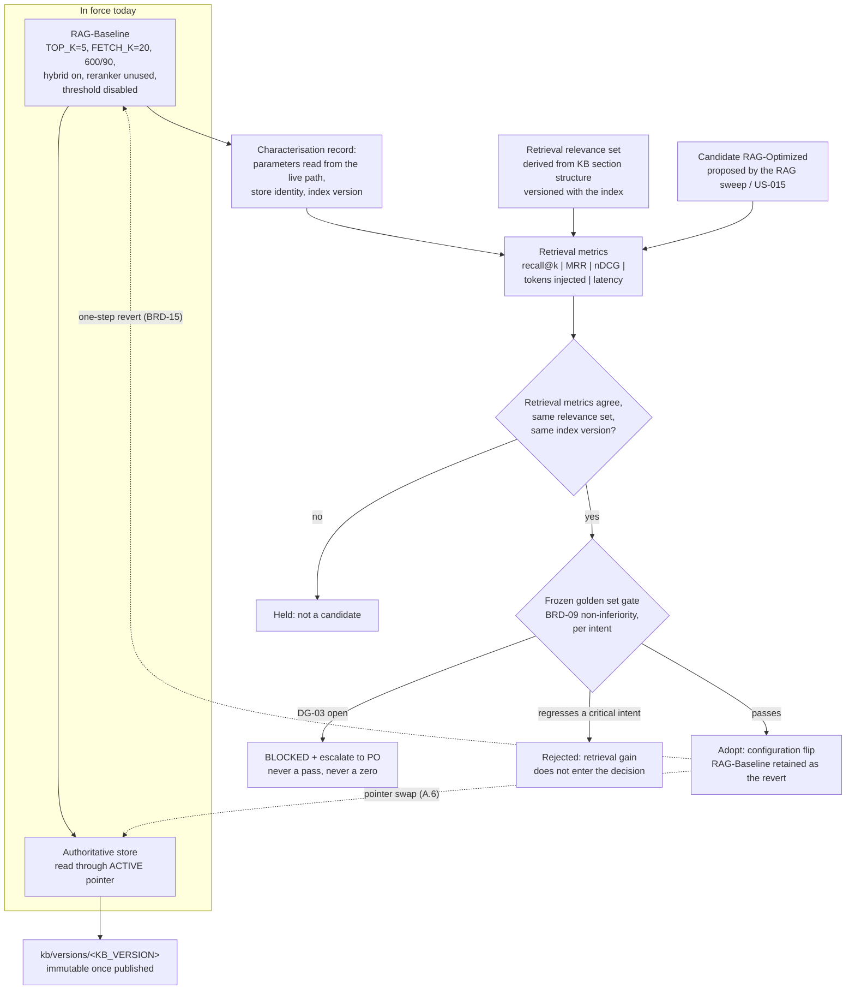

> **Lens:** PO / TPO (technical ACs) / Architect (HLD, LLD) · **Engagement:** Brownfield — `D:\project\universityDemo`

# US-018 — Two named RAG configurations, one in force and one gated [Lens: PO]

- **Status:** **BLOCKED - `DG-03`**

- **Story:** As a **developer and Product Owner responsible for what the admissions line retrieves**, I want **two named retrieval configurations — the one that runs today, characterised and frozen as it stands, and the one the evidence later selects — with the second shipping only when retrieval metrics and the frozen golden set agree**, so that **the program has a working configuration from day one without anyone pretending the incumbent values were ever chosen**.
- **Business value:** `BRD-21` splits the RAG configuration in two for one reason: `DG-03` (no golden set, no PO-approved ground truth) genuinely blocks final tuning, and without the split the whole program waits behind a human task. `RAG-Baseline` is what runs now — `TOP_K=5`, `FETCH_K=20`, 600/90 chunking, hybrid on, reranker loaded-unused, threshold disabled — and it is **honest about being unoptimised**: those values are the incumbents, they were never selected against anything, and `REC-07` records that a prior document already asserted wrong values for them. `RAG-Optimized` is what recall@k, MRR, nDCG, tokens injected and latency eventually select, and it enters service only through `BRD-09`'s non-inferiority gate. Today neither configuration is named anywhere in the system: `08-coverage-verification.md` §2 records that nothing *ships* the baseline definition, and `plan-state.md` records the baseline characterisation as **NOT STARTED, no owner**. This story is that owner.
- **Priority:** **Must** — TPO ordering note: the characterisation half is unblocked **today** and needs no golden set, which is why `BRD-21` exists; the adoption half is blocked on `DG-03` and must not pretend otherwise. It sequences after `US-001`/`US-007` for one narrow reason — retrieval latency is unattributable until the retrieval mark `TRD-21` requires exists — and alongside `US-009` (the relevance floor, whose naive implementation would corrupt the very measurement this story takes), `US-010` (store consolidation, which moves the corpus under the baseline) and `US-015` (the sweep that produces the candidate). It changes no caller-visible behaviour by itself: `RAG-Baseline` is what already runs.
- **Vocabulary, stated once:** *retrieval metrics* are measured on a **retrieval relevance set** derived from the knowledge base's own section structure; *quality adoption* is decided on the **frozen golden set** with Product-Owner-approved ground truth. They are different instruments with different gates, and this story keeps them apart (`BRD-21`: "after retrieval metrics **and** the frozen golden set agree").

## Acceptance Criteria [Lens: PO]

**AC-1.** Two configurations exist by name, exactly one is in force, and "what runs today" is a named thing rather than a set of defaults.

```gherkin
Scenario: The stack runs
  Given the voice path retrieves context for a caller
  When the active RAG configuration is asked for
  Then it answers "RAG-Baseline" and prints the parameter set in force
  And the same parameters are the ones the retrieval path actually reads, not the ones the environment file happens to contain

Scenario: A retrieval parameter is changed
  Given a proposed change to TOP_K, FETCH_K, chunking, hybrid weighting, reranker or the relevance threshold
  When it is applied
  Then it is a candidate RAG-Optimized configuration
  And it is not in force until the gates in AC-4 are met
  And the change is revertible by configuration alone (BRD-15)
```

**AC-2.** The baseline is characterised before anything alters what the model sees, and it does not dress itself up as a decision.

```gherkin
Scenario: The baseline record is written
  Given the current configuration is running
  When the baseline is characterised
  Then the record states every parameter in force, the knowledge store it was measured against, and the index version it was measured on
  And it states the retrieval metrics for that configuration, with their definitions and sample sizes

Scenario: Someone presents the incumbent values as evidence-based
  Given a document that describes TOP_K=5, FETCH_K=20, 600/90 chunking or the disabled threshold as "chosen" or "tuned"
  When it is reviewed
  Then it is corrected: these are the incumbents, never evaluated against a relevance set or a frozen set
  And RAG-Baseline is described as the honest starting point it is, not as a recommendation

Scenario: A parameter in the record does not actually execute
  Given a parameter that is written in configuration but never read by the retrieval path
  When the baseline record is produced
  Then it cannot be listed as a live value
  And the discrepancy is reported, because this codebase has already produced four wrong conclusions from exactly this pattern
```

**AC-3.** Both configurations are measured on the same instrument, and a comparison across a changed corpus is refused.

```gherkin
Scenario: Two configurations are compared
  Given RAG-Baseline and a candidate RAG-Optimized
  When their retrieval metrics are reported
  Then both were measured on the same relevance set and the same index version
  And the report names the version on both sides

Scenario: The knowledge base was rebuilt between the two runs
  Given the candidate was measured after a KB rebuild and the baseline before it
  When the comparison is presented
  Then it is refused as incomparable
  And the baseline is re-characterised on the new version before any delta is reported

Scenario: Tokens injected is reported
  Given a configuration's context assembly
  When tokens injected is reported for it
  Then it is read from the engine's own prompt counter for the real assembled prompt
  And it is never estimated from character counts or from the configured maximum
```

**AC-4.** Nothing changes what a caller hears until the frozen golden set says so, and blocked is never a pass.

```gherkin
Scenario: A candidate wins on retrieval metrics while the golden set does not exist
  Given DG-03 is open and the critical-intent ground truth is not approved
  When a candidate RAG-Optimized configuration is proposed for adoption
  Then the quality gate reports blocked and escalates to the Product Owner
  And the candidate is not adopted on retrieval metrics alone
  And no document presents the blocked gate as a pass

Scenario: A candidate improves retrieval and regresses a critical intent
  Given the candidate's per-intent end-to-end scores are in
  When fees, deadlines, eligibility, escalation or lead capture regresses against the frozen baseline
  Then the candidate is rejected under BRD-09
  And its retrieval-metric advantage does not enter the decision

Scenario: The candidate is adopted
  Given the retrieval metrics agree and the frozen-set gate passes
  When the candidate is put in force
  Then the adoption record names both instruments' numbers and the version they were measured on
  And reverting to RAG-Baseline is a configuration change, demonstrated rather than asserted
```

**AC-5.** The corpus a configuration reads is named, and both the configuration and the corpus can be rolled back in one step.

```gherkin
Scenario: A configuration is in force
  Given either configuration is serving callers
  When a turn is traced and a golden-set score is recorded
  Then both carry the index version they were measured against
  And a score cannot be attributed to a corpus it was not measured on

Scenario: The corpus is replaced
  Given a new index version has been built and validated
  When it is switched into service
  Then the switch is atomic — a reader sees the whole old version or the whole new one
  And the previous version is retained so the rollback is a pointer swap, seconds rather than minutes

Scenario: Retrieval fails over between the MCP path and the local store
  Given either path answers a query
  When the answer is returned
  Then both read the same ACTIVE version of the same authoritative store
  And the fallback no longer changes the corpus, only the route to it (DG-01, REC-03)
```

Technical acceptance criteria [Lens: TPO] — performance, security, resilience checks the code must pass:

- TAC-1: **The baseline record is complete and reproducible.** It carries the parameter set in force, the store identity, the index version, the commit, and the measured retrieval metrics with their definitions and sample sizes; re-running the characterisation on the same version reproduces it.
- TAC-2: **Every value in the record is read, not assumed.** Each parameter's effective value is confirmed against the code path that reads it; a value that is written but never read cannot appear as live (the standing "set ≠ live" rule this codebase earned four times over).
- TAC-3: **The retrieval relevance set is versioned and its construction is reproducible.** It is derived from the knowledge base's section structure with a stated rule; it is **not** the frozen golden set, it is not PO-approved ground truth, and it can never justify a quality adoption — only a retrieval configuration comparison.
- TAC-4: **Metric definitions are pinned with the numbers.** `recall@k` states its k, MRR states its rank cutoff, nDCG states its gain and discount. A number is comparable only to a number computed by the same definition, and the definition travels with it.
- TAC-5: **Tokens injected comes from the engine, not from arithmetic.** It is read from the inference response's prompt counter for the prompt actually assembled — the counter `BRD-01` names — so a context-assembly change's real cost is visible.
- TAC-6: **Latency is measured, with its condition stated.** Retrieval latency comes from the trace's retrieval mark at N=1, cold and warm reported separately, with the sample size printed alongside (`BRD-02`). Before that mark exists, retrieval latency is **unreported** rather than inferred from a component estimate.
- TAC-7: **The adoption verdict is recorded with the numbers behind it**, per intent, with deterministic failures treated as absolute blockers outside the statistical comparison and judge-versus-human disagreements reported separately (`BRD-09`).
- TAC-8: **No configuration is in force without a named index version** (`DAT-14`): the version is stamped into the turn trace and into every golden-set score, so a score is always attributable to the corpus it measured (`03-data-state-analysis.md` A.6).
- TAC-9: **Both configurations are revertible in one step** — a configuration flip for the parameters, a pointer swap for the corpus — with the rollback demonstrated, not asserted (`BRD-15`).
- TAC-10: **Measurement windows are respected.** Retrieval-only metrics may be taken at any time the stack is warm; an end-to-end adoption verdict may not be taken while a latency run is in progress (`WF-03` step 3, `MOD-06`), and may not be taken at all while the golden set is absent (`DG-03`).

## HLD — Architecture Slice [Lens: Architect]

Two configurations, one funnel, two instruments. The baseline is not a design — it is a **photograph of what already runs**, taken so that every later change has something to be compared against. The optimized configuration is a candidate that has to pass two different gates in order, and the reason they are different gates is that they answer different questions: *does retrieval find the right chunks?* (measurable today, from the knowledge base's own structure) and *does the caller still get a correct, non-regressed answer?* (blocked today, on `DG-03`).

`DG-01` and `REC-03` sit underneath both: the two divergent stores are a correctness problem before they are a tuning problem, and `03-data-state-analysis.md` A.6's index-versioning contract is what stops consolidation from trading one correctness bug — two stores, two answers — for another: callers reading a half-rebuilt index. This story adopts that contract as the identity of the thing being measured.



- **Components touched:**
  - `MOD-02` — the owner of the retrieval configuration: the parameter set, the relevance floor (`BRD-10`), the store it reads, and the index version it reads it from. The consolidation is `TRD-06`'s; this story names the configuration around it, it does not perform it.
  - `MOD-02` / `US-009` — the relevance floor and the second round trip. `REC-08` is load-bearing for this story's measurements: the naive floor implementation issues a second MCP call, so a threshold measured on the naive path inflates retrieval latency and would make the baseline comparison a comparison of two different pipelines. The floor is measured on the folded, single-round-trip implementation.
  - `MOD-07` — consumed: the configuration must be readable and switchable without a rebuild, which is what makes `BRD-15`'s revert a configuration change. Where configuration truth is ambiguous (`DG-05`), the baseline record's job is to state the **effective** value, not the written one.
  - `MOD-06` — consumed, and the reason this story has a first-half dependency: retrieval latency and tokens injected both come from the trace (`TRD-21`'s retrieval mark and the engine's counters). Without those marks, the metrics this story owns are not obtainable and the characterisation would be an estimate, which is the thing this program exists to stop doing.
  - `MOD-03` — consumed: tokens injected is the engine's prompt counter, and the prefix-cache behaviour that follows from prompt structure is what makes a chunking comparison show up in prefill time as well as in retrieval.
- **Interaction summary:**
  1. **Characterise.** The baseline is read from the live path — parameters, store, index version — and its retrieval metrics are measured on the versioned relevance set. Nothing is changed to make this step possible, which is the point: the baseline is a photograph, not an intervention.
  2. **Propose.** A candidate configuration is proposed by the RAG sweep (`US-015`'s funnel and the retrieval evaluation). It enters as `RAG-Optimized`, never as "the new default".
  3. **Compare.** Both sides are measured on the same relevance set and the same index version. A comparison across a rebuild is refused and the baseline is re-characterised (`AC-3`).
  4. **Gate.** The retrieval gate is passed on metrics; the quality gate is `BRD-09` on the frozen set. If `DG-03` is open, the gate reports **blocked** and escalates — never a pass, never a zero, and never a retrieval-metric proxy for an end-to-end answer.
  5. **Adopt or reject.** Adoption is a configuration flip with the baseline retained; the corpus side is a pointer swap (A.6 step 3). Rejection names the intent that regressed, and the retrieval gain does not enter the decision.
  6. **Failure path:** if a configuration is in force without a named index version, the record is incomplete and the score cannot be attributed — treated as a defect, not as a default (`TAC-8`).
  7. **Failure path:** if either store answers differently from the other for one question, the baseline's numbers are a property of the route, not of the configuration — which is why `DG-01`'s consolidation is a prerequisite for a comparable baseline, and why the fallback must read the same `ACTIVE` version (`AC-5`, `REC-03`).

## LLD — Implementation Detail [Lens: Architect]

- **Classes / functions / APIs** — Python 3.11; the configuration is data, and the record is the contract:

```
# app/rag_config.py   (MOD-02)

@dataclass(frozen=True)
class RagConfig:
    name: str                  # "RAG-Baseline" | "RAG-Optimized"
    top_k: int                 # 5 (incumbent)
    fetch_k: int               # 20 (incumbent)
    chunk_size: int            # 600 (incumbent)
    chunk_overlap: int         # 90 (incumbent)
    hybrid: bool               # True (incumbent)
    reranker: str              # "unused" | "onnx"  - unused today, REC-04
    similarity_threshold: float  # 0.0 == disabled today; BRD-10 owns the floor
    # Every field is confirmed against the code path that READS it (TAC-2).
    # An incumbent value is recorded as incumbent, never as a chosen one (AC-2).

def effective(name: str) -> RagConfig: ...
    """Reads the live path's values. Raises ConfigDriftError when the written
    value and the value the retrieval path reads disagree - the 'set != live'
    case that has already produced four wrong conclusions in this program."""

@dataclass(frozen=True)
class IndexIdentity:
    store: str                 # which authoritative store (DG-01)
    kb_version: str            # DAT-14; stamped into traces and scores
    active_pointer: str        # kb/ACTIVE - swapped atomically, never edited
```

```
# eval/rag_metrics.py   (MOD-02 evaluation; runs out of band, like MOD-06's harness)

@dataclass(frozen=True)
class RetrievalMetrics:
    config_name: str
    index: IndexIdentity       # metrics without this are not comparable (TAC-8)
    relevance_set_sha256: str
    k: int                     # the k in recall@k - travels with the number (TAC-4)
    recall_at_k: float
    mrr: float
    ndcg: float
    tokens_injected_p50: float   # from the engine's prompt counter (TAC-5)
    retrieval_ms_p50: float      # from the trace's retrieval mark (TAC-6)
    retrieval_ms_p95: float
    sample_size: int             # printed beside every figure (BRD-02)

@dataclass(frozen=True)
class AdoptionVerdict:
    decision: str              # "adopted" | "rejected" | "blocked"
    per_intent: dict[str, dict]  # baseline, candidate, n, delta, interval (BRD-09)
    deterministic_blockers: list[str]   # absolute, outside the comparison
    reason: str                # required for every non-adopted verdict
    # "blocked" is DG-03's designed outcome; it is never collapsed into
    # "rejected" (a decision was available) or "adopted" (a gate was passed).
```

- **Data schema changes** — no durable store is gained; the new artefacts are two records and one versioned fixture:

```jsonc
// eval/rag_baseline.json  (new) - the photograph, taken before anything changes
{
  "config_name": "RAG-Baseline",
  "in_force": true,
  "parameters": { "top_k": 5, "fetch_k": 20, "chunk_size": 600, "chunk_overlap": 90,
                  "hybrid": true, "reranker": "unused", "similarity_threshold": 0.0 },
  "effective_verified": true,          // each value confirmed against its reader (TAC-2)
  "incumbent_note": "never evaluated against a relevance set or a frozen set",
  "index": { "store": "…", "kb_version": "…", "active_pointer": "kb/ACTIVE" },
  "commit": "…",
  "metrics": { "k": 5, "recall_at_k": 0.0, "mrr": 0.0, "ndcg": 0.0,
               "tokens_injected_p50": 0.0, "retrieval_ms_p50": 0.0,
               "retrieval_ms_p95": 0.0, "sample_size": 0,
               "relevance_set_sha256": "…" }
  // the numeric fields are placeholders for the first characterisation run,
  // not predictions and not targets: this story asserts none of them (TAC-9)
}
```
```jsonc
// eval/rag_relevance_set.jsonl  (new) - NOT the golden set; derived from the KB
{
  "query_id": "…", "query": "…",
  "relevant_sections": ["## Fees Structure"],   // derived by a stated, reproducible rule
  "kb_version": "…",          // a relevance set is valid for one index version
  "derivation": "section-anchored"             // the pin travels with the labels
}
```
> The relevance set's construction rule is deliberately derived from the knowledge base's own section structure (`DAT-01`), because the PO-approved answer ground truth for fees, deadlines, eligibility and escalation (`DG-03`) is a different, human, blocking task and this story must not consume it or pretend to replace it.

- **Edge cases** — enumerated, each with the decided behavior:

| Edge case | Decided behavior |
|---|---|
| The two stores disagree (the `DG-01` divergence) | The baseline record names **which** store it was measured against. Until consolidation lands, a baseline number is a property of the route as much as of the configuration, and the record says so rather than hiding it behind one figure |
| The KB is rebuilt between two measurements | The comparison is refused as incomparable; the baseline is re-characterised on the new version (`AC-3`). A delta across a corpus change is not a retrieval result |
| A config value is written but never read | `effective()` raises `ConfigDriftError` and the value cannot enter the record as live (`TAC-2`). This codebase has produced four wrong conclusions from "set ≠ live"; a fifth would be a choice |
| The relevance floor is measured on the naive implementation | Rejected: `REC-08` records that the naive floor issues a second MCP call per turn, so the measurement would be of a different pipeline. The floor is measured on the folded, single-round-trip path (`US-009`) |
| The reranker is loaded but never invoked | Recorded as `"unused"`. Wiring it in is `UC-10`'s call and needs the golden set; this story records the state and does not silently change it (`REC-04`) |
| Retrieval latency is requested before the retrieval mark exists | Reported as **unavailable**, not inferred from component estimates. `TRD-21` requires the mark; until it exists, the metric is missing rather than approximated |
| Tokens injected is requested | Read from the engine's prompt counter for the assembled prompt (`TAC-5`); the configured context maximum is a limit, not a measurement |
| The golden set is absent at adoption time | The verdict is **blocked** and escalates (`DG-03`). It is not "rejected", because no decision was possible, and not "adopted", because no gate was passed |
| A candidate improves retrieval and regresses one critical intent | Rejected, and the retrieval improvement does not enter the decision (`BRD-09`) — a better retrieval result that produces a worse answer is a worse system |
| A configuration is in force with no named index version | Treated as a defect: the trace and the score cannot be attributed to a corpus, so neither figure is reportable (`TAC-8`) |
| The index switch happens while a caller is mid-turn | The caller keeps reading the version it opened; a rebuild never changes the answer to a question already being answered (A.6) |
| A rollback is requested | A configuration flip for the parameters, a pointer swap for the corpus, both seconds (`TAC-9`). The previous version is retained rather than deleted (A.6 step 4) |
| Someone reports the retrieval metrics as a quality result | Rejected: retrieval metrics are a **screening** instrument. Only the frozen set decides what a caller hears, and the two figures are never presented as one (`BRD-21`) |

- **Error handling** — the story adds no exception to the caller's turn path: a retrieval configuration is read, not negotiated. The loud failures are all out-of-band and deliberate — `ConfigDriftError` (a written value that does not execute, raised where the record is built), `NotComparable` (two measurements taken on different index versions, raised where the report is built, never silently pooled), and `AdoptionBlocked` (the golden set is absent — the designed behaviour of `BRD-08`/`DG-03`, not an error case). Nothing is downgraded to a pass: the verdict has three values and the fallback for every uncertainty is **blocked**, matching `MOD-06`'s rule that an evaluation which cannot run reports blocked rather than zero.

- **Test scenarios** — unit / integration / e2e / load, one checkable line each:

| # | Level | Scenario | Covers UC-02 row |
|---|---|---|---|
| T-1 | unit | `effective("RAG-Baseline")` returns the parameter set the retrieval path reads; a written-but-unread value raises `ConfigDriftError` (TAC-2) | — (TAC) |
| T-2 | unit | The baseline record carries store identity, index version, commit and the metric definitions; re-running on the same version reproduces it (TAC-1) | Duplicate request |
| T-3 | unit | `recall@k`, MRR and nDCG each refuse to report without their definitional parameters; k travels with the number (TAC-4) | Invalid input |
| T-4 | unit | `TokensInjected` is read from the engine counter; the configured maximum cannot be substituted for it (TAC-5) | — (TAC) |
| T-5 | unit | Two measurements with different `kb_version` values raise `NotComparable` rather than producing a delta (AC-3) | — (AC-3) |
| T-6 | unit | A metric record without an `IndexIdentity` is refused; no figure is reportable without the version it measured (TAC-8) | Missing data |
| T-7 | unit | `AdoptionVerdict` has three distinct values and no path maps `blocked` onto `adopted` or `rejected` (AC-4) | — (AC-4) |
| T-8 | integration | The baseline record is produced from the live stack with `RAG-Baseline` in force and no change made to the running configuration | Happy path |
| T-9 | integration | The relevance set is derived from the KB by its stated rule and is versioned to one index version; the same rule on the same KB reproduces the same labels (TAC-3) | Duplicate request |
| T-10 | integration | A retrieval query answered by the MCP route and by the local fallback reads the same `ACTIVE` version and returns the same chunks (`DG-01`, `REC-03`) | Dependency failure |
| T-11 | integration | Retrieval latency reported before the retrieval mark exists is reported as unavailable, not estimated (TAC-6) | Missing data |
| T-12 | integration | The relevance floor is measured only through the folded single-round-trip path; the naive path's second call does not appear in the measurement (`REC-08`) | Timeout |
| T-13 | e2e | A candidate `RAG-Optimized` passes the retrieval gate on the same relevance set and index version as the baseline (AC-3) | Partial data |
| T-14 | e2e | With `DG-03` open, a candidate reaching the quality gate reports **blocked** and escalates; nothing is adopted and the run states where it stopped (AC-4) | Dependency failure |
| T-15 | e2e | A candidate that raises recall but regresses a critical intent on the frozen set is rejected, and its retrieval gain is absent from the decision record (BRD-09) | — (AC-4) |
| T-16 | e2e | Revert: switching back to `RAG-Baseline` restores the prior behaviour and the prior metrics on the same index version (TAC-9) | Recovery |
| T-17 | load | Index version switch mid-traffic: in-flight turns keep the version they opened, new turns read the new one, and no turn reads a partial index (A.6) | Concurrent operation |
| T-18 | load | A candidate is measured at N=1 with cold and warm separated and a stated sample size; the report prints the sample size beside every figure (TAC-6, `BRD-02`) | Happy path |

- **Predictions — labelled, each with its measurement and its decision. None of these is an acceptance threshold.**

| # | Prediction (a belief to be tested, not a requirement) | Measured by | Decision the measurement drives |
|---|---|---|---|
| P-1 | The incumbent configuration will score poorly on recall@k at small k, because the two divergent chunkers mean the chunk boundaries are not the knowledge base's own sections | T-1, T-9 (recall@k and MRR for `RAG-Baseline` on the versioned relevance set) | If it scores well, the chunking question is smaller than assumed and the sweep's effort moves to prompt structure and tokens injected. Recorded either way |
| P-2 | Raising k will raise recall and inject more tokens, so the retrieval gain will show up as added prefill time | T-13, T-18 (tokens injected and retrieval latency for both configurations on the same version) | If prefill time moves more than the retrieval gain justifies, the candidate is rejected on the latency leg rather than on quality — and if the opposite is true, the token cost is smaller than assumed |
| P-3 | Enabling the relevance floor will reduce wrong-chunk grounding at a small latency cost **once folded into one round trip**, and a large one on the naive path | T-12 (retrieval latency with the floor on, folded versus naive) | If the folded cost is material, `BRD-10`'s floor is tuned against the budget rather than abandoned; the naive path is never the shipping one |
| P-4 | `RAG-Optimized` will not be adoptable on retrieval evidence alone, because the corpus and the answer ground truth are different instruments | T-14 (the verdict with `DG-03` open) | If the gate blocks — the expected outcome while ground truth is unapproved — the program holds the candidate and records the block, rather than shipping a configuration whose quality nobody measured |

## Traceability
- Parent module: `MOD-02` (Retrieval and Grounding — `TRD-06` owns consolidation to one authoritative store, `TRD-07` concurrent retrieval, `TRD-08` the relevance floor without a second round trip, `TRD-09` bounded dependency calls with a recovery probe; this story owns the **configuration contract and its baseline**, which is the thing those four TRDs are changed against)
- Use case: **`UC-02`** (receive a grounded answer) — its E1 (chunks below any relevance floor; today no floor exists) and E3 (prompt exceeds the context window; no trimming occurs) are the failure modes a configuration change trades between, and its "Partial data" and "Duplicate request" rows are what the metric definitions in TAC-4 keep separable. Also `UC-07` (measure a turn) as the instrument that makes retrieval latency attributable, and `UC-08` (evaluate quality) as the gate's home
- Technical requirements: `TRD-06` (one authoritative store, verified against `DAT-01` — the baseline's store identity is this TRD's subject); `TRD-07` (retrieval concurrency is a property of the configuration that is compared, not an assumption); `TRD-08` (`BRD-10`'s floor — this story requires it to be measured on the folded path, `REC-08`); `TRD-09` (the bounded retrieval hop whose cost appears in the latency metric); `TRD-21` (`MOD-06`'s retrieval mark — without it, this story's latency metric is unavailable rather than estimated, `TAC-6`)
- Business requirement: **`BRD-21`** (the two-configuration requirement this story owns: two configurations defined and delivered, baseline in force immediately, optimized decided from recall@k, MRR, nDCG, tokens injected and latency, adopted only under `BRD-09`); **`BRD-08`** (a frozen baseline must exist before any change that alters what the model sees or says — this story produces the retrieval half and consumes the quality half); **`BRD-09`** (non-inferiority per intent, deterministic failures as absolute blockers, disagreements never averaged away — the adoption gate); **`BRD-10`** (the relevance floor, whose measured effect is a configuration property); governs `BRD-15` (one-step revert for both configuration and corpus)
- Data gap / state machine: **`DG-01`** (two divergent stores, two chunkers, different results for the same question — the baseline names its store and the fallback reads the same `ACTIVE` version, `AC-5`); **`DG-03`** (no golden set, PO-approved ground truth outstanding — the block this split exists to route around, and the reason the retrieval half can start now); `DAT-01` (the KB whose section structure derives the relevance set); `DAT-02`/`DAT-03` (the two stores the baseline must choose between); **`DAT-14`** (`kb/ACTIVE` plus version directories — **Missing today**, the index-versioning concept this story requires, per `03-data-state-analysis.md` A.6); `DAT-07` (the trace the retrieval mark lands in). No `SM-xx` is touched: a configuration is not a state, and this story adds no lifecycle
- Reconciliation: **`REC-03`** (two divergent knowledge stores — the baseline must not be measured across the failover seam, because the fallback changes chunks *and* citation formatting); **`REC-08`** (the relevance gate is disabled and its obvious implementation doubles retrieval traffic — the measurement this story requires is taken on the folded path, not the naive one); `REC-04` (reranker and semantic cache loaded and unreachable — recorded as `"unused"`, wiring is `UC-10`'s call); `REC-05`/`REC-02` (the "set ≠ live" family — `effective()` raises rather than trusting a written value); `REC-07` (a prior document asserted wrong RAG values, which is why the baseline record must be produced from the running system rather than from documentation)
- Related workflow: `WF-01` (the inbound turn whose retrieval step this configuration decides) and `WF-03` (change adoption — the baseline is the "before" column, and `MOD-06`'s rule that latency and quality are measured in separate windows is respected by `TAC-10`)
- Related stories: `US-003` (the frozen golden set — the second gate, and the reason this story's adoption half is blocked); `US-009` (the relevance floor and the single round trip — its implementation is what makes this story's threshold measurement honest); `US-010` (store consolidation — it moves the corpus under the baseline, which is why comparability is version-anchored rather than assumed); `US-015` (the funnel and RAG sweep that propose the candidate; this story owns the contract the candidate must satisfy, not the sweep itself); `US-001`/`US-007` (the trace and the warm state the characterisation depends on)
- Honest boundary: the retrieval relevance set is **derived, not approved**. It is sufficient to compare retrieval configurations and insufficient to justify what a caller hears; the story says so wherever the metric is reported, and the adoption gate is the frozen set with PO-approved ground truth. A retrieval metric presented as a quality result is the specific misreading this story's vocabulary section exists to prevent

## D4 verification — the "unblocked today" claim, checked 2026-09-19

The remediation plan's D4 says to **verify this story's claim before starting
it**, and the claim is that the characterisation half needs no golden set. It
holds, and both prerequisites the story names for starting are now satisfied.

**1. The two sequencing dependencies are met.** The priority note says this
story sequences after `US-001`/`US-007` "for one narrow reason — retrieval
latency is unattributable until the retrieval mark `TRD-21` requires exists".
That mark exists (`retrieval_done`, `app/perf_trace.py`), and it is the stage
`DEF-001` was found through — it has already produced a finding. `US-007`'s gate
is implemented and exits 0.

**2. The baseline the story names is accurate.** This story warns against its own
subject matter — `REC-07` records that a prior document asserted wrong values for
these settings — so the values were checked rather than assumed:

| Story claims | Live | |
|---|---|---|
| `TOP_K=5` | `RAG_TOP_K=5` (`.env:239`) | ✓ |
| `FETCH_K=20` | `RAG_FETCH_K=20` (`.env:240`) | ✓ |
| 600/90 chunking | `RAG_CHUNK_SIZE=600`, `RAG_CHUNK_OVERLAP=90` (`rag_legacy.py:70-71`) | ✓ |
| hybrid on | `RAG_SEARCH_MODE=hybrid` (`.env:141`) | ✓ |
| threshold disabled | `RAG_SIMILARITY_THRESHOLD=0.0` (`.env:152`) | ✓ |
| reranker loaded-unused | absent from the retrieval path; a boot cost per `REC-04` | ✓ |

Six for six. `REC-07`'s warning applies to some other document, not this one.

**3. Nothing is implemented yet, which is exactly what the story says.** No
`app/rag_config.py`, no `eval/rag_baseline.json`, and `RAG-Baseline` /
`rag_optimized` / `recall_at_k` / `ndcg` / `tokens_injected` appear in no `.py`
file in the repository. `DAT-14` is still "Missing — no versioning concept
exists".

### Scope for the build, so it is not re-derived

Four deliverables, in dependency order, all unblocked:

1. **Name the configuration.** A module that returns the incumbent values as a
   named, inspectable object — not new behaviour, a name for what runs. The six
   values above are the contents and they are already verified.
2. **Record the baseline.** Emit the named configuration to
   `eval/rag_baseline.json` with a timestamp and the corpus identity, so a later
   `RAG-Optimized` has something to be non-inferior *to*.
3. **Define the relevance set.** The story derives it from the KB's section
   structure (`DAT-01`). This is the one item needing judgement rather than
   transcription, and it is the item `DG-03` would otherwise have covered.
4. **Define the metrics.** `recall@k`, `MRR`, `nDCG`, tokens injected, latency —
   declared and computed, even if only against the relevance set above.

**Deliberately not started.** Steps 1–2 are mechanical and steps 3–4 need
judgement about what "relevant" means, which is closer to the ground-truth
question `DG-03` exists for. Starting 1–2 without 3–4 would produce a baseline
nobody can score, which is the half-built state `US-003` already demonstrates the
cost of.

## Definition of Done
- [ ] All ACs pass (AC-1 … AC-5, TAC-1 … TAC-10)
- [ ] Tests from the LLD test scenarios pass (T-1 … T-18)
- [ ] Perf/load test passed against the story's TACs (TAC-6 measured retrieval latency at N=1 with cold and warm separated and the sample size printed; TAC-4/TAC-5 definitions and counters travelling with every figure)
- [ ] Schema migration applied — n/a for a durable store; the new artefacts are `eval/rag_baseline.json`, the versioned retrieval relevance set, and the index-version identity (`DAT-14`) that both the trace and the score carry
- [ ] The baseline record is produced **from the running system**, not from documentation, and `RAG-Baseline` is described in it as the incumbent — unoptimised, never evaluated, and not a recommendation
- [ ] The retrieval-metric report states its relevance set, its index version, its metric definitions and its sample sizes, and is labelled a **screening** instrument rather than a quality result
- [ ] `BRD-15` rollback demonstrated for both axes: a configuration flip back to `RAG-Baseline`, and a pointer swap back to the previous index version
- [ ] `DG-03`'s status is stated explicitly in the adoption record — blocked, with the PO escalation — rather than the retrieval half being presented as if the quality gate had run
- [ ] Module docs updated if contracts changed — `MOD-02` B.3 (the configuration contract and the index identity), B.4 (`DAT-14`'s shape once the versioning concept exists), B.6 (the fallback and rebuild rows gain their decided behaviour); `MOD-06` B.3 if the version stamp alters the trace or score record
- [ ] `03-data-state-analysis.md`'s index-versioning contract (A.6) is confirmed to be the implementation this story shipped, and `DAT-14` is moved out of **Missing** when it exists — or the record states precisely what remained unversioned and why
